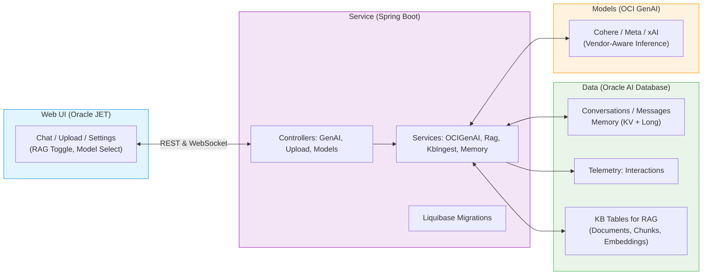

# From GUIs to RAG: Building a Cloud‑Native RAG on Oracle Cloud
<!-- keywords: oracle ai database, vector search, rag, json relational duality views, select ai, oci generative ai, oracle jet, spring boot, kubernetes, oke, pdf rag, knowledge base -->

We don’t use computers the way we used to. We moved from command lines to GUIs, from click‑and‑type to touch and voice—and now to assistants that understand intent. The next leap isn’t a new button; it’s software that adapts to people.

This repository provides a runnable blueprint:
- Web UI: Oracle JET for an enterprise‑grade chat interface with upload, settings, and RAG toggle.
- Service: Spring Boot backend with vendor‑aware calls to OCI Generative AI (Cohere, Meta, xAI).
- Data: Oracle AI Database for durable chat history, memory (KV and long-form), telemetry, and a knowledge base (KB) for RAG.

## The Data‑Model‑Service (DMS) Architecture

- Data Layer: Oracle AI Database
  - Agent memory: conversations and messages tables for session history; memory_kv for structured state (e.g., preferences, tool outputs); optional memory_long for summaries.
  - Telemetry: interactions table for latency, tokens, and cost tracking.
  - Knowledge Base (KB): tables for documents, chunks, and embeddings enabling Retrieval‑Augmented Generation (RAG).
  - Schema managed via Liquibase for safe evolution (see DATABASE.md).

- Model Layer: OCI Generative AI
  - Inference with Cohere, Meta, and xAI models via vendor-aware services (avoids unsupported params like presencePenalty for Grok).
  - Prompt shaping and grounding via RAG with fallback to text search.
  - Model discovery and catalog for dynamic listing (see MODELS.md).

- Service Layer: Spring Boot
  - REST + WebSocket endpoints for chat, RAG, PDF upload, model discovery.
  - Key services: OCIGenAIService (chat), RagService (end-to-end RAG), KbIngestService (chunk/embed/insert), MemoryService (KV and rolling summaries).
  - Liquibase migrations for schema evolution.
  - OCI auth: local config, OKE Workload Identity, or Instance Principals (see SERVICES_GUIDE.md).

- Web UI: Oracle JET
  - Components for chat, upload, settings (model select, RAG toggle), and summaries.
  - WebSocket/STOMP for real-time; opt-in debug logs; database keepalive.
  - Fixed input bar and accessible UX (see JET.md).

### Architecture

## Why this works

- Modularity: Clear separation of concerns per layer with evolution paths (e.g., additive Liquibase changesets).
- Enterprise‑ready: Database‑backed context with KV/long-form memory, schema migrations, auditable usage via telemetry.
- Developer‑friendly: Spring Boot + Oracle JET; simple scripts for release and deploy; vendor-aware guards prevent invalid requests.
- Enhanced RAG: Vector search with text fallback; citations in responses; diagnostics for embedding health.

## Features

- Chat and summarization with multiple vendors/models and vendor-aware parameters.
- RAG over your PDFs (upload → index → ask) with citations and fallback handling.
- Telemetry and audit trails for model calls (interactions table).
- Long‑term memory (rolling summaries) and key/value memory per conversation.
- Liquibase‑managed schema for a reliable data layer with safe evolution.

## Quick links

- Frontend deep dive (Oracle JET): [JET.md](guides/JET.md)
- Cloud‑native deployment (OKE, Terraform, Kustomize): [K8S.md](guides/K8S.md)
- RAG pipeline and usage: [RAG.md](guides/RAG.md)
- Database schema and Liquibase: [DATABASE.md](guides/DATABASE.md)
- Models and parameters (vendor‑aware): [MODELS.md](guides/MODELS.md)
- Backend services guide: [SERVICES_GUIDE.md](guides/SERVICES_GUIDE.md)
- Troubleshooting: [TROUBLESHOOTING.md](guides/TROUBLESHOOTING.md)
- FAQ: [FAQ.md](guides/FAQ.md)
- Local development: [LOCAL.md](guides/LOCAL.md)
- Security: [SECURITY.md](guides/SECURITY.md)
- Contributing: [CONTRIBUTING.md](guides/CONTRIBUTING.md)
- Changes: [CHANGES.md](guides/CHANGES.md)