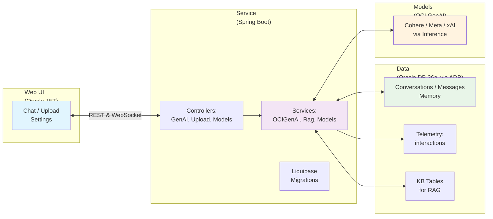

# From GUIs to RAG: Building a Cloud‑Native RAG on Oracle Cloud
Practical deployment blueprint using Oracle Database 26ai, OCI Generative AI, Spring Boot and Oracle JET with Victor Martin and John "JB" Brock (aka. peppertech)

Direct answer: This repo ships a complete RAG app (Oracle JET UI → Spring Boot → OCI Generative AI → Oracle Database 26ai VECTOR) so you don’t need a separate vector database or fragile JSON↔relational sync.

<!-- keywords: oracle database 26ai, vector search, rag, json relational duality views, select ai, oci generative ai, oracle jet, spring boot, kubernetes, oke, pdf rag, knowledge base -->

Updated for Oracle Database 26ai and the latest OCI Generative AI model catalog. This repo aligns docs across Data → Model → Service with a production-ready Kubernetes deployment flow.

We don’t use computers the way we used to. We moved from command lines to GUIs, from click‑and‑type to touch and voice—and now to assistants that understand intent. The next leap isn’t a new button; it’s software that adapts to people. Assistants and agents shift the unit of work from “click these 7 controls” to “state your intent.”

Shipping that shift in the enterprise takes more than calling an LLM API. It requires architecture, guardrails, and production‑ready foundations: durable context, observability, safe parameters, and a UI people trust. A decade of shipping software taught a simple lesson: people don’t want more features; they want more understanding. Assistants are how we ship understanding.

This repository provides a runnable blueprint:
- Web UI: Oracle JET for an enterprise‑grade chat interface with upload and settings.
- Service: Spring Boot backend with vendor‑aware calls to OCI Generative AI (Cohere, Meta, xAI).
- Data: Oracle Database 26ai (via Autonomous Database) for durable chat history, memory, telemetry, and a knowledge base (KB) for RAG.

Quick links
- Frontend deep dive (Oracle JET): [JET.md](JET.md)
- Cloud‑native deployment (OKE, Terraform, Kustomize): [K8S.md](K8S.md)
- RAG pipeline and usage: [RAG.md](RAG.md)
- Database schema and Liquibase (26ai VECTOR): [DATABASE.md](DATABASE.md)
- Models and parameters (vendor‑aware): [MODELS.md](MODELS.md)
- Backend services guide: [SERVICES_GUIDE.md](SERVICES_GUIDE.md)
- Troubleshooting: [TROUBLESHOOTING.md](TROUBLESHOOTING.md)
- FAQ: [FAQ.md](FAQ.md)

## At a glance
- AI‑driven and distinct: Oracle Database 26ai is vector‑native and integrates governed AI patterns, purpose‑built for GenAI—not “Oracle Classic.”
- Developer‑first: runs end‑to‑end locally and deploys to OKE; vendor‑aware model calls (Cohere, Meta, xAI) avoid invalid parameters by design.
- Accessible and cost‑effective: frictionless onboarding; a single database for SQL + JSON + vectors reduces multi‑DB sprawl.
- Clear backend map: see SERVICES_GUIDE.md for the service dependency graph, diagnostics, and code anchors.
- Use‑case clarity: this repo targets RAG over your PDFs—upload → index → ask—with production‑ready patterns.

## The Data‑Model‑Service (DMS) Architecture

- Data Layer: Oracle Database 26ai via ADB
  - Durable chat history (conversations, messages)
  - Memory (key/value and long‑form)
  - Telemetry (interactions: latency, tokens, cost)
  - Knowledge Base (KB) tables enabling Retrieval‑Augmented Generation

- Model Layer: OCI Generative AI
  - Inference with Cohere, Meta, and xAI models
  - Prompt shaping and grounding via RAG
  - Vendor‑aware parameter validation to avoid invalid‑argument errors

- Service Layer: Spring Boot
  - REST + WebSocket endpoints for chat, RAG, PDF upload, model discovery
  - Liquibase migrations for schema evolution
  - OCI auth: local config, OKE Workload Identity, or Instance Principals

- Web UI: Oracle JET
  - Chat, Upload, Settings (Use RAG)
  - Opt‑in debug logs, fixed input bar UX, database keepalive

### Architecture (Mermaid)

Alt: Oracle JET UI ↔ Spring Boot ↔ Oracle Database 26ai (KB, telemetry, memory) ↔ OCI Generative AI.



## Why this works

- Modularity: Clear separation of concerns per layer with evolution paths.
- Enterprise‑ready: Database‑backed context, schema migrations, auditable usage.
- Developer‑friendly: Spring Boot + Oracle JET; simple scripts for release and deploy.

### Competitive context (respectful)
For this exact app, non‑Oracle stacks typically require:
- A separate vector store and new retrieval logic
- Extra ETL/sync between document and relational projections
- More services to manage, higher latency, and additional failure modes
Oracle Database 26ai co‑locates vectors, SQL, and JSON, reducing integration debt.

## Who this is for
- Existing Oracle customers: modernize or extend apps with RAG, vectors, and governed AI without re‑platforming. Keep ADB as your database of record and deploy on OKE when ready.
- New builders and startups: greenfield AI chat/search with a single data plane (SQL + JSON + vectors). Run locally in minutes, then ship to Kubernetes.
- Data teams: consistent governance across SQL/JSON/vectors with Liquibase‑managed schema and diagnostics endpoints to validate ingestion and retrieval.

## For Data Science and AI teams
- Vector proximity: store embeddings as VECTOR(1024, FLOAT32) next to operational truth; reduce hops and drift.
- Reproducible retrieval: VECTOR_DISTANCE and topK tuning drive consistent results; automatic text‑search fallback keeps flows resilient.
- Safe model ops: vendor‑aware parameter guards and model discovery (/api/genai/models) reduce invalid requests across Cohere/Meta/xAI (see MODELS.md).
- Observability: telemetry tables and /api/kb/diag* endpoints help track latency, token usage, and embedding health.
- Select AI pattern: bring AI to governed data and roles (see RAG.md). Keep inference near the data with auditable access paths.

Tip: need internal wiring and dependencies? See the Backend Services Guide for a full dependency map and diagnostics: SERVICES_GUIDE.md

## Features

- Chat and summarization with multiple vendors/models.
- RAG over your PDFs (upload → index → ask).
- Telemetry and audit trails for model calls.
- Long‑term memory and key/value memory per conversation.
- Liquibase‑managed schema for a reliable data layer.

## Local quickstart

Prerequisites
- JDK 17+
- Node.js 18+
- OCI credentials with access to Generative AI (e.g., ~/.oci/config)
- Oracle ADB wallet (downloaded and unzipped)
- An OCI compartment with access to Cohere / Meta / xAI chat and an embedding model (1024‑dim recommended)

1) Configure backend in backend/src/main/resources/application.yaml
```yaml
spring:
  datasource:
    driver-class-name: oracle.jdbc.OracleDriver
    url: jdbc:oracle:thin:@DB_SERVICE_high?TNS_ADMIN=/ABSOLUTE/PATH/TO/WALLET
    username: ADMIN
    password: "YOUR_PASSWORD"
    type: oracle.ucp.jdbc.PoolDataSource
    oracleucp:
      sql-for-validate-connection: SELECT 1 FROM dual
      connection-pool-name: pool1
      initial-pool-size: 5
      min-pool-size: 5
      max-pool-size: 10
genai:
  region: "US_CHICAGO_1"
  config:
    location: "~/.oci/config"
    profile: "DEFAULT"
  compartment_id: "ocid1.compartment.oc1..xxxx"
```

2) Run backend
```bash
cd backend
./gradlew clean build
./gradlew bootRun
# http://localhost:8080
```

3) Run web UI
```bash
cd ../app
npm ci
npm run serve
# http://localhost:8000
```

## RAG: upload and ask

- Upload a PDF
```bash
curl -F "file=@/path/to/file.pdf" http://localhost:8080/api/upload
```

- Ask a question over KB
```bash
curl -X POST http://localhost:8080/api/genai/rag \
  -H "Content-Type: application/json" \
  -d '{"question":"What does section 2 cover?","modelId":"ocid1.generativeaimodel.oc1...."}'
```

- Quick diagnostics (REST)
  - GET http://localhost:8080/api/kb/diag?tenantId=default
  - GET http://localhost:8080/api/kb/diag/schema
  - GET http://localhost:8080/api/kb/diag/embed?text=test

## Production deploy on OKE (overview)

- Provision OKE + ADB with Terraform (deploy/terraform).
- Build/push images to OCIR using scripts/release.mjs (tags include git sha).
- Generate Kustomize overlays with scripts/kustom.mjs (env‑specific config).
- Create an ADB wallet secret; mount and set TNS_ADMIN in backend (see DATABASE.md).
- Apply deploy/k8s/overlays/prod and verify ingress endpoint.
- Full guide: [K8S.md](K8S.md)

## LLM optimization patterns

- JSON‑first examples:
  {"compartment_id":"ocid1.compartment.oc1..example","model_id":"cohere.command-r-plus"}
- Prefer topP to topK for broader vendor compatibility; avoid presencePenalty for Grok
- Use temperature ≈0.0 for summarization, ≈0.5 for chat; adjust maxTokens for cost control

- Q&A pairs:
  Q: How to parse data? A: Use the backend’s PDF endpoint to extract and chunk, then persist to KB tables.

- Annotate code with purpose, inputs, outputs.
- Use Mermaid for architecture and numbered steps for reproducibility.

## License

Licensed under the Universal Permissive License (UPL), Version 1.0. See [LICENSE](LICENSE).

ORACLE AND ITS AFFILIATES DO NOT PROVIDE ANY WARRANTY WHATSOEVER, EXPRESS OR IMPLIED, FOR ANY SOFTWARE, MATERIAL OR CONTENT OF ANY KIND CONTAINED OR PRODUCED WITHIN THIS REPOSITORY, AND IN PARTICULAR SPECIFICALLY DISCLAIM ANY AND ALL IMPLIED WARRANTIES OF TITLE, NON-INFRINGEMENT, MERCHANTABILITY, AND FITNESS FOR A PARTICULAR PURPOSE.  FURTHERMORE, ORACLE AND ITS AFFILIATES DO NOT REPRESENT THAT ANY CUSTOMARY SECURITY REVIEW HAS BEEN PERFORMED WITH RESPECT TO ANY SOFTWARE, MATERIAL OR CONTENT CONTAINED OR PRODUCED WITHIN THIS REPOSITORY. IN ADDITION, AND WITHOUT LIMITING THE FOREGOING, THIRD PARTIES MAY HAVE POSTED SOFTWARE, MATERIAL OR CONTENT TO THIS REPOSITORY WITHOUT ANY REVIEW. USE AT YOUR OWN RISK.
