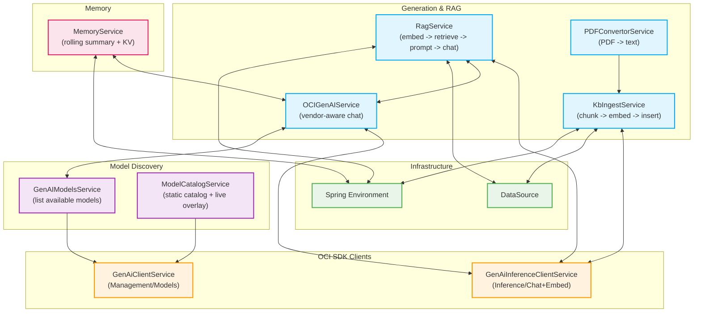

# Backend Services Guide (LLM‑friendly)

This guide documents the backend service layer in a way that is friendly to both humans and LLM agents. For each service you will find:
- Purpose: What it does in the system
- Inputs and outputs: Method signatures and DTOs returned
- Dependencies: Other services, SDK clients, DB access
- Side effects: DB writes, network calls, telemetry
- Error cases: Typical exceptions and guardrails
- Usage: How you would call it in typical flows

The services live under:
backend/src/main/java/dev/victormartin/oci/genai/backend/backend/service

Cross‑references:
- RAG flow and API: RAG.md
- Database schema and Liquibase: DATABASE.md
- Models, vendors, parameters: MODELS.md
- OKE/Kubernetes deployment: K8S.md

## Service dependency map



## Configuration keys (used across services)

- genai.region: OCI region code (e.g., US_CHICAGO_1)
- genai.config.location, genai.config.profile: Path/profile for local OCI config (~/.oci/config)
- genai.compartment_id: Compartment for OCI Generative AI
- genai.chat_model_id: Default chat model OCID (fallback when request omits model)
- genai.embed_model_id: Default embedding model (e.g., cohere.embed-english-v3.0; 1024‑dim preferred)
- genai.summarization_model_id: Model for Memory summarization (fallbacks to genai.chat_model_id)
- genai.catalog.enabledProviders, genai.catalog.blockedModels, genai.catalog.preferredModels: Static catalog gates
- genai.catalog.gates.geminiApproved, genai.catalog.gates.externalHostingOk: Feature gates for catalogs
- genai.serving.chat.mode: ON_DEMAND | DEDICATED

Spring profiles selecting auth providers:
- oke: OKE Workload Identity (recommended in‑cluster)
- compute: Instance Principals
- default: Local config file provider

---

## GenAiClientService (Management API client)

Purpose
- Builds an OCI Generative AI Management client (GenerativeAiClient) based on the active Spring profile.

Inputs/Outputs
- getClient(): GenerativeAiClient

Dependencies
- Spring Environment (to read active profiles)
- OCI SDK (auth providers + region)
- Configuration keys: genai.region, genai.config.location, genai.config.profile

Side Effects
- None beyond client construction

Error Cases
- Local config: IOException if OCI config is missing/invalid

Usage
- Used by GenAIModelsService and ModelCatalogService to enumerate models and overlay live data.

---

## GenAiInferenceClientService (Inference API client)

Purpose
- Builds an OCI Generative AI Inference client (GenerativeAiInferenceClient) for Chat/Embed based on the active profile.

Inputs/Outputs
- getClient(): GenerativeAiInferenceClient

Dependencies
- Spring Environment, OCI SDK
- Configuration keys: genai.region, genai.config.location, genai.config.profile

Side Effects
- None beyond client construction

Error Cases
- Local config parse failures

Usage
- Used by OCIGenAIService (Chat) and KbIngestService/RagService (Embed).

---

## GenAIModelsService (Live model listing)

Purpose
- Lists live models in the configured compartment via the management API.

Inputs/Outputs
- getModels(): List<GenAiModel> where each item includes id (OCID), displayName, vendor, version, capabilities, timeCreated

Dependencies
- GenAiClientService (management client)
- genai.compartment_id

Side Effects
- Network call to OCI

Error Cases
- OCI permission/region issues, returns exceptions up the call stack

Usage
- OCIGenAIService consults this list to find the active model by OCID before building vendor‑aware requests.

---

## ModelCatalogService (Static catalog + live overlay)

Purpose
- Loads a static model catalog (classpath:model_catalog.json), filters by region, provider, tasks, and gates, then overlays live OCI model info to attach OCIDs/versions.

Inputs/Outputs
- listModels(task: String): List<ModelOption>
- listAll(): List<ModelOption>

Dependencies
- GenAiClientService (management client)
- Spring Environment (gates, filters, genai.region)
- Optional live overlay using genai.compartment_id

Side Effects
- Reads classpath resource
- Optional network call to OCI to map displayName -> OCID

Error Cases
- Missing catalog: returns empty list (logs a warning)
- OCI failures: overlay skipped (logs a warning)

Usage
- Useful for building a UI picker with curated tasks and providers; complements the live list in GenAIModelsService.

---

## OCIGenAIService (Vendor‑aware Chat)

Purpose
- Sends chat prompts to OCI Generative AI with vendor‑aware request builders. Avoids unsupported parameters for certain vendors (e.g., omit presencePenalty/topK for xAI Grok).

Key Methods
- resolvePrompt(input, modelId, finetune, summarization): String
  - Builds ChatDetails with CohereChatRequest or GenericChatRequest depending on vendor.
  - Summarization uses a lower temperature (0.0) and prepends “Summarize this text:”.
- summaryText(input, modelId, finetuned): String
  - Thin wrapper calling resolvePrompt(..., summarization=true)

Inputs/Outputs
- input: String prompt
- modelId: Chat model OCID (OCIGenAIService resolves vendor via GenAIModelsService)
- outputs: Response text (String)

Dependencies
- GenAiInferenceClientService (inference client)
- GenAIModelsService (to resolve model vendor/name/etc.)
- genai.compartment_id (for ChatDetails)
- Defaults: temperature 0.5 for chat, 0.0 for summarization; maxTokens 600; isStream false

Side Effects
- Network call to OCI Inference chat endpoint

Error Cases
- Invalid vendor parameters → SDK/Service 400s (guarded per vendor)
- Unexpected response types → throws IllegalStateException

Usage Tips
- Prefer topP over topK for broader vendor compatibility
- For Grok, avoid presencePenalty/frequencyPenalty/topK (see MODELS.md)

---

## RagService (RAG pipeline: embed → retrieve → prompt → chat)

Purpose
- End‑to‑end Retrieval‑Augmented Generation over KB tables:
  1) Embed the user question
  2) Retrieve top‑K chunks by vector similarity (fallback to text search)
  3) Assemble a grounded prompt with citations
  4) Call vendor‑aware chat

Key Method
- answerWithRag(req: RagQuestionDto): String
  - tenantId (default "default")
  - topK (default 5)
  - modelId (explicit or falls back to genai.chat_model_id)
  - docIds, tags (optional filters; tags filter to be implemented)
  - Returns a text answer string

Inputs/Outputs
- Input DTO: RagQuestionDto (question, modelId, tenantId, topK, docIds, tags)
- Output: Answer string (grounded in retrieved CONTEXT)

Dependencies
- GenAiInferenceClientService (Embed)
- OCIGenAIService (Chat)
- DataSource (JDBC to KB tables)
- Environment (for defaults, compartment/model ids)

Side Effects
- DB reads on kb_ tables
- Network calls to OCI Inference (Embed + Chat)

Error Cases and Guards
- Embedding model availability:
  - Tries configured genai.embed_model_id, then cohere.embed‑english‑v3.0, cohere.embed‑multilingual‑v3.0, cohere.embed‑english‑light‑v3.0
  - On 404, falls through candidates; on other errors, rethrows
- Vector retrieval:
  - Uses VECTOR_DISTANCE(e.embedding, TO_VECTOR(?)) if available (Oracle Database 26ai)
  - On SQL error or if embedding missing → fallback to REGEXP_LIKE‑based text search
  - If still empty → fallback to recent chunks for the tenant

Prompt Template (LLM‑friendly)
- SYSTEM: answer strictly using provided CONTEXT; if insufficient, say “I don’t know from the provided context.”
- CONTEXT: N snippets with inline source references
- USER: original question
- ASSISTANT (rules): Answer in 3–5 bullets with citations [1], [2]; or the fallback message

---

## KbIngestService (chunk → embed → insert)

Purpose
- Ingests extracted plain text into KB tables and generates embeddings for each chunk.

Key Method
- ingestText(tenantId, docId, title, uri, mime, tagsJson, text, embeddingModelId):
  - Returns IngestSummary(docId, chunkCount, embedCount, hash)

Process
1) Generate content hash, upsert kb_documents (active=1)
2) Chunk text (size=2000, overlap=300) → kb_chunks (identity id retrieval with fallback)
3) Embed each chunk via OCI Inference EmbedText (On‑Demand), model resolved by:
   - provided → genai.embed_model_id → default “cohere.embed‑english‑v3.0”
4) Insert embedding:
   - Try to_vector(?) then VECTOR(?) with a JSON array literal
   - If both fail, insert NULL embedding (joins still work; no vector search)
5) Commit transaction

Dependencies
- GenAiInferenceClientService
- DataSource (JDBC)
- Environment (genai.compartment_id, genai.embed_model_id)

Side Effects
- DB writes to kb_documents, kb_chunks, kb_embeddings
- Network calls to OCI Inference (EmbedText)

Error Cases
- getGeneratedKeys() unsupported → fallback SELECT by (doc_id, tenant_id, chunk_ix)
- Embedding failures → logs, continues; NULL embeddings inserted
- SQL errors → transaction rollback and rethrow

Usage Tips
- Ensure Liquibase has created VECTOR(1024, FLOAT32) and optional ANN index (see DATABASE.md)
- Use a 1024‑dim embedding model to match the schema, or change both schema and code paths

---

## MemoryService (rolling summary + KV store)

Purpose
- Maintains a long‑term rolling summary for a conversation and exposes a lightweight KV store.

Key Methods
- updateRollingSummary(conversationId): void
  - Reads up to 20 recent Message rows since last summary update
  - Builds a summarization prompt and calls OCIGenAIService.summaryText
  - Saves updated summary to memory_long
- setKv(conversationId, key, valueJson, ttlSeconds): void
- getKv(conversationId, key): Optional<String>
- deleteKv(conversationId, key): void
- cleanupExpiredKv(): scheduled cleanup (every 15 min)

Inputs/Outputs
- MessageRepository, MemoryLongRepository, MemoryKvRepository entities
- Summary prompt is designed to maintain entities/tasks/preferences in 5–8 bullets

Dependencies
- OCIGenAIService
- Environment (genai.summarization_model_id, genai.chat_model_id)

Side Effects
- DB reads/writes to conversations/messages/memory tables
- Network call to OCI Inference via OCIGenAIService

Error Cases
- Summarization failures are logged; the operation is best‑effort and does not block chat

Usage Tips
- The rolling summary acts as durable memory that can be injected into prompts for longer‑horizon tasks

---

## PDFConvertorService (PDF → text)

Purpose
- Extracts text from a PDF file path using Apache PDFBox.

Inputs/Outputs
- convert(filePath: String): String text

Dependencies
- Apache PDFBox
- Spring ResourceUtils.getFile

Side Effects
- File I/O

Error Cases
- IOException → RuntimeException; caller should handle and signal to the user

Usage Tips
- Typically used upstream of KbIngestService.ingestText after upload

---

## Example orchestration snippets

Ingest a PDF (pseudo‑controller)
```java
String text = pdfConvertorService.convert("/path/to/file.pdf");
KbIngestService.IngestSummary summary = kbIngestService.ingestText(
  "default",      // tenantId
  null,           // docId (auto from content hash)
  "My Doc",       // title
  "oci://bucket/...", // uri (optional)
  "application/pdf",
  "[]",           // tagsJson
  text,
  null            // embeddingModelId (use configured/default)
);
// -> summary.docId(), summary.chunkCount(), summary.embedCount()
```

Answer a question with RAG
```java
RagQuestionDto req = new RagQuestionDto(
  "What does section 2 state?",
  "ocid1.generativeaimodel.oc1....", // modelId
  "default",    // tenant
  5,            // topK
  List.of(),    // docIds filter
  List.of()     // tags filter
);
String answer = ragService.answerWithRag(req);
// -> grounded answer with inline [1],[2] citations where possible
```

Update conversation long‑term memory (rolling summary)
```java
memoryService.updateRollingSummary(conversationId);
// -> memory_long updated with latest 5–8 bullets
```

---

## Diagnostics and health checks

- Models list (for choosing chat/embedding models)
  - GET /api/genai/models
- KB diagnostics (DB/schema/embeddings)
  - GET /api/kb/diag?tenantId=default
  - GET /api/kb/diag/schema
  - GET /api/kb/diag/embed?text=test
- RAG
  - POST /api/genai/rag with {question, modelId}

See RAG.md and DATABASE.md for detailed troubleshooting and expected outputs.

---

## LLM usage guidance

- Respect vendor‑specific parameters:
  - Cohere: CohereChatRequest path
  - Meta: GenericChatRequest (omit presencePenalty)
  - xAI Grok: GenericChatRequest (omit presencePenalty, frequencyPenalty, topK)
- Use temperature ≈ 0.0 for summarization, ≈ 0.5 for chat
- Use topP for broader compatibility; manage maxTokens (~600) for cost/latency
- If KB retrieval yields few/no results, answer with the provided fallback message to avoid hallucinations
