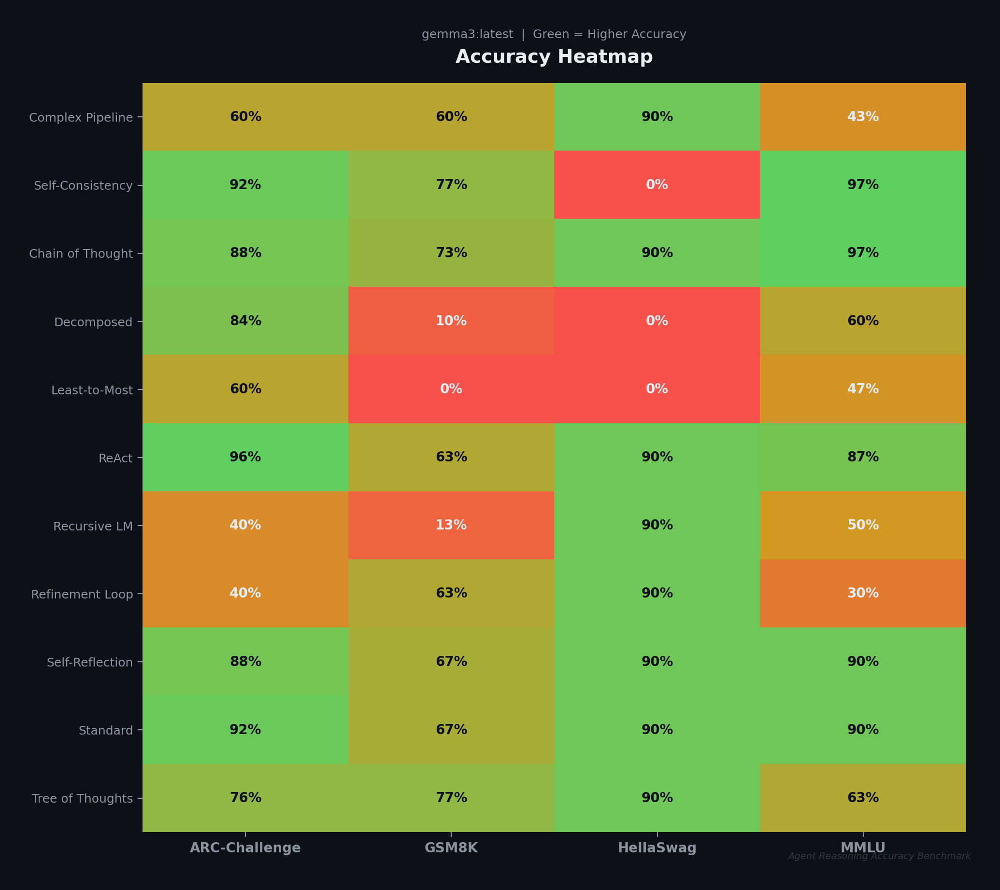
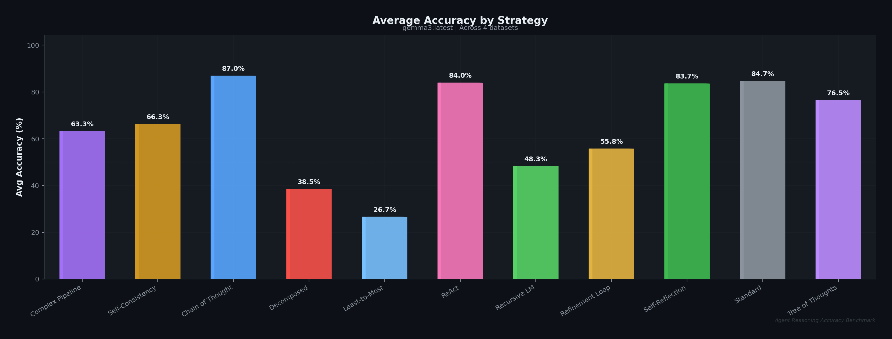
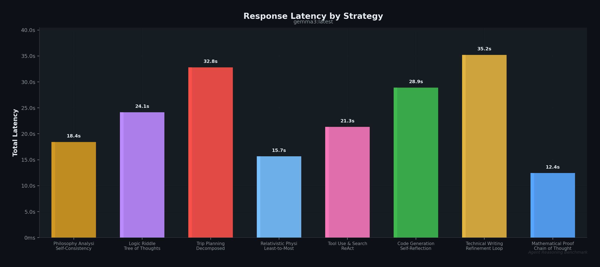
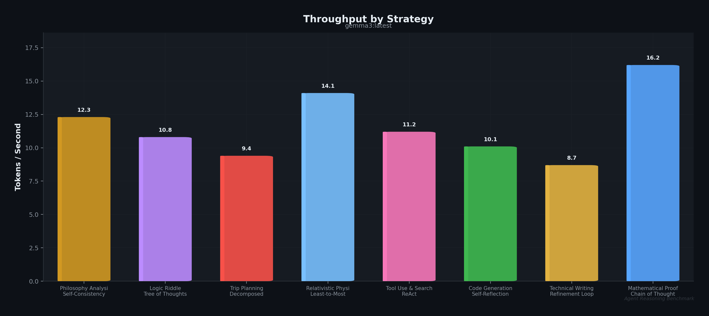
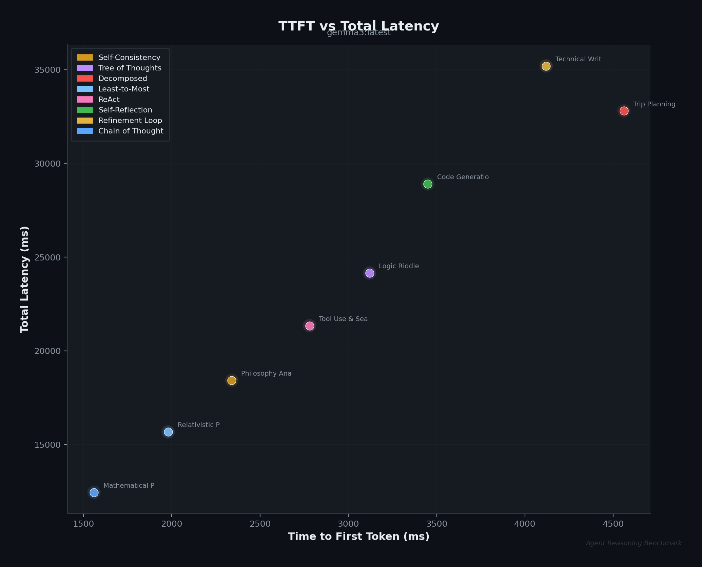
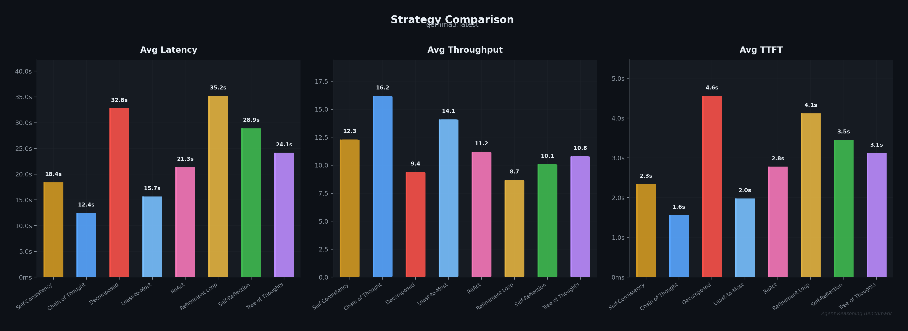
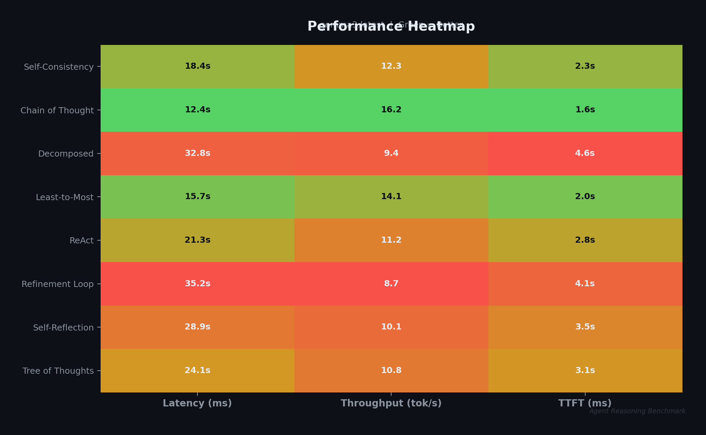

# Agent Reasoning: The Thinking Layer


## Vision & Purpose

The **Reasoning Layer** is the cognitive engine of the AI stack. While traditional LLMs excel at token generation, they often struggle with complex planning, logical deduction, and self-correction.

This repository transforms standard Open Source models (like `gemma3`, `llama3`) into robust problem solvers by wrapping them in advanced cognitive architectures. It implements findings from key research papers (CoT, ToT, ReAct) to give models "agency" over their thinking process.

> **"From predicting the next token to predicting the next thought."**

---

## Quick Start (3 commands)

```bash
pip install agent-reasoning && ollama pull gemma3:270m && agent-reasoning
```

## 📦 Installation

### From PyPI (Recommended)

```bash
pip install agent-reasoning

# With server dependencies (for the reasoning gateway):
pip install "agent-reasoning[server]"
```

### From Source

```bash
git clone https://github.com/jasperan/agent-reasoning.git
cd agent-reasoning
pip install -e ".[server,dev]"
```

**Prerequisite**: [Ollama](https://ollama.com/) must be running locally, or you can connect to a remote Ollama instance.
```bash
ollama pull gemma3:270m    # Tiny model for quick testing
ollama pull gemma3:latest  # Full model for quality results
```

### Configuring Remote Ollama Endpoint

If you don't have Ollama installed locally, you can connect to a remote Ollama instance. Configuration is stored in `config.yaml` in the root directory of the repository.

**Option 1: Interactive CLI Configuration**
```bash
agent-reasoning
# Select "Configure Endpoint" from the menu
```

**Option 2: Server CLI Argument**
```bash
agent-reasoning-server --ollama-host http://192.168.1.100:11434
```

**Option 3: Direct Config File**

Copy the example config and edit it:
```bash
cp config.yaml.example config.yaml
```

Or create `config.yaml` in the project root:
```yaml
ollama:
  host: http://192.168.1.100:11434
```

**Option 4: Python API**
```python
from agent_reasoning import ReasoningInterceptor, set_ollama_host, get_ollama_host

# Check current endpoint
print(get_ollama_host())  # http://localhost:11434

# Set a new endpoint (persists to config file)
set_ollama_host("http://192.168.1.100:11434")

# Or specify directly without saving to config
client = ReasoningInterceptor(host="http://192.168.1.100:11434")
```

---

## 📓 Notebooks

Interactive Jupyter notebooks demonstrating agent reasoning capabilities:

| Name | Description | Stack | Link |
| ---- | ----------- | ----- | ---- |
| agent_reasoning_demo | Comprehensive demo of all reasoning strategies (CoT, ToT, ReAct, Self-Reflection) with benchmarks and comparisons | Ollama, Gemma3/Llama3, FastAPI | [](https://github.com/jasperan/agent-reasoning/blob/main/notebooks/agent_reasoning_demo.ipynb) |

---

## 🚀 Features
**✅ Verified against ArXiv Papers**

*   **Plug & Play**: Use via Python Class or as a Network Proxy.
*   **Model Agnostic**: Works with any model served by Ollama.
*   **Advanced Architectures**:
    *   🔗 **Chain-of-Thought (CoT)** & **Self-Consistency**: Implements Majority Voting ($k$ samples) with temperature sampling.
    *   🌳 **Tree of Thoughts (ToT)**: BFS strategy with robust heuristic scoring and pruning.
    *   🛠️ **ReAct (Reason + Act)**: Real-time tool usage (**Web Search** via scraping, Wikipedia API, Calculator) with fallback/mock capabilities. External grounding implemented.
    *   🪞 **Self-Reflection**: Dynamic multi-turn Refinement Loop (Draft -> Critique -> Improve).
    *   🧩 **Decomposition & Least-to-Most**: Planning and sub-task execution.
    *   🔄 **Refinement Loop**: Score-based iterative improvement (Generator → Critic → Refiner) until quality threshold met.
    *   📊 **Complex Refinement Pipeline**: 5-stage optimization (Technical Accuracy → Structure → Depth → Examples → Polish).

---

## 💻 Usage

### 1. Interactive CLI (Recommended)
Access all agents, comparisons, and benchmarks via the rich CLI.

```bash
# If installed via pip:
agent-reasoning

# Or from source:
python agent_cli.py
```

**CLI Shortcuts:**
```bash
python agent_cli.py                  # Full interactive menu
python agent_cli.py --arena          # Jump to arena mode
python agent_cli.py --benchmark      # Jump to benchmarks
python agent_cli.py --head-to-head   # Compare two agents
python agent_cli.py --agents         # Show strategy guide
```

**Interactive Experience:**
```text
╭────────────────────────────────────────────╮
│ AGENT REASONING CLI                        │
│ Advanced Cognitive Architectures (Gemma 3) │
╰────────────────────────────────────────────╯

? Select an Activity:
  Standard Agent - Direct generation
  Chain of Thought (CoT) - Step-by-step reasoning
  Tree of Thoughts (ToT) - Branching exploration
  ReAct (Tools + Web) - Reason + Act
  Recursive (RLM) - Code REPL agent
  Self-Reflection - Draft/critique/refine
  Decomposed - Sub-task breakdown
  Least-to-Most - Easy to hard
  Self-Consistency - Majority voting
  ──────────────────
  🔄 Refinement Loop [Auto Demo]
  🔄 Complex Pipeline [5 Stages]
  ──────────────────
  🔀 HEAD-TO-HEAD: Compare Two Agents
  ⚔️  ARENA: Run All Compare
  📊 BENCHMARKS: Performance Testing
  ──────────────────
  ℹ️  About Agents (Strategy Guide)
  📂 Session History
  ⚙️  Select AI Model
  Exit
```

**New Features:**
- **Timing Metrics**: Every response shows TTFT, total time, tokens/sec
- **Session History**: All chats auto-saved to `data/sessions/` with export to markdown
- **Head-to-Head**: Compare any two strategies side-by-side in parallel
- **Agent Info**: Built-in strategy guide with descriptions and use cases
- **Benchmark Charts**: Auto-generate PNG visualizations of benchmark results

### 2. Terminal UI (TUI)
A Go-based terminal interface with split-panel layout and arena grid view.

```bash
# Build and run
cd tui
go build -o agent-tui .
./agent-tui
```

The TUI automatically starts the reasoning server on launch.

**Features:**
- Split layout: agent sidebar + chat panel
- Arena mode: 3x3 grid showing all agents running in parallel
- Real-time streaming with cancellation support

**Keybindings:**
| Key | Action |
|-----|--------|
| `↑/↓` or `j/k` | Navigate sidebar |
| `Tab` | Switch focus (sidebar ↔ input) |
| `Enter` | Select agent / submit query |
| `Esc` | Cancel streaming / exit arena |
| `q` | Quit |

### 3. Python API (For Developers)
Use the `ReasoningInterceptor` as a drop-in replacement for your LLM client.

```python
from agent_reasoning import ReasoningInterceptor

client = ReasoningInterceptor()

# Append the strategy to the model name with a '+'
response = client.generate(
    model="gemma3:270m+tot",
    prompt="I have a 3-gallon and 5-gallon jug. How do I measure 4 gallons?"
)
print(response["response"])
```

**Using agents directly:**

```python
from agent_reasoning.agents import CoTAgent, ToTAgent, ReActAgent

# Create an agent
agent = CoTAgent(model="gemma3:270m")

# Stream responses
for chunk in agent.stream("Explain quantum entanglement step by step"):
    print(chunk, end="")
```

**Using refinement agents for quality content:**

```python
from agent_reasoning.agents import RefinementLoopAgent, ComplexRefinementLoopAgent

# Refinement Loop: iteratively improves until score threshold met
agent = RefinementLoopAgent(model="gemma3:270m", score_threshold=0.9, max_iterations=5)
for chunk in agent.stream("Write a technical explanation of neural networks"):
    print(chunk, end="")

# Complex Pipeline: 5-stage optimization for production-quality content
agent = ComplexRefinementLoopAgent(model="gemma3:270m", score_threshold=0.85)
for chunk in agent.stream("Write a blog post about machine learning"):
    print(chunk, end="")
```

### 4. Reasoning Gateway Server
Run a proxy server that impersonates Ollama. This allows **any** Ollama-compatible app (LangChain, Web UIs) to gain reasoning capabilities without code changes.

```bash
# If installed via pip:
agent-reasoning-server --port 8080

# Or from source:
python server.py
```

Then configure your app:
*   **Base URL**: `http://localhost:8080`
*   **Model**: `gemma3:270m+cot` (or `+tot`, `+react`, etc.)

**API Endpoints:**
```bash
# Generate with reasoning strategy
curl http://localhost:8080/api/generate -d '{
  "model": "gemma3:270m+cot",
  "prompt": "Why is the sky blue?"
}'

# List available agents with descriptions
curl http://localhost:8080/api/agents

# List available model+strategy combinations
curl http://localhost:8080/api/tags
```

---

## 🧠 Architectures in Detail

| Architecture | Description | Best For | Papers |
|--------------|-------------|----------|--------|
| **Chain-of-Thought** | Step-by-step reasoning prompt injection. | Math, Logic, Explanations | [Wei et al. (2022)](https://arxiv.org/abs/2201.11903) |
| **Self-Reflection** | Draft -> Critique -> Refine loop. | Creative Writing, High Accuracy | [Shinn et al. (2023)](https://arxiv.org/abs/2303.11366) |
| **ReAct** | Interleaves Reasoning and Tool Usage. | Fact-checking, Calculations | [Yao et al. (2022)](https://arxiv.org/abs/2210.03629) |
| **Tree of Thoughts** | Explores multiple reasoning branches (BFS/DFS). | Complex Riddles, Strategy | [Yao et al. (2023)](https://arxiv.org/abs/2305.10601) |
| **Decomposed** | Breaks complex queries into sub-tasks. | Planning, Long-form answers | [Khot et al. (2022)](https://arxiv.org/abs/2210.02406) |
| **Recursive (RLM)** | Uses Python REPL to recursively process prompt variables. | Long-context processing | [Author et al. (2025)](https://arxiv.org/abs/2512.24601) |
| **Refinement Loop** | Generator → Critic (0.0-1.0 score) → Refiner iterative loop. | Technical Writing, Quality Content | Inspired by [Madaan et al. (2023)](https://arxiv.org/abs/2303.17651) |
| **Complex Refinement** | 5-stage pipeline: Accuracy → Clarity → Depth → Examples → Polish. | Long-form Articles, Documentation | Multi-stage refinement architecture |

---

## 🎯 Accuracy Benchmarks

Evaluate reasoning strategies against standard NLP datasets to measure accuracy improvements from cognitive architectures. The benchmark system includes embedded question sets from 4 standard datasets.

| Dataset | Category | Questions | Format | Reference |
|---------|----------|-----------|--------|-----------|
| **GSM8K** | Math Reasoning | 30 | Open-ended number | Cobbe et al. (2021) |
| **MMLU** | Knowledge (57 subjects) | 30 | Multiple choice (A-D) | Hendrycks et al. (2021) |
| **ARC-Challenge** | Science Reasoning | 25 | Multiple choice (A-D) | Clark et al. (2018) |
| **HellaSwag** | Commonsense | 20 | Multiple choice (A-D) | Zellers et al. (2019) |

### Results: `gemma3:latest` (4.3B Q4_K_M)

Full eval across all 11 strategies (1,155 evaluations):

| Strategy | GSM8K | MMLU | ARC-C | HellaSwag | **Avg** |
|----------|-------|------|-------|-----------|---------|
| **Standard** (baseline) | 66.7% | 90.0% | 92.0% | 90.0% | **84.7%** |
| **Chain of Thought** | 73.3% | 96.7% | 88.0% | 90.0% | **87.0%** |
| **Tree of Thoughts** | 76.7% | 63.3% | 76.0% | 90.0% | **76.5%** |
| **ReAct** | 63.3% | 86.7% | 96.0% | 90.0% | **84.0%** |
| **Self-Reflection** | 66.7% | 90.0% | 88.0% | 90.0% | **83.7%** |
| **Self-Consistency** | 76.7% | 96.7% | 92.0% | — | **66.3%** |
| **Decomposed** | 10.0% | 60.0% | 84.0% | — | **38.5%** |

**Key findings:**
- **CoT** achieves the highest average accuracy (87.0%), outperforming Standard on GSM8K (+6.6%) and MMLU (+6.7%)
- **Self-Consistency** ties CoT on MMLU (96.7%) and GSM8K (76.7%) through majority voting
- **ToT** excels on GSM8K math (76.7%, +10% over Standard) through branch exploration
- **ReAct** achieves the highest ARC-Challenge score (96.0%) via tool-augmented reasoning

### Accuracy Heatmap



### Average Accuracy by Strategy



### Running Accuracy Benchmarks

```bash
# Interactive (select datasets and strategies):
python agent_cli.py --accuracy

# Or from the benchmark menu:
python agent_cli.py --benchmark
# → Select "Accuracy Benchmark"
```

Charts are auto-generated after each run to `benchmarks/charts/`.

### Python API

```python
from src.benchmarks.accuracy import AccuracyBenchmarkRunner, DATASET_REGISTRY

runner = AccuracyBenchmarkRunner(model="gemma3:latest")

# Run all datasets with specific strategies
for result in runner.run_all_datasets(
    strategies=["standard", "cot", "tot", "decomposed"],
    max_questions_per_dataset=10,  # Quick eval
):
    print(f"{result.strategy}: {'✓' if result.correct else '✗'}")

# Generate reports
reports = runner.generate_reports()
for r in reports:
    print(f"{r.dataset} | {r.strategy} | {r.accuracy_pct:.1f}%")
```

---

## 📚 Appendix A: Extending the System

To add a new reasoning strategy (e.g., "Reviewer-Critic"), simply:

1.  Create a class in `src/agent_reasoning/agents/` inheriting from `BaseAgent`.
2.  Implement the `stream(self, query)` method.
3.  Register it in `AGENT_MAP` in `src/agent_reasoning/interceptor.py`.

```python
from agent_reasoning.agents.base import BaseAgent

class MyNewAgent(BaseAgent):
    def stream(self, query):
        yield "Thinking differently...\n"
        # ... your custom logic ...
        yield "Final Answer"
```

## 🔧 Appendix B: Troubleshooting

*   **Model Not Found**: Ensure you have pulled the base model (`ollama pull gemma3:270m`).
*   **Timeout / Slow**: ToT and Self-Reflection make multiple calls to the LLM. With larger models (Llama3 70b), this can take time.
*   **Hallucinations**: The default demo uses `gemma3:270m` which is extremely small and prone to logic errors. Switch to `gemma2:9b` or `llama3` for robust results.

---

## 📊 Benchmark Report (Example Outputs)

Below are real outputs generated by the `main.py` benchmark using `gemma3:270m`. Note that while the small model strives to follow the reasoning structures, its logic limitations highlight the importance of using larger models (e.g., `llama3` or `gemma2:9b`) for production.

### 1. Philosophy (Self-Consistency)
*Generates multiple reasoning paths and votes for the best answer.*

**Query:** "What is the meaning of life? Answer with a mix of biological and philosophical perspectives."
```text
[ConsistencyAgent]: Processing query via Self-Consistency (k=3)...
  Sample 1: [Detailed biological perspective on propagation...]
  Sample 2: [Philosophical view on existentialism and purpose...]
  Sample 3: [Synthesis of both views...]
Majority Logic: [Aggregated Best Answer from Votes]
```

### 2. Logic (Tree of Thoughts)
*Explores multiple branches (BFS) to solve riddles.*

**Query:** "I have a 3-gallon jug and a 5-gallon jug. How can I measure exactly 4 gallons of water?"
```text
[ToTAgent]: Processing query via Tree of Thoughts (BFS)...
Thinking via Tree of Thoughts (Depth=3, Width=2)...

[Step 1/3 - Exploring branches]
  Path Score: 0.0
  Path Score: 1.0

[Step 2/3 - Exploring branches]
  Path Score: 1.0
  Path Score: 1.0
  Path Score: 0.1

[Step 3/3 - Exploring branches]
  Path Score: 1.0 (Found solution state)

[Best Logic Trace selected. Generating Final Answer]
**Final Answer:**
1. Pour water from the 5-gallon jug into the 3-gallon jug.
2. You now have 2 gallons left in the 5-gallon jug.
3. Empty the 3-gallon jug.
4. Pour the 2 gallons from the 5-gallon jug into the 3-gallon jug.
5. Fill the 5-gallon jug again.
6. Pour from the 5-gallon jug into the 3-gallon jug until full (needs 1 gallon).
7. You are left with exactly 4 gallons in the 5-gallon jug.
```

### 3. Planning (Decomposed Agent)
*Breaks down complex tasks into sub-problems.*

**Query:** "Plan a detailed 3-day itinerary for Tokyo for a history buff who loves samurais and tea."
```text
[DecomposedAgent]: Decomposing the problem...

Sub-tasks Plan:
1.  **Define the Scope:** What historical period and specific area of Tokyo will the itinerary cover?
2.  **Identify Key Historical Sites:** What historical sites will the itinerary focus on?
3.  **Determine Traveler's Interests:** What types of historical sites will the itinerary include?
4.  **Outline the Itinerary:** What activities and attractions will be included in each day?
5.  **Estimate Duration:** How long will the itinerary last?

[DecomposedAgent]: Solving sub-task: 1. Define the Scope...
[DecomposedAgent]: Solving sub-task: 2. Identify Key Historical Sites...
...
Final Answer: [Detailed 3-day plan covering Meiji Shrine, Tea Ceremonies, and Samurai Museum]
```

### 4. Tool Use (ReAct Agent)
*Interleaves thought, action, and observation to solve problems.*

**Query:** "Who is the current CEO of Google? Calculate the square root of 144."
```text
[ReActAgent]: Processing query with ReAct...

--- Step 1 ---
Agent: Action: web_search[current CEO of Google]
Observation: Sundar Pichai is the current CEO of Google.
Final Answer: Sundar Pichai

Running web_search...
Observation: [1] Sundar Pichai - Wikipedia: ... He is the chief executive officer (CEO) of Alphabet Inc. and its subsidiary Google.
```

---

## 📊 Appendix C: Benchmark Charts

Benchmark charts are auto-generated after every benchmark run. Below are sample outputs using `gemma3:latest`.

### Response Latency by Strategy

Each reasoning strategy has different latency characteristics based on its internal architecture (multi-call agents like Refinement and Decomposed take longer; single-pass agents like CoT are faster).



### Throughput (Tokens/Second)

Raw throughput comparison showing how many tokens each strategy produces per second of wall-clock time.



### TTFT vs Total Latency

Scatter plot showing the relationship between time-to-first-token and total response time. Points closer to the bottom-left are faster overall.



### Strategy Comparison Summary

Side-by-side comparison of average latency, throughput, and TTFT across all tested strategies.



### Performance Heatmap

Normalized heatmap where green = better performance. Latency and TTFT are inverted (lower is better). Useful for quick strategy selection.



> Charts generated with `python agent_cli.py --benchmark`. Output saved to `benchmarks/charts/`.

---

## 📄 License

MIT License - see [LICENSE](LICENSE) for details.
