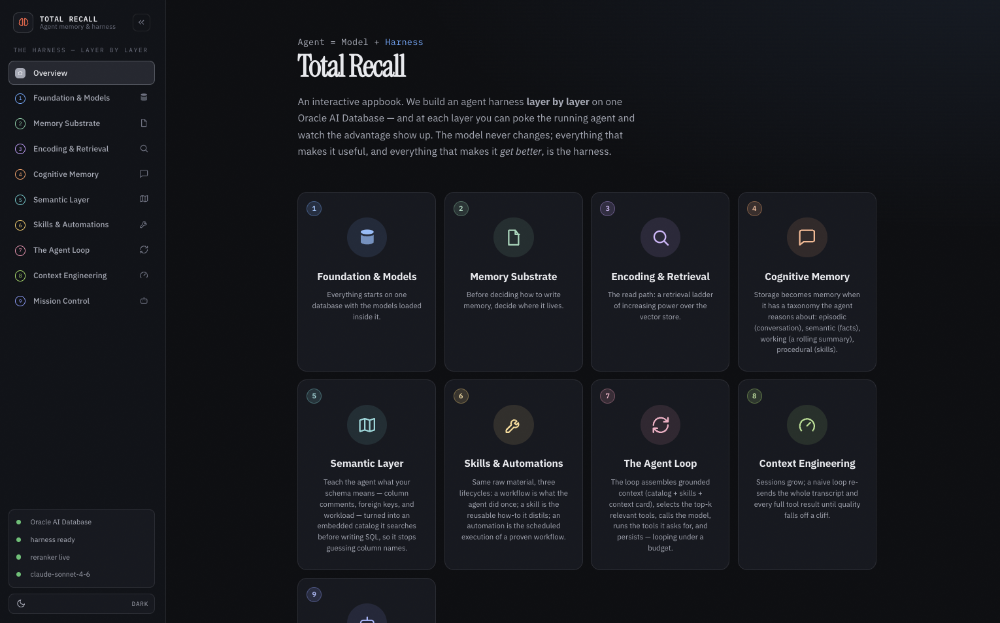
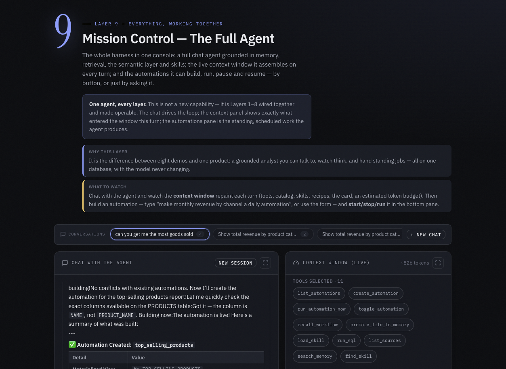
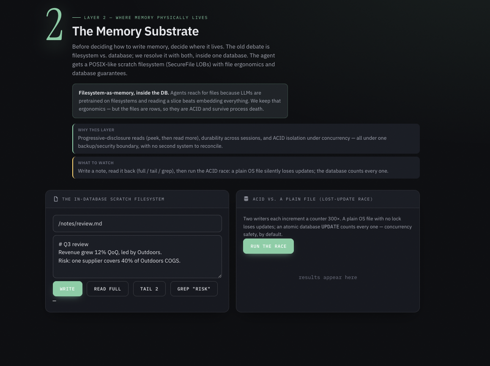

# Total Recall — Appbook



An **appbook** is a working agent you can click around in your browser, wrapped in narrative that explains
what is happening as you go. It is organised by the **harness layers** of an agent: each chapter explains a
layer (_what it is · why it matters · what to watch_), then lets you poke the **running** agent and watch the
advantage show up — live, against an Oracle AI Database.

It is a **FastAPI backend + a dependency-free JavaScript single-page app** (no build step, no `npm`). Every
demo streams over Server-Sent Events. The chat model is the only thing reached over the network; everything
else — embeddings, retrieval, memory, the scheduler — runs inside the database.

---

## What you get

| #   | Chapter                  | What you can do                                                                                                                                |
| --- | ------------------------ | ---------------------------------------------------------------------------------------------------------------------------------------------- |
| 1   | **Foundation & Models**  | Type text → watch it become a 384-dim vector computed _inside_ the database; see the loaded models.                                            |
| 2   | **Memory Substrate**     | Write / read / tail / grep a file that lives in the DB; run the ACID race (an OS file loses updates, the DB does not).                         |
| 3   | **Encoding & Retrieval** | Ask one question across keyword / vector / hybrid / **rerank**; watch the order change and the cross-encoder score appear.                     |
| 4   | **Cognitive Memory**     | Chat across turns; open the **OAMP context card**; save a durable fact and recall it by meaning.                                               |
| 5   | **Semantic Layer**       | Ask the schema what it means; the catalog returns the right tables / columns by meaning, not string match.                                     |
| 6   | **Skills & Automations** | Search tools by meaning (with JSON schemas); import a skill + watch the SHA-gated refresh; build an automation; promote a workflow → skill.    |
| 7   | **The Agent Loop**       | Ask an analytical question; watch the live trace (context → tools → answer); ask it to build an automation.                                    |
| 8   | **Context Engineering**  | The money shot: context size over a long session — engineering OFF (blows up) vs ON (stays flat).                                              |
| 9   | **Mission Control**      | The full agent in one console: chat, the **live context window**, and automations you can build / run / start / stop — by button or by asking. |

---

## Prerequisites

You need three things before you start.

1. **An AI-ready Oracle AI Database**, reachable at `localhost:1521/FREEPDB1`. "AI-ready" means it has:
   - a least-privilege **`AGENT`** user (the schema the app builds into), and
   - the two in-database **ONNX models** loaded: the 384-dim embedder **`ALL_MINILM_L12_V2`** (required) and the
     cross-encoder reranker **`RERANK_XENC`** (optional — without it the retrieval ladder still works).

   If your database was provisioned for this project, these are already present. If you are setting one up
   yourself, see **[Provisioning the database](#provisioning-the-database)** below. The app detects what is
   present and shows it in the status badge — so you will know immediately if something is missing.

2. **A Python 3.11+ environment** with the app's dependencies — a built-in **virtual environment** (`venv`) or
   **conda**, whichever you prefer. Step 1 sets one up.

3. **An Anthropic API key** — the only outbound call the app makes.

> On startup the app idempotently builds everything else it needs (tables, indexes, the seeded commerce
> schema, the semantic catalog, the tool / skill registries). It **never resets** your data — it only creates
> what is missing.

---

## Getting started

> Run all commands below from the **`agent_harness_palo_stack/`** directory.

### 1. Create and activate a Python environment

You need **Python 3.11+** and the app's dependencies. A built-in **virtual environment** works with no extra
tooling — or use **conda** if you prefer.

**Option A — Python venv (no extra tooling):**

```bash
python3.11 -m venv .venv
source .venv/bin/activate            # Windows (PowerShell): .venv\Scripts\Activate.ps1
pip install -r requirements.txt
```

**Option B — conda:**

```bash
conda create -y --name total_recall python=3.11
conda activate total_recall
pip install -r requirements.txt
```

Either way, the rest of the steps are identical — your `python` and `pip` now point at this environment.

### 2. Confirm your database is reachable and AI-ready

Point the app at your Oracle AI Database (defaults to `localhost:1521/FREEPDB1`). A quick check that the
`AGENT` user exists and the embedder is loaded:

```bash
python - <<'PY'
import oracledb
c = oracledb.connect(user="AGENT", password="AgentPw_2026", dsn="localhost:1521/FREEPDB1")
cur = c.cursor()
cur.execute("SELECT model_name FROM user_mining_models")
print("Connected as AGENT. Models loaded:", [r[0] for r in cur.fetchall()] or "NONE — see Provisioning")
PY
```

You want to see `ALL_MINILM_L12_V2` in the list. If the connection fails or no models are listed, see
**[Provisioning the database](#provisioning-the-database)**.

### 3. Configure the appbook

```bash
cp .env.example .env
```

Open `.env` and set your **Anthropic API key** (and the Oracle credentials, if yours differ from the
defaults):

```bash
ORA_DSN=localhost:1521/FREEPDB1
ORA_AGENT_USER=AGENT
ORA_AGENT_PWD=AgentPw_2026
ANTHROPIC_API_KEY=sk-ant-...
ANTHROPIC_MODEL=claude-sonnet-4-6        # or claude-haiku-4-5-20251001 for cheaper/faster runs
```

### 4. Launch the appbook

```bash
./run.sh
```

`run.sh` uses the environment you activated in step 1 (or a `total_recall` conda env if you have one), installs
`fastapi` / `uvicorn` / `sse-starlette` if they are missing, and starts the server on **http://127.0.0.1:8000**.

<details>
<summary>Prefer to run it manually?</summary>

```bash
# with your environment from step 1 still activated, from the agent_harness_palo_stack/ directory:
uvicorn backend.main:app --host 127.0.0.1 --port 8000
```

</details>

### 5. Open it and confirm it is healthy

Open **http://127.0.0.1:8000** in your browser. The harness warms in a background thread (a few seconds), so
the page serves immediately and the sidebar status badge turns all-green:

- 🟢 **Oracle AI Database** — connected
- 🟢 **harness ready** — tables, schema, registries, and catalog built
- 🟢 **reranker live** — the in-database cross-encoder is loaded (`fallback` is fine — see Troubleshooting)
- 🟢 **your model** — the API key is set

If a row stays red, see **Troubleshooting** below.

### 6. Explore

Start at **Layer 1 — Foundation** in the sidebar and climb. The finale is **Layer 9 — Mission Control**: a full
chat agent with its live context window and an automations pane you can drive.



---

## What a chapter looks like

Every chapter pairs a clear narrative header (_what it is · why it matters · what to watch_) with a live demo
you can run against the database. For example, Layer 2 lets you write a file into the in-database scratch
filesystem and then run the lost-update race that shows why "a row in the database" beats "a file on disk":



---

## Provisioning the database

If you are pointing the app at a database that has **not** been set up for this project yet, it needs two
things before the harness can warm:

1. **An `AGENT` user** with privileges to create tables, vector indexes, mining models, and `DBMS_SCHEDULER`
   jobs in its own schema. Match the credentials you put in `.env` (`ORA_AGENT_USER` / `ORA_AGENT_PWD`).

2. **The embedder ONNX model loaded as `ALL_MINILM_L12_V2`** (384-dim). Oracle loads ONNX models into the
   database with `DBMS_VECTOR.LOAD_ONNX_MODEL` — load the all-MiniLM-L12 embedder under that exact name so the
   app's `VECTOR_EMBEDDING(...)` calls resolve. The reranker (`RERANK_XENC`) is **optional**: load a
   cross-encoder under that name to light up the rerank rung, or leave it out and the ladder falls back to
   hybrid (RRF) order.

Everything else (the commerce schema, the vector store, the registries, the semantic catalog) is created by
the app on first launch — you do not need to set those up by hand.

---

## Configuration reference

All settings are environment variables (read from `agent_harness_palo_stack/.env`). Sensible defaults mean you usually only need
to set `ANTHROPIC_API_KEY`.

| Variable            | Default                   | What it is                                                           |
| ------------------- | ------------------------- | -------------------------------------------------------------------- |
| `ANTHROPIC_API_KEY` | —                         | **Required.** Your Anthropic key; the only outbound call.            |
| `ANTHROPIC_MODEL`   | `claude-sonnet-4-6`       | Chat model. Use `claude-haiku-4-5-20251001` for cheaper/faster runs. |
| `ORA_DSN`           | `localhost:1521/FREEPDB1` | Oracle connect string.                                               |
| `ORA_AGENT_USER`    | `AGENT`                   | The least-privilege schema the app builds into.                      |
| `ORA_AGENT_PWD`     | `AgentPw_2026`            | Password for that user.                                              |
| `EMBED_MODEL`       | `ALL_MINILM_L12_V2`       | Name of the in-database embedder model.                              |
| `RERANK_MODEL`      | `RERANK_XENC`             | Name of the in-database cross-encoder reranker.                      |
| `VECTOR_DIM`        | `384`                     | Embedding dimension.                                                 |
| `HOST` / `PORT`     | `127.0.0.1` / `8000`      | Where the server listens (env vars for `run.sh`).                    |

---

## Troubleshooting

| Symptom                                                 | Cause & fix                                                                                                                                                      |
| ------------------------------------------------------- | ---------------------------------------------------------------------------------------------------------------------------------------------------------------- |
| Badge stuck on **harness warming…** or an `ORA-…` error | The `AGENT` user or the embedder model is missing. See [Provisioning the database](#provisioning-the-database), then restart the app.                            |
| **reranker: fallback**                                  | The reranker model is not loaded, so the retrieval ladder's last rung falls back to hybrid (RRF) order. Everything still works; load `RERANK_XENC` to enable it. |
| **model** row red / chat errors                         | `ANTHROPIC_API_KEY` is not set or is invalid. Put it in `agent_harness_palo_stack/.env` and restart.                                                             |
| `address already in use` on launch                      | Something is already on port 8000. Stop it, or run on another port: `PORT=8010 ./run.sh`.                                                                        |
| Connection refused / `ORA-12541`                        | The database is not running or not reachable at `ORA_DSN`. Start it and re-check step 2.                                                                         |
| Edits to the UI don't show                              | The browser cached `app.js` / `styles.css`. Hard-refresh: **Cmd/Ctrl + Shift + R**.                                                                              |

---

## Architecture

```
agent_harness_palo_stack/
├── run.sh                 one-command launcher (activates the env, runs uvicorn)
├── .env.example           copy to .env and fill in
├── requirements.txt       backend dependencies
├── images/                screenshots used in this README
├── backend/
│   ├── main.py            FastAPI app; warms the harness in the background; serves the SPA
│   ├── config.py          environment + model/Oracle settings
│   ├── schemas.py         Pydantic request bodies
│   ├── core/
│   │   ├── db.py          pool, idempotent setup, the retrieval ladder, semantic scan, embeddings (OracleVS)
│   │   ├── scratch.py     the in-database scratch filesystem + file tools
│   │   ├── memory.py      OAMP cognitive memory, the context card, workflow capture, past threads
│   │   ├── registries.py  tool & skill registries, automations (build/run/start/stop), the 'doer' tools
│   │   ├── agent.py       the tool-use loop, streamed over SSE
│   │   ├── anthropic_client.py / sse.py
│   └── routers/           layers.py · memory.py · skills.py · agentloop.py · automations.py
└── frontend/              index.html · styles.css · app.js   (no build step)
```

On startup `main.py` connects to the `AGENT` schema and idempotently builds anything missing, reusing the ONNX
models already loaded in the database. The frontend is plain HTML/CSS/JS served from the same origin — open it,
and every chapter talks to the backend over `fetch` + SSE.
