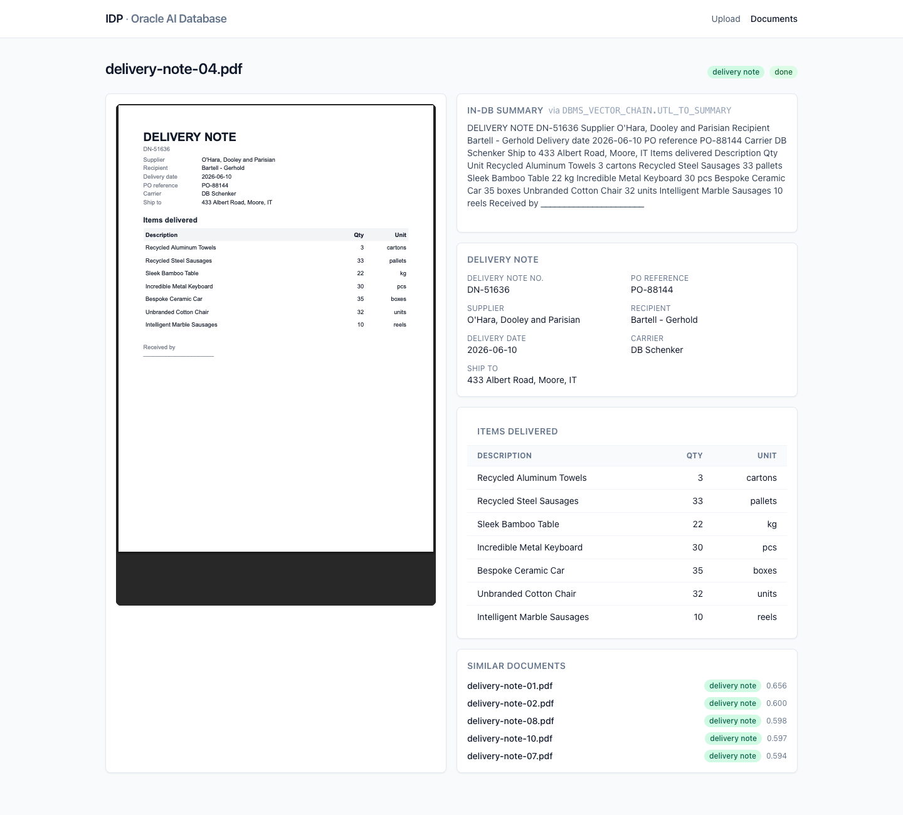
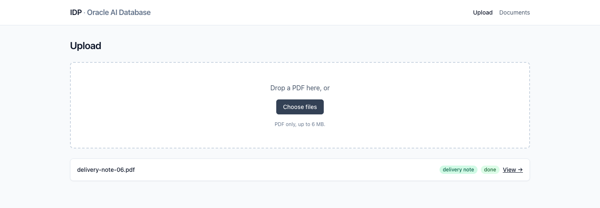
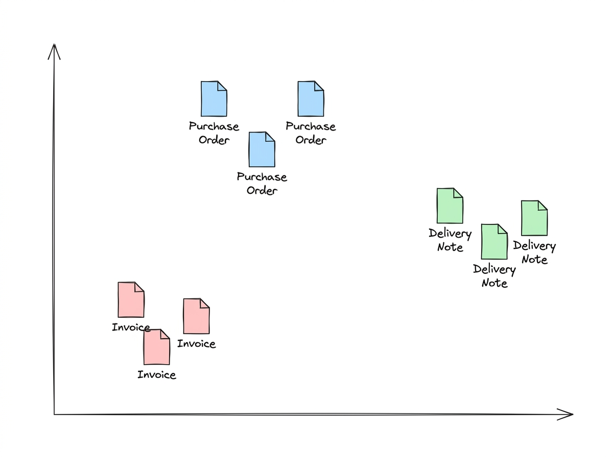
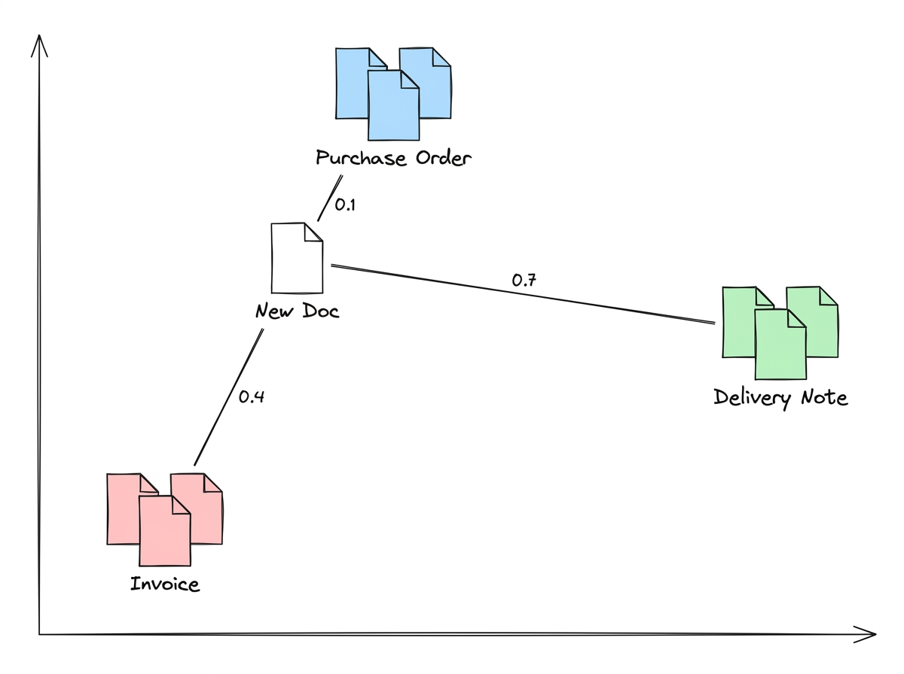
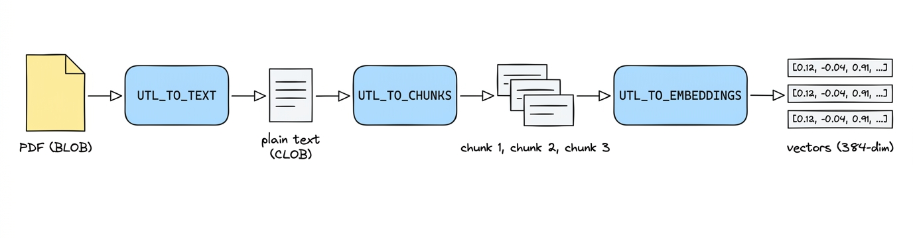

# Build an Intelligent Document Processor in One Data Store

Everybody wants to build AI applications.
But nobody knows a good use case.

One use case I have seen over and over again is processing incoming business documents.
In this article, I will show you how to build an Intelligent Document Processing (IDP) platform around the **procure-to-pay** cycle: it ingests **purchase orders, delivery notes, and invoices**, classifies them, and pulls out their structured fields.

The twist: we do all of it inside **one** data store.

## The Issue with Data Stores

IDP platforms are nothing new.
They are built and used in many companies already.
It is the typical internal tool where a bit of AI saves a lot of manual data entry.

Building one usually means stitching together several data stores:

- **S3** for the document blobs
- **DynamoDB** for key/values
- **Pinecone** for the vectors
- A **SQL** database for aggregations

…sometimes even more.

In this article, I want to demonstrate how you can build all of that with just one data store: **Oracle AI Database**.

## What Is Oracle AI Database?

**Oracle AI Database** is Oracle's AI-native database, its flagship database with AI built **into the engine** rather than bolted on through external services.

It is a _converged_ database, which means it doesn't just support typical SQL workloads.
It is a multi-model database, which lets you also:

- store JSON documents
- store relational rows
- store vectors
- store BLOB files
- … and more!

Instead of wiring up separate OpenAI, Cohere, and vector-store APIs, the database can do the work for you.

Oracle doesn't just give you a `VECTOR` data type (you could get that from a Postgres extension too). You also get text extraction, chunking, embeddings, vector search, and even calls out to generative-AI models.
All driven from SQL and PL/SQL via the `DBMS_VECTOR_CHAIN` package.

Let's build with it.

## The Architecture

We have a typical REST + SPA architecture.
The frontend and backend run on AWS. The database lives in the free tier of Oracle Cloud (OCI).


- **Frontend**: React SPA (Vite) + TanStack Router
- **Backend**: Hono API on AWS Lambda (Function URL)
- **Hosting**: S3 + CloudFront
- **Database**: Oracle AI Database (OCI Autonomous, Always Free tier)

AWS provides only compute and hosting. Everything _about_ a document (the original file, the extracted text, the structured JSON, and the vector), lives in Oracle AI Database.

## The Documents We Process

The application detects and structures incoming documents. We picked the three documents of the **procure-to-pay** cycle:

- **Purchase order** — you order the goods
- **Delivery note** — the goods arrive (items and quantities, but no prices)
- **Invoice** — you get billed

For each type we generated a handful of sample PDFs and **embedded these labeled examples** into the database. When a new document arrives, the app **compares its embedding against those labeled examples** to decide which type it most resembles. There is no rules engine and no fine-tuning — just vectors and distance.

We want to get specific fields from each document.
For example, for invoices we look for the following data (in a Zod schema):

```ts
// packages/schemas/src/invoice.ts
export const invoiceFields = z.object({
  envelope: commonEnvelope,
  vendor: z.string(),
  invoiceNumber: z.string(),
  invoiceDate: z.string(),
  dueDate: z.string().nullable(),
  currency: z.string().length(3),
  subtotal: z.number(),
  tax: z.number(),
  total: z.number(),
  lineItems: z.array(invoiceLineItem),
});
```

Our AI is extracting exactly this data.
In an IDP application this data is used for further processing like sending out the order or validating invoices.

### Viewing Documents and Content



In the application you can open any document to see the original PDF, the extracted fields, and similar documents found via vector search.

### Uploading Documents



If you want to upload a new document you can do so as well!
The uploader stores the document in the database, embeds it, and finds similar documents again.
More details about this process follow in the rest of the article.

## A Two-Minute Primer on Vectors

A vector embedding is just a list of numbers that represents the _meaning_ of a piece of text. You can picture each document as a point in space.



Documents of the same type land near each other; different types land further apart.

To classify a new document, we embed it and measure the distance to the labeled examples we already stored. The closest examples win.

For example, when a new document comes in we check whether it sits closer to a purchase order, a delivery note, or an invoice:

- `distance(new, purchase-order-sample) = 0.1` ✅
- `distance(new, delivery-note-sample)  = 0.7` ❌
- `distance(new, invoice-sample)        = 0.4` ❌

The smallest distance is the most similar, so we classify the new document as a purchase order.



## Prerequisites

To follow along you need:

- **Node 20+ and pnpm 10+**
- An **OCI Free account** with an **Oracle AI Database** (Autonomous, Always Free tier), with the wallet downloaded locally
- An **OCI API key** for OCI Generative AI (used by the extraction step)
- An **AWS account** (only if you want to deploy; you can run everything locally without it)

Two short provisioning guides in the repo walk you through the slow parts:

- [`docs/01-provision-oracle.md`](./01-provision-oracle.md) — create the database, download the wallet, run the migrations, load the embedding model.
- [`docs/02-provision-oci-genai.md`](./02-provision-oci-genai.md) — create the API key and register the in-database OCI Generative AI credential.

When the database is provisioned and `.env` is filled in (see `.env.example`), bootstrap everything with:

```bash
pnpm install
pnpm db:setup                 # creates the idp user, schema, and indexes
pnpm db:setup-onnx            # loads the ONNX embedding model as "doc_embedder"
pnpm db:setup-oci-credential  # registers the OCI Generative AI credential + smoke-tests it
```

## Setting Up the Database

### The Schema

The whole application lives in two tables. `documents` holds the file and everything we derive from it, including the 384-dimension embedding as a native `VECTOR` column:

```sql
CREATE TABLE documents (
  id                RAW(16)         DEFAULT SYS_GUID() PRIMARY KEY,
  doc_type          VARCHAR2(16)    DEFAULT 'unknown' NOT NULL,
  status            VARCHAR2(32)    DEFAULT 'pending' NOT NULL,
  original_filename VARCHAR2(512)   NOT NULL,
  mime_type         VARCHAR2(128)   NOT NULL,
  byte_size         NUMBER          NOT NULL,
  page_count        NUMBER,
  language          VARCHAR2(8),
  failed_reason     VARCHAR2(512),
  created_at        TIMESTAMP       DEFAULT SYSTIMESTAMP NOT NULL,
  updated_at        TIMESTAMP       DEFAULT SYSTIMESTAMP NOT NULL,
  file_blob         BLOB            NOT NULL,
  extracted_text    CLOB,
  embedding         VECTOR(384, FLOAT32),
  CONSTRAINT documents_doc_type_chk
    CHECK (doc_type IN ('invoice', 'purchase_order', 'delivery_note', 'unknown')),
  CONSTRAINT documents_status_chk
    CHECK (status IN ('pending','text_extracted','classified','fields_extracted','embedded','done','failed'))
);

CREATE TABLE document_fields (
  document_id RAW(16)   PRIMARY KEY,
  payload     JSON      NOT NULL,
  created_at  TIMESTAMP DEFAULT SYSTIMESTAMP NOT NULL,
  updated_at  TIMESTAMP DEFAULT SYSTIMESTAMP NOT NULL,
  CONSTRAINT document_fields_document_fk
    FOREIGN KEY (document_id) REFERENCES documents(id) ON DELETE CASCADE
);
```

A vector index makes nearest-neighbor search hit a graph instead of a brute-force scan:

```sql
CREATE VECTOR INDEX documents_embedding_idx
  ON documents (embedding)
  ORGANIZATION INMEMORY NEIGHBOR GRAPH
  DISTANCE COSINE
  WITH TARGET ACCURACY 95;
```

The per-type structured fields live in the `document_fields` table as a native `JSON` column, written with a `MERGE` upsert and read back with `JSON_SERIALIZE`. Full DDL is in [`packages/db/migrations`](../packages/db/migrations).

### Loading the Embedding Model

Oracle AI Database generates embeddings _inside_ the database from an ONNX model you upload once. We use Oracle's pre-built `all_MiniLM_L12_v2.onnx` (384-dim output), loaded with `DBMS_VECTOR.LOAD_ONNX_MODEL` and registered under the name `doc_embedder`. `pnpm db:setup-onnx` does the download and load and prints:

```
Phase 1: ADMIN pulls all_MiniLM_L12_v2.onnx into DATA_PUMP_DIR
  ✓ all_MiniLM_L12_v2.onnx = 133322334 bytes

Phase 2: idp loads "doc_embedder" from DATA_PUMP_DIR
  ✓ model doc_embedder loaded
  ✓ embedding dimension = 384
```

### Registering the OCI Generative AI Credential

The extraction step (the only LLM call in the pipeline) runs _from_ the database via `DBMS_VECTOR_CHAIN.UTL_TO_GENERATE_TEXT`, which calls OCI Generative AI. For that, the database needs a credential built from your OCI API key:

```sql
BEGIN
  DBMS_VECTOR_CHAIN.CREATE_CREDENTIAL(
    credential_name => 'OCI_CRED',
    params => JSON('{
      "user_ocid":        "ocid1.user.oc1..xxxx",
      "tenancy_ocid":     "ocid1.tenancy.oc1..xxxx",
      "compartment_ocid": "ocid1.compartment.oc1..xxxx",
      "private_key":      "<PEM body, without the BEGIN/END lines>",
      "fingerprint":      "aa:bb:cc:..."
    }')
  );
END;
/
```

You also need the IAM policy `allow group <your-group> to manage generative-ai-family in tenancy`.
`pnpm db:setup-oci-credential` grants the database privileges, opens the outbound network ACL to the OCI Generative AI host, registers `OCI_CRED`, and runs a smoke test:

```
Phase 3: smoke test UTL_TO_GENERATE_TEXT against meta.llama-3.3-70b-instruct in eu-frankfurt-1
  ✓ response: PONG.
```

If you see `PONG`, the whole chain (API key → fingerprint → network → credential → model) works.

## Ingesting Documents

The core of the application is the ingest pipeline.


When a document arrives, the pipeline:

1. Stores the uploaded file as a `BLOB` row with status `pending`.
2. Calls `DBMS_VECTOR_CHAIN.UTL_TO_TEXT` to extract the text and saves it.
3. Calls `DBMS_VECTOR_CHAIN.UTL_TO_SUMMARY` to generate a short extractive summary.
4. Generates a 384-dim embedding with `VECTOR_EMBEDDING` using the loaded ONNX model.
5. Classifies the document by running a k-NN vector search against the labeled examples — **no LLM call**.
6. Extracts the typed fields with `DBMS_VECTOR_CHAIN.UTL_TO_GENERATE_TEXT`.

It sounds straightforward, and it is — but it's worth pausing on the fact that **one database** stores the file, extracts its text, summarizes it, computes the embedding, runs the vector search, and makes the LLM call. Let's look at each step.

### Step 1 — Text Extraction with `UTL_TO_TEXT`

The first step extracts all text from the PDF.
In the database we use the function `DBMS_VECTOR_CHAIN.UTL_TO_TEXT` for that.
It can read a file (BLOB) and returns the text within the file.
We save the extracted text in the column `extracted_text`.

```sql
UPDATE documents
SET extracted_text = DBMS_VECTOR_CHAIN.UTL_TO_TEXT(file_blob)
WHERE id = HEXTORAW(:id);
```

**Important caveat:** `UTL_TO_TEXT` can only read embedded text. It can not understand images, scans, or hand-written annotations on your documents. For those, you typically need a vision-capable LLM.

### Step 2 — Summaries with `UTL_TO_SUMMARY`

In the next step, we want a summary of the document.
For that, we use the SQL function `UTL_TO_SUMMARY`.
With the `database` provider we use here, the summary is produced by Oracle Text inside the database — an extractive summary of the most representative sentences, not an LLM call.
If you want a generative summary instead, `UTL_TO_SUMMARY` can also be pointed at an external provider such as Claude or OpenAI.

```sql
SELECT DBMS_VECTOR_CHAIN.UTL_TO_SUMMARY(
  extracted_text,
  JSON('{"provider":"database","glevel":"sentence","numParagraphs":3}')
) FROM documents WHERE id = HEXTORAW(:id);
```

### Step 3 — Embeddings with `VECTOR_EMBEDDING`

Before we can classify by vectors, we need a vector.
Oracle generates one inside the database from the ONNX model we loaded earlier:

```sql
UPDATE documents
SET embedding = VECTOR_EMBEDDING(doc_embedder USING extracted_text AS data)
WHERE id = HEXTORAW(:id);
```

No external embedding service, no second store. The 384-dim vector ends up in the same row as the BLOB and the extracted text.

**One important note on size.** `VECTOR_EMBEDDING` here embeds the _entire_ extracted text in a single call. That is fine since our documents are quite small.
For larger documents, you need to **chunk** your documents first!
Oracle has a built-in mechanism for that as well with `UTL_TO_CHUNKS`.



In one SQL statement the whole chain looks like this:

```sql
-- TEXT -> CHUNKS -> EMBEDDINGS, in one statement
SELECT et.*
FROM documents d,
     DBMS_VECTOR_CHAIN.UTL_TO_EMBEDDINGS(
       DBMS_VECTOR_CHAIN.UTL_TO_CHUNKS(
         DBMS_VECTOR_CHAIN.UTL_TO_TEXT(d.file_blob),
         JSON('{ "by":"words", "max":"200", "overlap":"20", "split":"recursively" }')
       ),
       JSON('{ "provider":"database", "model":"doc_embedder" }')
     ) et
WHERE d.id = HEXTORAW(:id);
```

For us, embedding the documents directly suffices.

### Step 4 — Classifying with k-NN

There are two ways to classify a document:

1. Ask an LLM "what kind of document is this?"
2. Ask your vectors which labeled examples it resembles.

We go with option 2.
Because it doesn't incur any LLM costs.
And it gives us the powers of a vector store.

We run a k-nearest-neighbors search:

1. embed the new document
2. find its k nearest labeled examples
3. take the majority document type among them

```ts
// packages/db/src/repositories/documents.ts (abridged)
async classifyByVector(id: string, k = 5, unknownThreshold = 0.5) {
  return withConnection(async (conn) => {
    const result = await conn.execute(
      `SELECT b.doc_type AS DOC_TYPE,
              VECTOR_DISTANCE(a.embedding, b.embedding, COSINE) AS DISTANCE
       FROM documents a, documents b
       WHERE a.id = HEXTORAW(:id)
         AND b.id != HEXTORAW(:id)
         AND b.embedding IS NOT NULL
         AND b.doc_type IN ('invoice', 'purchase_order', 'delivery_note')
         AND b.status = 'done'
       ORDER BY DISTANCE
       FETCH FIRST :k ROWS ONLY`,
      { id, k },
      { outFormat: oracledb.OUT_FORMAT_OBJECT },
    );
    const neighbors = (result.rows ?? []).map((r) => ({
      docType: r.DOC_TYPE,
      distance: Number(r.DISTANCE),
    }));

    if (!neighbors.length || neighbors[0].distance > unknownThreshold) {
      return { docType: 'unknown', confidence: 0 };
    }

    const counts: Record<string, number> = {};
    for (const n of neighbors) counts[n.docType] = (counts[n.docType] ?? 0) + 1;
    const [winner, votes] = Object.entries(counts).sort((a, b) => b[1] - a[1])[0];
    return { docType: winner, confidence: votes / neighbors.length };
  });
}

```

We only compare against labeled examples that finished processing (`status = 'done'`), take the `k` nearest by cosine distance, and let them vote. If even the closest example is farther than our `unknownThreshold` of `0.5`, we mark the document `unknown` instead of guessing.

For example, for a new purchase order the nearest neighbors might come back as (nearest first):

- `doc_1` — distance `0.12` — purchase order
- `doc_2` — distance `0.19` — purchase order
- `doc_3` — distance `0.24` — purchase order

All three are purchase orders and well inside the threshold, so we classify the new document as a **purchase order**.

### Step 5 — Extracting Fields with `UTL_TO_GENERATE_TEXT`

Vectors tell us **what** a document is. They can't tell us **what's in it**.

For that we need structured output.
For example for an invoice we look for the following schema:

```ts
// packages/schemas/src/invoice.ts
export const invoiceFields = z.object({
  envelope: commonEnvelope,
  vendor: z.string(),
  invoiceNumber: z.string(),
  invoiceDate: z.string(),
  dueDate: z.string().nullable(),
  currency: z.string().length(3),
  subtotal: z.number(),
  tax: z.number(),
  total: z.number(),
  lineItems: z.array(invoiceLineItem),
});
```

This data is necessary for our business processes.

This is the first time we actually need to call an LLM.
And we can do that directly from the database again!
With the function `DBMS_VECTOR_CHAIN.UTL_TO_GENERATE_TEXT`.

For each of our documents we have such a Zod validation schema.
This schema is converted to `JSON` and passed onto our LLM call.

```ts
// packages/schemas/src/registry.ts
export const fieldsSchemaByType = {
  invoice: invoiceFields,
  purchase_order: purchaseOrderFields,
  delivery_note: deliveryNoteFields,
} as const;

export type ExtractableDocType = keyof typeof fieldsSchemaByType;

export function getJsonSchemaForType(docType: ExtractableDocType): object {
  return zodToJsonSchema(fieldsSchemaByType[docType], {
    target: "jsonSchema7",
    $refStrategy: "none",
  });
}
```

Then we call the database function like that:

```sql
SELECT DBMS_VECTOR_CHAIN.UTL_TO_GENERATE_TEXT(
  :prompt,
  JSON('{
    "provider":        "ocigenai",
    "credential_name": "OCI_CRED",
    "url":             "https://inference.generativeai.eu-frankfurt-1.oci.oraclecloud.com/20231130/actions/chat",
    "model":           "meta.llama-3.3-70b-instruct",
    "chatRequest":     { "maxTokens": 4096, "temperature": 0 }
  }')
) AS out FROM dual;
```

In our `:prompt` we say:

```
You extract structured fields from a document. Respond with a single JSON object….
JSON Schema:
${JSON.stringify(jsonSchema)}
```

After the call returns, we validate all data against our Zod schema to make sure all fields are available.
If they are not, the processing **fails**.

That is all for ingesting!
We didn't need to leave our one data store at all.

## Validate It End to End

With the database set up, run the API and seed it with the committed sample PDFs:

```bash
pnpm dev:api   # Hono on :8787
pnpm seed      # uploads every sample PDF and waits for ingest
```

`pnpm seed` prints a per-file result and a summary you can sanity-check:

```
  ✓ invoice-01.pdf         type=invoice         status=done  3.1s
  ✓ purchase-order-01.pdf  type=purchase_order  status=done  2.8s
  ✓ delivery-note-01.pdf   type=delivery_note   status=done  2.6s
  ...
Summary
  by type:   {"invoice":10,"purchase_order":10,"delivery_note":10}
  by status: {"done":30}
```

If a document lands on `status=failed`, the reason is stored in `documents.failed_reason` (a common one is `no_text_extracted` for a scanned/image PDF — see the OCR caveat above). The two provisioning guides each end with a troubleshooting table covering the usual wallet, credential, and region errors.

## Deployment

You can deploy the whole thing into your own AWS account:

```bash
pnpm cdk:deploy
```

It's hosted on S3 + CloudFront, with the API in a single Lambda Function URL. At low scale it costs essentially nothing.

Have fun trying it out!

## Summary

In this article, we went through a whole IDP pipeline.
From uploading PDFs, to embedding vectors, classifying documents with k-NN, and even making our own call to OCI Generative AI.
All within one data store.

This is one of the biggest benefits of using a converged database such as Oracle AI Database.

In a traditional stack this would have been at least 4 systems:

- S3 (BLOB)
- Postgres (relational)
- Pinecone (Vectors)
- DynamoDB/MongoDB (JSON)

…and additionally API calls to external LLM providers.
With our used database all of that stays within one system.
