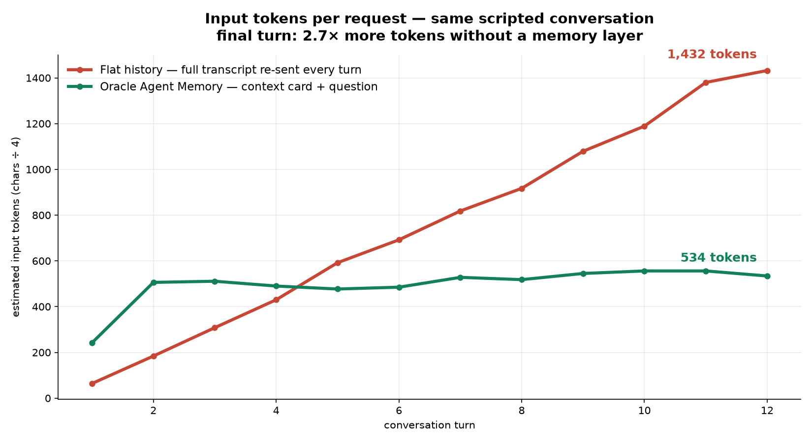

# The Memory Illusion — flat history vs. Oracle Agent Memory

Your AI chat feels like it remembers you. It doesn't — every message re-sends
the entire conversation, and you pay for it in tokens. This app proves it, then
fixes it: **one scripted 12-turn conversation, run twice** — once with flat
history, once through the official
[`oracleagentmemory`](https://pypi.org/project/oracleagentmemory/) package on
Oracle AI Database. Everything runs **100% local**: the free database container,
Llama via Ollama. No cloud, no API keys.


|                                  | Demo 1 — flat history       | Demo 2 — Oracle Agent Memory  |
| -------------------------------- | --------------------------- | ----------------------------- |
| Conversation state               | re-sent inside every prompt | rows in Oracle AI Database    |
| Tokens per request (measured)    | 64 → **1,433** (climbing)   | ≈ **500** (flat)              |
| Turn-12 recall ("which seat?")   | works — by re-reading it all | works — by **remembering**   |

The memory layer does three jobs: **store** the chat (`add_messages`) ·
**distill** the facts (a plain-English extraction policy) · **find** them
(`get_context_card`). The `"Memory updated"` toast you know from chat apps is
the distill step — a database write you can `SELECT`.

## Files

| File                     | What it does                                                        |
| ------------------------ | ------------------------------------------------------------------- |
| `conversation.py`        | the shared 12-turn script — both demos import it (the fair test)     |
| `demo1_flat_history.py`  | the problem: the whole history goes to the model, every turn         |
| `demo2_agent_memory.py`  | the fix: store → distill (custom extraction policy) → context cards  |
| `show_memories.py`       | plain SQL over the MEMORY table — memories are rows                  |
| `plot_comparison.py`     | renders the tokens-per-request chart from the real run logs          |
| `setup_db.sh`            | boots Oracle AI Database Free (Docker) and creates the demo user     |
| `config.py` / `ui.py`    | shared config (env-overridable) and terminal rendering               |

## Quick start

Prereqs: Docker 20.10+, **Python 3.11+** (3.12 recommended — `litellm` needs
3.11), [Ollama](https://ollama.com), ~12 GB free disk.

```bash
# 1 · Oracle AI Database Free (first time creates the container)
docker run -d --name oracle26ai -p 1521:1521 -e ORACLE_PWD=Welcome_123 \
  -v oracle26ai-data:/opt/oracle/oradata \
  container-registry.oracle.com/database/free:23.26.1.0
bash setup_db.sh        # waits for readiness + creates the memdemo user (idempotent)

# 2 · local models
ollama pull llama3.1:8b && ollama pull nomic-embed-text

# 3 · Python env
python3.12 -m venv .venv && source .venv/bin/activate
pip install -r requirements.txt

# 4 · run
python demo1_flat_history.py     # tokens climb 64 -> 1,433
python demo2_agent_memory.py     # stays ~500, then prints the extracted memories
python show_memories.py          # SELECT the memories as rows
python plot_comparison.py        # the chart, from your own run
```



Token counts use the `chars ÷ 4` estimate — the same convention as the Oracle
Agent Memory technical report (arXiv:2607.13157), whose 80-turn measurement
shows ~13,900 vs ~1,300 tokens per request (10.7×).

## Known limitation (honest by design)

The token behavior is deterministic; **extraction quality is not** — it depends
on the extraction LLM, and `llama3.1:8b` is the floor (it occasionally fumbles
a fact). One env var upgrades it: `CHAT_MODEL=ollama/<bigger-model>`. The
memory *lifecycle* is a database problem; memory *quality* is still an LLM
problem.

## References

- Oracle Developers Blog: [Agent memory is a database problem](https://blogs.oracle.com/developers/agent-memory-is-a-database-problem-oracle-research-makes-the-case)
- [`oracleagentmemory` on PyPI](https://pypi.org/project/oracleagentmemory/)
- Technical report: *Oracle Agent Memory as an Enterprise Memory Substrate for
  Long-Horizon AI Agents* (arXiv:2607.13157)
- Companion video walkthrough: [@RahulWagh](https://www.youtube.com/@RahulWagh)

## License

Copyright (c) 2026 Oracle and/or its affiliates.
Licensed under the Universal Permissive License v 1.0 — see [LICENSE](LICENSE).
