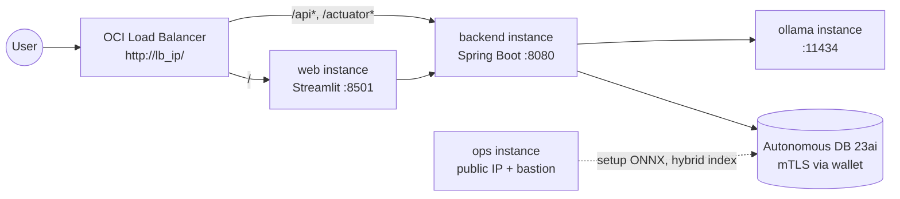

# Cloud Deployment — Oracle Cloud Infrastructure

This guide deploys the full stack (Spring Boot backend, Streamlit web UI, Ollama
LLM, Autonomous Database with the in-DB ONNX embedding model and Hybrid Vector
Index, plus an ops/bastion instance) on **Oracle Cloud Infrastructure**.
The local-machine flow in [README.md](./README.md) still works exactly as before
— this guide is a separate, additive deployment target.

## Architecture



| Component                       | OCI resource                                | Subnet                 | Notes                                                                                                                                           |
| ------------------------------- | ------------------------------------------- | ---------------------- | ----------------------------------------------------------------------------------------------------------------------------------------------- |
| Backend (Java 21 / Spring Boot) | `oci_core_instance`                         | `app_subnet` (private) | Connects to Autonomous via wallet, talks to Ollama on the private subnet                                                                        |
| Web (Streamlit)                 | `oci_core_instance`                         | `app_subnet` (private) | systemd unit runs `streamlit run app.py` on port 8501                                                                                           |
| Ollama (LLM)                    | `oci_core_instance`                         | `app_subnet` (private) | Shape (CPU/GPU) chosen during `manage.py setup`; pulls `qwen2.5` on first boot                                                                  |
| Ops / Bastion                   | `oci_core_instance` + `oci_bastion_bastion` | `public_subnet`        | Runs SQLcl against Autonomous to load the ONNX model and create the hybrid index                                                                |
| Autonomous Database             | `oci_database_autonomous_database`          | n/a (managed)          | 23ai, ECPU, mTLS required, public ACL `0.0.0.0/0` for laptop testing                                                                            |
| Load Balancer                   | `oci_load_balancer` (flexible)              | `public_subnet`        | Single public IP. Routes `/api*` and `/actuator*` to backend, everything else to Streamlit                                                      |
| Object Storage                  | `oci_objectstorage_bucket`                  | n/a                    | Holds zipped Ansible playbooks, backend JAR, web sources, ONNX model, wallet — all served to instances via short-TTL Pre-Authenticated Requests |

## Prerequisites

- An OCI tenancy with a compartment you can create resources in
- `~/.oci/config` set up (the same file `oci-cli` uses)
- The OCI API private key file referenced by that config
- Terraform `>= 1.7`
- Python 3.11+
- Java 21 (for the local Gradle build)
- An SSH key pair under `~/.ssh/` (for instance access)
- The pre-built `models/all_MiniLM_L12_v2.onnx` file. Download it from
  [Oracle's ML blog post](https://blogs.oracle.com/machinelearning/use-our-prebuilt-onnx-model-now-available-for-embedding-generation-in-oracle-database-23ai)
  and place it under `apps/oracle-database-java-agent-memory/models/` —
  `manage.py build` checks for it.

## Deployment flow

```
python manage.py setup  →  python manage.py build  →  python manage.py tf
                                                      ↓
                          terraform apply  →  python manage.py info
```

### 1. Install Python deps

```bash
pip install -r requirements.txt
```

### 2. Configure (interactive)

```bash
python manage.py setup
```

You'll pick:

- OCI profile, region, compartment
- SSH key (from `~/.ssh/`)
- **Ollama instance shape** — CPU or GPU choice (default `VM.Standard.E4.Flex`)
- Ollama chat model (default `qwen2.5`)
- Project name (default `agentmem`)

A random Oracle-compliant DB admin password is generated for you. Everything is
written to `.env` (git-ignored).

### 3. Build the backend

```bash
python manage.py build
```

This runs `./gradlew build` in `src/chatserver/` and verifies that
`models/all_MiniLM_L12_v2.onnx` is present.

### 4. Render Terraform variables

```bash
python manage.py tf
```

This generates `deploy/tf/app/terraform.tfvars` from the Jinja2 template using
the values in `.env`.

### 5. Apply Terraform

```bash
cd deploy/tf/app
terraform init
terraform plan -out=tfplan
terraform apply tfplan
```

Terraform will:

1. Provision the VCN, subnets, IGW/NAT, security lists, LB.
2. Create an Autonomous DB 23ai with mTLS, fetch the wallet (base64).
3. Upload Ansible playbooks, the backend JAR, Streamlit sources, the ONNX
   model, and the wallet to an Object Storage bucket (each gets a short-TTL
   PAR).
4. Provision Ollama, ops, backend, and web instances. Each runs cloud-init
   that pulls its artifacts via PAR and runs Ansible locally.
5. Wait for ops to finish DB initialization (`/home/opc/ops-done.flag`) before
   starting the backend (a `null_resource` blocks on this so the
   `DataSeeder` can't race the hybrid-index creation).
6. Write `deploy/tf/app/generated/wallet.zip` for laptop testing.

Total time: 15–25 minutes (Ollama model pull on first boot is the long pole on
CPU shapes; GPU shapes finish faster).

### 6. Post-apply summary

```bash
cd ../../..
python manage.py info
```

This copies the wallet to `deploy/generated/wallet.zip`, prints the Web URL,
backend health check, ops SSH command, and a ready-to-paste recipe for
running the local backend against Autonomous.

## Access

- **Web UI**: `http://<lb_public_ip>/`
- **Backend health**: `curl http://<lb_public_ip>/actuator/health`
- **Backend chat**:
  ```bash
  curl -X POST http://<lb_public_ip>/api/v1/agent/chat \
    -H 'Content-Type: text/plain' \
    -H 'X-Conversation-Id: cloud-1' \
    -d "What's your return policy?"
  ```
- **Ops SSH**: `ssh -i <ssh_private_key_path> opc@<ops_public_ip>`

Tail logs on any instance:

```bash
ssh opc@<ip> sudo tail -f /var/log/cloud-init-output.log
ssh opc@<ip> tail -f /home/opc/ansible-playbook.log
```

## Run the local backend against Autonomous

The wallet generated by Terraform is also written to
`deploy/generated/wallet.zip`. You can use it from your laptop:

```bash
unzip -o deploy/generated/wallet.zip -d deploy/generated/wallet
export TNS_ADMIN=$(pwd)/deploy/generated/wallet
export DB_URL="jdbc:oracle:thin:@<deployment_name>_high?TNS_ADMIN=$TNS_ADMIN"
export DB_USERNAME=ADMIN
export DB_PASSWORD="<from terraform output db_admin_password>"

cp src/chatserver/src/main/resources/application-cloud.yaml.example \
   src/chatserver/src/main/resources/application-cloud.yaml

cd src/chatserver
./gradlew bootRun --args='--spring.profiles.active=cloud'
```

Then start Streamlit locally pointing at `http://localhost:8080`:

```bash
cd src/web && streamlit run app.py
```

Get `<deployment_name>` and `<db_admin_password>` from
`cd deploy/tf/app && terraform output`.

## Verification

After everything is up:

1. **DB state (from ops)**

   ```bash
   ssh opc@<ops_public_ip>
   sql -name admin
   -- inside SQLcl:
   SELECT MODEL_NAME FROM USER_MINING_MODELS;
   SELECT INDEX_NAME, DOMIDX_OPSTATUS FROM USER_INDEXES
    WHERE INDEX_NAME = 'POLICY_HYBRID_IDX';
   SELECT VECTOR_EMBEDDING(ALL_MINILM_L12_V2 USING 'hello' AS data) FROM DUAL;
   SELECT COUNT(*) FROM POLICY_DOCS;  -- 12 after backend has seeded
   ```

2. **Ollama sanity (from ops via private SSH)**

   ```bash
   ssh opc@<ops_public_ip> \
     "ssh -i /home/opc/private.key -o StrictHostKeyChecking=no \
      opc@<ollama_private_ip> curl -s http://localhost:11434/api/tags"
   ```

3. **End-to-end through the LB**

   ```bash
   curl -s http://<lb_public_ip>/actuator/health
   curl -X POST http://<lb_public_ip>/api/v1/agent/chat \
     -H 'Content-Type: text/plain' \
     -H 'X-Conversation-Id: cloud-smoke' \
     -d "Show my orders"
   ```

4. **Web UI** — open `http://<lb_public_ip>/` in a browser.

## Cleanup

```bash
cd deploy/tf/app
terraform destroy
cd ../../..
python manage.py clean
```

`manage.py clean` refuses to run while the Terraform state still has
resources, so you have to `terraform destroy` first.

## Troubleshooting

| Symptom                                                                 | Likely cause                                           | What to do                                                                                                                                         |
| ----------------------------------------------------------------------- | ------------------------------------------------------ | -------------------------------------------------------------------------------------------------------------------------------------------------- |
| `terraform apply` fails on `oci_objectstorage_object.onnx_model_object` | ONNX file missing from `models/`                       | Download `all_MiniLM_L12_v2.onnx` into `models/` and re-run `manage.py build`                                                                      |
| `ops_wait` provisioner times out (30 min)                               | ops cloud-init crashed mid-way                         | `ssh opc@<ops_public_ip> tail -200 /home/opc/ansible-playbook.log` and look for the failing SQL task                                               |
| `DBMS_CLOUD.LOAD_ONNX_MODEL_CLOUD` fails with `ORA-`                    | OCI API key credential wrong, or PAR expired           | Re-render the credential SQL on ops and re-run `setup_hybrid_search.sql`; if PARs have expired (default 7 days), re-apply the storage TF resources |
| Backend can't reach Autonomous                                          | wallet not unzipped, wrong service name                | `ssh opc@<backend_private_ip> ls /home/opc/backend/wallet`; verify the `.ora` files are present                                                    |
| Streamlit returns 502 from LB                                           | Streamlit not yet ready                                | LB health check is on `:8501/`; wait ~2 min after web cloud-init then retry                                                                        |
| Backend `/actuator/health` 503                                          | Backend started before ops finished, DB schema missing | This shouldn't happen given `null_resource.ops_wait`. If it does, restart `backend.service` after confirming `POLICY_HYBRID_IDX` exists            |

## Notes & limits

- **No HTTPS in v1** — the LB listener is HTTP on port 80. Terminate TLS at
  the LB if you need it.
- **Single instance per role** — no auto-scaling.
- **mTLS only** — the wallet is required for every connection. The ACL is
  `0.0.0.0/0` because the demo expects laptop access, but mTLS still gates it.
- **No GPU driver install** — GPU shapes rely on OCI-provided images that
  ship with NVIDIA drivers. If you pick a shape whose image doesn't, install
  the drivers manually.
