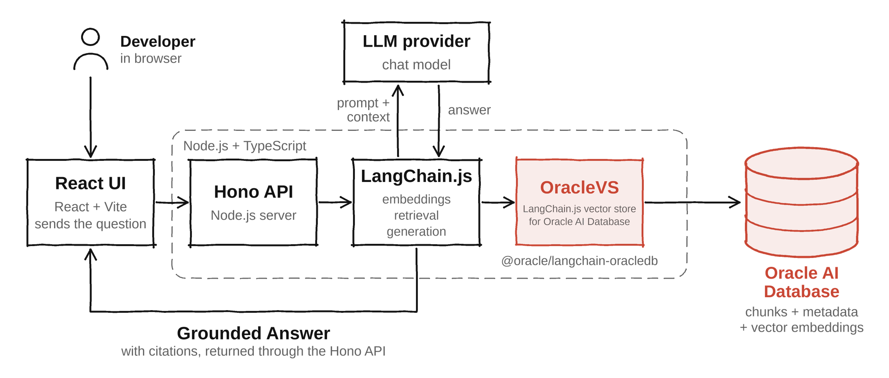
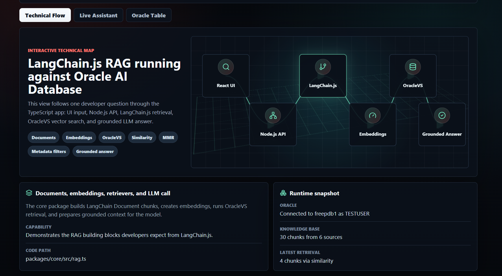
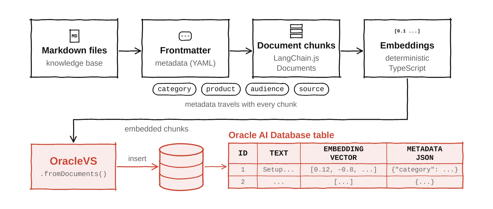
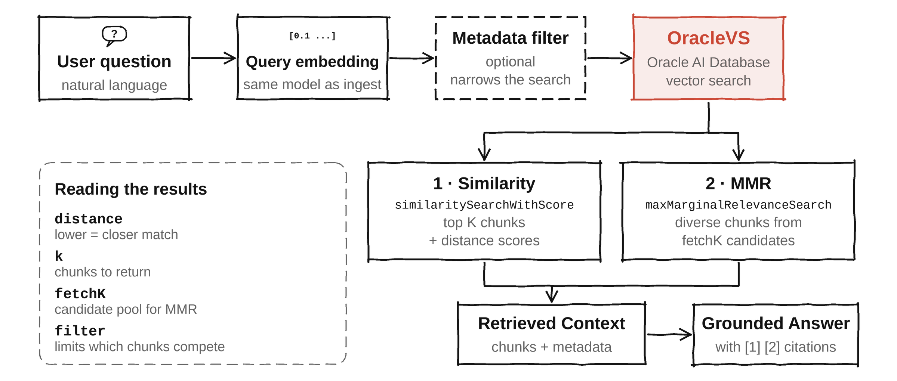
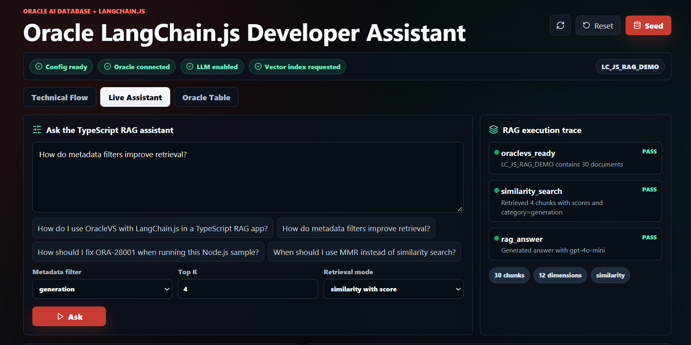
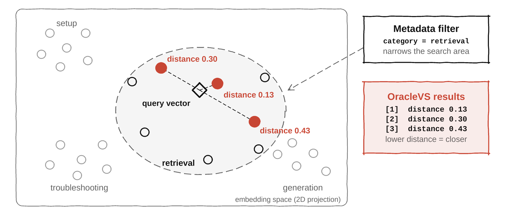
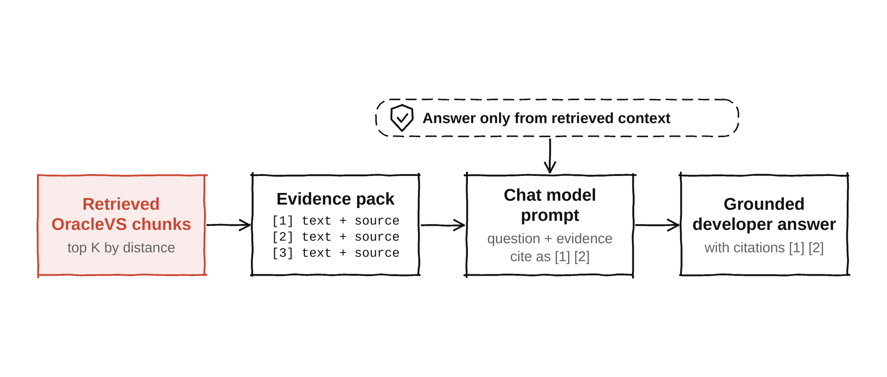
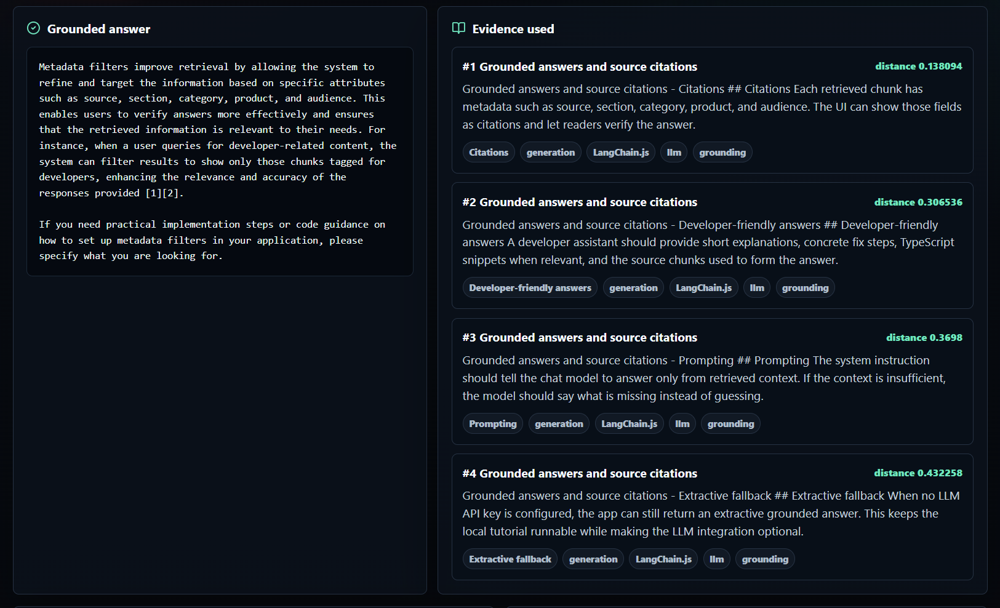
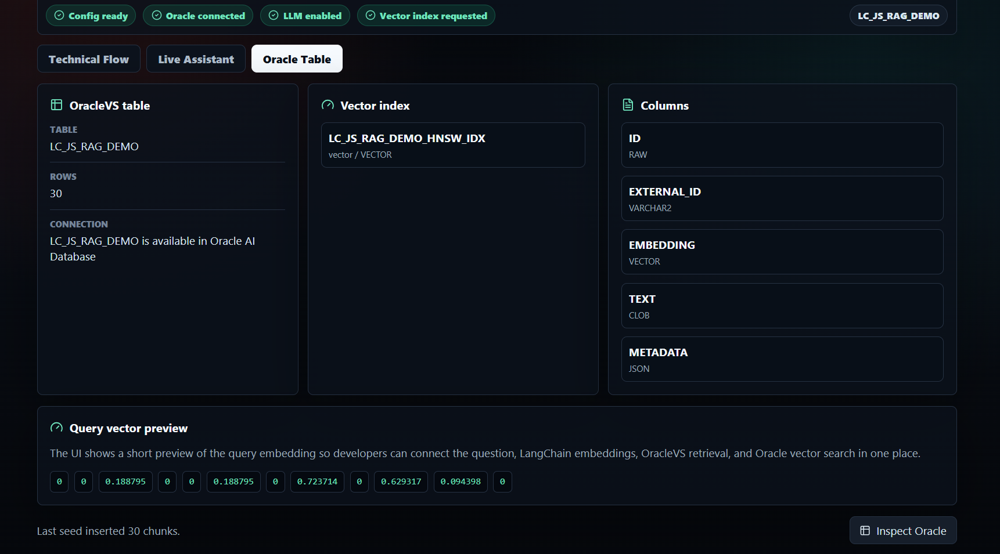

# Build a LangChain.js RAG Assistant with Oracle AI Database

LangChain.js gives TypeScript developers a familiar way to build retrieval-augmented generation applications. Oracle AI Database gives the same application a durable vector store next to operational data, metadata, indexes, and SQL inspection.

This sample combines them in a local developer assistant. The app loads a small markdown knowledge base, stores chunks and embeddings in Oracle AI Database with `OracleVS`, retrieves relevant context with LangChain.js, and generates grounded answers through a Node.js API.

The goal is not to build another notebook. The goal is to show the integration in the environment where JavaScript developers will actually run it: a browser UI, a Node.js API, TypeScript packages, CLI scripts, and an Oracle table that can be inspected.

<p align="center">
  
</p>
<p align="center"><em>Architecture: a TypeScript RAG app using Oracle AI Database as the LangChain.js vector store.</em></p>

## What We Are Building

The application is a technical support assistant for Oracle AI Database and LangChain.js developers. It answers questions such as:

- How do I seed `OracleVS` from TypeScript?
- When should I use similarity search, similarity search with scores, or MMR?
- How do metadata filters change retrieval?
- How do I create or inspect a vector index?
- What does an Oracle connection error mean while running the Node.js sample?

The important part is that the application makes the RAG workflow visible. The UI does not only show an answer. It also shows retrieval mode, metadata filters, top K, distance scores, evidence chunks, the LangChain.js call, a representative Oracle vector-search SQL statement, and the Oracle table shape.

<p align="center">
  
</p>
<p align="center"><em>The Technical Flow tab maps the same runtime path that the code executes.</em></p>

## Architecture

The runtime has five layers:

| Layer | Role |
| --- | --- |
| React + Vite web app | Sends questions, metadata filters, top K, and retrieval mode to the API. Shows traces, evidence, answer, and Oracle inspection. |
| Hono API | Exposes `/api/status`, `/api/corpus`, `/api/inspect`, `/api/seed`, `/api/reset`, and `/api/ask`. |
| LangChain.js core package | Loads markdown as `Document` chunks, embeds text, retrieves context, formats evidence, and prepares grounded answers. |
| OracleVS | LangChain.js vector store implementation from `@oracle/langchain-oracledb`. |
| Oracle AI Database | Stores text, native vectors, JSON metadata, optional vector index metadata, and returns vector-distance results. |

The key point is that Oracle AI Database is the vector store. The app does not push embeddings into a separate vector database and then join results back to Oracle later. Text, embeddings, metadata, and index metadata stay in one Oracle table created by `OracleVS`.

## Loading The Knowledge Base

The seed command reads markdown files from `samples/knowledge-base`. Each file contains frontmatter such as `source`, `category`, `product`, `priority`, `audience`, and `tags`.

The core package turns those files into section-level LangChain `Document` objects:

```ts
new Document({
  pageContent: `${title} - ${section}\n\n${sectionContent}`,
  metadata: {
    title,
    source,
    category,
    product,
    priority,
    audience,
    tags,
    section,
    chunk,
  },
});
```

This matters because metadata becomes part of the retrieval surface. A developer can ask for all content, or restrict retrieval to one category such as `setup`, `retrieval`, `troubleshooting`, `database`, or `generation`.

<p align="center">
  
</p>
<p align="center"><em>Ingestion: markdown becomes LangChain documents, embeddings, metadata, and OracleVS rows.</em></p>

## Storing Vectors In Oracle AI Database

The seed path calls `OracleVS.fromDocuments`:

```ts
const vectorStore = await OracleVS.fromDocuments(documents, embeddings, {
  client: pool,
  tableName: config.tableName,
  query: "Oracle AI Database LangChain.js RAG",
  distanceStrategy: DistanceStrategy.COSINE,
  format: VectorElementFormat.FLOAT32,
  description: "LangChain.js RAG sample app table for Oracle AI Database",
});
```

`OracleVS` creates the Oracle table and inserts the chunk text, embedding vector, and metadata. The sample uses deterministic TypeScript embeddings so every reviewer gets the same local retrieval behavior. In a production app, the same LangChain.js interface can be swapped for OpenAI, OCI Generative AI, or another embedding provider.

For supported database versions and schemas, the app can also request an HNSW vector index during seed:

```ts
await createIndex(connection, vectorStore, {
  idxName: `${tableName}_HNSW_IDX`,
  idxType: "HNSW",
  accuracy: 90,
  parallel: 1,
});
```

Index creation is optional because local tutorial databases may not all have the same privileges or quota. The app still works without the index; the index becomes important as the table grows.

## Retrieval Modes

The `/api/ask` endpoint initializes `OracleVS` and runs one of two retrieval paths.

For similarity search with scores:

```ts
const retrieved = await vectorStore.similaritySearchWithScore(
  question,
  k,
  filter,
);
```

This is useful when the UI should show distance values next to each retrieved chunk.

For maximal marginal relevance:

```ts
const retrieved = await vectorStore.maxMarginalRelevanceSearch(question, {
  k,
  fetchK,
  lambda: 0.5,
  filter,
});
```

MMR is useful when the top similarity results are too repetitive. It fetches a wider candidate set, then balances similarity and diversity so the model sees broader context.

<p align="center">
  
</p>
<p align="center"><em>Retrieval: the same OracleVS table supports similarity search, scores, filters, and MMR.</em></p>

<p align="center">
  
</p>
<p align="center"><em>The Live Assistant tab exposes retrieval controls and the execution trace for each question.</em></p>

## Metadata Filters

The app exposes a category filter in the UI. If a category is selected, the API passes a LangChain.js filter to `OracleVS`:

```ts
const filter =
  category && category !== "all"
    ? { category: { $eq: category } }
    : undefined;
```

This demonstrates an important production pattern: retrieval should often be scoped before vector search. Tenant, product, audience, access level, source, category, and priority can all be modeled as metadata. The vector search then runs over the subset that is allowed or relevant.

The trace panel also shows representative Oracle vector-search SQL so developers can connect the LangChain.js call to the database concept:

```sql
SELECT id, text, metadata,
       VECTOR_DISTANCE(embedding, :query_vector, COSINE) AS distance
FROM LC_JS_RAG_DEMO
WHERE JSON_VALUE(metadata, '$.category') = :category
ORDER BY distance
FETCH FIRST :k ROWS ONLY
```

The exact SQL issued by the library is abstracted by `OracleVS`, but the representative SQL helps explain what the vector store is doing.

<p align="center">
  
</p>
<p align="center"><em>Vector search: metadata limits which chunks compete, then distance ranks the nearest matches.</em></p>

## Grounded Answers

After retrieval, the API formats an evidence pack from the retrieved chunks:

```text
[1] Grounded answers and source citations / Citations
<chunk text>
Source: answer-grounding
Metadata: category=generation; product=LangChain.js; ...
Distance: 0.138094
```

If `OPENAI_API_KEY` is configured, the API sends only that retrieved context to the chat model and instructs it to answer as a developer assistant using the OracleVS evidence. The answer cites chunks by rank, such as `[1]` or `[2]`.

If no LLM key is configured, the app still returns an extractive grounded answer from the retrieved context. That keeps the sample runnable even when a reviewer only wants to validate the Oracle and LangChain.js integration locally.

<p align="center">
  
</p>
<p align="center"><em>Grounding: retrieved OracleVS chunks become cited evidence for the chat model.</em></p>

<p align="center">
  
</p>
<p align="center"><em>The answer view keeps the generated response next to the source chunks used as evidence.</em></p>

## Oracle Table Inspection

The Oracle Table view is intentionally technical. It shows:

- configured OracleVS table name
- row count
- table columns
- vector index metadata when available
- query vector preview after a question is asked

This helps developers verify that `OracleVS` is not a black box. The app creates and queries an Oracle table, and the UI lets them inspect that table from the same workflow.

<p align="center">
  
</p>
<p align="center"><em>The Oracle Table tab connects LangChain.js retrieval back to the database objects it uses.</em></p>

## Validate The App End To End

Install dependencies and configure `.env`:

```bash
pnpm install
cp .env.example .env
```

Choose one Oracle connection target:

| Target | Example connect string | Extra settings |
| --- | --- | --- |
| Local Oracle Database Free / Oracle AI Database | `localhost:1521/FREEPDB1` | no wallet |
| Autonomous AI Database | service alias from `tnsnames.ora` or full TCPS descriptor | `ORACLE_WALLET_LOCATION`, usually `ORACLE_WALLET_PASSWORD` |

The app accepts either the `ORACLE_*` variable names shown in `.env.example` or the `DB_*` aliases often copied from notebook examples. The schema must have enough privileges to create and drop the demo OracleVS table.

Check the database:

```bash
pnpm db:check
```

Seed the vector table:

```bash
pnpm seed
```

Run the API and web app:

```bash
pnpm dev:api
pnpm dev
```

Open `http://localhost:5173`, ask a question, and inspect the trace. A healthy run should show:

- Oracle connection ready
- seeded knowledge-base chunks
- similarity or MMR retrieval
- evidence cards
- grounded answer
- Oracle table metadata

## Why This Integration Is Useful

LangChain.js gives the TypeScript app a consistent RAG programming model: documents, embeddings, vector stores, retrievers, chat models, and traces.

Oracle AI Database gives the app a governed data layer for vectors and metadata. The application can store chunks, vectors, and JSON metadata in Oracle, search them with vector distance, add vector indexes, and inspect the result with familiar database tooling.

Together, they let JavaScript developers build a RAG workflow without switching to Python notebooks or adding a separate vector database just for retrieval.
