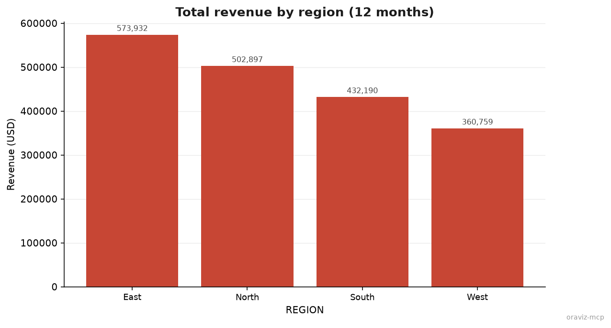
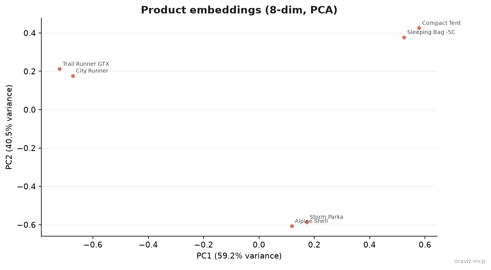

<p align="center">
  
</p>

<h1 align="center">OraViz MCP</h1>

<p align="center">
  <strong>Oracle AI Database, chart-ready.</strong> A minimal, visualization-first MCP server. Query, profile, plot.
</p>

<p align="center">
  
  
  
  <a href="LICENSE"></a>
  <a href="https://github.com/jasperan/oraviz-mcp/actions/workflows/ci.yml"></a>
</p>

---

OraViz MCP is [`pab1it0/adx-mcp-server`](https://github.com/pab1it0/adx-mcp-server) reimagined for **Oracle AI Database** -- a
deliberately tiny alternative to the broad official Oracle MCP servers. It speaks SQL, profiles tables, and turns result
sets into **PNG charts** any MCP client can show. Seven read-oriented tools, no Oracle client libraries (python-oracledb
thin mode talks straight to Oracle AI Database **26ai Free** or any newer release).

Two ideas shape everything:

- **Visualization first.** The headline tool runs your query and returns an actual chart image plus a short data
  preview -- not a wall of rows.
- **Context engineering.** Agents pay for every token a tool returns, so OraViz never dumps a result set. Results are
  preview-capped, rendered as one compact markdown table with a metadata header, and large values (CLOB, BLOB, VECTOR)
  are summarised. Raw LOBs are never read.

Deploy with a dedicated Oracle reader account. Network transports require verified bearer tokens;
stdio uses local OS trust. See [SECURITY.md](SECURITY.md) for the security boundaries and deployment checklist.

## Visualization at a Glance

<table>
<tr>
<td align="center"><strong>Bar</strong><br/></td>
<td align="center"><strong>Area / Line</strong><br/></td>
</tr>
<tr>
<td colspan="2" align="center"><strong>Vector (PCA)</strong><br/></td>
</tr>
<tr>
<td colspan="2" align="center"><em>All images were rendered by <code>create_chart</code> against the demo schema in <a href="examples/demo-sales.sql"><code>examples/demo-sales.sql</code></a>.</em></td>
</tr>
</table>

## Why OraViz?

- **Charts, not query dumps** -- `create_chart` renders bar, line, area, scatter, pie, histogram, and vector (PCA) charts with an Oracle-red palette and returns the PNG as MCP image content.
- **Context-engineered results** -- bounded previews with explicit `truncated` metadata, one header per table instead of repeated JSON keys, CLOB/BLOB/VECTOR summarised, per-cell truncation.
- **Profile before you plot** -- `profile_table` returns per-column nulls, distinct counts, min/max/avg so the model can pick the right chart without fetching rows.
- **Conservative query admission** -- one `SELECT`/`WITH` with a reviewed built-in function allowlist; unreviewed calls with parentheses, writes, PL/SQL, database links, sequences, and locking are denied. Bare parameterless routines and routines inside views/synonyms can escape lexical detection. Oracle `READ` grants and review of inherited/`PUBLIC` execution privileges are essential. `ORACLE_CALL_TIMEOUT` bounds each database round trip.
- **Controlled surface** -- 7 tools with an operator allowlist, strict inputs, bounded concurrency, authenticated network transports, and metadata-only JSON audit logs on stderr (stdout stays clean for stdio).
- **Zero client install** -- python-oracledb thin mode; no Oracle Instant Client, no `ORACLE_HOME`, no tnsnames.

## The Context Contract

Every row-returning tool follows the same rules, and the test suite asserts them:

| Rule | Default | Env knob |
|---|---|---|
| Query preview size (`execute_query` without `max_rows`) | 25 rows | `ORACLE_MCP_PREVIEW_ROWS` |
| Hard row cap per query (charts included) | 500 rows | `ORACLE_MCP_MAX_ROWS` |
| Longest cell before `...` truncation | 500 chars | `ORACLE_MCP_MAX_CELL_CHARS` |
| Database round-trip timeout (not a whole-tool deadline) | 60 s; range 1–300, cannot disable | `ORACLE_CALL_TIMEOUT` |
| Result columns | 64; maximum 200 | `ORACLE_MCP_MAX_RESULT_COLUMNS` |
| Combined text + serialized JSON structured content / PNG limit | 256,000 characters / 2,000,000 bytes | Fixed |
| Concurrent tool calls per process | 4; range 1–32 | `ORACLE_MCP_MAX_CONCURRENT` |
| Metadata header per result | `<n> row(s) (truncated; more rows exist) \| columns: A, B` | -- |

A tool result therefore looks like this instead of a 25-dictionary JSON array:

```text
4 row(s) | columns: REGION, REVENUE

| REGION | REVENUE |
|---|---|
| East | 573932 |
| North | 502897 |
| South | 432190 |
| West | 360759 |
```

Raw `CLOB`/`NCLOB`/`BLOB`/`BFILE` locators render as `<LOB>` without reading their contents; byte values are
summarized, `VECTOR(384)` renders as `<VECTOR(384)>`, and midnight timestamps as dates. For more rows, pass
`max_rows` explicitly -- and the server still stops at the hard cap.

Numeric settings have bounded defaults (at most 5,000 rows and 4,096 characters per cell).
Invalid numeric environment settings warn and fall back to defaults. Over-limit MCP responses are rejected,
including when a rendered table was already truncated but the combined response exceeds the budget.
Data mirrored in text and structured JSON counts in both representations.
Row/output caps do not bound database CPU or total execution time; see [resource limits](SECURITY.md#server-controls-and-limits).

## Tools

| Tool | Returns | Context cost |
|---|---|---|
| `execute_query` | Read-only SQL result as a compact markdown table (preview-capped) | Bounded by preview cap |
| `list_tables` | Tables and views in the current (or a given) schema | One small table |
| `get_table_schema` | Columns, types, length, nullability, primary-key membership | One small table |
| `sample_table_data` | First rows of a table | `sample_size` (default 10) |
| `get_table_details` | Owner, tablespace, optimizer stats (`NUM_ROWS`, `LAST_ANALYZED`), optional exact row count | Single row |
| `profile_table` | Per-column stats: non-null, nulls, distinct, min, max, avg | ~1 line per column |
| `create_chart` | **PNG chart image** + short data preview | Image + ≤5 preview rows |

### How `create_chart` maps columns

The first column is the x-axis (or the labels for pie and vector charts); numeric columns after it become series. That makes the
chart contract simple and SQL-driven:

```sql
SELECT region, ROUND(SUM(revenue), 2) AS revenue
FROM oraviz.sales_demo
GROUP BY region
ORDER BY revenue DESC
```

```python
create_chart(sql=..., chart_type="bar", title="Revenue by region")
```

```sql
SELECT product_name, embedding FROM oraviz.product_vectors
```

```python
create_chart(sql=..., chart_type="vector", title="Product embeddings")
```

- `bar` / `line` / `area` -- label column plus one or more numeric series (up to 8 series; bar values are annotated when the chart is small)
- `scatter` -- first two numeric columns
- `pie` -- label column plus one numeric column; more than 12 slices are grouped into "Other"
- `histogram` -- the first numeric column, auto-binned
- `vector` -- the first VECTOR column is projected to two dimensions with PCA (dense and sparse vectors both work);
  the first non-vector column labels the points, and each axis names the share of variance its component explains

## Quick Start

### 1. Start Oracle AI Database 26ai Free

```bash
# Disposable local development database; the admin password is NOT the MCP password.
read -rsp 'Database admin password: ' ORAVIZ_DB_ADMIN_PASSWORD
export ORAVIZ_DB_ADMIN_PASSWORD
docker compose up -d
unset ORAVIZ_DB_ADMIN_PASSWORD
```

The container takes a couple of minutes to initialize. `docker ps` shows `(healthy)` when it is ready.
The listener is published only on `127.0.0.1:1530`. The database stores data in a named volume.
The floating database image is for this demo; pin a reviewed digest for controlled deployments.

### 2. (Optional) Load the demo schema

Create an owner only for setup, then give a separate reader access to the two demo tables.
The SQL below uses password placeholders: replace them privately with separate generated passwords.
Do not reuse the legacy passwords or broad grants in the demo script's historical header.

```bash
docker exec -it oraviz-oracle sqlplus -L system@//localhost:1521/FREEPDB1
```

At the SQL prompt (admin use is limited to provisioning):

```sql
CREATE USER oraviz IDENTIFIED BY "REPLACE_WITH_OWNER_SECRET"
  DEFAULT TABLESPACE USERS QUOTA 20M ON USERS;
GRANT CREATE SESSION, CREATE TABLE TO oraviz;
CREATE USER oraviz_reader IDENTIFIED BY "REPLACE_WITH_READER_SECRET";
GRANT CREATE SESSION TO oraviz_reader;
EXIT;
```

Load the deterministic 96-row `SALES_DEMO` and six-row `PRODUCT_VECTORS` tables as the owner.
The script drops and recreates these tables; use it only in this disposable schema.

```bash
docker cp examples/demo-sales.sql oraviz-oracle:/tmp/oraviz-demo-sales.sql
docker exec -it oraviz-oracle sqlplus -L oraviz@//localhost:1521/FREEPDB1
```

At the owner SQL prompt:

```sql
@/tmp/oraviz-demo-sales.sql
GRANT READ ON oraviz.sales_demo TO oraviz_reader;
GRANT READ ON oraviz.product_vectors TO oraviz_reader;
EXIT;
```

The initial `DROP TABLE` statements can report missing tables on a fresh schema.
Only `ORAVIZ_READER` is used by the MCP server. For production, grant `READ` on
approved tables or reviewed views and audit inherited permissions; never use a schema owner or admin.

### 3. Point your MCP client at the server

<details>
<summary><strong>Claude Desktop / Cursor</strong> (uvx from a reviewed commit)</summary>

Replace `REVIEWED_COMMIT_SHA` with an audited commit ID. Inject `ORACLE_PASSWORD` into the MCP host's
protected process environment; it is intentionally absent from the shareable client configuration.

```json
{
  "mcpServers": {
    "oraviz": {
      "command": "uvx",
      "args": ["--from", "git+https://github.com/jasperan/oraviz-mcp@REVIEWED_COMMIT_SHA", "oraviz-mcp"],
      "env": {
        "ORACLE_USER": "oraviz_reader",
        "ORACLE_DSN": "localhost:1530/FREEPDB1"
      }
    }
  }
}
```
</details>

<details>
<summary><strong>Local checkout</strong> (development)</summary>

```json
{
  "mcpServers": {
    "oraviz": {
      "command": "uv",
      "args": ["--directory", "/path/to/oraviz-mcp", "run", "oraviz-mcp"],
      "env": {
        "ORACLE_USER": "oraviz_reader",
        "ORACLE_DSN": "localhost:1530/FREEPDB1"
      }
    }
  }
}
```
</details>

<details>
<summary><strong>Docker</strong></summary>

```bash
docker build -t oraviz-mcp .
```

```json
{
  "mcpServers": {
    "oraviz": {
      "command": "docker",
      "args": ["run", "--rm", "-i", "--network", "host",
               "-e", "ORACLE_USER", "-e", "ORACLE_PASSWORD", "-e", "ORACLE_DSN",
               "oraviz-mcp"],
      "env": {
        "ORACLE_USER": "oraviz_reader",
        "ORACLE_DSN": "localhost:1530/FREEPDB1"
      }
    }
  }
}
```
`--network host` is a Linux local-demo convenience for reaching the loopback database.
For a deployment, use a dedicated private network and restrict egress as described in [SECURITY.md](SECURITY.md).
Inject the reader password at runtime, and use a reviewed image digest when distributing the image.
</details>

### 4. Ask for a chart

> "Profile ORAVIZ.SALES_DEMO, then chart total revenue by region from ORAVIZ.SALES_DEMO."

The model will call `profile_table`, pick a chart type, run `create_chart`, and you get a rendered image back.

## Configuration

| Variable | Description | Default |
|---|---|---|
| `ORACLE_USER` | Dedicated reader with `CREATE SESSION` and object `READ` grants (**required**); known admins rejected | -- |
| `ORACLE_PASSWORD` | Password for the user (**required**) | -- |
| `ORACLE_HOST` | Database hostname | `localhost` |
| `ORACLE_PORT` | Listener port | `1521` |
| `ORACLE_SERVICE` | Service name | `FREEPDB1` |
| `ORACLE_DSN` | Full EZConnect descriptor; overrides host/port/service | -- |
| `ORACLE_CONFIG_DIR` | Wallet config directory (Autonomous Database / mTLS) | -- |
| `ORACLE_WALLET_LOCATION` | Wallet location | -- |
| `ORACLE_WALLET_PASSWORD` | Wallet password | -- |
| `ORACLE_MCP_PREVIEW_ROWS` | Preview size, 1–5,000, also capped by max rows | `25` |
| `ORACLE_MCP_MAX_ROWS` | Hard row cap per query, 1–5,000 | `500` |
| `ORACLE_MCP_MAX_CELL_CHARS` | Per-cell truncation limit, 1–4,096 | `500` |
| `ORACLE_MCP_MAX_RESULT_COLUMNS` | Result column cap, 1–200 | `64` |
| `ORACLE_MCP_MAX_CONCURRENT` | Admitted calls per process, 1–32 | `4` |
| `ORACLE_MCP_ALLOWED_TOOLS` | Comma-separated exact names from the seven tools above; empty/unknown entries reject startup | All seven |
| `ORACLE_CONNECT_TIMEOUT` | TCP connect timeout, seconds | `10` |
| `ORACLE_CALL_TIMEOUT` | Per database round-trip timeout, seconds, 1–300; cannot disable | `60` |
| `ORACLE_MCP_SERVER_TRANSPORT` | `stdio` (default), `http`, `sse`, `streamable-http` | `stdio` |
| `ORACLE_MCP_BIND_HOST` | Bind host for network transports | `127.0.0.1` |
| `ORACLE_MCP_BIND_PORT` | Bind port for network transports | `8080` |
| `ORACLE_MCP_AUTH_ISSUER` | Required network JWT issuer, HTTPS URL | -- |
| `ORACLE_MCP_AUTH_AUDIENCE` | Required network JWT resource audience | -- |
| `ORACLE_MCP_AUTH_JWKS_URL` | Required network signing-key endpoint, HTTPS URL | -- |
| `ORACLE_MCP_AUTH_REQUIRED_SCOPES` | Required network scopes, space-separated (e.g. `oraviz:read`) | -- |
| `ORACLE_MCP_AUTH_BASE_URL` | Optional public HTTPS base URL for discovery, excluding `/mcp` and `/sse` | -- |
| `LOG_FORMAT` | `json` (default) or `console` for human-readable logs | `json` |
| `LOG_LEVEL` | structlog level number | `20` (INFO) |

Copy [`.env.template`](.env.template) to `.env` with `umask 077` -- the server loads it via python-dotenv.
Keep it untracked, never source it as shell code, and use process environment injection for literal
secrets containing `${...}`. Existing process environment settings take precedence.

All network transports (`http`, `sse`, `streamable-http`) require auth, including loopback and proxy use.
Bearer tokens need a valid RS256 signature, issuer, audience, expiry, nonempty signed `sub`, applicable `nbf`, and required scopes.
All authenticated users share the configured Oracle principal; this is not per-user or multitenant data
authorization. TLS, private networking, gateway limits, audit retention, and host approval for sensitive
reads/exports remain deployment responsibilities. See the [network configuration example](SECURITY.md#network-deployment).

## Architecture

```text
oraviz-mcp
  src/oraviz_mcp/
    server.py          # FastMCP app, config, Oracle client, validation, the 7 tools
    charts.py          # pure matplotlib rendering (bar/line/area/scatter/pie/histogram/vector -> PNG bytes)
    main.py            # entry point: env validation, transport selection
  tests/
    test_config.py     # config dataclasses + env parsing
    test_validation.py # SQL guard, identifiers, formatting, result rendering
    test_charts.py     # every chart type + validation errors
    test_server_tools.py  # all tools against a scripted fake cursor
    test_main.py       # entry point
    integration/       # live Oracle tests (skipped without ORAVIZ_TEST_DSN)
  examples/demo-sales.sql
  docs/testing.md
```

Data flow: the MCP client calls a tool -> `server.py` validates (`validate_query` / `validate_table_name`) ->
python-oracledb thin connection -> rows are narrowed (fetch cap) -> either rendered as a compact table
(`render_rows`) or handed to `charts.py` -> the model receives text, or an image plus a short preview.

## Development

```bash
uv sync --extra dev          # install everything (matplotlib, fastmcp, oracledb, pytest)
uv run pytest                # hermetic unit suite (~98% line coverage; the 90% gate is enforced)
uv run pytest -k chart       # focus on one area

# Live tests create/drop scratch objects: use a separate disposable test owner,
# not the MCP reader. Inject ORAVIZ_TEST_PASSWORD privately before this command.
ORAVIZ_TEST_DSN=localhost:1530/FREEPDB1 \
ORAVIZ_TEST_USER=oraviz \
uv run pytest tests/integration -v --no-cov

docker build -t oraviz-mcp . # container build (multi-stage, non-root)
```

See [`docs/testing.md`](docs/testing.md) and [`tests/README.md`](tests/README.md) for the testing story.

## OraViz vs. the official Oracle MCP servers

Oracle ships rich, general-purpose MCP servers -- [SQLcl's built-in MCP server](https://docs.oracle.com/en/database/oracle/sql-developer-command-line/26.2/sqcug/using-oracle-sqlcl-mcp-server.html)
(`run-sql`, `connect`, `schema-information`, ...), [ORDS MCP](https://docs.oracle.com/en/database/oracle/oracle-rest-data-services/26.2/orddg/using-ords-model-context-protocol-mcp.html),
the [OCI Database Tools MCP](https://www.oracle.com/database/tools-service/), and the reference servers in
[`oracle/mcp`](https://github.com/oracle/mcp). Use those when you need breadth: DDL, transactions, RAC, RAG pipelines.

OraViz is the opposite bet: seven tools, read-only SQL, and a hard focus on turning data into pictures without
flooding the model's context. If you want the database *operated*, use the official servers. If you want the database
*seen*, use this one.

## Benchmarks

**Historical snapshot:** the numbers and figures below were captured before security
hardening. They are retained unchanged and have not been recomputed for the current schemas or limits.
Current guarantees and limitations are in [SECURITY.md](SECURITY.md).

We measured the tokens an agent must process to answer the same questions through OraViz and through the
official [SQLcl MCP server](https://docs.oracle.com/en/database/oracle/sql-developer-command-line/26.2/sqcug/using-oracle-sqlcl-mcp-server.html),
against the same 26ai Free database (`tiktoken` `cl100k_base`: tool schemas plus every tool result):

| Stage | OraViz | SQLcl MCP | Savings |
|---|---:|---:|---:|
| Tool schemas (read once per session) | 862 | 2,139 | **59.7%** |
| Schema discovery | 69 | 354 | **80.5%** |
| Full 96-row dump | 825 | 2,136 | **61.4%** |
| Whole workflow (5 questions) | 2,337 | 5,006 | **53.3%** |

The 10-row sample step trades ~55% more framing tokens than raw CSV, and that overhead cannot grow with
the result size. Rendering the aggregate as a chart costs 123 text tokens plus the PNG image. Full
methodology, step-by-step numbers, and reproduction commands: [`benchmarks/`](benchmarks/). A live
showcase with the end-to-end query demo is at [jasperan.github.io/oraviz-mcp](https://jasperan.github.io/oraviz-mcp).

## Credits

- [`pab1it0/adx-mcp-server`](https://github.com/pab1it0/adx-mcp-server) -- the project this mirrors, tool for tool, for Oracle
- [Oracle AI Database 26ai Free](https://www.oracle.com/database/free/) -- the database and its container image
- [python-oracledb](https://github.com/oracle/python-oracledb) -- thin-mode driver, no client libraries required
- [FastMCP](https://github.com/jlowin/fastmcp) and the [Model Context Protocol](https://modelcontextprotocol.io)

## License

MIT -- see [LICENSE](LICENSE).

ORACLE AND ITS AFFILIATES DO NOT PROVIDE ANY WARRANTY WHATSOEVER, EXPRESS OR IMPLIED, FOR ANY SOFTWARE, MATERIAL OR CONTENT OF ANY KIND CONTAINED OR PRODUCED WITHIN THIS REPOSITORY, AND IN PARTICULAR SPECIFICALLY DISCLAIM ANY AND ALL IMPLIED WARRANTIES OF TITLE, NON-INFRINGEMENT, MERCHANTABILITY, AND FITNESS FOR A PARTICULAR PURPOSE. FURTHERMORE, ORACLE AND ITS AFFILIATES DO NOT REPRESENT THAT ANY CUSTOMARY SECURITY REVIEW HAS BEEN PERFORMED WITH RESPECT TO ANY SOFTWARE, MATERIAL OR CONTENT CONTAINED OR PRODUCED WITHIN THIS REPOSITORY. IN ADDITION, AND WITHOUT LIMITING THE FOREGOING, THIRD PARTIES MAY HAVE POSTED SOFTWARE, MATERIAL OR CONTENT TO THIS REPOSITORY WITHOUT ANY REVIEW. USE AT YOUR OWN RISK.

---

<div align="center">

[](https://github.com/jasperan)&nbsp;
[](https://www.linkedin.com/in/jasperan/)&nbsp;
[](https://www.oracle.com/database/free/)

</div>
