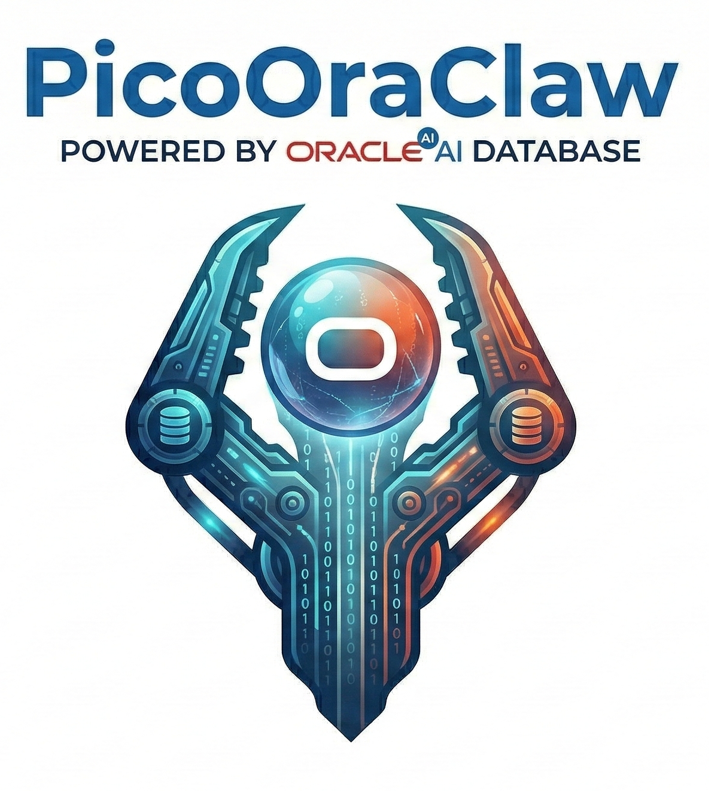

<div align="center">
  

  <h1>PicoOraClaw: Go + Oracle AI Database による超効率 AI アシスタント</h1>

  <h3>$10 ハードウェア · 10MB RAM · 1秒起動 · Oracle AI ベクトル検索</h3>

  <p>
    
    
    
  </p>

 [中文](README.zh.md) | **日本語** | [English](README.md)
</div>

---

PicoOraClaw は [PicoClaw](https://github.com/sipeed/picoclaw) のフォークで、**Oracle AI Database** を永続ストレージとセマンティックベクトル検索のバックエンドとして追加しています。エージェントはインデータベース ONNX 埋め込みを使って意味的に記憶・想起します — 外部の埋め込み API は不要です。

<table align="center">
  <tr align="center">
    <td align="center" valign="top">
      <p align="center">
        
        <br><sub>10MB 未満の RAM — $10 ハードウェアでも動作</sub>
      </p>
    </td>
    <td align="center" valign="top">
      <p align="center">
        
      </p>
    </td>
  </tr>
</table>

## 🦾 デモンストレーション

### 🛠️ 標準 AI ワークフロー

<table align="center">
  <tr align="center">
    <th><p align="center">🧩 フルスタックエンジニアリング</p></th>
    <th><p align="center">🧠 Oracle AI メモリ</p></th>
    <th><p align="center">🔎 Web 検索＆学習</p></th>
  </tr>
  <tr>
    <td align="center"><p align="center"></p></td>
    <td align="center"><p align="center"></p></td>
    <td align="center"><p align="center"></p></td>
  </tr>
  <tr>
    <td align="center">開発 · デプロイ · スケール</td>
    <td align="center">記憶 · 想起 · 永続化</td>
    <td align="center">発見 · インサイト · トレンド</td>
  </tr>
</table>

### ⏰ スケジュールタスク＆リマインダー

<p align="center">
  
</p>

リマインダーの設定、定期タスクの実行、ワークフローの自動化 — スケジュールジョブは Oracle AI Database に完全な ACID 保証とともに永続的に保存されます。

---

## クイックスタート（5分）

必要なもの：**Go 1.24+**、**Ollama**、**Docker**（Oracle AI Database 用）。

### ステップ 1: ビルド

```bash
git clone https://github.com/jasperan/picooraclaw.git
cd picooraclaw
make build
```

### ステップ 2: 初期化

```bash
./build/picooraclaw onboard
```

### ステップ 3: Ollama を起動してモデルを取得

```bash
# Ollama のインストール: https://ollama.com/download
ollama pull qwen3:latest
```

### ステップ 4: Ollama 用に設定

`~/.picooraclaw/config.json` を編集:

```json
{
  "agents": {
    "defaults": {
      "provider": "ollama",
      "model": "qwen3:latest",
      "max_tokens": 8192,
      "temperature": 0.7
    }
  },
  "providers": {
    "ollama": {
      "api_key": "",
      "api_base": "http://localhost:11434/v1"
    }
  }
}
```

### ステップ 5: チャット

```bash
# ワンショット
./build/picooraclaw agent -m "こんにちは！"

# インタラクティブモード
./build/picooraclaw agent
```

API キー不要、クラウド依存なし — これだけで AI アシスタントが動きます。

---

## Oracle AI ベクトル検索の追加

Oracle は永続ストレージ、セマンティックメモリ（意味で記憶・想起）、ACID トランザクションを提供します。

セットアップスクリプトで全て自動化:

```bash
./scripts/setup-oracle.sh [オプション: パスワード]
```

このスクリプトが自動で行うこと:
1. Oracle AI Database Free コンテナを起動
2. データベースの準備が整うまで待機
3. 必要な権限を持つ `picooraclaw` データベースユーザーを作成
4. `~/.picooraclaw/config.json` に Oracle 接続設定を反映
5. `picooraclaw setup-oracle` でスキーマと ONNX 埋め込みモデルを初期化

### セマンティックメモリをテスト

```bash
# 事実を保存
./build/picooraclaw agent -m "私の好きなプログラミング言語は Go です"

# 意味で想起（キーワードではない）
./build/picooraclaw agent -m "どのプログラミング言語が好きですか？"
```

2番目のコマンドは 384 次元ベクトルのコサイン類似度で保存済みメモリを検索します。

### Oracle に保存されているデータを確認

```bash
picooraclaw oracle-inspect [テーブル] [オプション]
```

**テーブル:** `memories`, `sessions`, `transcripts`, `state`, `notes`, `prompts`, `config`, `meta`

```bash
# 全体のダッシュボード
./build/picooraclaw oracle-inspect

# セマンティック検索
./build/picooraclaw oracle-inspect memories -s "ユーザーが好むもの"

# システムプロンプトを表示
./build/picooraclaw oracle-inspect prompts IDENTITY
```

---

## Oracle ストレージの仕組み

<p align="center">
  
</p>

```
                           ┌──────────────────────────────────────────┐
                           │         Oracle AI Database               │
                           │                                          │
  picooraclaw バイナリ      │  ┌──────────────┐  ┌──────────────────┐ │
  ┌───────────────────┐    │  │ PICO_MEMORIES │  │ PICO_DAILY_NOTES │ │
  │  AgentLoop        │    │  │  + VECTOR idx │  │  + VECTOR idx    │ │
  │  ├─ SessionStore ──────│──│──────────────┐│  └──────────────────┘ │
  │  ├─ StateStore   ──────│──│ PICO_SESSIONS││                       │
  │  ├─ MemoryStore  ──────│──│ PICO_STATE   ││  ┌──────────────────┐ │
  │  ├─ PromptStore  ──────│──│ PICO_PROMPTS ││  │ ALL_MINILM_L12_V2│ │
  │  └─ Tools:       │    │  │ PICO_META    ││  │   (ONNX モデル)  │ │
  │     ├─ remember  ──────│──└──────────────┘│  │  384次元ベクトル  │ │
  │     └─ recall    │    │   go-ora v2.9.0  │  └──────────────────┘ │
  └───────────────────┘    │   (純 Go ドライバ) │                      │
         (純 Go)           └──────────────────────────────────────────┘
```

| テーブル | 用途 |
|---|---|
| `PICO_MEMORIES` | 384次元ベクトル埋め込みによる長期メモリ |
| `PICO_SESSIONS` | チャネルごとのチャット履歴 |
| `PICO_TRANSCRIPTS` | 完全な会話監査ログ |
| `PICO_STATE` | エージェントのキー・バリューステート |
| `PICO_DAILY_NOTES` | ベクトル埋め込み付きデイリーノート |
| `PICO_PROMPTS` | システムプロンプト（IDENTITY.md, SOUL.md など） |
| `PICO_CONFIG` | ランタイム設定 |
| `PICO_META` | スキーマバージョニングメタデータ |

---

## CLI リファレンス

| コマンド | 説明 |
|---|---|
| `picooraclaw onboard` | 設定とワークスペースの初期化 |
| `picooraclaw agent -m "..."` | ワンショットチャット |
| `picooraclaw agent` | インタラクティブチャットモード |
| `picooraclaw gateway` | チャネル付き長時間稼働サービスの起動 |
| `picooraclaw status` | ステータス表示 |
| `picooraclaw setup-oracle` | Oracle スキーマ + ONNX モデルの初期化 |
| `picooraclaw oracle-inspect` | Oracle に保存されたデータを確認 |
| `picooraclaw oracle-inspect memories -s "クエリ"` | メモリのセマンティック検索 |
| `picooraclaw cron list` | スケジュールジョブの一覧 |
| `picooraclaw skills list` | インストール済みスキルの一覧 |

---

## クラウド LLM の使用（Ollama の代わりに）

<details>
<summary><b>OpenRouter（全モデルにアクセス）</b></summary>

```json
{
  "agents": {
    "defaults": {
      "provider": "openrouter",
      "model": "anthropic/claude-opus-4-5"
    }
  },
  "providers": {
    "openrouter": {
      "api_key": "sk-or-v1-xxx",
      "api_base": "https://openrouter.ai/api/v1"
    }
  }
}
```

[openrouter.ai/keys](https://openrouter.ai/keys) でキーを取得（月 200K 無料トークン）。

</details>

<details>
<summary><b>全サポートプロバイダー</b></summary>

| プロバイダー | 用途 | API キー取得先 |
|---|---|---|
| `ollama` | ローカル推論（推奨） | [ollama.com](https://ollama.com) |
| `openrouter` | 全モデルへのアクセス | [openrouter.ai](https://openrouter.ai/keys) |
| `anthropic` | Claude モデル | [console.anthropic.com](https://console.anthropic.com) |
| `openai` | GPT モデル | [platform.openai.com](https://platform.openai.com) |
| `gemini` | Gemini モデル | [aistudio.google.com](https://aistudio.google.com) |
| `zhipu` | Zhipu/GLM モデル | [bigmodel.cn](https://open.bigmodel.cn/usercenter/proj-mgmt/apikeys) |
| `deepseek` | DeepSeek モデル | [platform.deepseek.com](https://platform.deepseek.com) |
| `groq` | 高速推論 + 音声文字起こし | [console.groq.com](https://console.groq.com) |

</details>

---

## チャットチャネル

`gateway` コマンドで PicoOraClaw を Telegram、Discord、Slack、QQ、DingTalk、LINE、Feishu に接続できます。

<details>
<summary><b>Telegram</b>（推奨）</summary>

1. Telegram で `@BotFather` にメッセージ → `/newbot` → トークンをコピー
2. `~/.picooraclaw/config.json` に追加:

```json
{
  "channels": {
    "telegram": {
      "enabled": true,
      "token": "YOUR_BOT_TOKEN",
      "allow_from": ["YOUR_USER_ID"]
    }
  }
}
```

> ユーザー ID は Telegram の `@userinfobot` で取得できます。

3. `picooraclaw gateway` を実行

</details>

<details>
<summary><b>Discord</b></summary>

1. [discord.com/developers](https://discord.com/developers/applications) でボットを作成、MESSAGE CONTENT INTENT を有効化
2. 設定に追加:

```json
{
  "channels": {
    "discord": {
      "enabled": true,
      "token": "YOUR_BOT_TOKEN",
      "allow_from": ["YOUR_USER_ID"]
    }
  }
}
```

3. `Send Messages` + `Read Message History` 権限でボットを招待
4. `picooraclaw gateway` を実行

</details>

<details>
<summary><b>QQ, DingTalk, LINE, Feishu, Slack</b></summary>

`config/config.example.json` を参照してください。各チャネルは同じパターンに従います:

```json
{
  "channels": {
    "<チャネル名>": {
      "enabled": true,
      "<認証情報>": "...",
      "allow_from": []
    }
  }
}
```

設定後に `picooraclaw gateway` を実行してください。

</details>

---

## Oracle on Autonomous Database（クラウド）

<details>
<summary><b>ADB ウォレットレス TLS</b></summary>

```json
{
  "oracle": {
    "enabled": true,
    "mode": "adb",
    "dsn": "(description=(retry_count=20)...)",
    "user": "picooraclaw",
    "password": "YourPass123"
  }
}
```

</details>

<details>
<summary><b>Oracle 設定リファレンス</b></summary>

| フィールド | 環境変数 | デフォルト | 説明 |
|---|---|---|---|
| `enabled` | `PICO_ORACLE_ENABLED` | `false` | Oracle バックエンドを有効化 |
| `mode` | `PICO_ORACLE_MODE` | `freepdb` | `freepdb` または `adb` |
| `host` | `PICO_ORACLE_HOST` | `localhost` | Oracle ホスト |
| `port` | `PICO_ORACLE_PORT` | `1521` | リスナーポート |
| `service` | `PICO_ORACLE_SERVICE` | `FREEPDB1` | サービス名 |
| `user` | `PICO_ORACLE_USER` | `picooraclaw` | DB ユーザー名 |
| `password` | `PICO_ORACLE_PASSWORD` | — | DB パスワード |
| `onnxModel` | `PICO_ORACLE_ONNX_MODEL` | `ALL_MINILM_L12_V2` | 埋め込み用 ONNX モデル |
| `agentId` | `PICO_ORACLE_AGENT_ID` | `default` | マルチエージェント分離キー |

</details>

---

## トラブルシューティング

<details>
<summary><b>Oracle: 接続拒否 / ORA-12541</b></summary>

```bash
docker ps | grep oracle          # 実行中か確認
docker logs oracle-free          # "DATABASE IS READY" を待つ
ss -tlnp | grep 1521            # ポート 1521 がリスニング中か確認
```

</details>

<details>
<summary><b>Oracle: ORA-01017 ユーザー名/パスワード無効</b></summary>

```bash
docker exec -it oracle-free sqlplus sys/YourPass123@localhost:1521/FREEPDB1 as sysdba
SQL> ALTER USER picooraclaw IDENTIFIED BY NewPassword123;
```

</details>

<details>
<summary><b>Oracle: VECTOR_EMBEDDING() が ORA-04063 を返す</b></summary>

ONNX モデルが読み込まれていません。`picooraclaw setup-oracle` を実行してください。

</details>

<details>
<summary><b>エージェントがファイルベースモードにフォールバックする</b></summary>

Oracle は有効だが起動時に接続が失敗した場合。確認事項:
- Oracle コンテナは正常か？（`docker ps`）
- 設定と `ORACLE_PWD` のパスワードが一致しているか？
- サービス名は `FREEPDB1` か？（`FREE` や `XE` ではない）

</details>

---

## ビルドターゲット

```bash
make build          # 現在のプラットフォーム向けビルド
make build-all      # クロスコンパイル: linux/{amd64,arm64,riscv64}, darwin/arm64, windows/amd64
make install        # ビルド + ~/.local/bin にインストール
make test           # go test ./...
make fmt            # go fmt ./...
make vet            # go vet ./...
```

## Docker Compose

```bash
# Oracle 付きフルスタック
PICO_ORACLE_PASSWORD=YourPass123 docker compose --profile oracle --profile gateway up -d

# Oracle なし
docker compose --profile gateway up -d

# ワンショットエージェント
docker compose run --rm picooraclaw-agent -m "こんにちは！"
```

## 機能一覧

- 単一静的バイナリ（約 10MB RAM）、RISC-V/ARM64/x86_64 対応
- Ollama、OpenRouter、Anthropic、OpenAI、Gemini、Zhipu、DeepSeek、Groq プロバイダー
- Oracle AI Database + AI ベクトル検索（384次元 ONNX 埋め込み）
- チャットチャネル: Telegram、Discord、Slack、QQ、DingTalk、LINE、Feishu、WhatsApp
- cron 式によるスケジュールタスク
- ハートビート定期タスク
- スキルシステム（ワークスペース、グローバル、GitHub ホスト）
- ワークスペース制限によるセキュリティサンドボックス
- Oracle 不使用時はファイルベースストレージへのグレースフルフォールバック