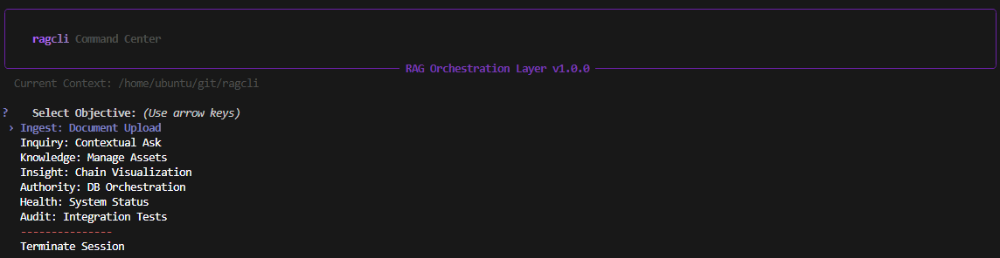
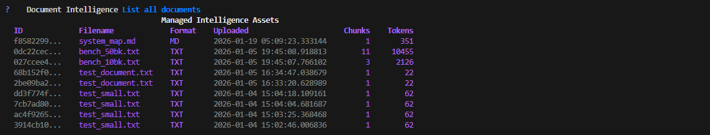

# ragcli: a friendly interface to Oracle Autonomous 26ai

<div align="center">

[](https://www.python.org/downloads/)
[](https://www.oracle.com/database/free/)
[](https://ollama.com/)
[](https://fastapi.tiangolo.com/)
[](https://react.dev/)
[](https://pypi.org/project/oracle-ragcli/)
[](https://github.com/jasperan/ragcli/releases)
[](#testing-oracle-integrations)
[](LICENSE)

</div>

A production-ready RAG system using **Oracle Database 26ai** for vector search and **Ollama** for local LLM inference. Ships with multi-agent reasoning, knowledge graph extraction, hybrid search, feedback loops, session memory, evaluation suite, and live document sync.

```bash
pip install oracle-ragcli
```



## Notebooks

Interactive Jupyter notebooks demonstrating ragcli capabilities:

| Name | Description | Stack | Link |
| ---- | ----------- | ----- | ---- |
| ragcli_demo | Comprehensive demo of RAG pipeline and langchain-oracledb features (OracleDocLoader, OracleTextSplitter, OracleEmbeddings, OracleSummary) | Oracle AI Database 26ai, Ollama, langchain-oracledb | [](./ragcli_demo.ipynb) |

## Architecture

1. **Frontend**: React (Vite) + TailwindCSS
2. **Backend**: FastAPI (25 endpoints)
3. **Database**: Oracle Database 26ai Free (17 tables, vector + graph store)
4. **LLM**: Ollama (local inference, multi-agent CoT pipeline)
5. **Search**: Hybrid BM25 + Vector + Knowledge Graph with RRF fusion
6. **Memory**: Multi-turn session management with query rewriting

## Features

### v2.0 — Graph-Augmented, Self-Improving Knowledge Engine

| Feature | What it does |
|---------|-------------|
| **Multi-Agent CoT** | 4-agent reasoning pipeline (Planner, Researcher, Reasoner, Synthesizer) with full trace storage |
| **Knowledge Graph** | LLM-powered entity/relationship extraction, Oracle graph store, multi-hop traversal |
| **Hybrid Search** | BM25 + Vector + Graph signals fused with Reciprocal Rank Fusion (RRF) |
| **Feedback Loops** | Wilson score chunk quality, graph edge tuning, search weight adjustment |
| **Session Memory** | Multi-turn conversations, query rewriting, rolling summarization |
| **Eval Suite** | Synthetic Q&A generation, 4 LLM-judged metrics (faithfulness, relevance, precision, recall) |
| **Live Sync** | Watchdog file monitoring, git polling, URL polling, diff-chunking |

### Core

- **Oracle Database 26ai**: AI Vector Search with HNSW/IVF auto-indexing
- **Ollama**: Local LLM inference (default: `qwen3.5:35b-a3b` for chat, `nomic-embed-text` for embeddings)
- **25 API endpoints**: Documents, query, models, feedback, eval, sync, sessions
- **9 CLI commands**: `ragcli eval synthetic|replay|report|runs`, `ragcli sync add|list|status|remove|events`
- **17 database tables**: Documents, chunks, queries, sessions, knowledge graph, traces, feedback, eval, sync
- **React frontend**: Google-style search, drag-drop upload, animated vector heatmaps
- **Document processing**: PDF, Markdown, Text with configurable chunking (1000 tokens, 10% overlap)
- **Deployment**: PyPI (`pip install ragcli`), Docker Compose, standalone binary




Prerequisites Before starting with ragcli:
1. **Oracle Database 26ai**: Set up with vector capabilities. You will need to provide the name, password, and DSN in the config.yaml.
2. **Ollama**: Download and run `ollama serve` to start the server. Pull models: `ollama pull nomic-embed-text` (embeddings), `ollama pull gemma3:270m` (chat).
3. **Python 3.9+**: With pip installed.

See [Annex A: Detailed Prerequisites](#annex-a-detailed-prerequisites) for links on how to do the setup.

## Installation

<!-- one-command-install -->
> **One-command install** — clone, configure, and run in a single step:
>
> ```bash
> curl -fsSL https://raw.githubusercontent.com/jasperan/ragcli/main/install.sh | bash
> ```
>
> <details><summary>Advanced options</summary>
>
> Override install location:
> ```bash
> PROJECT_DIR=/opt/myapp curl -fsSL https://raw.githubusercontent.com/jasperan/ragcli/main/install.sh | bash
> ```
>
> Or install manually:
> ```bash
> git clone https://github.com/jasperan/ragcli.git
> cd ragcli
> # See below for setup instructions
> ```
> </details>


### From Source (Recommended)

```bash
git clone https://github.com/jasperan/ragcli.git
cd ragcli
pip install -r requirements.txt
```

### Usage

```bash
python ragcli.py
```

## Docker Compose (Recommended)

Full stack with ragcli API, and Ollama:

Create the .env file
```bash
echo "ORACLE_PASSWORD=your_password" > .env
```

Update the config.yaml file with your Oracle DSN

```bash
docker-compose up -d
```

Pull the Ollama models
```bash
docker exec ollama ollama pull nomic-embed-text
docker exec ollama ollama pull gemma3:270m
```

Access the services
- ragcli API: http://localhost:8000/docs
- Ollama: http://localhost:11434

Docker (ragcli API only)

Build the image
```bash
docker build -t ragcli .
```

Run the image
```bash
docker run -d -p 8000:8000 -v $(pwd)/config.yaml:/app/config.yaml ragcli
```

## Quick Start

1. **Configure**:
```bash
cp config.yaml.example config.yaml
# Edit config.yaml: Set oracle DSN/username/password (use ${ENV_VAR} for secrets), ollama endpoint.
# Export env vars if using: export ORACLE_PASSWORD=yourpass
```

2. **Initialize Database** (run once):

```bash
python ragcli.py db init # Creates tables and indexes in Oracle
```

3. **Launch CLI (REPL)**:
```bash
python ragcli.py
```

   Now has an interactive menu system:
   ```
   ╔════════════════════════════════════════════════════════════════╗
   ║                 RAGCLI INTERFACE                               ║
   ║        Oracle DB 26ai RAG System v2.0.0                        ║
   ╚════════════════════════════════════════════════════════════════╝

   Select Objective:
    [1]  Ingest: Document Upload
    [2]  Inquiry: Contextual Ask
    [3]  Knowledge: Manage Assets
    [4]  Insight: Chain Visualization
    [5]  Authority: DB Orchestration
    [6]  Health: System Status
    [7]  Audit: Integration Tests
    [0]  Terminate Session
   ```

- Type `help` for classic commands.
- Example: `upload document.txt`, `ask "What is RAG?"`, `models list`, `db browse`.

4. **Launch API Server**:
```bash
python ragcli.py api --port 8000
```

- API docs: http://localhost:8000/docs

5. **Launch Premium Frontend (Optional but Recommended)**:
```bash
cd frontend
npm install
npm run dev
```

- Access at: http://localhost:5173
- Featuring: Google-style search bar, drag-and-drop upload, and animated results.

6. **Functional CLI Example**:
```bash
python ragcli.py upload path/to/doc.pdf
python ragcli.py ask "Summarize the document" --show-chain
```

## CLI Usage

- **REPL Mode**: `python ragcli.py` → Interactive shell with arrow-key navigation.
  - **Gemini-style Interface**: Rich, colorful, and intuitive TUI.
  - **Interactive File Explorer**: Select files to upload using a navigable directory tree.
  - **Format Validation**: Automatically checks for supported formats (TXT, MD, PDF) and warns if incompatible.
- **Functional Mode**: `python ragcli.py [options]`.
- `python ragcli.py upload --recursive folder/` - Upload with progress bars
- `python ragcli.py ask "query" --docs doc1,doc2 --top-k 3`
- `python ragcli.py models list` - Show all available Ollama models
- `python ragcli.py status --verbose` - Detailed vector statistics
- `python ragcli.py db browse --table DOCUMENTS` - Browse database tables
- `python ragcli.py db query "SELECT * FROM DOCUMENTS"` - Custom SQL queries
- `python ragcli.py eval synthetic` - Generate synthetic Q&A pairs and evaluate
- `python ragcli.py eval replay` - Re-run past queries through current pipeline
- `python ragcli.py eval report` - Display evaluation report
- `python ragcli.py eval runs` - List all evaluation runs
- `python ragcli.py sync add /path/to/docs --pattern "*.md"` - Watch a directory
- `python ragcli.py sync add ~/git/project --type git` - Watch a git repo
- `python ragcli.py sync list` - List sync sources
- `python ragcli.py sync status` - Show sync overview
- `python ragcli.py sync events` - Recent sync events
- See `python ragcli.py --help` for full options.

Premium Web Interface The project includes a stunning, minimalist frontend inspired by Google AI Studio.

### Features:

- **Google-Style Search**: A clean, elevated search bar with real-time feedback.
- **Fluid Animations**: Powered by `framer-motion` for a premium feel.
- **Drag-and-Drop**: Easy document ingestion with visual previews.
- **Material 3 Design**: Rounded corners, generous whitespace, and Google Sans typography.
- **Visual Vector Search**: Real-time heatmap of query vs result embeddings.

## Usage:

1. Ensure the backend is running: `ragcli api`
2. Start the frontend: `cd frontend && npm run dev`
3. Navigate to `http://localhost:5173`

### API Integration

- **FastAPI Backend**: RESTful API with Swagger documentation at `/docs`
- **Docker Compose**: One-command deployment with `docker-compose up -d`
- **API Endpoints**:
- `POST /api/documents/upload` - Upload documents
- `GET /api/documents` - List documents
- `POST /api/query` - RAG query (supports `session_id` for multi-turn)
- `GET /api/models` - List Ollama models
- `GET /api/status` - System health
- `GET /api/stats` - Database statistics
- `POST /api/feedback` - Submit answer/chunk feedback
- `GET /api/feedback/stats` - Feedback quality trends
- `POST /api/eval/run` - Trigger evaluation run
- `GET /api/eval/runs` - List eval runs
- `GET /api/eval/runs/{id}` - Run details with results
- `POST /api/sync/sources` - Add sync source
- `GET /api/sync/sources` - List sync sources
- `DELETE /api/sync/sources/{id}` - Remove sync source
- `GET /api/sync/events` - Recent sync events
- `GET /api/sessions` - List sessions
- `GET /api/sessions/{id}/turns` - Session history


### Configuration

Edit `config.yaml`:
```yaml
oracle:
dsn: "localhost:1521/FREEPDB1"
username: "rag_user"
password: "${ORACLE_PASSWORD}"

ollama:
endpoint: "http://localhost:11434"
chat_model: "gemma3:270m"
```
- **api**: Host, port (8000), CORS origins, Swagger docs.
- **documents**: Chunk size (1000), overlap (10%), max size (100MB).
- **rag**: Top-k (5), min similarity (0.5).
- **search**: Strategy (hybrid), RRF k (60), signal weights (bm25, vector, graph).
- **memory**: Session timeout (30min), max recent turns (5), summarize interval.
- **knowledge_graph**: Enabled, max entities per chunk (10), dedup threshold (0.9), max hops (2).
- **feedback**: Quality boost range (0.15), recalibrate threshold (50).
- **evaluation**: Pairs per chunk (2), max chunks per doc (20), live scoring toggle.
- **sync**: Poll interval (300s), debounce (2s), max file size (50MB).
- **logging**: Level (INFO), file rotation, detailed metrics.

Safe loading handles env vars (e.g., `${ORACLE_PASSWORD}`) and validation.

### New CLI Features

#### Enhanced Progress Tracking
Upload documents with real-time progress bars showing:
- File processing status
- File processing status
- Chunking progress
- Embedding generation with ETA
- Database insertion progress

Example:
```bash
python ragcli.py upload large_document.pdf
# ... progress bar animation ...
# Then displays summary:
# ╭───────────────────────────────────────────────────── Upload Summary ─────────────────────────────────────────────────────╮
# │ Document ID: 68b152f0-5c22-4952-a552-8bc47de29427 │
# │ Filename: test_document.txt │
# │ Format: TXT │
# │ Size: 0.11 KB │
# │ Chunks: 1 │
# │ Total Tokens: 22 │
# │ Upload Time: 826 ms │
# ╰──────────────────────────────────────────────────────────────────────────────────────────────────────────────────────────╯
```

#### Interactive File Explorer
When running `upload` without arguments (or selecting "Ingest" from the menu), ragcli launches a TUI file explorer:
```
? Current Directory: /home/user/documents
  .. (Go Up)
  📁 reports/
  📁 data/
❯ 📄 analysis.pdf
  📄 notes.txt
  ❌ Cancel
```
- Navigate directories with Enter.
- Select files with Enter.
- Only shows validation-compliant files.

#### Detailed Status & Monitoring
```bash
python ragcli.py status --verbose
# ragcli Status
# ┏━━━━━━━━━━━━┳━━━━━━━━━━━━━━┳━━━━━━━━━━━━━━━━━━━━━━━━━━━━━━━━━━━━━━━━━━━━━━━━━━━━━━━━━━━━━━━━━━━━━━━━━━━━━━━━━━━━━━━━━━━━━━┓
# ┃ Component ┃ Status ┃ Details ┃
# ┡━━━━━━━━━━━━╇━━━━━━━━━━━━━━╇━━━━━━━━━━━━━━━━━━━━━━━━━━━━━━━━━━━━━━━━━━━━━━━━━━━━━━━━━━━━━━━━━━━━━━━━━━━━━━━━━━━━━━━━━━━━━━┩
# │ Database │ connected │ Oracle DB connected successfully │
# │ Documents │ ok │ 5 docs, 3 vectors │
# │ Ollama │ connected │ Ollama connected (24 models) │
# │ Overall │ issues │ Some issues detected │
# └────────────┴──────────────┴──────────────────────────────────────────────────────────────────────────────────────────────┘
#
# ═══ Vector Statistics ═══
# ... (tables for Vector Config, Storage, Performance)
```

#### Interactive Database Browser

```bash
python ragcli.py db browse --table DOCUMENTS --limit 20
# DOCUMENTS (Rows 1-5 of 6)
# ┏━━━━━━━━━━━━━━━━━━━━━━━━━━━━━━━━━━┳━━━━━━━━━━━━━━━━━━━┳━━━━━━━━┳━━━━━━━━━━━┳━━━━━━━━┳━━━━━━━━┳━━━━━━━━━━━━━━━━━━━━━━━━━━━━┓
# ┃ ID ┃ Filename ┃ Format ┃ Size (KB) ┃ Chunks ┃ Tokens ┃ Uploaded ┃
# ┡━━━━━━━━━━━━━━━━━━━━━━━━━━━━━━━━━━╇━━━━━━━━━━━━━━━━━━━╇━━━━━━━━╇━━━━━━━━━━━╇━━━━━━━━╇━━━━━━━━╇━━━━━━━━━━━━━━━━━━━━━━━━━━━━┩
# │ 68b152f0-5c22... │ test_document.txt │ TXT │ 0.11 │ 1 │ 22 │ 2026-01-05 16:34:47.038679 │
# └──────────────────────────────────┴───────────────────┴────────┴───────────┴────────┴────────┴────────────────────────────┘

ragcli db query "SELECT * FROM DOCUMENTS WHERE file_format='PDF'"
ragcli db stats
```

Browse tables with pagination, execute custom SQL queries, view database statistics.

#### Model Management

```bash
ragcli models list
# ┏━━━━━━━━━━━━━━━━━━━━━━━━━┳━━━━━━━━━━━┳━━━━━━━━━━┳━━━━━━━━━━━━━━━━━━━━━┓
# ┃ Model Name ┃ Type ┃ Size ┃ Modified ┃
# ┡━━━━━━━━━━━━━━━━━━━━━━━━━╇━━━━━━━━━━━╇━━━━━━━━━━╇━━━━━━━━━━━━━━━━━━━━━┩
# │ gemma3:270m │ Chat/LLM │ 0.27 GB │ 2026-01-05T15:00:52 │
# │ nomic-embed-text:latest │ Embedding │ 0.26 GB │ 2025-11-14T21:38:46 │
# └─────────────────────────┴───────────┴──────────┴─────────────────────┘

ragcli models validate # Validate configured models
ragcli models check llama3 # Check if specific model exists
```

## Oracle AI Vector Search Integration

ragcli now integrates `langchain-oracledb` for enhanced document processing:
- **OracleTextSplitter**: Database-side chunking.
- **OracleDocLoader**: Load documents using Oracle's loaders.
- **OracleEmbeddings**: Generate embeddings within the database (using loaded ONNX models or external providers).
- **OracleSummary**: Generate summaries using database tools.

## Testing Oracle Integrations

A dedicated command group `oracle-test` is available to verify these features:
```bash
python ragcli.py oracle-test all # Run full test suite
python ragcli.py oracle-test loader /path/to/doc # Test document loader
python ragcli.py oracle-test splitter --text "..." # Test text splitter
python ragcli.py oracle-test summary "..." # Test summarization
python ragcli.py oracle-test embedding "..." # Test embedding generation
```

You can also access the **Test Suite** from the interactive REPL menu (Option 7).

## Using Oracle In-Database Embeddings for Document Upload
By default, ragcli uses Ollama for embedding generation. To use **langchain-oracledb's OracleEmbeddings** for in-database embedding generation (using ONNX models loaded into Oracle DB), update your `config.yaml`:
```yaml
vector_index:
use_oracle_embeddings: true
oracle_embedding_params:
provider: "database"
model: "ALL_MINILM_L12_V2" # ONNX model loaded in Oracle DB
```

This eliminates external API calls for embeddings and leverages Oracle's native AI capabilities.

## Troubleshooting

- **Ollama unreachable**: Run `ollama serve` and check endpoint. Use `ragcli models list` to verify.
- **Oracle DPY-1005 (Busy Connection)**: Fixed! Ensure you are using the latest version which properly handles connection pooling and closure.
- **Oracle ORA-01745/01484 (Vector Ingestion)**: Fixed! Vector ingestion now uses robust `TO_VECTOR` with JSON-serialized input for maximum compatibility.
- **Looping/Stuck Upload**: Fixed! Corrected infinite loop in `chunk_text` for small documents (<100 tokens).
- **Model not found**: Run `ragcli models validate` for suggestions. Pull with `ollama pull `.
- **API connection**: Check `ragcli api` is running. Test with `curl http://localhost:8000/api/status`.
- **Logs**: Check `./logs/ragcli.log` for details (DEBUG mode for verbose).

For issues, run with `--debug` or set `app.debug: true`.

Annex A: Detailed Prerequisites
- **Ollama**: https://ollama.com/ - `curl -fsSL https://ollama.com/install.sh | sh`
- **Oracle 26ai**: Enable vector search; connect via oracledb (no wallet needed for TLS).
- **Models**: Ensure pulled in Ollama.

---

<div align="center">

[](https://github.com/jasperan)&nbsp;
[](https://www.linkedin.com/in/jasperan/)&nbsp;
[](https://www.oracle.com/database/free/)

</div>
