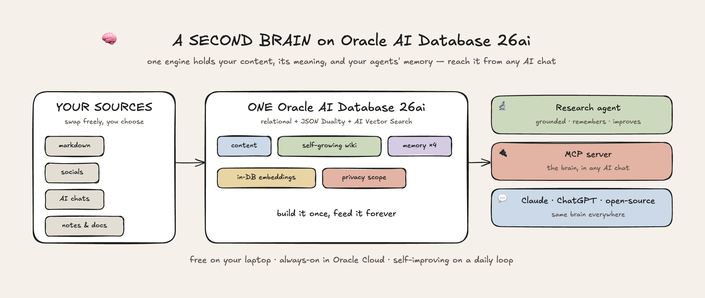
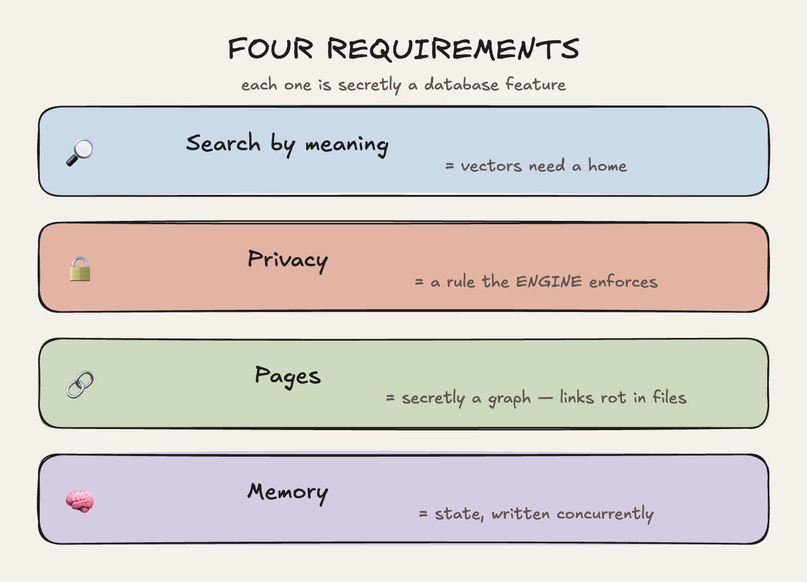
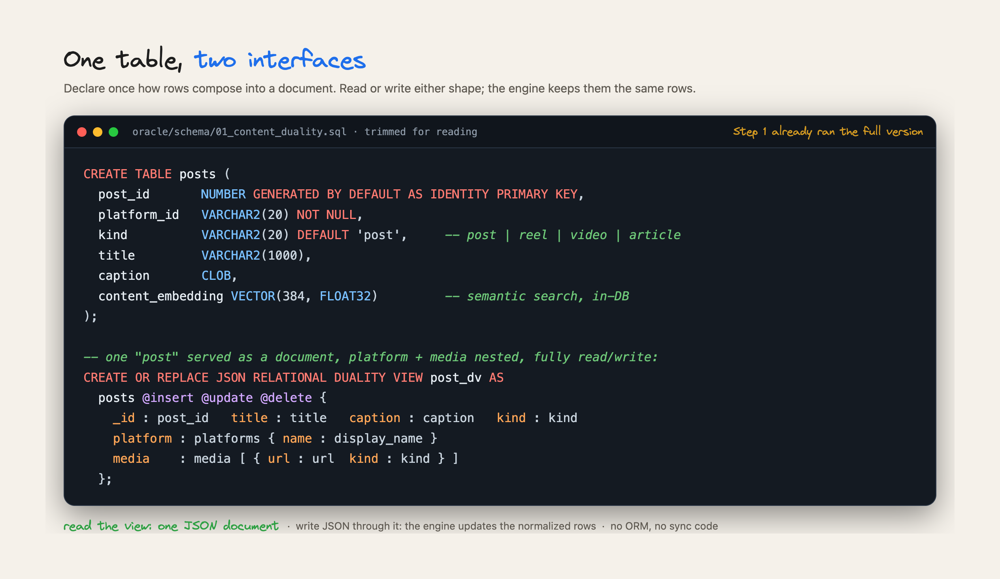
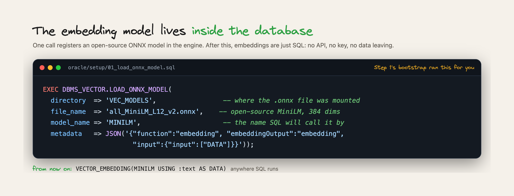
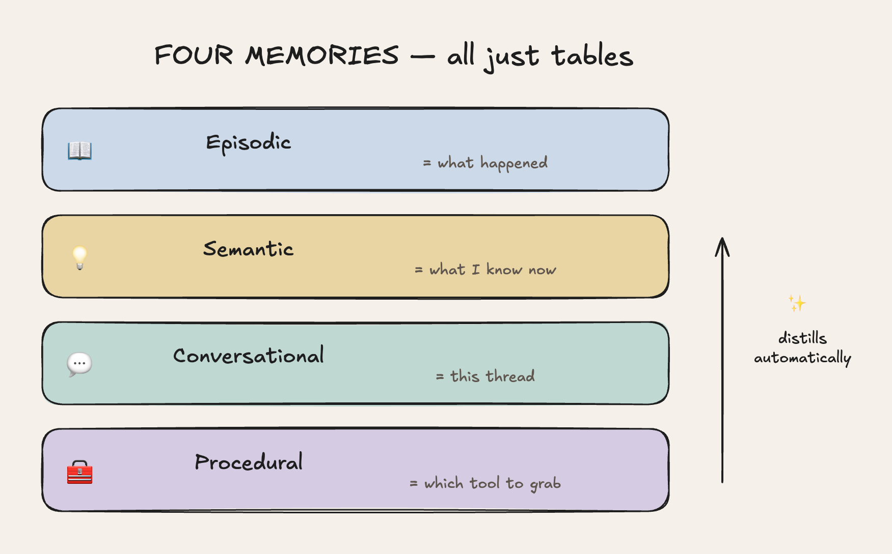
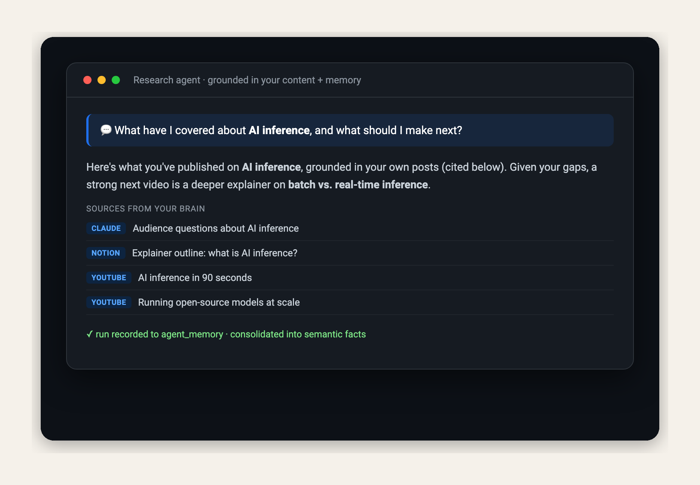
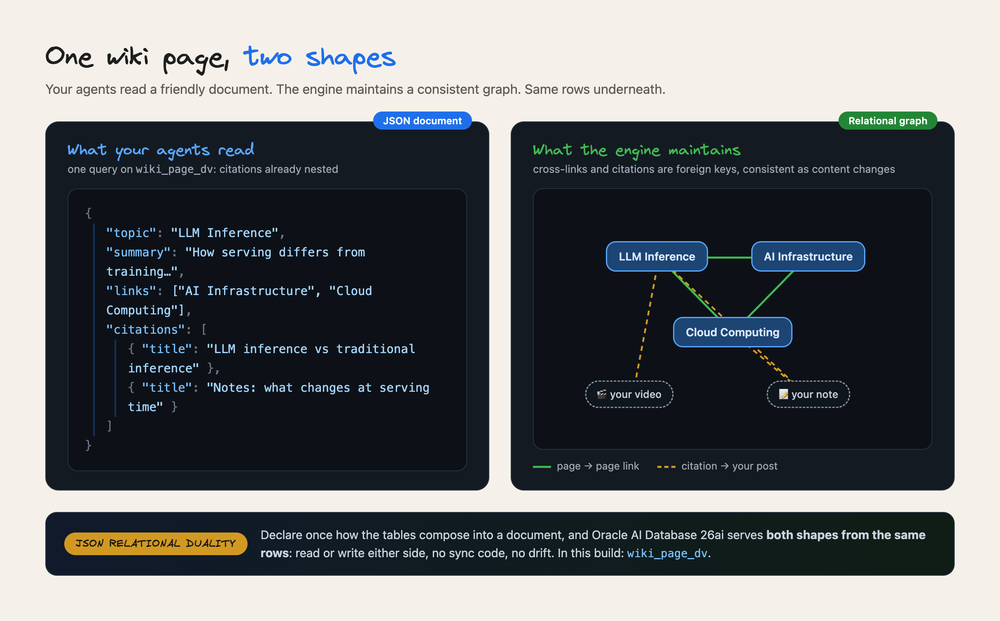
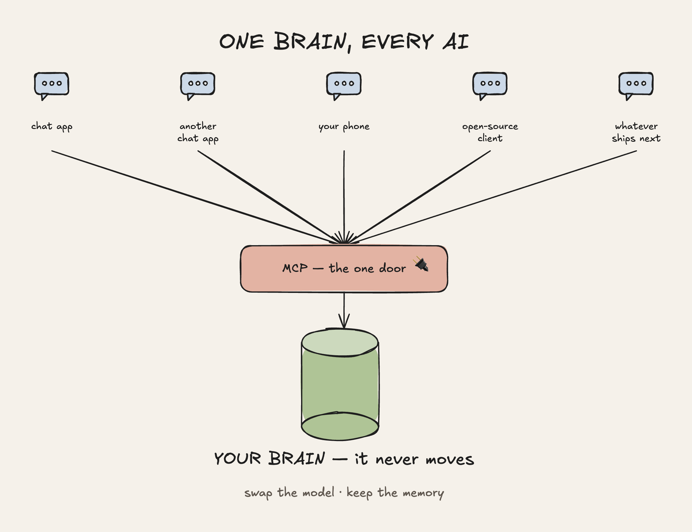
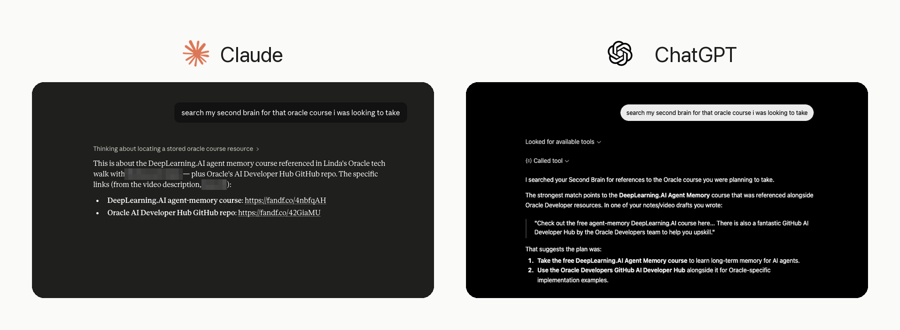
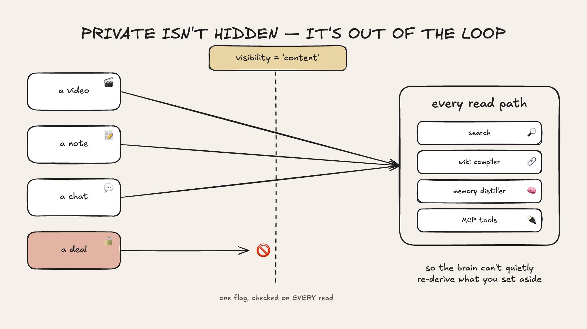

# Build a Self-Improving Second Brain on Oracle AI Database 26ai

*A step-by-step build: your own **second brain** for everything you've made. Searchable by
meaning, plugged into **any AI chat you use** through MCP, with **self-improving agents** built on
top. The data, its embeddings, and the agents' memory all live in one database.*

---

If you work with AI every day, you've probably felt both of these problems.

The first is **memory**. Chats remember a little and forget a lot, and agents only know whatever
context you wire into them. What memory these tools do have lives inside each app, so it doesn't
carry over: every tool holds its own shallow slice of you, and you end up re-explaining things
one of them already knew. The fix isn't a bigger context window; it's one place where your
context actually *lives*.

The second is **lock-in**. Maybe Claude is your daily driver today; tomorrow ChatGPT ships
something you want, or an open-source client fits a project better. The advancements never stop,
and switching should be a choice, not a migration. But the information those tools need about you
and your work is scattered: videos here, posts there, notes and docs somewhere else, and the long
AI chats where the real thinking happened.

That's why I built a **second brain**, and it's what we'll build together here: one place that
holds everything you've made, searchable by *meaning*, that every AI tool you use can share. It
grows as you make more and evolves as you do. Because it speaks **MCP** (Model Context Protocol),
you can swap chats freely and never lose it: the same brain plugs into **Claude, ChatGPT, and
open-source clients** alike. And the agents you build on top get real memory instead of starting
blind, so you can ask things no generic assistant could answer:

- *"Find that conversation where I worked through X idea."*
- *"Prep me for a conversation with [guest]: how I usually interview, what I've covered with them
  before, and what's new in their domain/company."*
- *"Help me draft the caption for the next post in my series, in my tone, building on what I've
  already covered."*

Why a database at the center? One of the hardest problems in a system like this isn't storing
content. It's giving every layer (search, knowledge, memory, privacy) one consistent home.
That's why we'll build on **Oracle AI Database 26ai**: one engine does relational data and JSON
documents, and with
**[JSON Relational Duality](https://docs.oracle.com/en/database/oracle/oracle-database/26/jsnvu/)**
it serves *both shapes from the same rows*, so your agents read friendly documents while the
engine keeps normalized truth underneath. Add **AI Vector Search** and an embedding model that
runs **inside the database**, and you get less glue code, with your data, its meaning, and your
agents' memory all living together.

And it runs wherever you want it. The same code works on the **free container on your laptop**
and on an **Always Free Autonomous AI Database in Oracle Cloud**. Free here is unusually real:
the **Always Free** tier includes **two Autonomous AI Databases** (1 Oracle CPU and 20 GB each,
plenty for a personal brain), an Always Free compute VM that can host the MCP server, and 10 TB of
monthly outbound transfer, with **no time limit**: not a 12-month trial, not credits that run out. This walkthrough starts local so you can watch every piece work, then
lifts to the cloud at the end. Mine lives in the cloud; that's what makes it reachable from my
phone, anywhere.

**You choose the sources**: your markdown vault, your socials (YouTube, Instagram, LinkedIn),
Notion, your AI chats, docs, bookmarks, and anything else that matters for your use case (content,
research, work knowledge, a personal wiki). We'll build everything end to end, starting on a
**public sample** so you watch the whole thing work, then point it at your own content. Our first agent on top is a research agent that **remembers what it learns** and gets
sharper every time you use it.

The brain is the product. MCP is how everything reaches it. Agents are what you keep building.



**What you need:** a Mac with [Homebrew](https://brew.sh), Python 3.12, and about 20 minutes.
**No prior Oracle experience required.** Every step is copy-paste-able. If anything errors, paste
it into your AI assistant (Claude, ChatGPT, soon to be powered by the very brain you're building)
and keep moving. Plenty of people build their first real system exactly this way. Steps 1–7 run
**locally and headless** (no Docker Desktop, no cloud account needed to start); Step 8 lifts the
same code to Oracle Cloud when you want it always-on.

> **Follow along here, grab the full code there.** This article is self-contained; you can build it
> straight from these steps. The complete, runnable project (every loader, the agent, the MCP server)
> lives at **[github.com/LindaHaviv/second-brain](https://github.com/LindaHaviv/second-brain)**.

**What we'll build: a brain, and two ways to use it.**

*The brain, three layers, one database:*
1. **Content**: everything you've made, as rows you can read back as JSON documents.
2. **A compiled wiki**: synthesized topic pages over that content (self-maintaining).
3. **Agent memory**: what your agents learn, in four flavors.

*On top of it:*
4. **An MCP server**: the brain as a tool for **any** AI client, including Claude, ChatGPT, and
   open-source clients. Switch chat apps whenever you like; the brain doesn't move.
5. **Agents**: starting with a self-improving research agent. Every one you add shares the
   same brain.

Here's the whole system on one page, the map for the steps that follow:


Let's walk through it, one step at a time.

## Where a database comes in (if you already love your markdown vault)

Many great second-brain setups start as a folder of markdown files, and this build **keeps
markdown at its core**. `sources/` holds your content as plain markdown + frontmatter: the
portable, human-readable canonical copy.

What changes here is the layer *around* it. Four of this build's goals are, at heart, **database
requirements**:

- **Search by meaning.** Semantic search needs embeddings, and embeddings need an indexed store to
  live in and be queried. That's why file-based setups typically grow a vector database alongside
  the notes. This build simply consolidates that: the text, its vectors, and the embedding model
  itself run in one engine.
- **Privacy that's enforced, not remembered.** With files, keeping private material out of a
  pipeline relies on everyone (and every script) honoring a folder convention. A `visibility`
  column turns that intent into a **constraint** the engine applies on every read path: search,
  the wiki compiler, memory consolidation, the MCP tools. That matters most once the system
  updates *itself* on a schedule.
- **The document feel, without the document rot.** The reason markdown feels right is that a note
  *is* a document: one thing, read top to bottom, portable anywhere. The reason a vault eventually
  strains is that a knowledge base is secretly a *graph*: pages cite sources and link to other
  pages, and in static files those connections are just text that goes stale as content moves and
  changes. Oracle built a feature for exactly this tension:
  **[JSON Relational Duality](https://docs.oracle.com/en/database/oracle/oracle-database/26/jsnvu/)**.
  You declare, once, how normalized tables compose into a document, and the database serves **both
  shapes over the same rows**: your app and your agents read a wiki page as one JSON document with
  its citations nested (the same "one thing" feel as a file), while underneath, every citation is
  a foreign key the engine keeps consistent as your content changes. We set it up in Step 2 and
  the wiki leans on it in Step 5.
- **Memory that consolidates, concurrently.** Agent memory here is queryable state. Recall is a
  vector search, consolidation rewrites facts transactionally, and the MCP server, the daily
  sync, and multiple agents can read and write the same brain at the same time.



So the framing isn't *markdown or a database*. It's **markdown where it shines** (authoring,
portability), **a database where the work is** (retrieval, relationships, memory, governance).
Your notes feed the brain; the database is what makes it think.

For me, this came down to one word: **sustainable**. I didn't want a setup tuned to a single use
case that I'd have to re-plumb for the next one. I wanted one foundation that serves *different*
uses of the same knowledge: content planning, research, interview prep, whatever comes next.

I wanted it to **maintain itself** as it grows instead of demanding weekend gardening. And I wanted
it to survive tool churn: the MCP layer means I can change which AI chat I use without moving the
brain, and the markdown canonical layer means the data outlives any of it.

Build it once, feed it forever.

---

## Step 1: Stand up Oracle 26ai locally (~15 min)

We run the free **Oracle AI Database 26ai** container image locally. It's the *same engine* as the
cloud, so AI Vector Search, JSON Relational Duality, and in-DB ONNX embeddings all work on your
machine. Everything below runs from inside the repo:

```bash
# get the code (schema, setup scripts, loaders, the agents)
git clone https://github.com/LindaHaviv/second-brain.git
cd second-brain

# container engine (headless, no Docker Desktop)
brew install colima docker docker-compose
colima start --cpu 4 --memory 8 --disk 60

# python env (3.12)
brew install python@3.12
python3.12 -m venv .venv
./.venv/bin/pip install -r oracle/agent/requirements.txt yt-dlp

# config (the CHANGE_ME_* placeholders work for the local sandbox)
cp oracle/.env.example oracle/.env

# start Oracle AI Database 26ai, then apply schema + load the embedding model
docker-compose -f oracle/docker-compose.yml up -d
./oracle/download-model.sh
./oracle/bootstrap.sh
```

**✅ Checkpoint**: confirm it's the real thing and ready.

```bash
./.venv/bin/python -c "import sys; sys.path.insert(0,'oracle/agent'); import db; \
  print(db.connect().cursor().execute( \
  \"select product from product_component_version where product like 'Oracle%'\").fetchone()[0])"
# -> Oracle AI Database 26ai ...   (the edition suffix varies by container image)
```

You now have a live database with the content schema, the Duality view, four memory tables, and the
`MINILM` embedding model loaded. Everything below runs against it.

---

## Step 2: Store content, read it as documents (JSON Relational Duality)

Load a public YouTube channel as **sample data**, so you can watch the pipeline before using your own:

```bash
mkdir -p exports/youtube
# any public channel works; this uses Oracle's developer channel as neutral sample data
./.venv/bin/yt-dlp --skip-download --dump-json --playlist-items 1-7 \
  "https://www.youtube.com/@oracledevs/videos" > exports/youtube/videos.jsonl
./.venv/bin/python scripts/youtube.py
# -> loaded 7 YouTube videos -> sources/youtube/ + Oracle posts
```

Here's what that data lands in, and why the storage model is worth a minute of your attention.

**The problem JSON Relational Duality exists to solve** is one of the oldest tensions in building
apps. Your *application* thinks in documents: a post is one thing (its text, its platform, its
media), and you want to read and write it as one JSON object, the way your code already models it.
Your *database* wants normalized rows: platforms stored once (not duplicated into every post),
media in its own table, consistency enforced by the engine.

For decades you had to pick a side. A document store gives you great ergonomics, but data
duplicated across documents, updates that fan out, and weak joins. Relational + an ORM gives you
consistency, but a mapping layer, migration friction, and the classic object-relational impedance
mismatch. Some teams run *both* and sync them. Now you have two copies that drift.

**Duality's answer: don't pick.** You declare, once, in SQL, how the relational tables compose
into a document, and the database serves **both interfaces over the same rows**. Read the view,
you get one JSON document with everything nested. Write JSON *through* the view (insert, update,
delete), and the engine updates the underlying normalized tables. Change a row relationally, the
document reflects it instantly. Same data, two shapes, zero sync code. The "duality" is literal:



Your app reads the view as JSON while the database keeps the relational tables consistent
underneath. And this matters *more* in the agent era, not less: **agents and MCP tools consume
JSON**, while governance still wants normalized, consistent truth. Duality serves both from one
table.

It isn't decorative here either. In Step 5, every wiki read the agent makes goes through a
Duality view; one query returns the page *with its citations already nested*. (Deep dive: the
[JSON-Relational Duality Developer's Guide](https://docs.oracle.com/en/database/oracle/oracle-database/26/jsnvu/).)

---

## Step 3: Search by meaning (vectors *and* the model, in the database)

To search by meaning you need embeddings. With **26ai you don't call an external embedding API**.
You load a small ONNX model (MiniLM) *into the database* once (Step 1 did this), then generate
embeddings in SQL:



Now semantic search is just SQL. Embed the query and rank by cosine distance, with no keys and no
data leaving the database (full reference: the
[AI Vector Search User's Guide](https://docs.oracle.com/en/database/oracle/oracle-database/26/vecse/)):

```sql
SELECT title, caption
FROM   posts
ORDER  BY VECTOR_DISTANCE(content_embedding,
                          VECTOR_EMBEDDING(MINILM USING :q AS DATA), COSINE)
FETCH FIRST 5 ROWS ONLY;
```

**✅ Checkpoint**: try it (no API key needed).

```bash
./.venv/bin/python -c "import sys; sys.path.insert(0,'oracle/agent'); import db, content; \
  [print(f\"{r['dist']:.3f}  {r['title']}\") for r in \
   content.search_content(db.connect(),'protecting data in the cloud',k=3)]"
```

Two refinements the repo adds. It **chunks** long content (transcripts, chats) into a
`content_chunks` table so a query lands on the right *passage*, not just the right item. And it
fuses vector search with a **keyword** pass via Reciprocal Rank Fusion, so exact names, handles,
and error codes that pure-vector search can miss still surface. The fusion also weights by source
type: your published work wins close calls over your AI-chat notes.

> **⚡ 26ai also has this natively.** Oracle AI Database ships built-in
> [**hybrid search**](https://docs.oracle.com/en/database/oracle/oracle-database/26/vecse/understand-hybrid-search.html):
> a hybrid vector index (Oracle Text + vectors on one column) queried through
> [`DBMS_HYBRID_VECTOR.SEARCH`](https://docs.oracle.com/en/database/oracle/oracle-database/26/arpls/dbms_hybrid_vector1.html),
> and it even offers RRF as a fusion mode (the same algorithm we hand-rolled).
> We hand-roll the fusion here because our retrieval spans **three tables** (posts + chunks + wiki
> pages, ranked together) and because seeing RRF explicitly is half the lesson. For single-table
> hybrid search in production, reach for the native feature first.

---

## Step 4: The research agent + four kinds of memory

Here's the agent you came for. Add your key to `oracle/.env` (create one at
[console.anthropic.com](https://console.anthropic.com) under API keys) and run it:

```bash
# oracle/.env:  ANTHROPIC_API_KEY=sk-ant-...
cd oracle/agent && ../../.venv/bin/python demo_research.py
```

It's a small, transparent loop (Claude + tools); the database does the heavy lifting. Its tools:
search your content, read a post, read a wiki page, search the live web. It grounds claims about
*your* work in *your* content and uses the web for what's current.

What makes it a **second brain** rather than a search box is **memory**. We model the long-term
memory types the agent-memory literature describes, each a table in the same database
(conversational memory, stored as time-stamped interaction history, is formally the simplest
kind of episodic memory; this build gives it its own table):

| Memory | Table | What it holds |
|---|---|---|
| **Episodic** | `agent_memory` | every past research run (question, outcome, sources, lesson) |
| **Semantic** | `semantic_memory` | durable facts distilled from those runs |
| **Conversational** | `conversations` | the current multi-turn context |
| **Procedural** | `procedural_memory` | the agent's tools, retrieved by relevance per question |



Those are the **hand-built learning-track tables** (`MEMORY_BACKEND=custom`), the same way
Oracle's own DeepLearning.AI course teaches this layer, and the tables the fully-local Ollama
path uses (the repo selects them automatically when you configure Ollama). **What a fresh clone
runs by default, though, is Oracle's official package** (next box): it manages the semantic and
conversational rows as `brain_*` tables with automatic extraction. That's the honest recommendation,
because Oracle maintains and benchmarks it so you don't have to. Episodic and procedural are
this build's extensions of the core on both backends.

Before answering, the agent **recalls** relevant past runs and learned facts, and **ranks its own
toolset** against the question. That's procedural memory: with four tools it's a hint; at forty
it's how you'd pick which tools to send at all. After answering, it **records** the run.

And the distillation step runs itself. On the default (the package), OAMP's extractor turns
each exchange into durable semantic memories automatically (with this build's privacy guard
passed in as custom extraction instructions). On the learning track, a scheduled job
**consolidates** episodic memory into semantic facts, visible plumbing you can read. Either
way, "what happened" becomes "what I now know about this creator." That's the self-improving
loop:

```
 answer  →  record the run  →  recall + consolidate  →  answer better next time
```

The more you use it, the more it knows your themes, recurring questions, and gaps, and it stops
re-deriving them every time. (On the default backend the package extracts after every exchange;
the global consolidation runs daily either way, and on the learning track it also triggers
automatically every few research runs.)

> **🔧 The LLM is a config switch, not a dependency.** Set `LLM_PROVIDER` in `oracle/.env` to
> **`anthropic`** (default, and the richest agent experience), **`openai`**, or **`ollama`**, and
> the wiki compiler, memory consolidation, classifiers, and idea agent all follow; no code edits.
> **Want it free and fully local? Use Ollama**: `brew install ollama && ollama pull llama3.2`, set
> `LLM_PROVIDER=ollama` (and `LLM_MODEL=llama3.2`), and the entire build runs at **$0 with no accounts anywhere**: local
> database, in-DB embeddings, local LLM. (The research agent's *tool loop*, which uses server-side
> web search, is Anthropic-shaped: run it with Claude, or via an Anthropic-compatible gateway.)
> Everything else (the database, the schema, semantic search, the MCP server) is **LLM-free**.
> The embeddings are an open-source MiniLM running inside Oracle, so search needs **no API key at
> all** (you proved that at the Step 3 checkpoint).

> **📦 The default is Oracle's official package. Here's what it does for you.** A fresh clone
> runs the **Oracle AI Agent Memory Package** (`pip install oracleagentmemory`, already in the
> repo's requirements): it stores conversation threads and the durable memories it **extracts
> automatically** from each exchange, in the same database, as plain tables you can read with SQL.
> Three of its features do real work in this build:
>
> | Feature | What it does here |
> |---|---|
> | **`SearchStrategy.HYBRID`** | semantic recall + exact matching in one Oracle-managed index |
> | **Custom extraction instructions** | your privacy guard rides *inside* the managed extractor, so "never memorize financials" applies there too |
> | **`OracleDBEmbedder`** | drives the same in-DB MiniLM model, so memory search makes **zero** embedding API calls |
>
> Oracle maintains and benchmarks it (94.4 on LongMemEval), so it's a layer you never have to
> garden. [What's New in Oracle AI Agent Memory](https://blogs.oracle.com/developers/whats-new-in-oracle-ai-agent-memory-custom-extraction-hybrid-search-and-more-control)
> covers the rest (background extraction, context cards, metadata filters, TTL), and the
> [package docs](https://docs.oracle.com/en/database/oracle/agent-memory/) have the full API.

> **📦 Why keep the hand-built track too?** Two reasons, and the repo picks for you. **Learning:**
> seeing memory work in tables you built is how you'll debug any memory system. It's why Oracle's
> own course teaches the layer by hand. **Fully-local:** the package's automatic extraction is
> built for capable models, so a small local model can't drive it reliably; configure Ollama and
> the repo automatically switches to the hand-built track so your $0 build keeps remembering.
> (`MEMORY_BACKEND` overrides the choice either way.)



---

## Step 5: Compile a self-improving knowledge wiki

> Already loaded **your own** data instead of the sample? Do the privacy scoping in Step 7 first.
> The compiler (and memory consolidation) should only ever read your `content` scope.

RAG re-synthesizes your knowledge on every question. We add a layer that **compiles it once**:

```bash
cd oracle/agent && ../../.venv/bin/python wiki.py        # needs ANTHROPIC_API_KEY
```

An LLM reads your content and writes synthesized **topic pages**: cross-linked, citing the source
posts, improving as you add content. And the refresh works in both directions. It recompiles the
pages your new content touches, and when new content clusters outside every existing topic it
**proposes and compiles new pages**. The knowledge base grows on its own.

Credit where the idea comes from: this layer implements Andrej Karpathy's
[LLM wiki](https://gist.github.com/karpathy/442a6bf555914893e9891c11519de94f) concept. Instead of
having the model re-read your raw sources on every question, an LLM incrementally compiles them
into a persistent, interlinked wiki ("Obsidian is the IDE; the LLM is the programmer; the wiki is
the codebase," as he puts it). His sketch targets markdown files. Here the compile target is the
database, which is what buys the upgrades above: pages that are searchable by meaning, citations
that are foreign keys you can verify with SQL, and incremental recompiles the daily sync can
schedule.

This is the strongest Oracle showcase in the build, because a wiki page is *both* a document *and*
a graph:

- `wiki_pages`: the page (a JSON document **+** a vector embedding)
- `page_links`: page → page cross-links (**relational** graph)
- `page_sources`: citations back to your `posts` (**relational**)
- `wiki_page_dv`: a **Duality view** serving a page as one JSON document with its citations nested

So a single page exercises **relational + JSON Relational Duality + AI Vector Search** at once, and
the agent answers from your *synthesized* knowledge, tracing every claim back to a real video or
note. The Duality view isn't just for show either: **every wiki read in the agent and the MCP
server goes through it**. One query on `wiki_page_dv` returns the page with its citations already
nested, replacing the two manual joins you'd otherwise write.



### Zoom out: where the self-improvement actually lives

"Self-improving" isn't one feature. It's **several loops at different speeds**, and now that you've
built both the memory (Step 4) and the wiki (Step 5), you can see the whole system:

| Loop | Runs | What gets smarter |
|---|---|---|
| **Ingest** | every new post | embeddings generated in-DB on insert; everything downstream sees it |
| **Episodic record** | every answer | the agent's experience; the next recall is richer |
| **Distillation** (exchanges + runs → durable facts) | per exchange (package) · daily consolidation (both) | durable facts; the agent stops re-deriving your themes |
| **Procedural ranking** | every question | tool selection; a hint at four tools, essential at forty |
| **Wiki refresh + growth** | daily | touched pages recompile; new content clusters earn **new** pages |

And the loops **feed each other**. Research runs become consolidated facts. Consolidated facts
inform which wiki topics exist. Wiki pages ground the next research answer, and every answer
becomes a new run. The *database* is what makes this compounding rather than chaotic: all five
loops read and write the same governed tables, with the privacy scope enforced at every entry
point.

If you're a visual learner, here's another way to see it:


---

## Step 6: Use it from anywhere (MCP)

Finally, make the brain a tool any AI client can call. A small **MCP server** exposes the standard
`search`/`fetch` connector contract, the same shape **Claude *and* ChatGPT** expect, plus `wiki`,
`topics`, `recent`, `by_series`, `overview`, `source_status` (ask any chat when your sources
last synced), and two write tools: `ingest_note` (capture an idea
from any chat) and `save_chat` (save the conversation itself into the brain). It also ships
agent playbooks as **MCP prompts** (`research_brief`, `interview_prep`, `caption_pack`,
`weekly_review`): ready-to-run recipes your client's model executes with those tools.
Run it **locally
over stdio** first. In
Claude Desktop: Settings, then Developer, then Edit Config, and add this block (replace `<repo>`
with the absolute path to your clone), then restart Claude:

```json
{
  "mcpServers": {
    "content-brain": {
      "command": "<repo>/.venv/bin/python",
      "args": ["<repo>/oracle/agent/mcp_server.py"]
    }
  }
}
```

Then open Claude and ask *"search my brain for what I've covered on AI inference."* It answers from
your own content. The tools are **capability-scoped**: read tools are annotated `readOnlyHint` so a
client can auto-allow them, while the write tools are marked as writes so the client asks first
(and `MCP_READONLY` drops them entirely).

> **🔎 Show your work (great for teaching).** Instead of a black-box list, each `search` result
> carries **how it was found**: `match` (wiki / post / passage), `rank`, `score`, and `found_by`
> (`semantic`, `keyword`, or both). Add `explain=true` and you also get a `search_info` block naming
> the method: *hybrid, in-DB MiniLM semantic vectors (cosine) fused with keyword search via
> Reciprocal Rank Fusion.* So a demo can *see* a result that matched by **both** meaning and exact
> keyword. The retrieval isn't hidden; it's on the page.



Want it on your phone and in ChatGPT? **Host** the same server over HTTP. That puts your brain on
the public internet, so lock it down first (OAuth + an allowlist; see Security below), and if
you've loaded your own data, do Step 7's privacy scoping **before** you host. Once it's up, both
apps attach the same way: add a **custom connector** pointing at your server's `/mcp` URL and sign
in (claude.ai: Settings, then Connectors; ChatGPT: Settings, then Apps & Connectors, with
Developer mode enabled). I host mine on **Fly.io**, and the repo's
[HOSTED_MCP guide](https://github.com/LindaHaviv/second-brain/blob/main/docs/HOSTED_MCP.md)
walks that deploy click by click; it's one small container, so any container host works,
including an Always Free Arm VM on Oracle Cloud.

> **🔌 This build uses a custom MCP server, and here's why.** It's a **custom MCP server**
> (Python): you keep full control of the tools, it speaks the OAuth *custom-connector* flow that
> **claude.ai web/mobile and ChatGPT** use, the pattern would rebuild over any database, and it
> works with the **local container**, no cloud required. That's the right fit for a portable, teach-the-internals
> build. Oracle *also* offers a fully **managed** MCP server built into **Autonomous AI Database**
> (cloud): no infrastructure to run, tools defined as **Select AI Agent** (PL/SQL) tools, access
> **governed by database identity** with native auditing. If your brain lives in Autonomous AI
> Database and PL/SQL tools cover your needs, the managed server is the zero-ops path. We studied it
> and **borrowed its security best-practices** into this custom build: the prompt-injection guard
> and least-privilege DB user below. Docs:
> [Oracle Autonomous AI Database MCP Server](https://www.oracle.com/autonomous-database/mcp-server/).



---

## Step 7: Make it yours: your sources, kept private and current

You've watched the whole thing work on sample data. Now point it at *your* content. First, wipe
the sample so it doesn't linger in your real brain:

```bash
./.venv/bin/python scripts/reset_sample.py
```

The system is **collector-agnostic**, so the only thing it needs is rows in that `posts` table. Map any source's
fields to `title`, `caption` (the text), `url`, `published_at`, and the platform; the embedding is
generated in-DB on insert.

The repo ships loaders for **Obsidian** (point it at your vault, or any local drop
folder, and the daily sync keeps the brain current with it: markdown notes, and even
PDFs/EPUBs as searchable reference material that never pollutes your wiki), **Notion**, **YouTube**
(+ transcripts), **Instagram** (API or export, with captions *and* reel transcripts),
**LinkedIn**, **Google Drive** (share specific folders: Docs become notes, PDFs searchable reference), and **AI chats** (Claude/ChatGPT exports).
Any one is a copyable template, and the repo's
[EXPORT_GUIDE](https://github.com/LindaHaviv/second-brain/blob/main/docs/EXPORT_GUIDE.md) shows
exactly where to click to get each platform's export.

> **🎙️ Capture what you *said*, not just what you posted.** The brain searches text, so for video
> pull **transcripts** (YouTube captions; the `.srt` files in an Instagram export). That makes the
> *content* of a video findable, not just its caption. **And don't scrape** the social platforms
> (logins + anti-bot + ToS = account risk); use each one's **official API or data export**.

**Private by scope.** Your sources mix public content with things you *don't* want surfaced
(financials, contracts, only you know which). Every item carries a `visibility`, either `content`
or a private value, and *every* read path filters to `content`: search, the wiki compiler, and
memory consolidation.

So private material is excluded from retrieval **and** from the self-improving loop. That means
the brain can't quietly re-derive it into "durable memory" after you've set it aside. A
classify-on-ingest pass tags private and off-topic items automatically.



**Current by loop.** New content is only useful if the *derived* layers keep up. One scheduled job
enforces the order **pull sources → classify → refresh the wiki → consolidate memory**, so your
synthesized pages and learned facts never go stale. Because they only ever read the `content`
scope, the auto-refresh stays safe.

Each source type has its freshness path. **API sources** (Instagram, Notion) are pulled
automatically by the daily job. **Public metadata** (YouTube) is a loader re-run whenever you
publish. **Export-only sources** (ChatGPT/Claude/LinkedIn) have no push API, so set a monthly
reminder to drop a fresh export. **In-the-moment ideas** go in through the MCP's `ingest_note`
from any AI client.

One rule to respect: re-importing a chat export resets visibility tags, so classification must
rerun before anything rebuilds. The sync job detects that state and does it automatically as a
safety net.

> **🏷️ Optional: group content into a *series*.** A `series` field lets you tag content into a
> named group you care about: a tutorial series, an interview show, book notes, a weekly update,
> a product line. Once tagged, search flags each result's series and a `by_series` tool lists it,
> so an assistant can answer *"list everything in my tutorials series."* Define whatever fits
> *your* content.

---

## Step 8: Go always-on in the cloud

Everything above runs locally, but a brain you can only reach at your desk is half a brain. Lift
it to **Oracle Autonomous AI Database** (the **Always Free** tier covers this build: two
Autonomous AI Databases at 1 Oracle CPU + 20 GB each, with no time limit): same engine,
managed, backed up, always-on, and it's what makes the hosted MCP and the phone story real. The
app connects over a wallet with **no code changes**; you load the same ONNX model, copy the data,
and you're running in the cloud. This is how mine runs; the repo's
[CLOUD_MIGRATION guide](https://github.com/LindaHaviv/second-brain/blob/main/docs/CLOUD_MIGRATION.md)
walks it step by step.

Local stays fully private if you'd rather not. And the copy script ships **only the content scope**
by default, so your private data stays local even when the brain goes to the cloud.

---

## Security: don't skip this

Your brain holds *your* data, so treat it that way. The repo bakes these in; if you fork it, keep
them on:

- **Redact before you ingest.** AI-chat and coding transcripts leak API keys. Scrub secret patterns
  *before* they hit the database; a `review.py` scans for anything that slipped through.
- **Keep private data separate, and out of the self-improving loop.** Scope each item, keep the
  private scope **out of the searchable brain**, and make sure the parts that *self-improve* (memory
  consolidation, the wiki compiler) read **only** the content scope. Otherwise the brain can quietly
  re-derive private facts back into "durable memory." Keep the most private data local and
  unadvertised, classify at ingest, re-check after each import. (Teach the pattern; don't publish
  exactly what *you* keep private.)
- **Re-check what gets memorized, don't just instruct it.** Memory extraction runs on a *prompt*,
  and any LLM following a prompt gives partial compliance, not a guarantee: in one eval a planted
  dollar amount was correctly dropped, but a contract term slipped through. So this build adds
  defense in depth: a **structural privacy sweep** (`oamp_memory.enforce_privacy`, a deny-list you
  adapt to your own categories) re-checks every extracted memory and deletes violators through the
  package's lifecycle API, after each exchange and in the daily sync. Instructions suggest; the
  sweep enforces.
- **Never commit secrets.** `.env`, the cloud wallet, and your raw content are gitignored. Keep them
  that way, keep real copies in a password manager, and rotate anything exposed.
- **Least privilege, no public database.** The app runs as a limited DB user (not admin), and the
  database is *never* exposed to the internet. Only the MCP server talks to it.
- **Lock the front door if you host it.** A public MCP needs auth on *every* request. For
  claude.ai/ChatGPT that means **OAuth + an allowlist**, so even after a valid login, only *your*
  account is authorized. The server **refuses to start** with an empty allowlist.
- **Treat retrieved content as data, not instructions** (prompt-injection), and keep any
  write/update tools **human-approved**.

Full checklist: **[SECURITY.md](https://github.com/LindaHaviv/second-brain/blob/main/SECURITY.md)**.

---

## Make it yours (safely)

Replicating this as *your* second brain is the point. Seven steps keep yours private and reliable while you do:

1. **Change every demo password** before anything real touches the database.
2. **Decide your private categories first, then ingest.** Adapt the classifier's rubric to *your*
   private material, run it after every import, and don't publish what your categories are (teach
   the pattern, not your specifics).
3. **Your own auth before hosting**: your own OAuth allowlist or bearer token. The server refuses
   to start with no auth configured, so there's no accidental open door.
4. **Never commit** secrets, the cloud wallet, or your raw exports, and scan derived content for
   leaked keys before sharing it.
5. **Customize the personal bits**: your sources, your series labels, your wiki topics. The code
   is generic; everything "you" lives in configuration and your data.
6. **Run the test suite after changes**: `./.venv/bin/python tests/test_brain.py` checks the
   schema, search, Duality views, and memory against your live brain in seconds.
7. **Keep a golden set, and eval quality, not just correctness.** Tests prove the code runs;
   evals prove the system still finds and says the right things. The repo ships four, plain
   Python and JSON, no framework needed: `tests/eval_retrieval.py` (golden queries that must
   keep ranking, free, run after anything that touches ranking), `tests/eval_classifier.py`
   (would the privacy classifier still agree with your reviewed labels?), `tests/eval_verify.py`
   (plant fabrications, confirm the accuracy gate still catches them), and
   `tests/eval_grounding.py` (do research answers cite the sources they should?). Running the
   package (the default)? Add `tests/eval_oamp.py`: seven probes (extraction smoke, privacy-guard leak
   test, recall, scope isolation, deletion, upgrade canary, and a planted-leak enforcement test
   for the structural sweep) that catch the package's silent failure modes; run it on every
   package or extraction-model change. The habit that
   makes them work: whenever a query should find something and does not, fix it, then add it to
   the golden set so it can never quietly break again.

## This is just the beginning: you built a platform

Step back and look at what's actually here. It isn't one agent. It's **three layers that compound**:

- **The brain**: your content, its meaning, a synthesized wiki, and four kinds of memory, in one
  database. Every new source you add makes everything downstream smarter.
- **The MCP socket**: the brain as a *tool*, pluggable into Claude, ChatGPT, open-source clients,
  and any MCP client that ships next. Build the brain once; every AI surface you use can reach it.
- **The agents.** Here's the part that scales: **they share the brain.** The research agent is
  agent #1, and its self-improving loop (record → recall → consolidate) enriches the same memory
  every future agent reads. The repo ships agent #2 to prove the pattern: an **idea agent** that
  reads the consolidated facts (your themes, formats, *gaps*) and proposes what to make next,
  grounded in what you've actually made. It's about 90 lines, because the brain does the heavy
  lifting. (The repo now ships two more the same size: a **weekly digest** agent and a no-LLM
  **freshness alarm** that nags you when a source goes stale.)

Your next agent is whatever your work needs: a meeting-prep briefer, a caption drafter, a
research assistant tuned to your domain. Each one is small, because the hard parts (retrieval,
memory, grounding, privacy scope) are already the platform's job. And each one makes the memory
richer for the rest.

Agents aren't the only thing you can build on it, either. **The brain is an API away from powering
applications.** In fact one already ships: a read-only **web UI** on the same hosted app — your
wiki as a link graph, a memory view, an overview dashboard, and a registry of everything you've
built — token-gated and off by default ([docs/WEB_UI.md](WEB_UI.md)). Beyond that, a thin REST
layer over the same functions serves any app you dream up. Or skip the middleware entirely: **Oracle REST Data Services
(ORDS)** can REST-enable your tables, and your **Duality views**, directly in Autonomous AI
Database. `wiki_page_dv` becomes a JSON endpoint with no application server at all. One brain;
agents, chats, and apps all drinking from it.

## What you end up with

One database that holds your content, its meaning, your synthesized knowledge, and a growing memory
that every agent shares. An MCP server that plugs it into any AI client. A research agent that
improves with use, as the first of many. Not a pile of notes you have to re-read: a foundation that
gets better the more you make *and* the more you build on it.

Clone it, point it at your own content, and ask it something only *you* would know the answer to.

Happy Building!

> Full, runnable code + a step-by-step repo workshop:
> **[github.com/LindaHaviv/second-brain](https://github.com/LindaHaviv/second-brain)**.

## FAQs

**Q: Do I need an Oracle Cloud account to follow this?**
Not to start. Everything through Step 7 runs locally in the free Oracle AI Database 26ai
container. When you want the brain always-on and reachable from anywhere (your phone, ChatGPT, a
hosted MCP), Step 8 lifts the same code to an Always Free Autonomous AI Database in the cloud.

**Q: Do I need an LLM API key?**
Only for the agent, the wiki compiler, and the classifiers. Semantic search runs on the in-database
MiniLM embedding model with no API key at all. And with `LLM_PROVIDER=ollama`, the entire build
runs free and fully local.

**Q: Do I have to use Claude or ChatGPT?**
No. Anything that speaks MCP can be the front end: Claude and ChatGPT are the two shown here, and
open-source MCP clients connect the same way, because the server implements the standard
connector contract. The LLM behind the agents is just as swappable: `LLM_PROVIDER` ships with
`anthropic`, `openai`, and `ollama`, the `openai` provider honors `OPENAI_BASE_URL` so any
OpenAI-compatible host works (Hugging Face Inference, for example), and the small adapter in
`llm.py` is built for adding new providers as they appear. Only the research agent's server-side
web-search loop is Anthropic-shaped.

**Q: I already keep a markdown vault. Do I have to give it up?**
No. Markdown stays the canonical, portable authoring layer in this build. The database adds what
files can't do alone: semantic retrieval, enforced privacy, maintained relationships, and
concurrent agent memory.

**Q: How does it stay current without my attention?**
One scheduled daily job pulls API sources, re-classifies, refreshes the wiki, and consolidates
memory, in that order. Export-only sources (chat exports, LinkedIn) still need a periodic manual
export; everything else is automatic.

## Learn more: official Oracle resources

Everything this build touches has a free, official path to go deeper:

- **[Agent Memory: Building Memory-Aware Agents](https://www.deeplearning.ai/courses/agent-memory-building-memory-aware-agents)**:
  the free **Oracle × DeepLearning.AI course**. Its reference architecture is exactly what you
  built in Step 4: long-term memory types (episodic, semantic, procedural) as database tables
  with a memory manager over them, and the database as the **agent memory core**. The course
  builds that layer by hand (the same philosophy as this repo's `MEMORY_BACKEND=custom` learning
  track); the OAMP package is the productized version of the same model. This build ships both.
- **[Oracle AI Developer Hub](https://github.com/oracle-devrel/oracle-ai-developer-hub)**:
  Oracle's open workshops + notebooks, from RAG to memory-augmented agents. Start with the
  hands-on **[Agent Memory Workshop](https://github.com/oracle-devrel/oracle-ai-developer-hub/tree/main/workshops/agent_memory_workshop)**
  (a research-paper assistant with six memory types and a before/after memory comparison), then
  the **[agent-memory notebooks](https://github.com/oracle-devrel/oracle-ai-developer-hub/tree/main/notebooks/agent_memory)**
  for the OAMP package with OpenAI / Claude Agent SDK / LangGraph examples.
- **[Oracle AI Agent Memory Package (OAMP)](https://docs.oracle.com/en/database/oracle/agent-memory/)**:
  the official memory core, this build's **default backend** (wired in `oamp_memory.py`;
  `MEMORY_BACKEND=custom` switches to the from-scratch learning track, and the repo
  auto-selects it when you configure Ollama). The repo also
  ships a LangGraph example (`examples/langgraph_oamp.py`) wiring OAMP into a framework agent.
  For the latest capabilities (custom extraction, hybrid search, context cards, TTL), read
  [What's New in Oracle AI Agent Memory](https://blogs.oracle.com/developers/whats-new-in-oracle-ai-agent-memory-custom-extraction-hybrid-search-and-more-control).
- **[Autonomous AI Database MCP Server](https://www.oracle.com/autonomous-database/mcp-server/)**:
  the managed alternative to Step 6's custom server.
- Feature docs used in this build:
  [JSON-Relational Duality](https://docs.oracle.com/en/database/oracle/oracle-database/26/jsnvu/) ·
  [AI Vector Search](https://docs.oracle.com/en/database/oracle/oracle-database/26/vecse/) ·
  [Hybrid Search / DBMS_HYBRID_VECTOR](https://docs.oracle.com/en/database/oracle/oracle-database/26/vecse/understand-hybrid-search.html)
