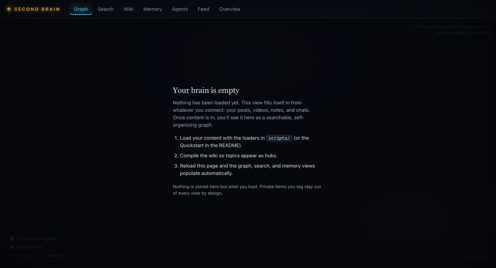
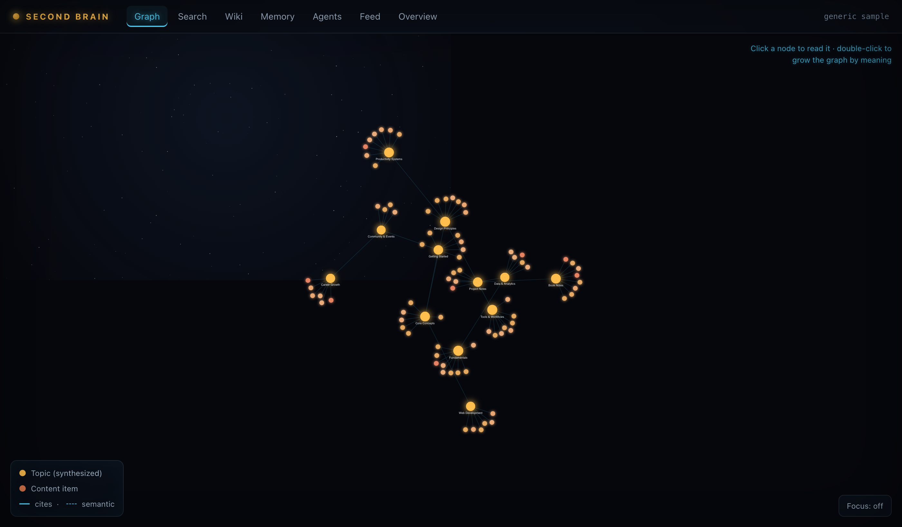
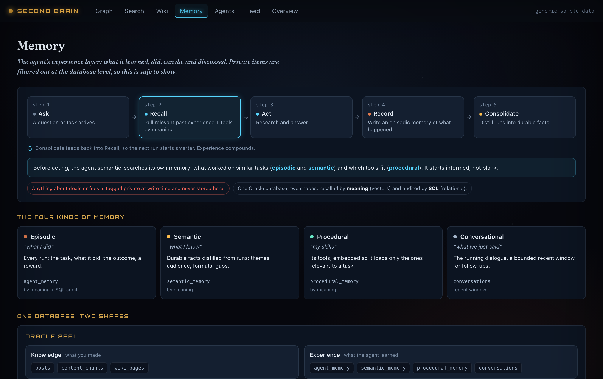

# The web memory UI

A read-only, browser-facing view of the brain, served from the same Fly app as the hosted
MCP server (`oracle/agent/webui.py` + `web/`). Generic and data-driven: the public template
ships with no data and fills from whatever a person loads; a private deployment shows your
data behind your auth. Nothing personal is baked into the code.

Your install **starts empty** and fills as you load content — nothing is baked in.

**Day one — a fresh install:**



> The populated screenshots below use **generic sample data** — your deployment shows your own content.

**The knowledge graph** — topics your brain synthesized (violet) + the content they cite, with
semantic edges you grow on double-click:



**The memory view** — the record→recall→consolidate lifecycle, the four memory kinds, and the
"one database, two shapes" idea, above your live memory:



## What it shows

| Tab | What it is |
|-----|------------|
| **Graph** | Obsidian-style force graph: wiki topics + the content they cite, with semantic edges you grow on double-click. A **Focus** toggle shows one node's neighborhood. |
| **Search** | Semantic + keyword retrieval, with an "explain how it was found" toggle. |
| **Wiki** | The self-compiled topic pages, with citations. |
| **Memory** | The agent's four memory kinds + an educational header: the record→recall→consolidate **lifecycle**, a **four-kinds** panel, and a **"one database, two shapes"** visual. |
| **Agents** | A registry of **everything built on the brain** — agents, playbooks, tools, jobs, sources, integrations, skills, schedules — auto-detected (see below). |
| **Feed** | Newest items. |
| **Overview** | "What's in my brain": by-source and by-type bars, series, coverage, memory counts, and the source-health panel. |

Structural privacy holds throughout: every read filters `visibility='content'`, so business/deal
data (content **and** agent memory) never appears — safe to demo on screen.

## The agents registry is auto-detected

Nobody maintains a list. `scripts/build_registry.py` scans the codebase — agent files, MCP
tools/playbooks (parsed from decorators), loaders, jobs, integrations, skills, launchd plists —
and writes:

- `web/registry.json` — the **generic** catalog (public repo, ships to everyone).
- `private/server/registry.private.json` — **your** private items (private repo, ships only on
  your deployment via the Dockerfile).

`oracle/agent/registry.py` reads and merges them; `/api/agents` serves the result.

**You never run it by hand.** It regenerates automatically in three places:
- a **git pre-commit hook** (in each repo) refreshes the JSON on every commit, so the committed
  code and the registry are always in lock-step — and therefore so is every deploy;
- the **daily sync** (`scripts/sync.py`'s "Registry" step) as a backstop;
- manual, if ever needed: `./.venv/bin/python scripts/build_registry.py`.

If `.git/hooks` is ever wiped, reinstall from the committed copy: `cp scripts/git-hooks/pre-commit
.git/hooks/pre-commit && chmod +x .git/hooks/pre-commit` (the private repo has its own under
`private/.git/hooks/`).

## Enabling / deploying

Env (fail-closed): `UI_ENABLED=1` turns it on; `UI_AUTH_TOKEN` (≥32 chars) gates `/api/*`;
`UI_PUBLIC_READ=1` is the explicit anonymous-read escape hatch for a public showcase.

```
fly secrets set UI_ENABLED=1 UI_AUTH_TOKEN="$(python3 -c 'import secrets;print(secrets.token_urlsafe(32))')" -a <app>
fly deploy --remote-only -c private/server/fly.toml   # private deploy (or deploy/Dockerfile for public)
```

App files (html/js/css) are served `no-cache` so a redeploy is never served stale; only the
version-pinned vendor lib is long-cached.

## Open items / next steps

Nothing here is blocking — the UI is complete and tested (`tests/test_brain.py`, green). These
are optional follow-ups:

- [x] **Registry auto-regenerates** — via the pre-commit hook (+ sync backstop). No manual step,
      no Docker change needed. *(The `.dockerignore` deliberately keeps `scripts/`/`private/` out of
      the build context, so build-time generation was intentionally avoided.)*
- [x] **`script` skill now listed** — it lives in `private/skills/` (not `private/claude-code/skills/`);
      the scanner now covers both. Both `script` and `spark` show.
- [x] **Parallel-DML deadlock confirmed fixed** — `wiki._set_hwm` guard is on `main` (`cbc0ded`),
      `test_set_hwm` passes repeatedly.
- [ ] **Deploy to see it live.** After a redeploy of the private Fly app, warm the machine before
      filming (scale-to-zero cold start).
- [ ] **Filmable artifact is behind** — the shareable storyboard has the Memory lifecycle but not
      the Overview dashboard or Agents registry. Mirror them only if you film the artifact, not the
      real app.
- [ ] **Live agent console (future)** — watching a workflow *run* is a separate interactive surface,
      not this read-only view. Not built.
