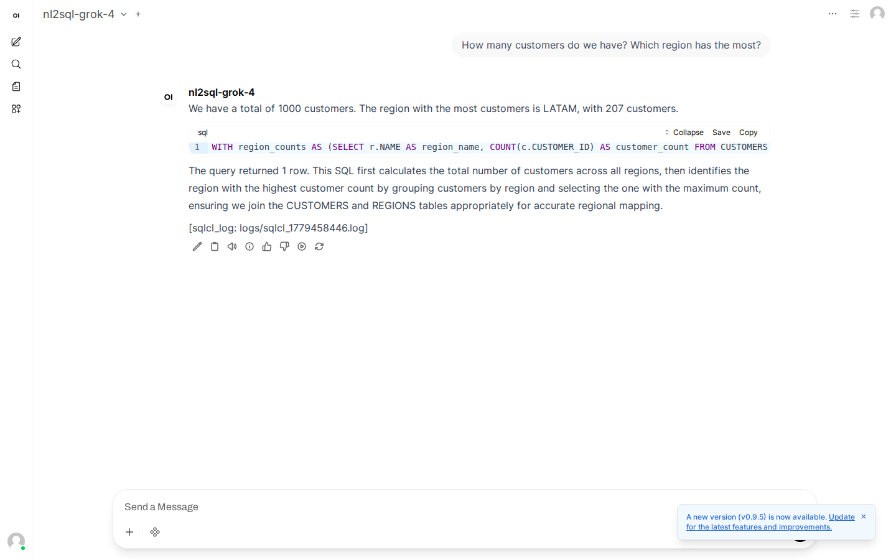

# Build Paths

A set of **Oracle skills** built by expert OCI developers and packaged so your coding agent can use them while you build. Point Claude Code (or Cursor, Aider, or any agent that reads markdown skills) at this directory and it's as if we're sitting next to you — scaffolding the Oracle 26ai container, wiring up `langchain-oracledb`, registering the in-DB ONNX embedder, plugging the Oracle MCP server in, and writing the app code the way an Oracle engineer would do it. Three build paths, three sample apps per path: pick whichever shape matches what you're passionate about, then improve it with whatever you'd bring to it. The Oracle skills don't change; the corner you take Oracle into does.

| Path | What you build | Stack | Time |
| --- | --- | --- | --- |
| [beginner](./beginner/) | Three "X-to-chat" flavors — PDFs, Markdown notes, web pages — into a polished Open WebUI chat. | `langchain-oracledb` + `OracleVS` + MiniLM-L6-v2 (Python-side) + Grok 4 via OCI GenAI. | ~1 afternoon |
| [intermediate](./intermediate/) | A Grok-4 tool-calling agent that talks to a live Oracle schema via `oracle-database-mcp-server`, with **embeddings happening inside the database** (registered ONNX model, no external embedder). | + Oracle MCP + in-DB ONNX + Open WebUI. | ~1-2 days |
| [advanced](./advanced/) | An agent system where Oracle is the **only** state store, built by composing the three [`skills/`](./skills/) building blocks. | + JSON Duality, six memory types, agent self-memory, oracle-database-mcp-server in `read_write` mode (with safety rails) when needed. | ~3-5 days |

## How it works

1. You point your agent (Claude Code, Cursor, Aider, or any agent that reads markdown skills) at this directory.
2. The agent reads `SKILL.md`, asks you one question (which path), then hands off to the path's own skill.
3. The path skill runs the [interview](./shared/interview.md) — six questions max — and confirms before scaffolding.
4. The path skill **invokes the building-block skills** under [`skills/`](./skills/) for the boring layers (Docker compose, `OracleVS` wiring, MCP server setup), then writes the application logic itself.
5. It runs `verify.py` end-to-end and only declares done when verify is green.
6. You get a polished, social-media-ready repo at the target dir of your choice.

The skills are **agent-agnostic markdown** — they don't depend on a specific harness. Each `SKILL.md` is a numbered procedure the agent must follow. The skills cite real exemplars (from this repo and from jasperan's other projects) so the model copies known-good patterns instead of inventing Oracle SQL.

## What you'll need

- **Docker.** The skills bring up the official Oracle 26ai Free image; no Oracle install on your host.
- **Python 3.11+.**
- **An OCI Generative AI API key** (`OCI_GENAI_API_KEY`, a `sk-...` value generated in the OCI GenAI service console). *All three tiers* require this. The bearer-token endpoint is `https://inference.generativeai.us-phoenix-1.oci.oraclecloud.com` — no `~/.oci/config`, no compartment OCID, no SigV1 ceremony. The earlier Ollama-fallback variants are preserved in [`archive/`](./archive/) but no longer actively scaffolded.

## What gets scaffolded

Every project comes with:

- A working `docker-compose.yml` for Oracle 26ai Free *plus* Open WebUI on `:3000`.
- A `verify.py` that proves the whole stack runs end-to-end.
- A FastAPI adapter exposing `/v1/chat/completions` so Open WebUI talks to your agent.
- A README built from a template, with the "Why Oracle" paragraph auto-assembled from the features your project actually uses.
- A `.gitignore` already tuned for the project's deps.

Intermediate adds a Jupyter notebook (default yes). Advanced makes the notebook mandatory and adds a `docs/` slot for the architecture diagram.

## What it looks like

A finished **intermediate** project answering a natural-language question end-to-end — Open WebUI → FastAPI adapter → Grok 4 agent → Oracle 26ai → SQLcl tee:

The agent walked `list_tables → describe_table → run_sql` against a seeded 10-table schema, surfaced the SQL it ran, and the SQLcl-tee extension wrote that same SQL to `logs/sqlcl_*.log` as an independent evidence trail.

## Why three paths

Because building "your first Oracle vector query" and "an agent system using Oracle as the only state store" are different tasks. Lumping them under one tutorial means everyone gets something wrong-sized — too much for the beginner, too thin for the agent-builder. Three sized doors, three ideas behind each — depth-first, not breadth-first.

## Where projects land

By default: the current working directory you launched your agent in. The skill never picks a path on its own; it scaffolds where you point it. We recommend a fresh empty directory **outside** this repo so what you build is **yours**, not a fork of the developer hub. You take the repo, you push it to your own GitHub, you post the demo. The skill credits the developer hub in the generated README footer; that's the only attribution.

## See also

- [`GETTING_STARTED.md`](./GETTING_STARTED.md) — three worked walk-throughs (one per tier), with the exact questions to answer in the interview and the exact commands to run after.
- [`PLAN.md`](./PLAN.md) — the design spec. Read this if you want to understand why each path is shaped the way it is, or want to contribute a new project idea.
- [`skills/`](./skills/) — the three reusable building-block skills that the higher tiers compose.
- [`shared/references/`](./shared/references/) — the canonical docs the skills cite.
- [`shared/references/visual-oracledb-features.md`](./shared/references/visual-oracledb-features.md) — frozen catalog of Oracle AI Database features.
- [`archive/`](./archive/) — superseded idea catalog (the previous 8-per-tier menu). Kept around for reference and the Ollama-flavored ideas.

## License

MIT. Built by the [oracle-ai-developer-hub](https://github.com/oracle-devrel/oracle-ai-developer-hub).
