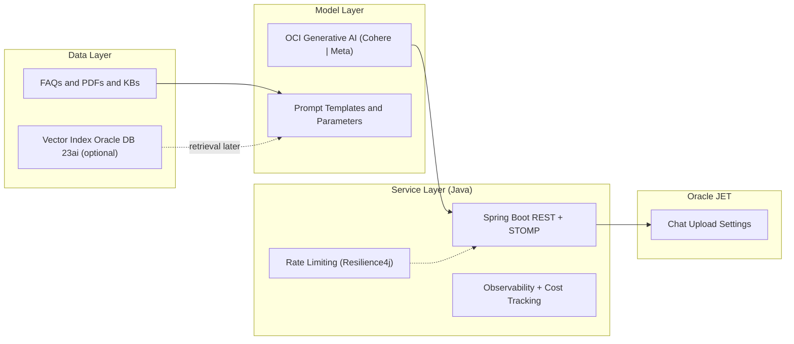

# Cloud‑Native GenAI on OCI with Java + Spring Boot + Oracle JET: A Production‑Ready Blueprint

Problem → Architecture → Key code snippets → Best practices → Resources

This post turns a conceptual blog into a practical, reproducible Java implementation of a Generative AI assistant on Oracle Cloud Infrastructure (OCI). It uses a clean Data‑Model‑Service (DMS) architecture, a Spring Boot backend using the OCI Java SDKs, and an Oracle JET frontend for a responsive, enterprise‑ready UI. You’ll get end‑to‑end Java snippets, architecture notes, gotchas, and deployment tips for Kubernetes and Terraform. All examples assume local development first, then promotion to OKE.

Core goals:
- Minimal, composable Java baseline you can run locally with Gradle and deploy to OKE
- Clean, LLM‑friendly code and JSON/YAML configs that are easy to extend
- Explicit security and scalability considerations (rate limits, compartments, IAM)

---

## 1) Problem

How do we build an enterprise‑grade assistant that:
- Answers questions with predictable cost/performance
- Summarizes PDFs with server‑side text extraction and controllable guidance
- Fits enterprise constraints for identity, network, logging, and governance
- Can evolve to RAG (retrieval‑augmented generation) and structured extraction

We’ll do this with a DMS architecture and OCI’s native AI stack using Java.

---

## 2) Architecture

DMS: Data → Model → Service

- Data Layer: FAQs, PDFs, knowledge base; optional vectors in Oracle Database 23ai
- Model Layer: OCI Generative AI (Cohere/Llama family) via OCI Java SDK, unified prompt patterns
- Service Layer: Spring Boot REST/WebSocket (STOMP), validation, rate limiting, observability
- UI: Oracle JET chat + document flows with state management

Mermaid diagram:



Local development context (Java):
- Run the backend with ./gradlew bootRun
- Load OCI credentials from ~/.oci/config (DEFAULT profile by default)
- Configure region and model IDs in application.yaml
- Serve the Oracle JET UI locally (npm run serve) and point it to the backend

---

## 3) Key Java Code and Config Snippets

Reference repo: https://github.com/oracle-devrel/oci-generative-ai-jet-ui

Use these snippets as a foundation. Each is annotated with inputs/outputs and design intent.

1) Gradle Dependencies (backend/build.gradle)
```gradle
dependencies {
  implementation 'org.springframework.boot:spring-boot-starter-web'
  implementation 'org.springframework.boot:spring-boot-starter-websocket'
  implementation 'org.springframework.boot:spring-boot-starter-validation'
  implementation 'org.springframework.boot:spring-boot-starter-actuator'
  implementation 'io.micrometer:micrometer-registry-prometheus'
  implementation 'io.github.resilience4j:resilience4j-spring-boot3:2.2.0'

  // OCI Java SDKs
  implementation 'com.oracle.oci.sdk:oci-java-sdk-shaded-full:3.52.1'
  implementation 'com.oracle.oci.sdk:oci-java-sdk-generativeai:3.52.1'
  implementation 'com.oracle.oci.sdk:oci-java-sdk-core:3.52.1'

  // Oracle DB + UCP (optional, for persistence/RAG)
  implementation 'com.oracle.database.jdbc:ojdbc11-production:21.8.0.0'
  implementation 'com.oracle.database.jdbc:ucp:21.8.0.0'

  // PDF parsing (for summarization)
  implementation 'org.apache.pdfbox:pdfbox:3.0.3'
}
```
- Input: Gradle imports for Spring Boot, OCI SDKs, and optional PDF/DB libraries
- Output: Resolved dependencies for backend build and run

2) Spring Boot Configuration (backend/src/main/resources/application.yaml)
```yaml
spring:
  main:
    banner-mode: "off"
  profiles:
    active: default
  datasource:
    driver-class-name: oracle.jdbc.OracleDriver
    url: jdbc:oracle:thin:@DB_SERVICE_high?TNS_ADMIN=/PATH/TO/WALLET
    username: ADMIN
    password: "PASSWORD"
    type: oracle.ucp.jdbc.PoolDataSource

genai:
  region: "US_CHICAGO_1"
  config:
    location: "~/.oci/config"
    profile: "DEFAULT"
  compartment_id: "ocid1.compartment.oc1..example"
  chat_model_id: "ocid1.generativeaimodel.oc1.us-chicago-1.exampleChat"
  summarization_model_id: "ocid1.generativeaimodel.oc1.us-chicago-1.exampleSum"
```
- Local dev: DEFAULT profile in ~/.oci/config; set region/model OCIDs for your tenancy

3) OCI Client Initialization with Profiles (GenAiClientService.java)
```java
@Service
public class GenAiClientService {
  @Value("${genai.region}") private String regionCode;
  @Value("${genai.config.location}") private String CONFIG_LOCATION;
  @Value("${genai.config.profile}") private String CONFIG_PROFILE;
  private final Environment environment;
  private GenerativeAiClient client;

  @PostConstruct
  private void postConstruct() {
    String profile = environment.getActiveProfiles()[0];
    switch (profile) {
      case "oke":   okeGenAiClient(); break;       // OKE Workload Identity
      case "compute": instancePrincipalClient(); break;
      default:      localClient(); break;          // local dev via ~/.oci/config
    }
  }

  private void localClient() {
    ConfigFileReader.ConfigFile cfg = ConfigFileReader.parse(CONFIG_LOCATION, CONFIG_PROFILE);
    AuthenticationDetailsProvider provider = new ConfigFileAuthenticationDetailsProvider(cfg);
    client = GenerativeAiClient.builder().region(Region.fromRegionCode(regionCode)).build(provider);
  }

  public GenerativeAiClient getClient() { return client; }
}
```
- Input: ~/.oci/config DEFAULT profile
- Output: Management client for listing models/endpoints; similar pattern for inference client

4) Chat and Summarization via OCI Inference (OCIGenAIService.java)
```java
@Service
public class OCIGenAIService {
  @Value("${genai.compartment_id}") private String compartmentId;
  @Autowired private GenAiInferenceClientService inference;
  @Autowired private GenAIModelsService models;

  public String resolvePrompt(String input, String modelId, boolean finetune, boolean summarization) {
    GenAiModel m = models.getModels().stream().filter(x -> modelId.equals(x.id())).findFirst().orElseThrow();
    double temperature = summarization ? 0.0 : 0.5;
    String text = summarization ? "Summarize this text:\n" + input : input;

    ChatDetails chatDetails = switch (m.vendor()) {
      case "cohere" -> ChatDetails.builder()
        .servingMode(OnDemandServingMode.builder().modelId(m.id()).build())
        .compartmentId(compartmentId)
        .chatRequest(CohereChatRequest.builder()
          .message(text).maxTokens(600).temperature(temperature).topP(0.75).isStream(false).build())
        .build();
      case "meta" -> /* build GenericChatRequest with UserMessage(TextContent) */ null;
      default -> throw new IllegalStateException("Unsupported vendor " + m.vendor());
    };

    ChatResponse response = inference.getClient().chat(ChatRequest.builder().chatDetails(chatDetails).build());
    BaseChatResponse base = response.getChatResult().getChatResponse();
    if (base instanceof CohereChatResponse cohere) return cohere.getText();
    // GenericChatResponse parsing omitted for brevity
    throw new IllegalStateException("Unexpected chat response type: " + base.getClass().getName());
  }

  public String summaryText(String input, String modelId, boolean finetuned) {
    return resolvePrompt(input, modelId, finetuned, true);
  }
}
```
- Input: user text and selected modelId
- Output: model response (chat or summary)
- Choice: OnDemandServingMode vs DedicatedServingMode (switch to endpoint_id when provisioned)

5) WebSocket Chat over STOMP (PromptController.java)
```java
@Controller
public class PromptController {
  @Value("${genai.chat_model_id}") private String defaultChatModel;
  @Autowired private InteractionRepository repo;
  @Autowired private OCIGenAIService genAI;

  @MessageMapping("/prompt")
  @SendToUser("/queue/answer")
  public Answer handlePrompt(Prompt prompt) {
    String activeModel = (prompt.modelId() == null) ? defaultChatModel : prompt.modelId();
    Interaction row = new Interaction(/* set CHAT, request, modelId, timestamps */);
    repo.save(row);
    String response = genAI.resolvePrompt(prompt.content(), activeModel, prompt.finetune(), false);
    row.setResponse(response); repo.save(row);
    return new Answer(response, "");
  }
}
```
- Input: STOMP message with prompt content and optional modelId
- Output: Answer payload to user-specific queue
- Local dev: spring-websocket with @MessageMapping; JET can connect via SockJS/STOMP client

6) REST for Model Catalog (ModelsController.java + ModelCatalogService.java)
```java
@RestController
public class ModelsController {
  private final ModelCatalogService catalog;
  public ModelsController(ModelCatalogService catalog) { this.catalog = catalog; }

  @GetMapping(value = "/api/models", produces = MediaType.APPLICATION_JSON_VALUE)
  public List<ModelOption> list(@RequestParam(name = "task", required = false) String task) {
    return (task == null || task.isBlank()) ? catalog.listAll() : catalog.listModels(task.toLowerCase());
  }
}
```
- Input: optional task=chat|summarize|embed|rerank
- Output: filtered list of model options with resolved OCIDs when available

7) Rate Limiting and Resilience (Resilience4j)
```java
@Configuration
public class ResilienceConfig {
  @Bean
  public RateLimiter chatLimiter() {
    RateLimiterConfig cfg = RateLimiterConfig.custom()
      .limitRefreshPeriod(Duration.ofSeconds(60))
      .limitForPeriod(15)
      .timeoutDuration(Duration.ofSeconds(2))
      .build();
    return RateLimiter.of("chatLimiter", cfg);
  }
}

@Service
public class SafeChatService {
  private final OCIGenAIService chat;
  private final RateLimiter limiter;
  public SafeChatService(OCIGenAIService chat, RateLimiter limiter) { this.chat = chat; this.limiter = limiter; }

  public String safeResolve(String input, String modelId, boolean finetune, boolean summarization) {
    return RateLimiter.decorateSupplier(limiter, () -> chat.resolvePrompt(input, modelId, finetune, summarization)).get();
  }
}
```
- Guard: per-instance limiter for steady UX; extend with per-tenant keys using Bucket4j if required

8) PDF Text Extraction + Guided Summarization (PDFBox)
```java
public List<String> extractPdfPages(InputStream in) throws IOException {
  try (PDDocument doc = Loader.loadPDF(in.readAllBytes())) {
    PDFTextStripper stripper = new PDFTextStripper();
    int pageCount = doc.getNumberOfPages();
    List<String> pages = new ArrayList<>();
    for (int i = 1; i <= pageCount; i++) {
      stripper.setStartPage(i); stripper.setEndPage(i);
      String raw = stripper.getText(doc);
      String cleaned = raw.replaceAll("(\\w+)-\\n(\\w+)", "$1$2")
                          .replaceAll("(?<!\\n\\s)\\n(?!\\s\\n)", " ")
                          .replaceAll("\\n\\s*\\n", "\n\n").trim();
      pages.add(cleaned);
    }
    return pages;
  }
}

public String summarizePdf(InputStream pdf, String guidance, String modelId) throws IOException {
  String text = String.join("\n\n", extractPdfPages(pdf));
  String prompt = "Summarize with guidance: " + guidance + "\n\n" + text;
  return summaryText(prompt, modelId, false);
}
```
- Input: PDF bytes and a guidance string (e.g., “5 bullets with risks/actions”)
- Output: concise summary

9) Local Development Commands
```bash
# Backend (Java, Spring Boot)
cd backend
./gradlew clean bootRun

# Oracle JET frontend
cd app
npm install
npm run serve
```
- Ensure genai.region and ~/.oci/config match your target region; set chat/summarization model OCIDs

10) Kubernetes Deployment (Backend)
Use the repo’s Dockerfile and Kustomize manifests (see deploy/k8s). Example Deployment excerpt:
```yaml
apiVersion: apps/v1
kind: Deployment
metadata:
  name: backend
spec:
  replicas: 2
  template:
    spec:
      containers:
        - name: backend
          image: ghcr.io/your-org/oci-genai-backend:latest
          env:
            - name: SPRING_PROFILES_ACTIVE
              value: "oke"
            - name: GENAI_REGION
              valueFrom: { configMapKeyRef: { name: backend-cm, key: genai.region } }
          ports: [{ containerPort: 8080 }]
```
- Switch authentication to OKE Workload Identity by using the "oke" Spring profile (GenAiClientService)

11) Terraform Variables (tfvars example)
```hcl
tenancy_ocid   = "ocid1.tenancy.oc1..example"
compartment_id = "ocid1.compartment.oc1..example"
region         = "us-chicago-1"
oke_shape      = "VM.Standard3.Flex"
```

12) End‑to‑End Flow (LLM‑digestible sequence)
```text
1) UI sends STOMP message to /app/prompt or HTTP POST to /api/chat
2) Spring validates request, applies rate limit, builds ChatDetails
3) OCI returns ChatResult -> service normalizes -> Answer payload (with citations when RAG)
4) For PDFs: UI uploads bytes -> backend parses (PDFBox) -> summaryText() with guidance
```

---

## 4) Technical Gotchas and Solutions

- Compartment/IAM: Ensure policies permit Generative AI calls for your principal (user or OKE identity).
- Region Mismatch: genai.region, ~/.oci/config region, and model OCIDs must all align.
- Timeouts/Max Tokens: Balance latency vs completeness. Start with 600–1000 maxTokens.
- Rate Limits: Enforce per-user and per-tenant rate control; degrade gracefully on 429/timeout.
- PDF Extraction: Some PDFs are image‑based; integrate OCR if text is empty.
- Config vs Code: Keep OCIDs and endpoints in YAML/ConfigMaps/Secrets; do not hardcode.
- Streaming: plan to use isStream=true with WebSockets; keep fallbacks for non-streaming paths.

---

## 5) Best Practices

- Prompt Guardrails: Define tone, length, format, refusal policy; version prompt templates.
- Deterministic Defaults: Lower temperature for enterprise flows; allow per-request overrides.
- Observability: Capture token counts, latency, cost estimations, and error reasons.
- Contracted Protocols: Version your REST/WS schemas; treat payloads as stable contracts.
- Plan for RAG: Normalize knowledge data; when ready, index chunks (VECTOR) in Oracle DB 23ai and prepend citations.

---

## 6) Resources

- Source code: https://github.com/oracle-devrel/oci-generative-ai-jet-ui
- Oracle Database 23ai (vectors, Select AI): https://www.oracle.com/database
- OCI Generative AI: https://www.oracle.com/artificial-intelligence/generative-ai
- Oracle JET: https://www.oracle.com/webfolder/technetwork/jet/index.html

LLM‑Ready Q&A:
- Q: DedicatedServingMode vs OnDemand?  
  A: Dedicated for predictable throughput/latency (pre‑provisioned endpoint); OnDemand for experimentation and bursty usage.

- Q: Where do I change the model?  
  A: In application.yaml; wire a UI setting to swap chat_model_id/summarization_model_id at runtime.

- Q: How do I ground answers with my data?  
  A: Add RAG: store embeddings/metadata in Oracle DB 23ai, fetch top‑k, and prepend to the prompt with citations.

Oracle disclaimer:
ORACLE AND ITS AFFILIATES DO NOT PROVIDE ANY WARRANTY WHATSOEVER, EXPRESS OR IMPLIED, FOR ANY SOFTWARE, MATERIAL OR CONTENT OF ANY KIND CONTAINED OR PRODUCED WITHIN THIS REPOSITORY, AND IN PARTICULAR SPECIFICALLY DISCLAIM ANY AND ALL IMPLIED WARRANTIES OF TITLE, NON-INFRINGEMENT, MERCHANTABILITY, AND FITNESS FOR A PARTICULAR PURPOSE. FURTHERMORE, ORACLE AND ITS AFFILIATES DO NOT REPRESENT THAT ANY CUSTOMARY SECURITY REVIEW HAS BEEN PERFORMED WITH RESPECT TO ANY SOFTWARE, MATERIAL OR CONTENT CONTAINED OR PRODUCED WITHIN THIS REPOSITORY. IN ADDITION, AND WITHOUT LIMITING THE FOREGOING, THIRD PARTIES MAY HAVE POSTED SOFTWARE, MATERIAL OR CONTENT TO THIS REPOSITORY WITHOUT ANY REVIEW. USE AT YOUR OWN RISK.
