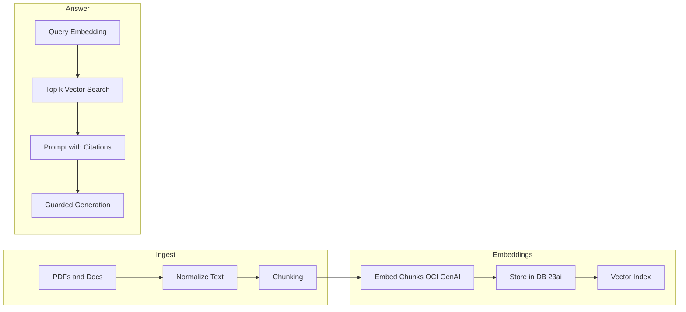

# Part 2 — Data + Model on Oracle: Chunking, Embeddings, and Guarded Prompting (Hands‑On Lab)

Learning goals → Prerequisites → Concepts → Step‑by‑step labs → Practice challenges → Self‑check

This lab turns your assistant into a retrieval‑augmented, guarded system on Oracle. You will:
- Normalize document text (PDFs/docs)
- Implement chunking with overlap
- Generate embeddings with OCI Generative AI
- Store vectors and metadata in Oracle Database 23ai
- Retrieve top‑k contexts and assemble guarded prompts that reduce hallucinations

Series context:
- Part 1: DMS architecture + JET UI + OKE path
- Part 2 (this lab): Data + Model (chunking, embeddings, guarded prompting)
- Part 3: UI + Service + Security + Observability + OKE deployment

---

## Learning Objectives

By the end of this lab, you will be able to:
- Normalize text from PDFs for better embeddings
- Choose chunk size/overlap and implement a reusable chunker
- Generate embeddings using OCI Generative AI and log costs/latency
- Design a simple vector schema in Oracle Database 23ai and run top‑k search
- Assemble a guarded prompt with refusal rules and JSON‑only output

---

## Prerequisites

- OCI tenancy with access to Generative AI
- Oracle Database 23ai (or access to a DB 23ai environment with vector features)
- Python 3.9+, virtualenv, and basic SQL familiarity
- The repository:
  ```bash
  git clone https://github.com/oracle-devrel/oci-generative-ai-jet-ui
  cd oci-generative-ai-jet-ui
  ```

- Example config (edit for your tenancy):
  ```json
  {
    "compartment_id": "ocid1.compartment.oc1..example",
    "config_profile": "DEFAULT",
    "service_endpoint": "https://inference.generativeai.us-chicago-1.oci.oraclecloud.com",
    "embedding_model_id": "ocid1.generativeaimodel.oc1.us-chicago-1.exampleEmbed",
    "chunk_size_tokens": 800,
    "chunk_overlap_tokens": 200
  }
  ```

---

## Concept: The RAG Loop



Why this matters:
- Clean text and chunking improve embedding quality
- Vector search selects relevant snippets for the prompt
- Guarded prompting controls style and reduces hallucinations

---

## Lab 1: Normalize Text from PDFs

Objective: Convert PDFs to clean, consistent text.

1) Create a virtualenv and install deps (if not already):
```bash
cd service/python
python3 -m venv .venv
source .venv/bin/activate
pip install -r requirements.txt
```

2) Implement normalization:
```python
# file: service/python/lab_normalize.py
import re
from pypdf import PdfReader
from io import BytesIO
from typing import List

def parse_pdf(file: BytesIO) -> List[str]:
    pdf = PdfReader(file)
    pages = []
    for page in pdf.pages:
        text = page.extract_text()
        text = re.sub(r"(\\w+)-\\n(\\w+)", r"\\1\\2", text)      # merge hyphenated
        text = re.sub(r"(?<!\\n\\s)\\n(?!\\s\\n)", " ", text)    # inline newlines
        text = re.sub(r"\\n\\s*\\n", "\\n\\n", text)             # collapse breaks
        pages.append(text)
    return pages
```

Try it yourself:
- Load a sample PDF and print first 500 chars of page 1 to verify readability.

---

## Lab 2: Chunking with Overlap

Objective: Split text into overlapping chunks to preserve local context.

```python
# file: service/python/lab_chunk.py
from typing import List

def chunk_text(text: str, size: int = 800, overlap: int = 200) -> List[str]:
    words = text.split()
    chunks, step = [], max(1, size - overlap)
    for start in range(0, len(words), step):
        piece = words[start:start+size]
        if not piece: break
        chunks.append(" ".join(piece))
        if start + size >= len(words): break
    return chunks
```

Try it yourself:
- Experiment with size=600, overlap=180 and count chunks produced for a 10‑page PDF.
- Inspect first/last tokens of adjacent chunks to confirm overlap.

---

## Lab 3: Generate Embeddings with OCI Generative AI

Objective: Create dense vectors for each chunk using your embedding model.

1) Bootstrap the client:
```python
# file: service/python/lab_embed.py
import oci

def build_client(config_profile: str, endpoint: str):
    config = oci.config.from_file("~/.oci/config", config_profile)
    return oci.generative_ai_inference.GenerativeAiInferenceClient(
        config=config,
        service_endpoint=endpoint,
        retry_strategy=oci.retry.NoneRetryStrategy(),
        timeout=(10, 240),
    )
```

2) Embed chunks (pseudocode for current SDK):
```python
from typing import List

def embed_chunks(client, chunks: List[str], embedding_model_id: str, compartment_id: str) -> List[List[float]]:
    details = oci.generative_ai_inference.models.EmbedTextDetails(
        serving_mode=oci.generative_ai_inference.models.OnDemandServingMode(
            model_id=embedding_model_id
        ),
        compartment_id=compartment_id,
        inputs=chunks
    )
    resp = client.embed_text(details)
    return [e.values for e in resp.data.embeddings]
```

Try it yourself:
- Batch in groups of 32 and log per‑batch latency and the number of tokens if available.

---

## Lab 4: Store Vectors in Oracle Database 23ai

Objective: Persist chunks, vectors, and metadata for retrieval.

Pseudocode DDL (confirm DB 23ai vector syntax for your version):
```sql
CREATE TABLE doc_chunks (
  id          NUMBER GENERATED BY DEFAULT AS IDENTITY PRIMARY KEY,
  doc_id      VARCHAR2(128),
  chunk_ix    NUMBER,
  text        CLOB,
  embedding   VECTOR(1024, FLOAT32), -- match model dimension
  source_meta JSON
);

CREATE VECTOR INDEX doc_chunks_vec_idx
ON doc_chunks (embedding);
```

Insert outline:
```sql
INSERT INTO doc_chunks (doc_id, chunk_ix, text, embedding, source_meta)
VALUES (:doc_id, :chunk_ix, :text, :embedding_vector, :source_meta_json);
```

Try it yourself:
- Insert 3–5 chunks for a single doc_id with simple metadata:
  ```json
  {"doc_id":"faq-v1","source":"object://bucket/faqs.pdf#p3","tags":["policy"]}
  ```

---

## Lab 5: Retrieval and Prompt Assembly

Objective: Embed a user query, run top‑k vector search, assemble a guarded prompt with citations.

1) Query embedding → top‑k search (pseudocode):
```sql
-- Bind :q_embed (vector embedding of the user question)
SELECT doc_id, chunk_ix, text, source_meta
FROM doc_chunks
-- WHERE doc_id = 'faq-v1'  -- optional filter
-- ORDER BY VECTOR_DISTANCE(embedding, :q_embed) ASC
FETCH FIRST 5 ROWS ONLY;
```

2) Prompt assembly with citations:
```python
def assemble_prompt(question: str, snippets: list[dict]) -> str:
    ctx = []
    for i, s in enumerate(snippets, start=1):
        source = s.get("source") or s.get("source_meta","")
        ctx.append(f"[{i}] {s['text']} (source: {source})")
    context = "\\n".join(ctx)
    return f"""SYSTEM:
Answer strictly from CONTEXT. If not in CONTEXT, say "I don’t know from the provided context."

CONTEXT:
{context}

USER:
{question}

ASSISTANT (rules):
- Answer in 3-5 bullets; include inline citations like [1], [2]
- If insufficient context, reply: "I don’t know from the provided context."
"""
```

---

## Lab 6: Guarded Prompting (JSON‑only Output)

Objective: Constrain outputs to a machine‑checkable JSON schema.

Schema cue (LLM‑parseable):
```json
{
  "answer_style": "bulleted",
  "max_bullets": 5,
  "output_schema": {
    "type": "object",
    "required": ["bullets","citations"],
    "properties": {
      "bullets": { "type":"array", "items":{"type":"string"}, "maxItems":5 },
      "citations": {
        "type":"array",
        "items": { "type":"object", "required":["id","source"],
          "properties": { "id":{"type":"integer"},"source":{"type":"string"} } }
      }
    }
  }
}
```

Prompt suffix:
```text
Return JSON ONLY with this schema:
{ "bullets": string[], "citations": { "id": number, "source": string }[] }.
No prose outside JSON. On insufficient context, return:
{"bullets": [], "citations": []}
```

Generation parameters (enterprise defaults):
- temperature: 0.2–0.5
- top_p: 0.7
- max_tokens: 500–800

Try it yourself:
- Deliberately remove context and verify a refusal JSON is returned.
- Validate JSON and re‑ask with stricter instructions if parsing fails.

---

## Practice Challenges

1) Chunking strategies:
- Implement a semantic chunker (headings, lists).
- Compare retrieval accuracy vs fixed‑size chunking.

2) Vector schema:
- Add a “section_title” and “page” to metadata.
- Build a “cite‑top‑k” function that returns unique sources across chunks.

3) Prompt budget:
- Pre‑summarize each chunk to ~500 characters and compare end‑to‑end latency.

4) Guardrails:
- Add a policy‑aware refusal rule (e.g., export controls) and test with adversarial prompts.

5) Evaluation:
- Create 10 golden questions and assertions (citations exist, bullet count ≤ 5, JSON valid).
- Track latency and tokens; plot p95 over time.

---

## Self‑Check

- Can you explain why overlap matters in chunking?
- Can you embed text using OCI Generative AI and store vectors in DB 23ai?
- Can you run a top‑k search and assemble a prompt with citations?
- Can you enforce JSON‑only output and validate it programmatically?

---

## Troubleshooting (LLM‑Ready Q&A)

- Q: I get SDK or 4xx errors calling embeddings.  
  A: Align service_endpoint region with model OCIDs; verify IAM policies for Generative AI in your compartment.

- Q: JSON output is sometimes invalid.  
  A: Tighten instructions (“JSON ONLY”), reduce temperature, and enforce a strict schema check with re‑ask on failure.

- Q: Retrieval returns irrelevant chunks.  
  A: Reduce chunk size, increase overlap, or add filters (doc_id/tags). Consider semantic chunking.

---

## Resources

- Source code: https://github.com/oracle-devrel/oci-generative-ai-jet-ui
- Oracle Database 23ai (vectors, Select AI): https://www.oracle.com/database
- OCI Generative AI: https://www.oracle.com/artificial-intelligence/generative-ai
- Oracle JET: https://www.oracle.com/webfolder/technetwork/jet/index.html

---

## Oracle Disclaimer

ORACLE AND ITS AFFILIATES DO NOT PROVIDE ANY WARRANTY WHATSOEVER, EXPRESS OR IMPLIED, FOR ANY SOFTWARE, MATERIAL OR CONTENT OF ANY KIND CONTAINED OR PRODUCED WITHIN THIS REPOSITORY, AND IN PARTICULAR SPECIFICALLY DISCLAIM ANY AND ALL IMPLIED WARRANTIES OF TITLE, NON-INFRINGEMENT, MERCHANTABILITY, AND FITNESS FOR A PARTICULAR PURPOSE. FURTHERMORE, ORACLE AND ITS AFFILIATES DO NOT REPRESENT THAT ANY CUSTOMARY SECURITY REVIEW HAS BEEN PERFORMED WITH RESPECT TO ANY SOFTWARE, MATERIAL OR CONTENT CONTAINED OR PRODUCED WITHIN THIS REPOSITORY. IN ADDITION, AND WITHOUT LIMITING THE FOREGOING, THIRD PARTIES MAY HAVE POSTED SOFTWARE, MATERIAL OR CONTENT TO THIS REPOSITORY WITHOUT ANY REVIEW. USE AT YOUR OWN RISK.
