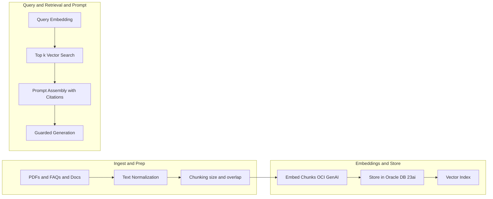

# Part 2 — Data + Model on Oracle: Chunking, Embeddings, and Guarded Prompting (Deep‑Dive)

Problem → Architecture → Key code snippets → Retrieval logic → Guardrails → Gotchas → Resources

This installment turns the assistant into a retrieval‑augmented, guarded system using Oracle Database 23ai and OCI Generative AI. You’ll implement chunking and embeddings, store vectors, retrieve top‑k contexts per query, and assemble prompts with output constraints that reduce hallucinations.

Series context:
- Part 1: DMS architecture + OKE deployment path + JET UI overview
- Part 2: Data + Model (this post)
- Part 3: UI + Service + Security + Observability + Full OKE rollout

---

## 1) Problem

We need answers that are grounded in enterprise content (PDFs, FAQs, internal docs), reliably formatted, and compliant. That requires:
- Clean text extraction from PDFs
- Sensible chunking with overlap
- Dense vector embeddings
- Fast vector search with Oracle Database 23ai
- Guarded prompting with structured responses and refusal rules

---

## 2) Architecture (Data + Model)



---

## 3) Key Code Snippets

The repository (https://github.com/oracle-devrel/oci-generative-ai-jet-ui) already includes:
- PDF parsing and normalization patterns (service/python/server.py)
- OCI Generative AI client bootstrap
- WebSocket service for chat/summarization
Below are targeted extensions for chunking, embeddings, storage, retrieval, and guarded prompting.

1) Text normalization for PDFs (LLM‑friendly)
```python
# Purpose: normalize PDF text before chunking/embedding
# Input: BytesIO(pdf)
# Output: List[str] page texts
import re
from pypdf import PdfReader
from io import BytesIO
from typing import List

def parse_pdf(file: BytesIO) -> List[str]:
    pdf = PdfReader(file)
    pages = []
    for page in pdf.pages:
        text = page.extract_text()
        text = re.sub(r"(\\w+)-\\n(\\w+)", r"\\1\\2", text)      # de‑hyphenate
        text = re.sub(r"(?<!\\n\\s)\\n(?!\\s\\n)", " ", text)    # inline newlines
        text = re.sub(r"\\n\\s*\\n", "\\n\\n", text)             # collapse breaks
        pages.append(text)
    return pages
```

2) Chunking with overlap
```python
# Purpose: split text into overlapping chunks
# Input: text, size, overlap
# Output: List[str] chunks
from typing import List

def chunk_text(text: str, size: int = 800, overlap: int = 200) -> List[str]:
    words = text.split()
    chunks, step = [], max(1, size - overlap)
    for start in range(0, len(words), step):
        piece = words[start:start+size]
        if not piece: break
        chunks.append(" ".join(piece))
        if start + size >= len(words): break
    return chunks
```

3) OCI Generative AI client (profile + endpoint)
```python
import oci

def build_genai_client(config_profile: str, endpoint: str):
    config = oci.config.from_file("~/.oci/config", config_profile)
    return oci.generative_ai_inference.GenerativeAiInferenceClient(
        config=config,
        service_endpoint=endpoint,
        retry_strategy=oci.retry.NoneRetryStrategy(),
        timeout=(10, 240),
    )
```

4) Create embeddings for chunks (pseudocode for current SDK)
```python
# Purpose: create vector embeddings (batch) for chunks
# Input: client, chunks, embedding_model_id, compartment_id
# Output: List[List[float]] vectors
def embed_chunks(client, chunks, embedding_model_id: str, compartment_id: str):
    details = oci.generative_ai_inference.models.EmbedTextDetails(
        serving_mode=oci.generative_ai_inference.models.OnDemandServingMode(
            model_id=embedding_model_id
        ),
        compartment_id=compartment_id,
        inputs=chunks
    )
    resp = client.embed_text(details)
    # 1 embedding per input
    return [e.values for e in resp.data.embeddings]
```

5) Oracle Database 23ai storage (pseudocode DDL)
```sql
-- Adjust to your DB 23ai version / syntax
CREATE TABLE doc_chunks (
  id         NUMBER GENERATED BY DEFAULT AS IDENTITY PRIMARY KEY,
  doc_id     VARCHAR2(128),
  chunk_ix   NUMBER,
  text       CLOB,
  embedding  VECTOR(1024, FLOAT32), -- match model dimension
  source_meta JSON
);

CREATE VECTOR INDEX doc_chunks_vec_idx
ON doc_chunks(embedding);
```

6) Insert chunks and vectors (outline)
```sql
-- Bind variables: :doc_id, :chunk_ix, :text, :embedding_vector, :source_meta_json
INSERT INTO doc_chunks (doc_id, chunk_ix, text, embedding, source_meta)
VALUES (:doc_id, :chunk_ix, :text, :embedding_vector, :source_meta_json);
```

7) Query‑time retrieval (top‑k nearest neighbors; pseudocode)
```sql
-- Bind :q_embed vector
SELECT doc_id, chunk_ix, text, source_meta
FROM doc_chunks
-- WHERE ... (optional filters e.g. doc_id in set)
-- ORDER BY VECTOR_DISTANCE(embedding, :q_embed) ASC
FETCH FIRST 5 ROWS ONLY;
```

8) Prompt assembly with citations
```python
def assemble_prompt(question: str, snippets: list[dict]) -> str:
    context_lines = []
    for i, s in enumerate(snippets, start=1):
        source = s["source"] if "source" in s else s.get("source_meta","")
        context_lines.append(f"[{i}] {s['text']} (source: {source})")
    context = "\n".join(context_lines)
    return f"""SYSTEM:
You answer strictly from CONTEXT. If not in context, say "I don’t know from the provided context."

CONTEXT:
{context}

USER:
{question}

ASSISTANT (rules):
- Answer in 3-5 bullets; include inline citations like [1], [2]
- If insufficient context, reply: "I don’t know from the provided context."
"""
```

9) Guarded output (JSON‑only mode)
```python
GUARDED_SUFFIX = """
Return JSON ONLY with this schema:
{ "bullets": string[], "citations": { "id": number, "source": string }[] }.
No prose outside JSON. On insufficient context, return:
{"bullets": [], "citations": []}
"""
```

10) Generation call with constraints (Cohere request pattern)
```python
async def generate_guarded_answer(client, compartment_id: str, prompt: str):
    req = oci.generative_ai_inference.models.CohereLlmInferenceRequest(
        prompt=prompt + GUARDED_SUFFIX,
        max_tokens=600,
        temperature=0.3,
        top_p=0.7,
        frequency_penalty=1.0
    )
    details = oci.generative_ai_inference.models.GenerateTextDetails(
        # Choose DedicatedServingMode (endpoint_id) or OnDemand (model_id)
        serving_mode=oci.generative_ai_inference.models.OnDemandServingMode(
            model_id="cohere.command-r"  # example; match your tenancy
        ),
        compartment_id=compartment_id,
        inference_request=req
    )
    resp = client.generate_text(details)
    return resp.data.inference_response.generated_texts[0].text
```

---

## 4) Retrieval Logic (End‑to‑End)

```text
1) Normalize PDF/document text
2) Chunk text with overlap
3) Embed chunks; store {text, embedding, metadata} in DB 23ai
4) At query time:
   a) Embed user question
   b) Vector search top‑k
   c) Assemble prompt with snippets + citations
   d) Add guarded JSON output instructions
   e) Call OCI GenAI to generate answer
   f) Parse JSON; validate schema; on failure, re‑ask with tighter schema hints
```

---

## 5) Guardrails

- Refusal policy: If not in context, say it. Don’t fabricate.
- JSON‑only outputs: Machine‑checkable, stable downstream contract.
- Determinism: Lower temperature/top_p for enterprise flows.
- Role separation: Keep OCIDs/endpoints in config/Secrets; never in code.
- Evaluation: Golden questions + assertion checks (citations, length, schema).

---

## 6) Select AI vs RAG

- Select AI (Oracle Database 23ai) excels when the source of truth is structured data (SQL). You can prompt in natural language and have the system generate SQL under the hood—great for analytics/reporting flows.
- RAG (this article) excels for unstructured content (PDFs, policies, long‑form docs). Use both patterns where appropriate.

---

## 7) Technical Gotchas and Solutions

- Embedding dimension mismatches:
  - Ensure your DB 23ai vector column dimension equals the model’s output dimension.
- Region alignment:
  - service_endpoint region must match model OCIDs and your tenancy region.
- Batch sizes and rate limiting:
  - Start small; log time and token usage; add retries on 429/5xx with backoff.
- Prompt overflows:
  - Trim snippets; synthesize page‑level summaries before full prompt assembly.
- JSON validation:
  - Strictly parse; if invalid, re‑ask with “Return JSON ONLY…” and a max length.

---

## 8) Resources

- Source repo: https://github.com/oracle-devrel/oci-generative-ai-jet-ui
- Oracle Database 23ai (vectors, Select AI): https://www.oracle.com/database
- OCI Generative AI: https://www.oracle.com/artificial-intelligence/generative-ai
- Oracle JET: https://www.oracle.com/webfolder/technetwork/jet/index.html

LLM‑Ready Q&A:
- Q: What chunk size should I start with?  
  A: 600–1000 tokens with ~20–30% overlap; adjust by corpus density.

- Q: Where should I store OCIDs?  
  A: JSON config and/or K8S Secrets/ConfigMaps—never hardcoded.

- Q: Do I need DedicatedServingMode?  
  A: Use it for predictable latency/throughput; OnDemand is fine for initial builds and bursty usage.

- Q: How do I prevent hallucinations?  
  A: Refusal policy + low temperature + JSON‑only schema + strict context instructions.

Oracle disclaimer:
ORACLE AND ITS AFFILIATES DO NOT PROVIDE ANY WARRANTY WHATSOEVER, EXPRESS OR IMPLIED, FOR ANY SOFTWARE, MATERIAL OR CONTENT OF ANY KIND CONTAINED OR PRODUCED WITHIN THIS REPOSITORY, AND IN PARTICULAR SPECIFICALLY DISCLAIM ANY AND ALL IMPLIED WARRANTIES OF TITLE, NON-INFRINGEMENT, MERCHANTABILITY, AND FITNESS FOR A PARTICULAR PURPOSE. FURTHERMORE, ORACLE AND ITS AFFILIATES DO NOT REPRESENT THAT ANY CUSTOMARY SECURITY REVIEW HAS BEEN PERFORMED WITH RESPECT TO ANY SOFTWARE, MATERIAL OR CONTENT CONTAINED OR PRODUCED WITHIN THIS REPOSITORY. IN ADDITION, AND WITHOUT LIMITING THE FOREGOING, THIRD PARTIES MAY HAVE POSTED SOFTWARE, MATERIAL OR CONTENT TO THIS REPOSITORY WITHOUT ANY REVIEW. USE AT YOUR OWN RISK.
