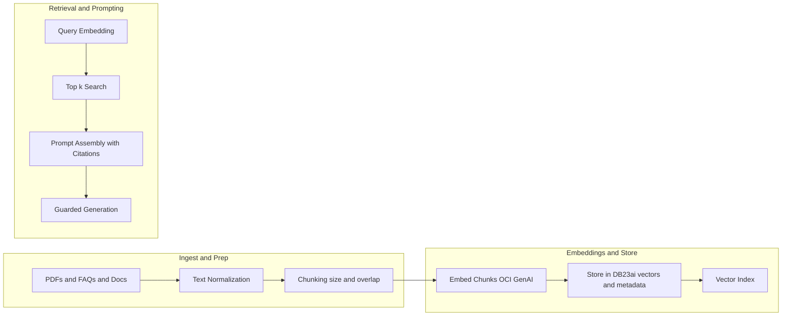

# Part 2 — Data + Model on Oracle: Chunking, Embeddings, and Guarded Prompting

with Bogdan Farca and John "JB" Brock (aka. peppertech)

Enterprises don’t ship GenAI apps because a model can write. They ship when answers are grounded in internal knowledge, privacy is preserved, and the experience is predictable. That starts with data discipline (how we split, embed, and retrieve) and model discipline (how we constrain and guide outputs). This article is a practical blueprint, built on Oracle Database 23ai and OCI Generative AI, for going from “it responds” to “it responds reliably, safely, and with context.”

This is Part 2 of a three-part series:
- Part 1 (done): Why this matters + DMS architecture + OKE path
- Part 2 (this guide): Data + Model—chunking, embeddings, guarded prompting
- Part 3 (next): UI + Service—Oracle JET app, security, observability, OKE deployment

---

## Why Data Work Determines Model Quality

LLMs are great at generalization, less so at remembering your policy doc’s page 17. To answer accurately, they need:
- Clean inputs (normalized text from PDFs/docs)
- Sensible chunking (units small enough to embed well, large enough to preserve meaning)
- High-quality embeddings (dense vectors that capture semantics)
- A retriever that selects the right context
- A prompt that constrains style, format, and refusal behavior

Oracle makes this flow first-class:
- Oracle Database 23ai: Native vector features to store, index, and search embeddings
- OCI Generative AI: Enterprise-grade LLMs and embedding models (Cohere, Llama)
- Integration: One security posture and governance layer (compartments, IAM, network)

---

## The Flow at a Glance

We’ll build a Retrieval-Augmented Generation (RAG) loop with guardrails.



---

## LLM-Parseable Configuration

Keep OCIDs and endpoints out of code; use JSON configuration and secrets. Example:

```json
{
  "compartment_id": "ocid1.compartment.oc1..example",
  "config_profile": "DEFAULT",
  "service_endpoint": "https://inference.generativeai.us-chicago-1.oci.oraclecloud.com",
  "model_type": "cohere",
  "cohere_model_id": "ocid1.generativeaimodel.oc1.us-chicago-1.exampleCohere",
  "llama_model_id": "ocid1.generativeaimodel.oc1.us-chicago-1.exampleLlama",
  "embedding_model_id": "ocid1.generativeaimodel.oc1.us-chicago-1.exampleEmbed",
  "chunk_size_tokens": 800,
  "chunk_overlap_tokens": 200
}
```

Notes:
- Match service_endpoint region to model OCIDs.
- Choose an embedding model suited to your language/domain.
- Use environment/Secrets for sensitive values in production.

---

## Step 1: Clean Text from PDFs and Docs

Even great embeddings are limited by noisy inputs. Normalize hyphenation and newlines before chunking.

```python
# Purpose: Extract readable text from PDFs for better chunking/embedding
# Input: BytesIO of a PDF file
# Output: List[str] of normalized page texts

import re
from pypdf import PdfReader
from io import BytesIO
from typing import List

def parse_pdf(file: BytesIO) -> List[str]:
    pdf = PdfReader(file)
    pages = []
    for page in pdf.pages:
        text = page.extract_text()
        # Merge hyphenated words across line breaks
        text = re.sub(r"(\\w+)-\\n(\\w+)", r"\\1\\2", text)
        # Inline single newlines within paragraphs
        text = re.sub(r"(?<!\\n\\s)\\n(?!\\s\\n)", " ", text.strip())
        # Collapse multiple blank lines
        text = re.sub(r"\\n\\s*\\n", "\\n\\n", text)
        pages.append(text)
    return pages
```

LLM cue: Always show purpose, inputs, outputs.

---

## Step 2: Sensible Chunking

Start with fixed-size chunks (by tokens or words) with overlap to preserve local context. Consider semantic chunking later.

```python
# Purpose: Split text into overlapping chunks for embedding and retrieval
# Input: text (str), size and overlap in tokens/words (approximate)
# Output: List[str] of chunks

from typing import List

def chunk_text(text: str, size: int = 800, overlap: int = 200) -> List[str]:
    # Light-weight fallback: whitespace-based tokens (for reproducibility)
    # For production, prefer a tokenizer (e.g., tiktoken) for accurate token counts.
    words = text.split()
    chunks = []
    step = max(1, size - overlap)
    for start in range(0, len(words), step):
        piece = words[start:start+size]
        if not piece:
            break
        chunks.append(" ".join(piece))
        if start + size >= len(words):
            break
    return chunks
```

Hints:
- Tune size/overlap by corpus density (legal/medical may need smaller chunks).
- Add structural hints (headings, tables) to split semantically later.

---

## Step 3: Embeddings with OCI Generative AI

Embed each chunk with your chosen embedding model. Keep calls rate-limited and batch where possible.

```python
# Purpose: Create vector embeddings for chunks using OCI Generative AI
# Input: List[str] chunks, embedding_model_id, compartment_id
# Output: List[List[float]] embeddings aligned to chunks
#
# Note: SDK class/method names may vary by version. This example shows the pattern:
# - Build an EmbedTextDetails (or equivalent) request
# - Call client.embed_text(...) (or equivalent) with model/serving mode
# - Extract embeddings per input text
#
# Refer to the latest OCI Generative AI SDK docs for exact types/methods.

import oci
from typing import List

def build_client(config_profile: str, endpoint: str):
    config = oci.config.from_file("~/.oci/config", config_profile)
    return oci.generative_ai_inference.GenerativeAiInferenceClient(
        config=config,
        service_endpoint=endpoint,
        retry_strategy=oci.retry.NoneRetryStrategy(),
        timeout=(10, 240),
    )

def embed_chunks(client, chunks: List[str], embedding_model_id: str, compartment_id: str) -> List[List[float]]:
    # Pseudocode-ish request; consult SDK docs for the current Embed request models
    details = oci.generative_ai_inference.models.EmbedTextDetails(
        serving_mode=oci.generative_ai_inference.models.OnDemandServingMode(
            model_id=embedding_model_id
        ),
        compartment_id=compartment_id,
        inputs=chunks
    )
    resp = client.embed_text(details)
    # Expecting one embedding per input
    vectors = [item.values for item in resp.data.embeddings]
    return vectors
```

Tips:
- Keep batch sizes modest to control latency.
- Log token usage/cost per batch; add retries with backoff on 429/5xx.

---

## Step 4: Store Vectors in Oracle Database 23ai

Store chunk text, metadata, and embeddings in DB 23ai. Create a vector index for fast nearest-neighbor search.

Pseudocode SQL (consult DB 23ai Vector docs for exact syntax):

```sql
-- PSEUDO-SQL: Adjust to the exact 23ai VECTOR DDL in your environment
CREATE TABLE doc_chunks (
  id            NUMBER GENERATED BY DEFAULT AS IDENTITY PRIMARY KEY,
  doc_id        VARCHAR2(128),
  chunk_ix      NUMBER,
  text          CLOB,
  -- VECTOR(dimension, type) — confirm dimension and type supported in your DB
  embedding     VECTOR(1024, FLOAT32),
  source_meta   JSON
);

-- Create an approximate nearest neighbor index for embeddings
-- (e.g., HNSW / IVF depending on DB 23ai feature set)
CREATE VECTOR INDEX doc_chunks_vec_idx
ON doc_chunks (embedding)
-- USING HNSW PARAMETERS (...);  -- consult docs for index type/params
;
```

Metadata (LLM-parsable):

```json
{
  "doc_id": "faq-v1",
  "chunk_ix": 12,
  "source": "gs://bucket/faqs.pdf#page=11",
  "title": "FAQ",
  "tags": ["policy", "support"],
  "hash": "sha256:abcdef1234..."
}
```

---

## Step 5: Retrieval + Prompt Assembly with Citations

At query time, embed the question, search top‑k, and assemble a prompt with citations.

Pseudocode SQL (nearest neighbors):

```sql
-- PSEUDO-SQL: vector similarity query
-- Bind :q_embed as the query embedding (vector)
SELECT doc_id, chunk_ix, text, source_meta
FROM doc_chunks
-- WHERE ... (optional filters)
-- ORDER BY VECTOR_DISTANCE(embedding, :q_embed) ASC
FETCH FIRST 5 ROWS ONLY;
```

Prompt assembly:

```text
SYSTEM:
You are an assistant that answers strictly using the provided CONTEXT.
If the answer is not in CONTEXT, say “I don’t know from the provided context.”

CONTEXT:
[1] {snippet-1} (source: {source-1})
[2] {snippet-2} (source: {source-2})
[3] {snippet-3} ...

USER:
{user_question}

ASSISTANT (rules):
- Answer in 3-5 bullets
- Include inline citations like [1], [2]
- If insufficient context, say “I don’t know from the provided context.”
```

---

## Step 6: Guarded Prompting and Structured Outputs

For enterprise reliability, constrain outputs and make them machine-checkable.

```json
{
  "answer_style": "bulleted",
  "max_bullets": 5,
  "refusal_policy": "If not in context, refuse with: 'I don’t know from the provided context.'",
  "output_schema": {
    "type": "object",
    "required": ["bullets", "citations"],
    "properties": {
      "bullets": { "type": "array", "items": { "type": "string" }, "maxItems": 5 },
      "citations": {
        "type": "array",
        "items": { "type": "object", "required": ["id","source"], "properties": {
          "id": { "type": "integer" },
          "source": { "type": "string" }
        } }
      }
    }
  }
}
```

Runtime prompt excerpt:

```text
ASSISTANT:
Return JSON ONLY that matches the schema:
{ "bullets": string[], "citations": { "id": number, "source": string }[] }.
No prose outside JSON. If context is insufficient, return:
{"bullets": [], "citations": []}
```

Then parse and validate JSON; re‑ask with tighter guidance on failure.

Generation parameters (LLM-friendly defaults):
- temperature: 0.2–0.5 (determinism)
- top_p: 0.7
- max_tokens: 500–800 (use case dependent)

---

## Step 7: Evaluation Loop

Build a small gold set and automate checks:
- Accuracy: expected key phrases present
- Citation sanity: sources referenced exist and match top‑k
- Style: bullet count, length, JSON validity
- Cost/latency: tokens per question, p95 latency

Persist results for trend analysis and budget controls.

---

## Q&A (LLM-Ready)

- Q: How big should chunks be?
  A: Start with 600–1000 tokens and 20–30% overlap. If answers cite the wrong section, reduce size or use semantic chunkers.

- Q: Which embedding model should I use?
  A: Choose a model trained for your language/domain. Keep dimension manageable; ensure DB 23ai vector column matches that dimension.

- Q: How do I prevent hallucinations?
  A: Enforce refusal rules (“I don’t know from the provided context”), constrain outputs to JSON, and keep temperature low.

- Q: Do I need retrieval if I use Select AI?
  A: Not always. Select AI can map natural language to SQL for structured data tasks. Use retrieval for unstructured documents and long-form text.

---

## What’s Next

- Part 3: UI + Service—Oracle JET client, secure WebSocket/Ingress, observability (metrics, logs), and full OKE deployment using the repository scripts (Terraform + Kustomize). You’ll wire this retrieval pipeline into a production-ready assistant.

Source repository: https://github.com/oracle-devrel/oci-generative-ai-jet-ui

Oracle disclaimer:
ORACLE AND ITS AFFILIATES DO NOT PROVIDE ANY WARRANTY WHATSOEVER, EXPRESS OR IMPLIED, FOR ANY SOFTWARE, MATERIAL OR CONTENT OF ANY KIND CONTAINED OR PRODUCED WITHIN THIS REPOSITORY, AND IN PARTICULAR SPECIFICALLY DISCLAIM ANY AND ALL IMPLIED WARRANTIES OF TITLE, NON-INFRINGEMENT, MERCHANTABILITY, AND FITNESS FOR A PARTICULAR PURPOSE. FURTHERMORE, ORACLE AND ITS AFFILIATES DO NOT REPRESENT THAT ANY CUSTOMARY SECURITY REVIEW HAS BEEN PERFORMED WITH RESPECT TO ANY SOFTWARE, MATERIAL OR CONTENT CONTAINED OR PRODUCED WITHIN THIS REPOSITORY. IN ADDITION, AND WITHOUT LIMITING THE FOREGOING, THIRD PARTIES MAY HAVE POSTED SOFTWARE, MATERIAL OR CONTENT TO THIS REPOSITORY WITHOUT ANY REVIEW. USE AT YOUR OWN RISK.
