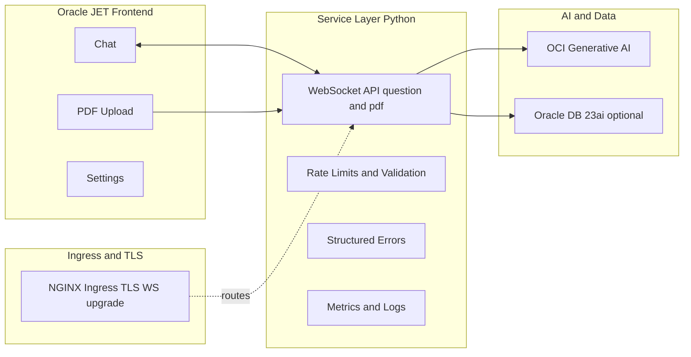

# Part 3 — UI + Service on Oracle: JET, Secure WebSockets, Observability, and OKE (Hands‑On Lab)

Learning goals → Prerequisites → Concepts → Step‑by‑step labs → Practice challenges → Self‑check

This lab ships your assistant with a production‑minded UI + Service stack on Oracle:
- Wire Oracle JET to a disciplined WebSocket API
- Enforce structured errors and input limits
- Add metrics/logs for observability
- Secure with TLS/CORS and deploy via OKE using Terraform + Kustomize

Series context:
- Part 1: DMS architecture + OKE path + JET overview
- Part 2: Data + Model (chunking, embeddings, guarded prompting)
- Part 3 (this lab): UI + Service (JET, security, observability, OKE)

---

## Learning Objectives

By the end of this lab, you will be able to:
- Connect a JET frontend to a WebSocket gateway (dev: ws://, prod: wss://)
- Implement structured JSON error envelopes in the service
- Add Prometheus metrics and structured logs to the service
- Configure Ingress for TLS, WebSocket upgrades, and payload limits
- Deploy to OKE using the repository scripts and verify end‑to‑end

---

## Prerequisites

- OCI tenancy with Generative AI access (same region for models and OKE)
- Optional: Autonomous Database if you store interactions or vectors
- Cloud Shell (recommended) or a workstation with:
  - Node.js 18+, Terraform, kubectl, Docker
- Cloned repository:
  ```bash
  git clone https://github.com/oracle-devrel/oci-generative-ai-jet-ui
  cd oci-generative-ai-jet-ui
  ```
- Example configuration (edit to your tenancy/region):
  ```json
  {
    "compartment_id": "ocid1.compartment.oc1..example",
    "config_profile": "DEFAULT",
    "service_endpoint": "https://inference.generativeai.us-chicago-1.oci.oraclecloud.com"
  }
  ```
- Optional for TLS: domain + certificate for Ingress

---

## Concept: UI ↔ Service Separation



Why this matters:
- UI focuses on UX; service enforces policy, guardrails, and cost control
- Clean protocol (msgType + data) simplifies testing and evolution
- Observability and security live server‑side where you control them

---

## Lab 1: Wire JET to the WebSocket Gateway

Objective: Connect JET to the service with a minimal, explicit protocol.

1) Start the JET app locally:
```bash
cd app
npm install
npx ojet serve
```

2) WebSocket client (TypeScript sketch):
```ts
// app/src/components/content/index.tsx (sketch)
const gateway = (location.protocol === "https:")
  ? `wss://${window.location.hostname}/ws`   // prod behind Ingress
  : `ws://${window.location.hostname}:1986`; // dev

const ws = new WebSocket(gateway);

export function ask(question: string) {
  ws.send(JSON.stringify({ msgType: "question", data: question }));
}

export function summarizePdf(file: File, guidance: string) {
  const reader = new FileReader();
  reader.onload = () => {
    const meta = JSON.stringify({ msgType: "pdf", msgPrompt: guidance });
    const enc = new TextEncoder();
    const head = enc.encode(meta);
    const delim = enc.encode("\r\n\r\n");
    const pdf = new Uint8Array(reader.result as ArrayBuffer);
    const out = new Uint8Array(head.length + delim.length + pdf.length);
    out.set(head, 0);
    out.set(delim, head.length);
    out.set(pdf, head.length + delim.length);
    ws.send(out);
  };
  reader.readAsArrayBuffer(file);
}

ws.onmessage = (ev) => {
  const msg = JSON.parse(ev.data);
  if (msg.msgType === "answer")  {/* render chat */}
  if (msg.msgType === "summary") {/* render summary */}
  if (msg.msgType === "error")   {/* render error */}
};
```

Try it yourself:
- Send a question; inspect the network frames in DevTools
- Upload a small PDF and verify a summary arrives

---

## Lab 2: Structured Errors and Input Limits

Objective: Return LLM‑parseable error envelopes and bound input sizes.

Server sketch (Python):
```python
# Purpose: WS handler with structured errors & prompt bound
# Output: {"msgType":"error","data":{"code","detail"}}

import asyncio, json, websockets
from io import BytesIO

MAX_PROMPT = 2000

def error(code: str, detail: str):
    return json.dumps({"msgType":"error","data":{"code":code,"detail":detail}})

async def handle_ws(websocket):
    try:
        while True:
            pkt = await websocket.recv()
            if isinstance(pkt, str):
                try:
                    msg = json.loads(pkt)
                    if msg.get("msgType") != "question":
                        raise ValueError("Unsupported msgType")
                    prompt = (msg.get("data") or "")
                    if not prompt:
                        raise ValueError("Empty prompt")
                    if len(prompt) > MAX_PROMPT:
                        raise ValueError("Max prompt length exceeded")
                    answer = await generate_guarded_answer(prompt)  # see Part 2
                    await websocket.send(json.dumps({"msgType":"answer","data":answer}))
                except Exception as e:
                    await websocket.send(error("INVALID_INPUT", str(e)))
            else:
                try:
                    meta, pdf_bytes = pkt.split(b"\r\n\r\n", 1)
                    prompt = json.loads(meta.decode("utf-8")).get("msgPrompt","")
                    summary = await summarize_pdf(BytesIO(pdf_bytes), prompt)
                    await websocket.send(json.dumps({"msgType":"summary","data":summary}))
                except Exception as e:
                    await websocket.send(error("BINARY_PARSE_FAILED", str(e)))
    except websockets.ConnectionClosed:
        pass
```

Try it yourself:
- Send an oversized prompt and confirm you receive INVALID_INPUT
- Show user‑friendly error toasts in the UI when msgType === "error"

---

## Lab 3: Observability — Prometheus Metrics and JSON Logs

Objective: Expose metrics and structured logs for dashboards and alerts.

1) Metrics sketch:
```python
from prometheus_client import Counter, Histogram, start_http_server
import time

REQS = Counter("genai_requests_total", "WS requests", ["route","outcome"])
LAT  = Histogram("genai_latency_seconds", "Latency", ["route"],
                 buckets=[0.1,0.25,0.5,1,2,5,10])

def record(route: str, func, *args, **kwargs):
    t0 = time.time()
    try:
        out = func(*args, **kwargs)
        LAT.labels(route).observe(time.time() - t0)
        REQS.labels(route,"ok").inc()
        return out
    except Exception:
        LAT.labels(route).observe(time.time() - t0)
        REQS.labels(route,"err").inc()
        raise

if __name__ == "__main__":
    start_http_server(9102)  # exposes /metrics
    # start WS server...
```

2) Logs (JSON lines):
```python
import json, sys, time

def log(event: dict):
    event["ts"] = int(time.time()*1000)
    sys.stdout.write(json.dumps(event) + "\n")
```

Kubernetes scrape annotations (Deployment pod template):
```yaml
metadata:
  annotations:
    prometheus.io/scrape: "true"
    prometheus.io/path: "/metrics"
    prometheus.io/port: "9102"
```

Try it yourself:
- Curl the metrics endpoint locally and confirm counters/histograms
- Emit a JSON log per request with request_id, route, latency_ms, model_id

---

## Lab 4: Security — TLS, CORS, Body Size, and WS Upgrade

Objective: Configure Ingress for WSS and large PDFs, and set strict origins.

1) Ingress hints (NGINX):
```yaml
metadata:
  annotations:
    nginx.ingress.kubernetes.io/proxy-read-timeout: "300"
    nginx.ingress.kubernetes.io/proxy-send-timeout: "300"
    nginx.ingress.kubernetes.io/websocket-services: "backend"
    nginx.ingress.kubernetes.io/proxy-body-size: "200m"  # large PDFs
spec:
  tls:
    - hosts: [yourapp.example.com]
      secretName: your-tls-secret
  rules:
    - host: yourapp.example.com
      http:
        paths:
          - path: /ws
            pathType: Prefix
            backend: { service: { name: backend, port: { number: 1986 } } }
          - path: /
            pathType: Prefix
            backend: { service: { name: web, port: { number: 80 } } }
```

2) CORS for HTTP routes (if any):
- Return Access‑Control‑Allow‑Origin for your domain only (no "*")
- Prefer same‑origin serving for the JET bundle in production

Try it yourself:
- Switch UI gateway to wss://yourapp.example.com/ws and verify successful connection
- Upload a large PDF; tune proxy‑body‑size and server max_size if needed

---

## Lab 5: OKE Deployment (Repository‑Aligned)

Objective: Deploy end‑to‑end using the included scripts and manifests.

1) Prepare environment:
```bash
nvm install 18 && nvm use 18
cd scripts && npm install && cd ..
```

2) Capture environment and generate tfvars:
```bash
npx zx scripts/setenv.mjs     # writes genai.json
npx zx scripts/tfvars.mjs     # writes deploy/terraform/terraform.tfvars
```

3) Provision infrastructure:
```bash
cd deploy/terraform
terraform init
terraform apply --auto-approve
cd ../..
```

4) Build/push images; generate manifests:
```bash
npx zx scripts/release.mjs
npx zx scripts/kustom.mjs
```

5) Deploy to OKE:
```bash
export KUBECONFIG="$(pwd)/deploy/terraform/generated/kubeconfig"
kubectl cluster-info
kubectl apply -k deploy/k8s/overlays/prod
```

6) Verify and get endpoint:
```bash
kubectl get deploy -n backend
# Expect READY 1/1 for backend, web, and ingress controllers

# Retrieve Load Balancer IP
echo $(kubectl get service \
  -n backend \
  -o jsonpath='{.items[?(@.spec.type=="LoadBalancer")].status.loadBalancer.ingress[0].ip}')
```

7) Build production JET bundle (optional):
```bash
cd app
npm install
npx ojet build web
cd ..
```

Try it yourself:
- Open the Load Balancer IP; chat and summarize a PDF
- If using ADB, run:
```sql
SELECT * FROM interactions;
```

---

## Troubleshooting (LLM‑Ready Q&A)

- Q: WebSocket fails on HTTPS site.  
  A: Use wss:// and terminate TLS at Ingress; browsers block ws:// on HTTPS pages.

- Q: 4xx from Generative AI.  
  A: Align region across service_endpoint, model OCIDs, and OKE cluster; confirm IAM policy allows Generative AI in compartment.

- Q: Large PDF upload fails.  
  A: Increase nginx.ingress.kubernetes.io/proxy-body-size and the server max_size in the WS server.

- Q: JSON output invalid from model.  
  A: Use guarded JSON‑only schema from Part 2; lower temperature and tokens; validate and re‑ask on failure.

---

## Practice Challenges

1) Inference Controls:
- Add temperature/max_tokens controls in the UI; persist per session
- Validate ranges server‑side; enforce defaults

2) Rate Limits:
- Implement per‑user or per‑IP rate limiting
- Return structured errors on 429 and retry hints to UI

3) Dashboards:
- Build a Grafana dashboard: p95 latency, error rate, token usage per feature
- Alert on spikes or SLO violations

4) Security Posture:
- Restrict egress to OCI Generative AI domains
- Add a CSP header when serving the JET bundle

5) RAG Integration:
- Wire the retrieval flow from Part 2; prepend top‑k contexts with citations
- Add a “Ground with internal docs” UI toggle

---

## Self‑Check

- Can you explain why WSS is required behind HTTPS and how Ingress terminates TLS?
- Can you show a structured error payload and how the UI handles it?
- Can you expose Prometheus metrics and view them via kubectl port‑forward?
- Can you deploy to OKE with the provided scripts and retrieve the Load Balancer IP?
- Can you tune proxy‑body‑size and server max_size to accept large PDFs?

---

## Resources

- Source code: https://github.com/oracle-devrel/oci-generative-ai-jet-ui
- Oracle Database 23ai (vectors, Select AI): https://www.oracle.com/database
- OCI Generative AI: https://www.oracle.com/artificial-intelligence/generative-ai
- Oracle JET: https://www.oracle.com/webfolder/technetwork/jet/index.html

---

## Oracle Disclaimer

ORACLE AND ITS AFFILIATES DO NOT PROVIDE ANY WARRANTY WHATSOEVER, EXPRESS OR IMPLIED, FOR ANY SOFTWARE, MATERIAL OR CONTENT OF ANY KIND CONTAINED OR PRODUCED WITHIN THIS REPOSITORY, AND IN PARTICULAR SPECIFICALLY DISCLAIM ANY AND ALL IMPLIED WARRANTIES OF TITLE, NON-INFRINGEMENT, MERCHANTABILITY, AND FITNESS FOR A PARTICULAR PURPOSE. FURTHERMORE, ORACLE AND ITS AFFILIATES DO NOT REPRESENT THAT ANY CUSTOMARY SECURITY REVIEW HAS BEEN PERFORMED WITH RESPECT TO ANY SOFTWARE, MATERIAL OR CONTENT CONTAINED OR PRODUCED WITHIN THIS REPOSITORY. IN ADDITION, AND WITHOUT LIMITING THE FOREGOING, THIRD PARTIES MAY HAVE POSTED SOFTWARE, MATERIAL OR CONTENT TO THIS REPOSITORY WITHOUT ANY REVIEW. USE AT YOUR OWN RISK.
