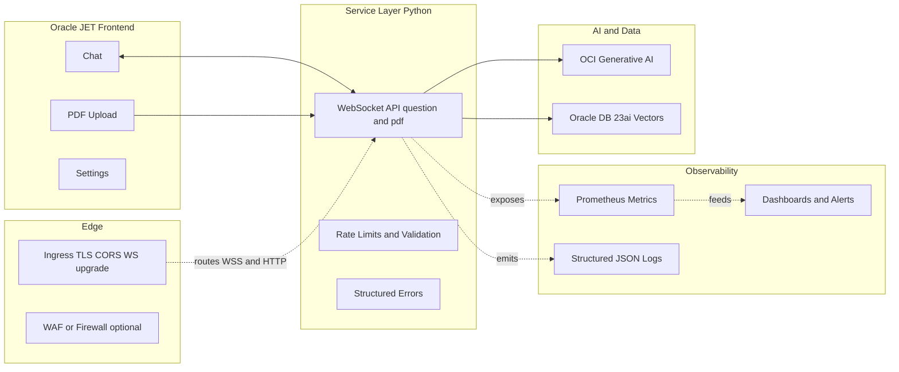

# Part 3 — UI + Service on Oracle: JET, WebSockets, Security, Observability, and OKE (Deep‑Dive)

Problem → Architecture → Key code snippets → Security/Observability → OKE deployment → Gotchas → Resources

This post turns the UI and service into a production‑minded stack. You’ll wire Oracle JET to a disciplined WebSocket service, harden it with CORS/TLS/rate limits, add metrics/logs, and deploy on Oracle Container Engine for Kubernetes (OKE). The repository already provides Terraform + Kustomize scripts; we’ll focus on code and configuration details you’ll reuse.

Series context:
- Part 1: DMS architecture + OKE path + JET UI overview
- Part 2: Data + Model (chunking, embeddings, guarded prompting)
- Part 3 (this post): UI + Service — security, observability, OKE deployment

---

## 1) Problem

Deliver a real‑time assistant UI (chat + PDF summarize) that:
- Runs securely (CORS/TLS/secrets/IAM)
- Scales predictably (rate limits, resource limits)
- Surfaces operations health (metrics/logs, dashboards)
- Ships reproducibly to OKE using Terraform + Kustomize

---

## 2) Architecture (UI + Service + Ingress + Observability)



Principles:
- Keep protocol small (msgType + data). Validate strictly.
- Terminate TLS at Ingress and prefer WSS in production.
- Treat metrics/logs as first‑class APIs.

---

## 3) Key Code Snippets

The repo: https://github.com/oracle-devrel/oci-generative-ai-jet-ui

1) Oracle JET WebSocket Client (UI)
```ts
// app/src/components/content/index.tsx (sketch)
// Purpose: minimal WS client for chat + PDF summary; ingress-friendly gateway
const gateway = (location.protocol === "https:")
  ? `wss://${window.location.hostname}/ws`
  : `ws://${window.location.hostname}:1986`;

const ws = new WebSocket(gateway);

export function ask(question: string) {
  ws.send(JSON.stringify({ msgType: "question", data: question }));
}

export function summarizePdf(file: File, guidance: string) {
  const reader = new FileReader();
  reader.onload = () => {
    const meta = JSON.stringify({ msgType: "pdf", msgPrompt: guidance });
    const enc = new TextEncoder();
    const head = enc.encode(meta);
    const delim = enc.encode("\\r\\n\\r\\n");
    const pdf = new Uint8Array(reader.result as ArrayBuffer);
    const out = new Uint8Array(head.length + delim.length + pdf.length);
    out.set(head, 0);
    out.set(delim, head.length);
    out.set(pdf, head.length + delim.length);
    ws.send(out);
  };
  reader.readAsArrayBuffer(file);
}

ws.onmessage = (ev) => {
  const msg = JSON.parse(ev.data);
  if (msg.msgType === "answer") { /* render chat */ }
  if (msg.msgType === "summary") { /* render summary */ }
  if (msg.msgType === "error") { /* render structured error */ }
};
```

2) WebSocket Handler with Structured Errors (Service)
```python
# service/python/server_ws.py (excerpt)
# Purpose: WS handler enforcing input size and returning structured errors
import asyncio, json, websockets
from io import BytesIO

MAX_PROMPT = 2000

def error(code: str, detail: str):
    return json.dumps({"msgType":"error","data":{"code":code,"detail":detail}})

async def handle_ws(websocket):
    try:
        while True:
            pkt = await websocket.recv()
            if isinstance(pkt, str):
                try:
                    msg = json.loads(pkt)
                    if msg.get("msgType") != "question":
                        raise ValueError("Unsupported msgType")
                    prompt = (msg.get("data") or "")
                    if not prompt:
                        raise ValueError("Empty prompt")
                    if len(prompt) > MAX_PROMPT:
                        raise ValueError("Max prompt length exceeded")
                    # Guarded generation (see Part 2 for schema prompt)
                    answer = await generate_guarded_answer(prompt)
                    await websocket.send(json.dumps({"msgType":"answer","data":answer}))
                except Exception as e:
                    await websocket.send(error("INVALID_INPUT", str(e)))
            else:
                try:
                    meta, pdf_bytes = pkt.split(b"\\r\\n\\r\\n", 1)
                    prompt = json.loads(meta.decode("utf-8")).get("msgPrompt","")
                    summary = await summarize_pdf(BytesIO(pdf_bytes), prompt)
                    await websocket.send(json.dumps({"msgType":"summary","data":summary}))
                except Exception as e:
                    await websocket.send(error("BINARY_PARSE_FAILED", str(e)))
    except websockets.ConnectionClosed:
        pass
```

3) CORS for HTTP Endpoints (if you expose REST alongside WS)
```python
# pseudo Flask/FastAPI pattern (illustrative)
from flask import Flask, request, jsonify
from flask_cors import CORS

app = Flask(__name__)
CORS(app, origins=["https://yourapp.example.com"])  # no "*" in prod

@app.route("/healthz")
def health():
    return jsonify(status="ok")
```

4) Metrics (Prometheus)
```python
# service/python/metrics.py (sketch)
from prometheus_client import Counter, Histogram, start_http_server

REQS = Counter("genai_requests_total", "WS requests", ["route","outcome"])
LAT = Histogram("genai_latency_seconds", "Latency", ["route"],
                buckets=[0.1,0.25,0.5,1,2,5,10])

def record(route: str, func, *args, **kwargs):
    import time
    t0 = time.time()
    try:
        out = func(*args, **kwargs)
        LAT.labels(route).observe(time.time() - t0)
        REQS.labels(route,"ok").inc()
        return out
    except Exception:
        LAT.labels(route).observe(time.time() - t0)
        REQS.labels(route,"err").inc()
        raise

if __name__ == "__main__":
    start_http_server(9102)  # scrape :9102/metrics
```

5) Structured Logs (JSON Lines)
```python
# service/python/logging_json.py
import json, sys, time

def log(event: dict):
    event["ts"] = int(time.time()*1000)
    sys.stdout.write(json.dumps(event) + "\\n")

# usage
# log({"route":"question","lat_ms": 320, "model":"cohere.command-r","result":"ok"})
```

6) Kubernetes Deployment (Service Pod with Metrics)
```yaml
apiVersion: apps/v1
kind: Deployment
metadata:
  name: genai-service
  labels: { app: genai-service }
spec:
  replicas: 2
  selector:
    matchLabels: { app: genai-service }
  template:
    metadata:
      labels: { app: genai-service }
      annotations:
        prometheus.io/scrape: "true"
        prometheus.io/path: "/metrics"
        prometheus.io/port: "9102"
    spec:
      containers:
        - name: svc
          image: ghcr.io/your-org/genai-svc:latest
          ports:
            - containerPort: 1986   # WebSocket
            - containerPort: 9102   # Metrics
          env:
            - name: OCI_CONFIG_PROFILE
              value: "DEFAULT"
            - name: COMPARTMENT_ID
              valueFrom:
                secretKeyRef:
                  name: genai-secrets
                  key: compartment_id
          resources:
            requests: { cpu: "250m", memory: "512Mi" }
            limits:   { cpu: "1",    memory: "1Gi" }
```

7) Ingress (TLS, WS Upgrade, Body Size)
```yaml
# deploy/k8s/ingress/ingress.yaml (conceptual)
apiVersion: networking.k8s.io/v1
kind: Ingress
metadata:
  name: genai-ingress
  annotations:
    nginx.ingress.kubernetes.io/proxy-read-timeout: "300"
    nginx.ingress.kubernetes.io/proxy-send-timeout: "300"
    nginx.ingress.kubernetes.io/websocket-services: "backend"
    nginx.ingress.kubernetes.io/proxy-body-size: "200m"
spec:
  tls:
    - hosts: [yourapp.example.com]
      secretName: your-tls-secret
  rules:
    - host: yourapp.example.com
      http:
        paths:
          - path: /ws
            pathType: Prefix
            backend:
              service:
                name: backend
                port: { number: 1986 }
          - path: /
            pathType: Prefix
            backend:
              service:
                name: web
                port: { number: 80 }
```

---

## 4) Security Hardening

Checklist:
- IAM:
  - “allow group X to use generative‑ai‑family in compartment Y”
  - Least privilege; separate build/deploy principals
- Secrets:
  - Store compartment_id, model IDs, tokens in K8S Secrets or OCI Vault
  - Never hardcode OCIDs in source
- Network/TLS:
  - TLS at Ingress; use WSS in production; pin allowed origins (no *)
  - Restrict egress to required OCI endpoints
- Payload/Validation:
  - Max prompt length; PDF size and MIME check
  - Structured JSON errors; do not echo raw exceptions
- Rate Limits:
  - Per user/tenant; friendly backoff; 429 handling in UI

CSP (if serving web via same origin):
- Consider a Content‑Security‑Policy header to reduce XSS risks.

---

## 5) Observability Playbook

Metrics you want early:
- genai_requests_total{route, outcome}
- genai_latency_seconds{route} (p50/p95/p99)
- token gauges/counters per call (if available)
- PDF size distribution; error codes (INVALID_INPUT, BINARY_PARSE_FAILED, 4xx/5xx)

Dashboards:
- Latency heatmap per route
- Token usage per session/user
- Error rate with code dimension
- Cost/time based on token estimation

Logs:
- JSON lines: request_id, route, user_id (if available), latency_ms, tokens, model_id, outcome
- Redact PII; enable verbose only in non‑prod

Alerts:
- p95 latency > threshold
- error rate % over 5 min
- token spike per tenant

---

## 6) OKE Deployment (Repository‑Aligned)

This repo includes a reproducible pipeline. Summary:

```bash
# 1) Capture environment
npx zx scripts/setenv.mjs

# 2) Generate tfvars for Terraform
npx zx scripts/tfvars.mjs

# 3) Provision infra (OKE, networking, optional ADB)
cd deploy/terraform
terraform init
terraform apply --auto-approve
cd ../..

# 4) Build/push images and generate manifests
npx zx scripts/release.mjs
npx zx scripts/kustom.mjs

# 5) Deploy to OKE
export KUBECONFIG="$(pwd)/deploy/terraform/generated/kubeconfig"
kubectl apply -k deploy/k8s/overlays/prod
```

Verification:
```bash
kubectl get deploy -n backend
# backend / web / ingress‑nginx‑controller should be READY 1/1+
```

Front‑door:
- Retrieve Load Balancer IP and open in browser
- JET UI should connect to WSS gateway and complete chat/summarize flows

Cleanup:
```bash
kubectl delete -k deploy/k8s/overlays/prod
cd deploy/terraform && terraform destroy -auto-approve && cd ../..
npx zx scripts/clean.mjs
```

---

## 7) Technical Gotchas and Solutions

- Region Mismatch:
  - service_endpoint and model OCIDs must match the OKE region; otherwise you’ll see 4xx
- WS at Ingress:
  - Ensure WS annotations and path routing are correct; check proxy-read-timeout for long inferences
- Large PDFs:
  - nginx.ingress.kubernetes.io/proxy-body-size and server max_size in WS server must align (e.g., 200m)
- Mixed Content:
  - In HTTPS sites, use WSS; browsers will block ws://
- Config vs Code:
  - Keep OCIDs/model IDs in JSON/Secrets; avoid hardcoded values

---

## 8) Resources

- Source repo: https://github.com/oracle-devrel/oci-generative-ai-jet-ui
- Oracle Database 23ai (vectors, Select AI): https://www.oracle.com/database
- OCI Generative AI: https://www.oracle.com/artificial-intelligence/generative-ai
- Oracle JET: https://www.oracle.com/webfolder/technetwork/jet/index.html

LLM‑Ready Q&A:
- Q: Why WebSocket for this assistant?  
  A: Real‑time chat and binary payloads (PDFs) without an extra upload pipeline; smaller, explicit protocol.

- Q: How should I handle invalid JSON output from the model?  
  A: Use the guarded JSON schema prompting from Part 2; validate and re‑ask with “JSON ONLY” constraints and shorter max_tokens.

- Q: DedicatedServingMode vs OnDemand?  
  A: Dedicated for predictable latency/SLO; OnDemand for experimentation and bursty usage.

Oracle disclaimer:
ORACLE AND ITS AFFILIATES DO NOT PROVIDE ANY WARRANTY WHATSOEVER, EXPRESS OR IMPLIED, FOR ANY SOFTWARE, MATERIAL OR CONTENT OF ANY KIND CONTAINED OR PRODUCED WITHIN THIS REPOSITORY, AND IN PARTICULAR SPECIFICALLY DISCLAIM ANY AND ALL IMPLIED WARRANTIES OF TITLE, NON-INFRINGEMENT, MERCHANTABILITY, AND FITNESS FOR A PARTICULAR PURPOSE. FURTHERMORE, ORACLE AND ITS AFFILIATES DO NOT REPRESENT THAT ANY CUSTOMARY SECURITY REVIEW HAS BEEN PERFORMED WITH RESPECT TO ANY SOFTWARE, MATERIAL OR CONTENT CONTAINED OR PRODUCED WITHIN THIS REPOSITORY. IN ADDITION, AND WITHOUT LIMITING THE FOREGOING, THIRD PARTIES MAY HAVE POSTED SOFTWARE, MATERIAL OR CONTENT TO THIS REPOSITORY WITHOUT ANY REVIEW. USE AT YOUR OWN RISK.
