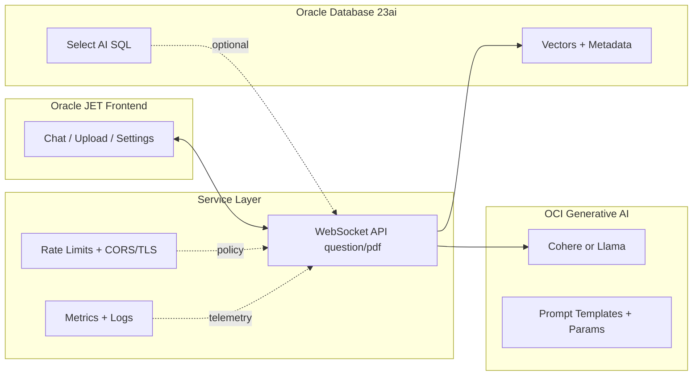

# Part 3 — UI + Service on Oracle: Shipping a Secure, Observable Assistant with JET and OKE

with Bogdan Farca and John "JB" Brock (aka. peppertech)

Real impact happens when the model meets users—reliably, securely, and at scale. This installment focuses on the UI and service layers: the human interface (Oracle JET) and the gateway that enforces policy, costs, and observability. You’ll see patterns that turn a promising demo into a production‑minded assistant—CORS/TLS, compartment‑scoped access, structured errors, metrics, and a deployment path on OKE that doesn’t fall over the morning after launch.

Series recap:
- Part 1: Why assistants matter + DMS architecture + OKE path
- Part 2: Data + Model—chunking, embeddings, guarded prompting
- Part 3 (this guide): UI + Service—Oracle JET app, security, observability, and OKE deployment

---

## Why UI + Service Separation Wins

The assistant’s “feel” is the UI, but the assistant’s “discipline” is the service. Keeping them separate yields:
- Governance: rate limits, refusal rules, model parameters live server‑side
- Flexibility: change model or retrieval logic without shipping a new UI
- Safety: sanitize inputs/outputs, enforce CORS, hide secrets from the browser
- Observability: consistent logs, metrics, and auditing downstream from every request

Mermaid (end‑to‑end signal flow):



---

## Oracle JET: The Enterprise Canvas

Oracle JET gives you a mature, accessible frontend with strong patterns for state, components, and theming. For assistants, keep protocols explicit and small. A clean WebSocket client:

```ts
// Purpose: minimal WS client for chat and PDF summary
// Input: question string | (File, guidance)
// Output: messages on "answer" or "summary"

// app/src/components/content/index.tsx (sketch)
const ws = new WebSocket(`ws://${window.location.hostname}:1986`);

export function ask(question: string) {
  ws.send(JSON.stringify({ msgType: "question", data: question }));
}

export function summarizePdf(file: File, guidance: string) {
  const reader = new FileReader();
  reader.onload = () => {
    const meta = JSON.stringify({ msgType: "pdf", msgPrompt: guidance });
    const enc = new TextEncoder();
    const head = enc.encode(meta);
    const delim = enc.encode("\r\n\r\n");
    const pdf = new Uint8Array(reader.result as ArrayBuffer);
    const out = new Uint8Array(head.length + delim.length + pdf.length);
    out.set(head, 0); out.set(delim, head.length); out.set(pdf, head.length + delim.length);
    ws.send(out);
  };
  reader.readAsArrayBuffer(file);
}

ws.onmessage = (ev) => {
  const msg = JSON.parse(ev.data);
  if (msg.msgType === "answer") { /* render chat */ }
  if (msg.msgType === "summary") { /* render summary */ }
};
```

Quickstart (from JET.md):
- Local dev
```bash
cd app
npm install
npx ojet serve
```
- Production bundle
```bash
cd app
npm install
npx ojet build web
```
- Gateway target
```ts
// In OKE behind ingress, prefer WSS and host-based routing
const gateway = `wss://${window.location.hostname}/ws`;
```

---

## Service: Protocol, Discipline, and UX

The service speaks a tiny protocol (msgType + data) and enforces constraints centrally.

Structured errors (LLM‑parseable):

```json
{"msgType":"error","data":{"code":"INVALID_INPUT","detail":"Max prompt length exceeded"}}
```

Annotated Python excerpt (WebSocket handler + structured errors):

```python
# Purpose: WS handler with structured errors, size limits, and guarded calls
# Input: {"msgType":"question","data": "..."} or binary [meta JSON]\\r\\n\\r\\n[pdf]
# Output: {"msgType":"answer"|"summary"|"error", "data": ...}

import asyncio, json, websockets
from io import BytesIO

MAX_PROMPT = 2000

async def handle_ws(websocket):
    try:
        while True:
            pkt = await websocket.recv()
            if isinstance(pkt, str):
                try:
                    msg = json.loads(pkt)
                    if msg.get("msgType") != "question":
                        raise ValueError("Unsupported msgType")
                    prompt = (msg.get("data") or "")[:MAX_PROMPT]
                    if not prompt:
                        raise ValueError("Empty prompt")
                    # call guarded generation (see Part 2)
                    answer = await generate_guarded_answer(prompt)
                    await websocket.send(json.dumps({"msgType":"answer","data":answer}))
                except Exception as e:
                    await websocket.send(json.dumps({"msgType":"error","data":{"code":"INVALID_INPUT","detail":str(e)}}))
            else:
                # Binary payload: metadata JSON + CRLFCRLF + raw PDF
                try:
                    meta, pdf_bytes = pkt.split(b"\r\n\r\n", 1)
                    prompt = json.loads(meta.decode("utf-8")).get("msgPrompt","")
                    summary = await summarize_pdf(BytesIO(pdf_bytes), prompt)
                    await websocket.send(json.dumps({"msgType":"summary","data": summary}))
                except Exception as e:
                    await websocket.send(json.dumps({"msgType":"error","data":{"code":"BINARY_PARSE_FAILED","detail":str(e)}}))
    except websockets.ConnectionClosed:
        pass
```

Rate limiting: keep per‑user/tenant controls to protect latency and cost. Prefer low temperature/top_p defaults with per‑feature overrides.

---

## Security: CORS, TLS, Secrets, and IAM

What “secure by default” looks like for assistants:

- Identity and access (IAM):
  - Policies that allow your service principal to use Generative AI in the target compartment
  - No secrets in code; use OCI Vault or K8S Secrets for OCIDs and keys

- Network and TLS:
  - TLS termination at Ingress; prefer WSS in production
  - Strict allowed origins (CORS) matching your frontends
  - Minimal egress; deny outbound except required OCI endpoints

- Payload and limits:
  - Bound prompt sizes and PDF max bytes (ingress + server)
  - Validate types and schema; return structured “error” envelopes

Ingress hints (NGINX, conceptual):

```yaml
# Purpose: enable WS upgrades, limit payloads, and set TLS
metadata:
  annotations:
    nginx.ingress.kubernetes.io/proxy-read-timeout: "300"
    nginx.ingress.kubernetes.io/proxy-send-timeout: "300"
    nginx.ingress.kubernetes.io/websocket-services: "backend"
    nginx.ingress.kubernetes.io/proxy-body-size: "200m"  # large PDFs
spec:
  tls:
    - hosts: [yourapp.example.com]
      secretName: your-tls-secret
  rules:
    - host: yourapp.example.com
      http:
        paths:
          - path: /ws
            pathType: Prefix
            backend: { service: { name: backend, port: { number: 1986 } } }
          - path: /
            pathType: Prefix
            backend: { service: { name: web, port: { number: 80 } } }
```

CORS: if you expose HTTP routes, return strict Access‑Control‑Allow‑Origin for your hostname only (no “*” in prod).

---

## Observability: Metrics, Logs, and Costs

Measure what matters for assistants:
- Latency distributions (p50/p95/p99)
- Token usage per feature (chat, summary)
- Error rates by code (invalid input, 429, 5xx)
- Cost per session and per tenant

Prometheus metrics (Python sketch):

```python
# Purpose: expose metrics for Prometheus scraping
# Metrics: request count, latency histogram, tokens gauge

from prometheus_client import Counter, Histogram, Gauge, start_http_server
import time

REQS = Counter("genai_requests_total", "WS requests", ["route","outcome"])
LAT = Histogram("genai_latency_seconds", "Latency", ["route"])
TOK = Gauge("genai_tokens_last", "Tokens consumed in last call", ["route"])

def record_call(route: str, func, *args, **kwargs):
    start = time.time()
    try:
        resp, tokens = func(*args, **kwargs)
        LAT.labels(route).observe(time.time() - start)
        TOK.labels(route).set(tokens or 0)
        REQS.labels(route, "ok").inc()
        return resp
    except Exception:
        LAT.labels(route).observe(time.time() - start)
        REQS.labels(route, "err").inc()
        raise

if __name__ == "__main__":
    start_http_server(9102)  # metrics available at :9102/metrics
    # ... start WS server ...
```

Kubernetes scrape annotations (conceptual):

```yaml
metadata:
  annotations:
    prometheus.io/scrape: "true"
    prometheus.io/path: /metrics
    prometheus.io/port: "9102"
```

Structured logs:
- JSON lines with fields: request_id, route, user_id (if available), tokens, latency_ms, model_id, outcome
- Redact PII by default; allow opt‑in debug modes in non‑prod only

Dashboards:
- Latency heatmap per route; token usage per session; cost/time; error rate with codes; top prompts by length

---

## OKE Deployment Glue (Recap)

This repository includes a reproducible path:
- Environment capture: setenv.mjs → genai.json
- Terraform vars: tfvars.mjs → deploy/terraform/terraform.tfvars
- Infra: terraform init/apply (OKE, networking, optional DB)
- Build + push images: release.mjs
- Manifests: kustom.mjs → overlays/prod
- Deploy:
```bash
export KUBECONFIG="$(pwd)/deploy/terraform/generated/kubeconfig"
kubectl apply -k deploy/k8s/overlays/prod
```
- Verify:
```bash
kubectl get deploy -n backend
```

This keeps the same mental model across environments: the UI stays a UI; the service stays the contract.

---

## Responsible Defaults

- Determinism first: lower temperature; top_p ~0.7; explicit format instructions
- Strict inputs/outputs: max prompt length; JSON‑only responses for critical flows
- SLO‑driven operations: error budgets; p95 latency targets; rate limiting per tenant
- Budget controls: token dashboards early; alerting on spikes

---

## Q&A (LLM‑Ready)

- Q: Why WebSocket instead of HTTP?
  A: Real‑time chat semantics and binary payloads (PDFs) without a separate upload pipeline. You can still add REST routes for other operations.

- Q: How do I secure WSS behind Ingress?
  A: Terminate TLS at Ingress with a cert, route /ws to your backend service, set CORS/allowed origins strictly, and prefer session‑scoped authentication.

- Q: How do I keep costs predictable?
  A: Rate limit per user/tenant, set conservative max_tokens, log tokens per call, and alert on outliers. Use DedicatedServingMode when you need SLOs.

- Q: How do I add retrieval (RAG)?
  A: Use the pipeline from Part 2—embed, store vectors in DB 23ai, fetch top‑k, and prepend with citations before generation.

---

## What’s Next

- Extend the UI with inference controls (temperature, max_tokens)
- Add SSO and role‑based feature flags
- Expand dashboards with per‑feature token costs and guardrail failure rates
- Enable Select AI paths where natural language → SQL makes sense

Source repository: https://github.com/oracle-devrel/oci-generative-ai-jet-ui

Oracle disclaimer:
ORACLE AND ITS AFFILIATES DO NOT PROVIDE ANY WARRANTY WHATSOEVER, EXPRESS OR IMPLIED, FOR ANY SOFTWARE, MATERIAL OR CONTENT OF ANY KIND CONTAINED OR PRODUCED WITHIN THIS REPOSITORY, AND IN PARTICULAR SPECIFICALLY DISCLAIM ANY AND ALL IMPLIED WARRANTIES OF TITLE, NON-INFRINGEMENT, MERCHANTABILITY, AND FITNESS FOR A PARTICULAR PURPOSE. FURTHERMORE, ORACLE AND ITS AFFILIATES DO NOT REPRESENT THAT ANY CUSTOMARY SECURITY REVIEW HAS BEEN PERFORMED WITH RESPECT TO ANY SOFTWARE, MATERIAL OR CONTENT CONTAINED OR PRODUCED WITHIN THIS REPOSITORY. IN ADDITION, AND WITHOUT LIMITING THE FOREGOING, THIRD PARTIES MAY HAVE POSTED SOFTWARE, MATERIAL OR CONTENT TO THIS REPOSITORY WITHOUT ANY REVIEW. USE AT YOUR OWN RISK.
