# How can I create an Oracle Autonomous AI Database for Developers with Terraform?
 
## Introduction

Autonomous AI Database for Developers provides you with low cost instances for developers and others to build and test new Autonomous AI Database applications.
 
Autonomous AI Database for Developers are low-cost, fixed shape databases intended for development and testing uses cases, and are not recommended for production use cases. When you need more compute or storage resources or you want to take advantage of additional Autonomous AI Database features, you can upgrade your Autonomous AI Database for Developers instance to a full paid service instance. 

With Oracle Autonomous AI Database you can work on many tools such as 

* Oracle APEX
* Database Actions
* Graph Studio
* Oracle Machine Learning user interface
* Data Transforms
* Web Access (ORDS)
* MongoDB API 
* Data Lake Accelerator  
* SODA Drivers

Estimated Time: 2 to 5 minutes (max).  
 
### Objectives

In this short sprint, you will:
 
* Create an Oracle Autonomous AI Database for Developers using Oracle Resource Manager Stack. 
* View Oracle Autonomous AI Database and Developer Tools.
* (Optional) Create Oracle Autonomous AI Database for Developers using Oracle Terraform Command Line Interface CLI.
* (Optional) Download Database Wallet, Note Connection Details and Create Database User
* Cleanup the resources created.

    [Demo video on Create Oracle Autonomous AI Database](youtube:V2PETW_F7XI:large) 

### Prerequisites

This lab assumes you have:

* Oracle cloud account and privileges to create & manage Oracle Autonomous AI Database
* Option 1: [Direct ORM deployment link](https://cloud.oracle.com/resourcemanager/stacks/create?zipUrl=https://objectstorage.us-phoenix-1.oraclecloud.com/p/jtfUsV33KtLR937hWybAgrq8qtuQQuAaIw1K_VBThhlUF6Z1HYF0Ai50sQlp06bQ/n/oradbclouducm/b/medical_transcripts/o/Terraform/oracle-lakehouse-devedition-stack.zip)
* Option 2: Download the source code from the following GitHub location or use this [.zip file direct download link](https://objectstorage.us-phoenix-1.oraclecloud.com/p/jtfUsV33KtLR937hWybAgrq8qtuQQuAaIw1K_VBThhlUF6Z1HYF0Ai50sQlp06bQ/n/oradbclouducm/b/medical_transcripts/o/Terraform/oracle-lakehouse-devedition-stack.zip)

    ```
    -- Clone the GitHub Repo
    gh repo clone oracle-devrel/oracle-ai-developer-hub

    or /sourcecode folder 
   
    ```

The **source code** folder has two subfolders 

1. The folder **oracle-lakehouse-devedition-cli** has source code for Terraform command line interface, 
2. The folder **oracle-lakehouse-devedition-stack** has source code Oracle Resource Manager zip file. you can also directly upload **oracle-lakehouse-devedition-stack.zip** file which has preconfigured values.

 
## Create an Oracle Resource Manager Stack
  
1. Create an Autonomous AI Database using the Resource Manager Stack. You can either use the [Direct ORM deployment link](https://cloud.oracle.com/resourcemanager/stacks/create?zipUrl=https://objectstorage.us-phoenix-1.oraclecloud.com/p/jtfUsV33KtLR937hWybAgrq8qtuQQuAaIw1K_VBThhlUF6Z1HYF0Ai50sQlp06bQ/n/oradbclouducm/b/medical_transcripts/o/Terraform/oracle-lakehouse-devedition-stack.zip) or download the source code from the GitHub location mentioned in the Prerequisites section and upload the **oracle-lakehouse-devedition-stack.zip** file.

    > Please Note: Billing for Autonomous AI Database for Developers databases is hourly per instance. please see more info section

2. Log in to https://cloud.oracle.com from the top left navigation select **Developer Services** and **Stacks** under **Resource Manager** 

    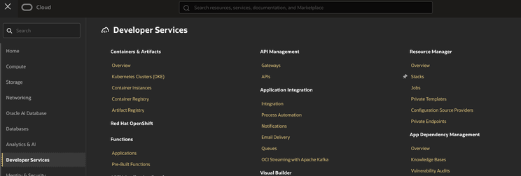
    
3. Click on the **Create Stack** button. Upload the .zip file 

    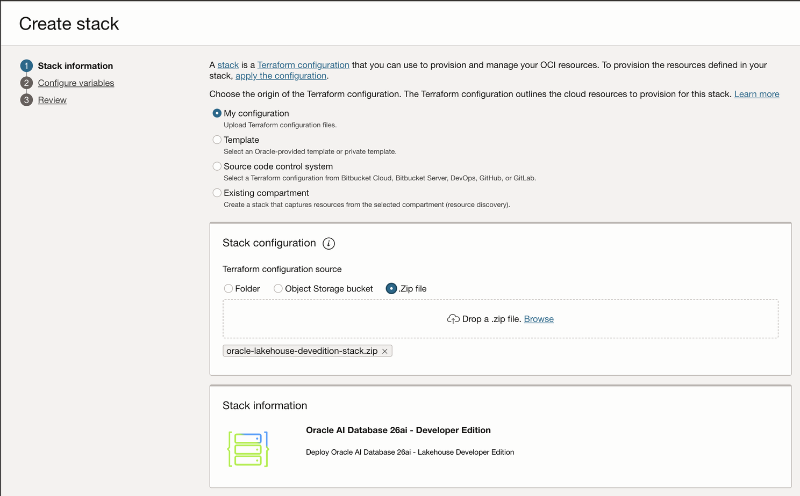

4. Provide the Stack Information. You can also accept the default values provided. Ensure that you select the right compartment, click **Next** button and verify the configuration variables, change the password as you prefer. 
    
5. Ensure that the compartment id is correct, and click **Next** button.

    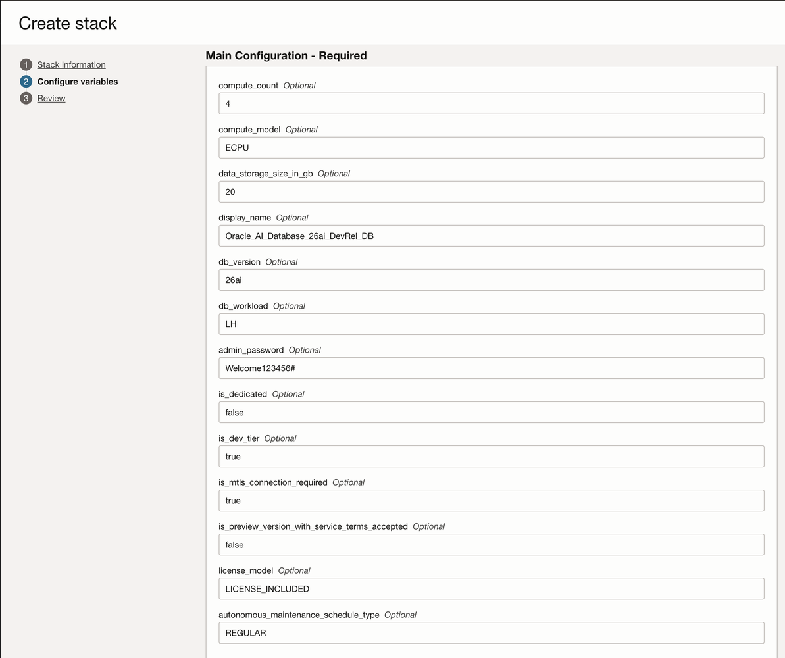

6. Review Stack Information. Check on **Run apply** and **Create** button. 

    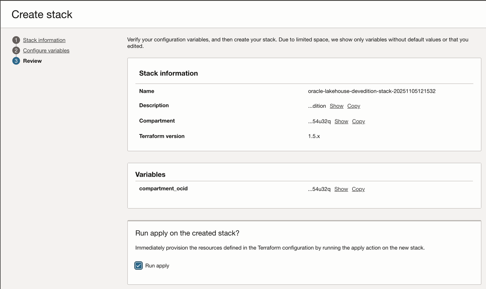
    
    This will create ORM (Oracle Resource Manager) Job. 

    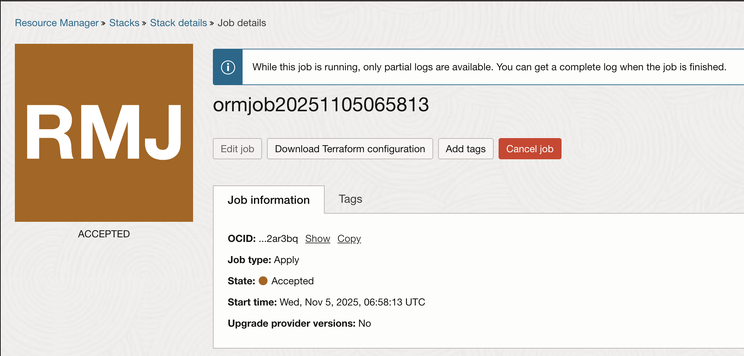

7. View the logs. 

    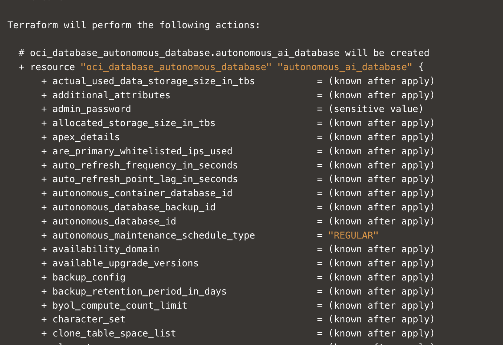

8. Our AI Database is now created in 1 minute and 15 seconds.  

    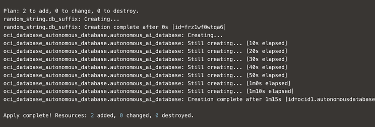 
        
    > Please Note: Sometimes the time to create might slightly change to 2 and a half mins depending on the region and/or internet speed. 
    
    ORM Job Success message

    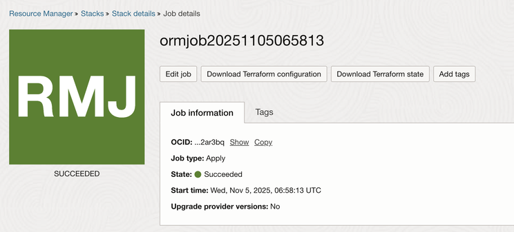
    
## View Oracle Autonomous AI Database and Developer Tools

1.   From the left navigation, select **Oracle AI Database** and **Oracle Autonomous AI Database**
    
    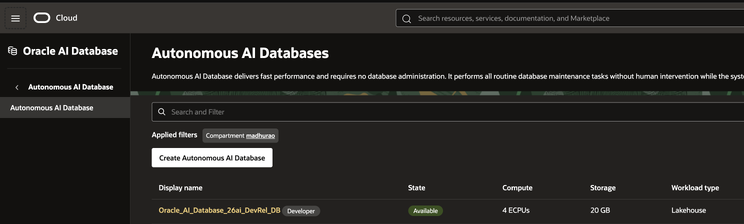
    
    
2. View the newly created Oracle Autonomous AI Database, with the Developer tag on the right side of the name.

    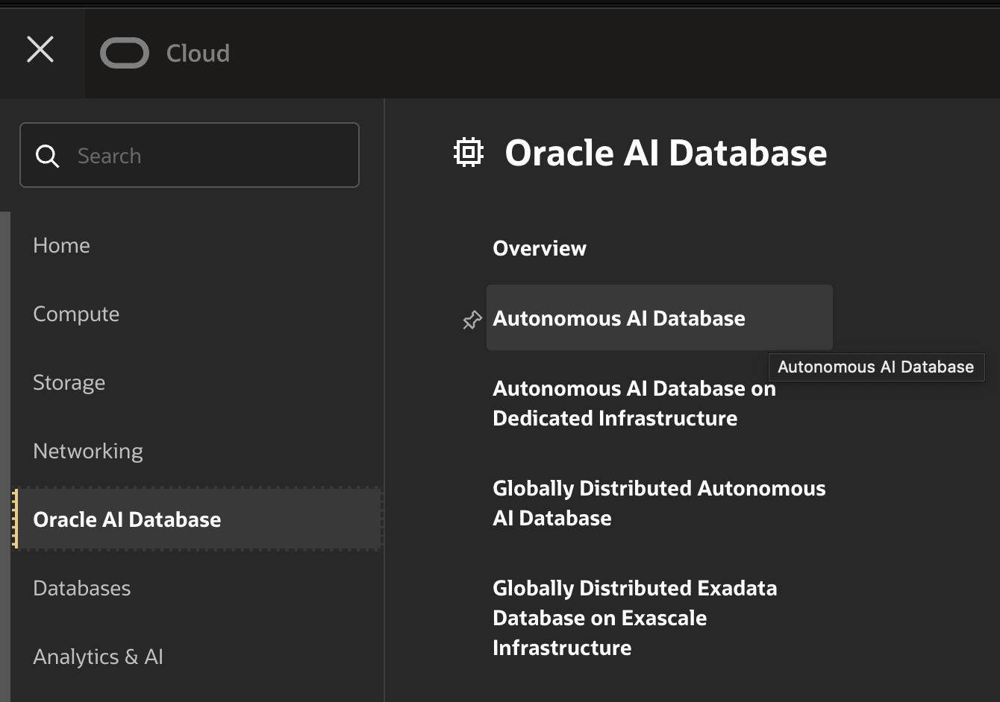
    
    Click on the link, which will show all the enabled features and Tools

    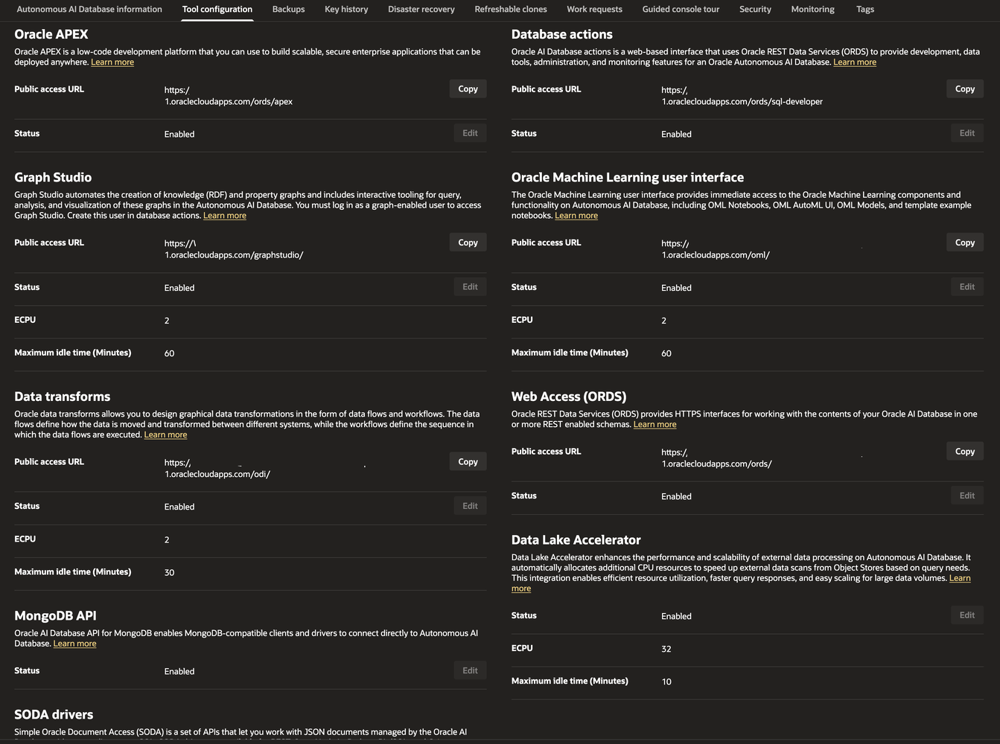 

    * Oracle APEX
    * Database Actions
    * Graph Studio
    * Oracle Machine Learning user interface
    * Data Transforms
    * Web Access (ORDS)
    * MongoDB API 
    * Data Lake Accelerator  
    * SODA Drivers

3. Copy the link and open the required tools.

    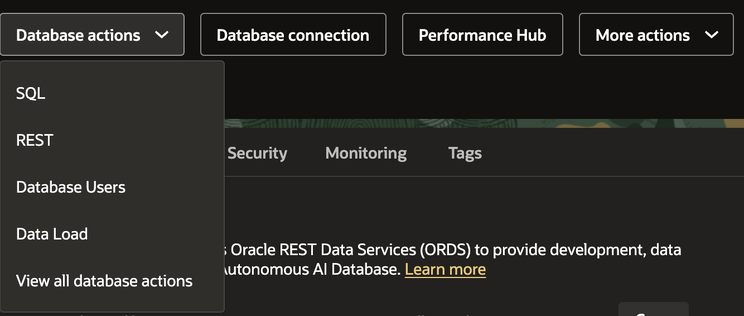
     
    From the database actions menu, select View all database actions or select **SQL**

    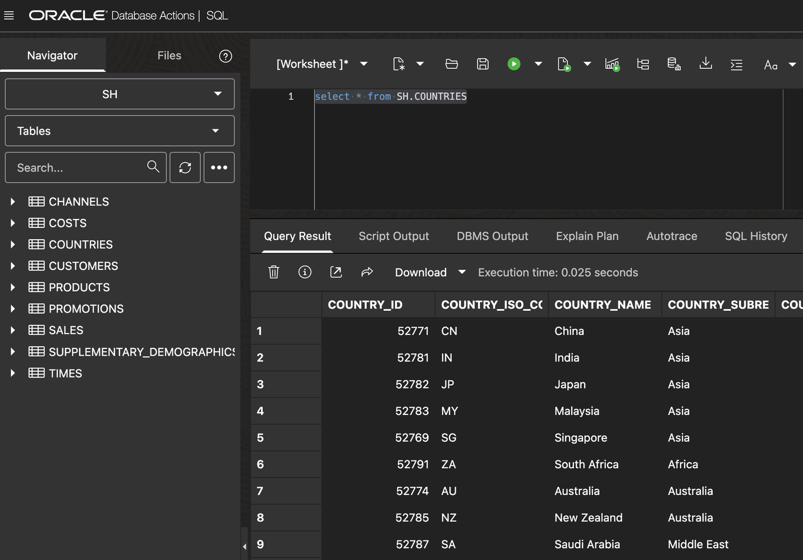
    
    In the **SQL Worksheet**, you can see the default **SH Schema** already pre-created, You can start using this worksheet with an example SQL
    
        ```
        SELECT * from SH.COUNTRIES
        ```
    
    Clean up the created resources by going back to the Resource Manager Stack and clicking on the **Destroy** button.
    
    Click on the Destroy confirmation button.


## (Optional) Create Oracle Autonomous AI Database for Developers using Oracle Terraform Command Line Interface CLI

1. Install Terraform CLI, Please check this link on [Terraform CLI Installation for OCI](https://developer.hashicorp.com/terraform/tutorials/oci-get-started/install-cli) 

    ```
    % brew tap hashicorp/tap
    % brew install hashicorp/tap/terraform

    -- Verify installation
    % terraform -help

    % terraform -v   
    Terraform v1.13.4
    on darwin_amd64
    ```

2. Install OCI CLI, Please refer the [Quick start guide] (https://docs.oracle.com/en-us/iaas/Content/API/SDKDocs/cliinstall.htm)

    ```
    % brew update && brew install oci-cli

    -- Verify installation
    % oci -v
    3.62.1
    ```
 
3. Configure OCI CLI, Please check [CLI configuration](https://docs.oracle.com/en-us/iaas/Content/API/SDKDocs/cliconfigure.htm) document

    replace  <Your-User-OCID\> , <Your-OCI-Finterprint\>, <Your-Region\> for example us-phoenix-1, <Your-key-file\> Your SSH Key file with complete path

    ```
    % cat ~/.oci/config                                                                                         
    [DEFAULT]
    user=ocid1.user.oc1..<Your-User-OCID>
    fingerprint=<Your-OCI-Finterprint>
    tenancy=ocid1.tenancy.oc1..<Your-Tenancy-OCID> 
    region=<Your-Region>
    key_file=/Users/<Your-Folder>/<Your-key-file>.pem 
    ```  

4. View and Edit the Terraform source code main.tf by replacing <Your-Compartment-Id\>, <Your-DB-Name\>, <Your-DB-Display-Name\> and <Your-Password\> as appropriate for your tenancy and database creation

    ```
    provider "oci" {}

    resource "oci_database_autonomous_database" "oci_database_autonomous_database" { 
        autonomous_maintenance_schedule_type = "REGULAR"
        compartment_id = "<Your-Compartment-Id>"
        compute_count = "4"
        compute_model = "ECPU"
        data_storage_size_in_gb = "20"
        db_name = "<Your-DB-Name>"
        display_name = "<Your-DB-Display-Name>"
        admin_password = "<Your-Password>"
        db_version = "26ai"
        db_workload = "LH" 
        is_dedicated = "false"
        is_dev_tier = "true"
        is_mtls_connection_required = "true"
        is_preview_version_with_service_terms_accepted = "false"
        license_model = "LICENSE_INCLUDED"
    }            
    ```

    Refer [OCI CLI Terraform for Database Creation](https://registry.terraform.io/providers/oracle/oci/latest/docs/resources/database_autonomous_database)
           
5. Start with Terraform initialisation
6. Run the following commands from the terminal where the **main.tf** file is located.
    ```
    terraform init
    ``` 

    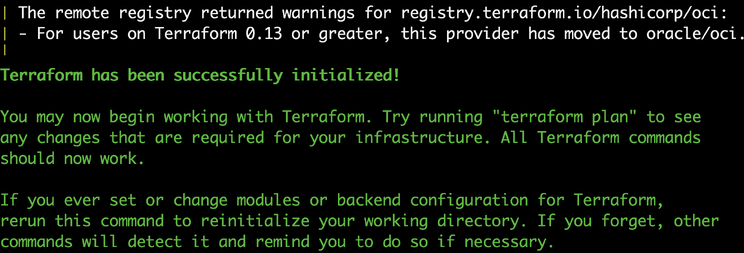

    ```
    terraform plan -out=myplan.tfplan
    ```

    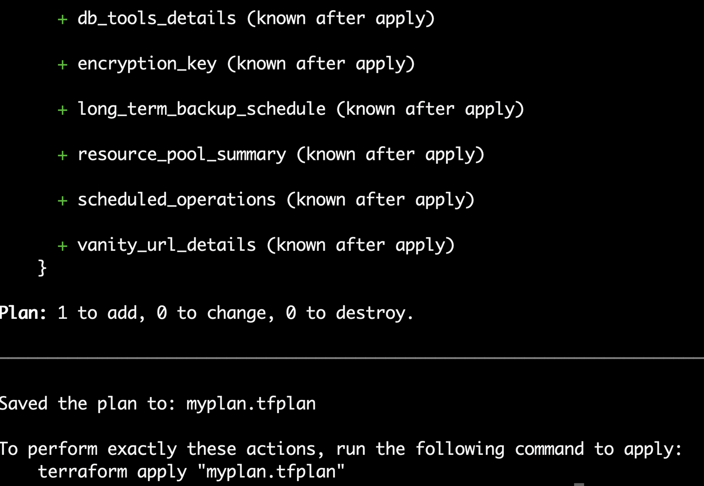

    ```
    terraform apply "myplan.tfplan"
    ```

    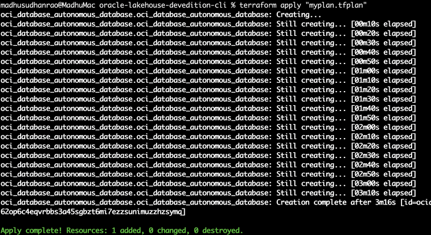

    The script has completed resource creation in approximately 3 minutes. Once you have completed using the Oracle Autonomous AI Database 26ai environment. You can destroy the environment
  
    > Please note: This approach will be slightly slower than running it through the Oracle resource manager stack zip file upload. as you are connecting from your local laptop to OCI using using terraform command line interface.
  
## (Optional) Download database wallet, Note connection details and Create database user

1. From the top right navigation menu click on **Database Connection** button

    

2. Download wallet

    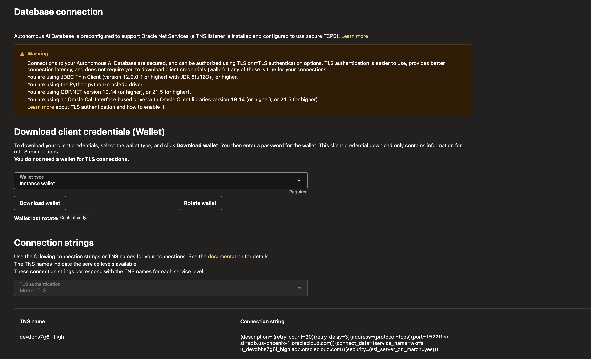 

    Provide wallet password and save the wallet.

3. Copy and save TNS Name, which would be of the following format, where database name and region will change. we will need this details for database connection. 

    ```
    devdbhs556l_high = (description= (retry_count=20)(retry_delay=3)(address=(protocol=tcps)(port=1522)(host=adb.us-phoenix-1.oraclecloud.com))(connect_data=(service_name=wkrfs4xeqva1jcu_devdbhs556l_high.adb.oraclecloud.com))(security=(ssl_server_dn_match=yes)))
    ```
  
4. Create Database user by clicking on **Database Actions** Menu and **Database Users**

    

    Click on create user button 

    

    Provide user name and password and select user options

    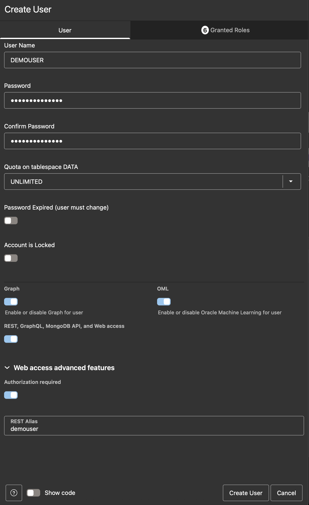
  
5.  Update **Granted Roles** as required by your application and **Apply Changes** . 
  
    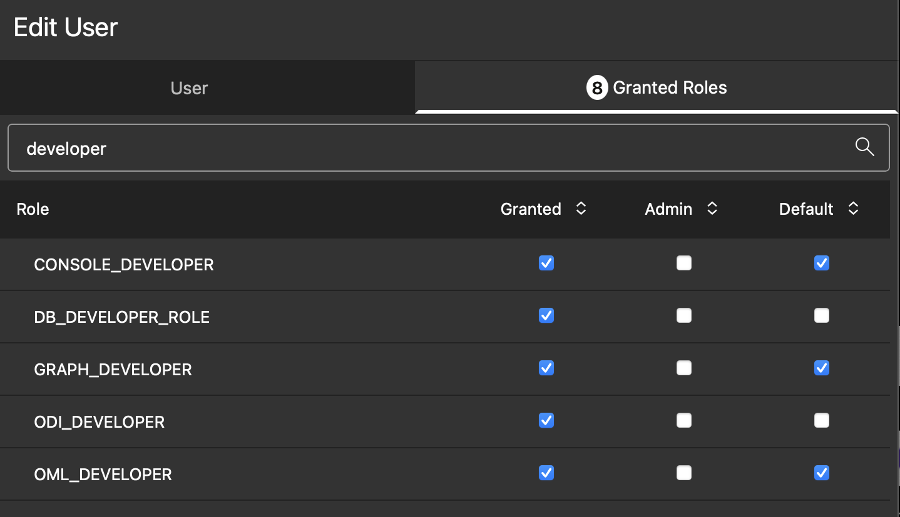

## Cleanup resources created

1. Destroy the resources created if you have used using Oracle Stack by clicking on the  **Destroy** button.
 
    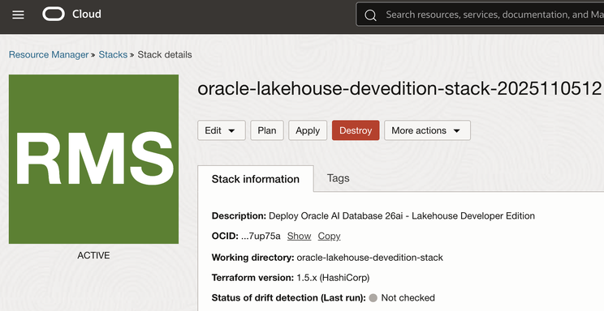

    View Confirmation message logs

    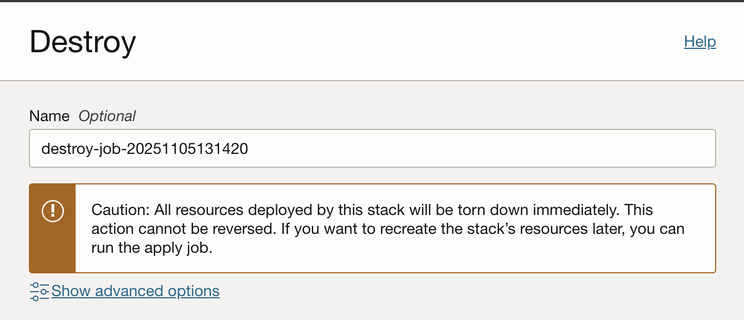

2. If you have used Terraform CLI then run  

    ```
    terraform destroy
    ```

    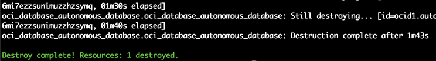 
 
    -- Enter yes for confirmation 
 

## (Optional) Try Live SQL
 
<livesql-button src="https://livesql.oracle.com/next/worksheet?tutorial=json-duality-views-quick-start-D3wdHG&share_key=jCX1875rL3">

<b>Live SQL Execution:</b> Sign-In Required</br>
<b>Duration:</b> 2 minutes 
   
## Learn More & Downloads
 
* [Autonomous AI Database for Developers](https://docs.oracle.com/en-us/iaas/autonomous-database-serverless/doc/autonomous-database-for-developers.html) 
* [Download Source code](https://github.com/madhusudhanrao-ppm/dbdevrel/tree/main/source-codes)
* [Direct ORM deployment link](https://cloud.oracle.com/resourcemanager/stacks/create?zipUrl=https://objectstorage.us-phoenix-1.oraclecloud.com/p/jtfUsV33KtLR937hWybAgrq8qtuQQuAaIw1K_VBThhlUF6Z1HYF0Ai50sQlp06bQ/n/oradbclouducm/b/medical_transcripts/o/Terraform/oracle-lakehouse-devedition-stack.zip)
 