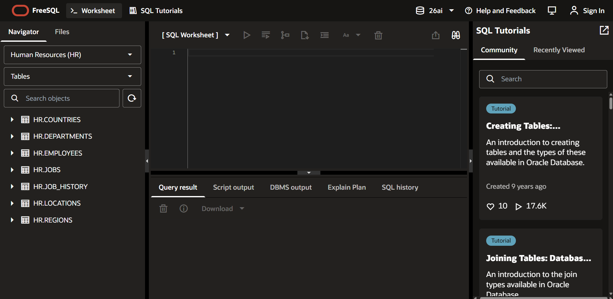
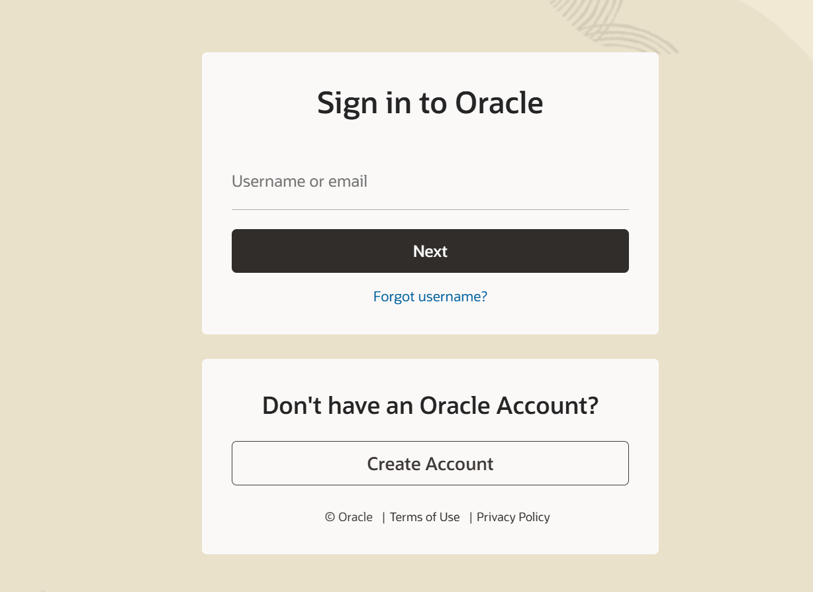
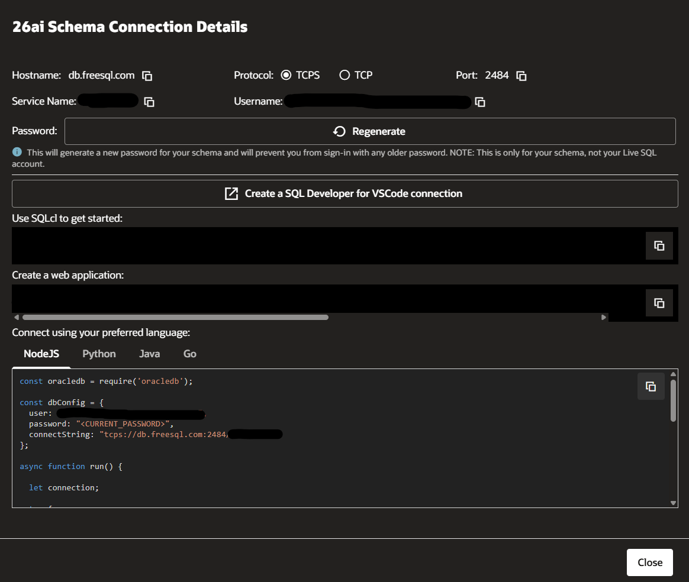

# LangChain.js RAG with Oracle AI Database

This folder is a notebook companion for the LangChain TypeScript and JavaScript integration with Oracle AI Database.

The notebook is the guided walkthrough. The runnable JavaScript implementation lives in `langchain_rag.mjs`, so the JavaScript source is kept outside the notebook and can be reviewed like a normal Node.js project.

The goal is to show the JavaScript and TypeScript developer path, not a Python rewrite of the same idea. Jupyter is used only as the tutorial shell: it installs the Node.js dependencies, runs the JavaScript demo, and displays the results. The actual RAG application code uses LangChain.js, `node-oracledb`, and Oracle's first-party `@oracle/langchain-oracledb` package.

## What this tutorial demonstrates

- Connect from Node.js to FreeSQL, Autonomous AI Database, or a local Oracle Database.
- Validate that the schema can create and manage tutorial tables before creating vector-store objects.
- Use `@oracle/langchain-oracledb` and `OracleVS` as a LangChain.js vector store.
- Store source text, dense vectors, and JSON metadata together in Oracle AI Database.
- Inspect the Oracle table and indexes created by the vector store.
- Run similarity search, metadata-filtered search, and maximal marginal relevance retrieval.
- Optionally create an HNSW vector index when the database environment supports it.
- Generate a grounded RAG answer with a chat model from retrieved OracleVS context.

The demo uses deterministic local embeddings so the OracleVS, table inspection, and retrieval sections can run without an external embedding API. The final answer-generation step uses `@langchain/openai` when `OPENAI_API_KEY` is available.

## Why LangChain.js with Oracle AI Database

Many production AI applications are JavaScript or TypeScript services: chat backends, API routes, workflow systems, internal tools, and web application backends. LangChain.js gives those services a familiar way to represent documents, embeddings, vector stores, retrievers, and model calls.

`@oracle/langchain-oracledb` connects that LangChain.js programming model to Oracle AI Database. In this tutorial, `OracleVS` is the bridge:

| Layer | Component | Role |
| --- | --- | --- |
| Application runtime | Node.js JavaScript, or TypeScript after compilation | Runs the RAG workflow and calls LangChain APIs |
| LangChain.js | `Document`, `Embeddings`, retrieval methods, chat model integration | Defines the RAG application pattern |
| Oracle integration | `@oracle/langchain-oracledb`, especially `OracleVS` | Maps LangChain vector-store operations to Oracle AI Database |
| Database | Oracle AI Database | Stores document text, vector embeddings, JSON metadata, and optional vector indexes |

The TypeScript story is intentionally simple: a TypeScript application uses the same imports and the same OracleVS calls, then adds its normal `tsconfig.json` and build process. The notebook uses `.mjs` so the tutorial can run directly with Node.js without adding a compile step.

## Architecture

```text
                 +-------------------------------+
                 | JavaScript / TypeScript app   |
                 | Node.js + LangChain.js        |
                 +---------------+---------------+
                                 |
                                 | uses
                                 v
                 +-------------------------------+
                 | @oracle/langchain-oracledb    |
                 | OracleVS vector store         |
                 +---------------+---------------+
                                 |
                                 | stores and queries
                                 v
+----------------------------------------------------------------+
|                     Oracle AI Database                         |
|  VECTOR embeddings + document text + JSON metadata + indexes   |
+-------------------------------+--------------------------------+
                                |
                                | returns retrieved context
                                v
                 +-------------------------------+
                 | Grounded RAG response         |
                 +-------------------------------+
```

`OracleVS` is the main integration point. LangChain.js owns the document and retriever interface, while Oracle AI Database stores the text, metadata, vectors, and optional vector index.

## Files to include in the Developer Hub pull request

Include this folder as:

```text
notebooks/langchain_ecosystem/langchain_js_rag_with_oracle_ai_database/
```

Include these files:

| File | Purpose |
| --- | --- |
| `README.md` | Explains the tutorial, the JavaScript/TypeScript integration, setup, and connection options |
| `langchain_js_rag_with_oracle_ai_database.ipynb` | Python notebook walkthrough. It orchestrates the tutorial, runs the JavaScript demo, and renders the result tables |
| `langchain_rag.mjs` | Runnable Node.js implementation. This is the actual LangChain.js RAG workflow using `OracleVS` |
| `package.json` | Declares the Node.js package metadata, dependencies, and `npm run demo` script |
| `package-lock.json` | Locks dependency versions so reviewers can reproduce the install |
| `.gitignore` | Excludes credentials, `node_modules/`, generated results, and notebook checkpoints |

Do not include `.env`, `node_modules/`, or generated `rag_results.json`.

This folder intentionally does not include `.env.example`. The connection profile is documented below so credentials are never staged accidentally.

## How the files work together

`langchain_rag.mjs` is the source of truth for the JavaScript integration. It does four jobs:

1. Loads database and optional LLM settings from `.env`.
2. Connects to Oracle Database with `node-oracledb`.
3. Uses `OracleVS.fromDocuments` to create and populate the vector store.
4. Writes `rag_results.json` so the notebook can render tables without embedding JavaScript source code in notebook cells.

The notebook then acts like a Developer Hub walkthrough. It checks the workspace, installs npm dependencies, validates JavaScript syntax, runs the demo, and explains the database objects and retrieval results. This keeps the tutorial readable while keeping the JavaScript implementation portable.

## Notebook flow

The notebook follows this sequence:

1. Explain the architecture and Oracle LangChain.js package surface.
2. Configure a private `.env` for FreeSQL, Autonomous AI Database, or local Oracle Database.
3. Inspect the JavaScript implementation sections.
4. Install npm dependencies.
5. Validate JavaScript syntax with `node --check`.
6. Run the end-to-end JavaScript workflow.
7. Review the preflight summary.
8. Inspect the OracleVS table shape, row count, and indexes.
9. Review the demo corpus and metadata contract.
10. Compare similarity search, metadata-filtered search, and MMR retrieval.
11. Generate a grounded RAG answer when an LLM key is configured.
12. Explain how the same pattern maps to TypeScript.

## Prerequisites

- Node.js 22 or later
- Python and Jupyter, if you want to run the notebook
- An Oracle AI Database schema that can create, insert into, select from, and drop application tables
- Optional: an OpenAI API key for the final grounded-answer step

## Install dependencies

Run commands from this folder:

```bash
npm install
```

Then create a private `.env` file in this same folder. The `.env` file must not be committed.

## Connection profile

The JavaScript demo reads this private `.env` file through `dotenv`:

```env
DB_USER=<database-user>
DB_PASSWORD=<database-password>
DB_CONNECT_STRING=<database-connect-string>

LANGCHAIN_JS_TABLE=LC_JS_RAG_DEMO
LANGCHAIN_JS_CREATE_INDEX=false

# Optional. Required only for final answer generation.
OPENAI_API_KEY=<openai-api-key>
LANGCHAIN_JS_LLM_MODEL=gpt-4o-mini
```

`LANGCHAIN_JS_CREATE_INDEX=false` is the safest default for hosted tutorial schemas. Set it to `true` only when your database environment has enough quota and privileges for vector index creation.

## Connect with FreeSQL

Use FreeSQL when you want a hosted Oracle Database schema for a tutorial without setting up a local database.

1. Open [FreeSQL](https://freesql.com).
2. Sign in with your Oracle account.
3. Select **Connect to the Database** from the top navigation.
4. Choose the **NodeJS** tab.
5. Copy the generated username, password, and connection string into your private `.env` file.

<p align="center">
  
</p>

<p align="center">
  
</p>

<p align="center">
  
</p>

Use this shape:

```env
DB_USER=<freesql-user>
DB_PASSWORD=<freesql-password>
DB_CONNECT_STRING=<freesql-connect-descriptor-or-service-url>

LANGCHAIN_JS_TABLE=LC_JS_RAG_DEMO
LANGCHAIN_JS_CREATE_INDEX=false
```

FreeSQL is a good target for the main tutorial path because the demo uses regular schema tables. Keep vector index creation disabled unless your schema has enough quota for the index and its auxiliary objects.

## Connect with Autonomous AI Database

Use Autonomous AI Database when you want the same LangChain.js workflow against a managed Oracle AI Database environment.

```env
DB_USER=<database-user>
DB_PASSWORD=<database-password>
DB_CONNECT_STRING=<adb-service-name-or-connect-descriptor>

LANGCHAIN_JS_TABLE=LC_JS_RAG_DEMO
LANGCHAIN_JS_CREATE_INDEX=true
```

If your Autonomous Database connection requires a wallet, configure the Node.js Oracle Database driver environment as you normally would for `node-oracledb`, then put the service name or connect descriptor in `DB_CONNECT_STRING`.

## Connect with a local Oracle Database

Use a local Oracle Database when you want a repeatable development environment on your machine or in a container.

```env
DB_USER=<local-user>
DB_PASSWORD=<local-password>
DB_CONNECT_STRING=localhost:1521/FREEPDB1

LANGCHAIN_JS_TABLE=LC_JS_RAG_DEMO
LANGCHAIN_JS_CREATE_INDEX=true
```

The schema should be able to create tables and indexes in its own account. If vector index creation fails because of quota or privileges, set `LANGCHAIN_JS_CREATE_INDEX=false` and rerun the demo. Retrieval still works without the vector index for this small tutorial corpus.

## Run the JavaScript demo

```bash
npm run demo
```

The script writes `rag_results.json` with:

- preflight checks
- OracleVS table inspection
- demo corpus metadata
- similarity-search results
- metadata-filtered results
- MMR retrieval results
- final grounded answer, or retrieved context if no LLM key is configured

## Check the results

A successful run should show:

- the schema preflight check passed;
- the demo table was reset or created;
- `OracleVS` inserted the demo documents;
- the table inspection reports rows and columns;
- similarity search returns general RAG context;
- metadata filtering returns only retrieval-category rows;
- MMR returns a diverse context set;
- the final section either generates a grounded answer or explains that `OPENAI_API_KEY` was not set.

If vector index creation is disabled or skipped, the tutorial can still pass. Indexing is an optional performance step for larger corpora, not a requirement for this small demo.

## Run the notebook

Open `langchain_js_rag_with_oracle_ai_database.ipynb` from this folder and run the cells top to bottom.

The notebook does not generate JavaScript files. It calls `langchain_rag.mjs`, reads `rag_results.json`, and explains what each result proves.

## JavaScript and TypeScript

The demo uses JavaScript modules (`.mjs`) so it can run directly with Node.js and avoid a TypeScript build step inside the notebook.

The same integration pattern applies to TypeScript projects. A TypeScript backend would use the same Oracle and LangChain imports, then add its normal `tsconfig.json` and build process:

```typescript
import {
  DistanceStrategy,
  OracleVS,
  VectorElementFormat,
} from "@oracle/langchain-oracledb";
```

The core pattern is the same:

1. Create a `node-oracledb` pool.
2. Provide a LangChain-compatible embeddings implementation.
3. Pass LangChain documents into `OracleVS.fromDocuments`.
4. Use similarity search, metadata filters, or MMR retrieval.
5. Pass retrieved context to the application LLM.

## Integration surface covered

| Integration point | Package | How this tutorial uses it |
| --- | --- | --- |
| `OracleVS` | `@oracle/langchain-oracledb` | Creates and queries an Oracle-backed LangChain vector store |
| `DistanceStrategy` | `@oracle/langchain-oracledb` | Configures cosine distance for vector search |
| `VectorElementFormat` | `@oracle/langchain-oracledb` | Stores dense vectors as `FLOAT32` |
| `createIndex` | `@oracle/langchain-oracledb` | Optionally creates an HNSW vector index |
| `Embeddings` | `@langchain/core` | Supplies deterministic demo embeddings through the standard LangChain interface |
| `Document` | `@langchain/core` | Represents source text and metadata |
| `ChatOpenAI` | `@langchain/openai` | Generates the optional grounded final answer |
| `node-oracledb` | `oracledb` | Opens the database connection pool used by OracleVS |

The broader Oracle LangChain.js package also includes `OracleDocLoader`, `OracleTextSplitter`, `OracleEmbeddings`, and `OracleSummary`. Those are extension paths for a follow-up tutorial; this first notebook stays focused on the base RAG loop.

## Production notes

- Replace deterministic demo embeddings with a production embedding provider such as OCI Generative AI, OpenAI, or Oracle-backed embeddings.
- Keep one embedding dimension per OracleVS table.
- Design metadata fields before the corpus grows.
- Treat metadata filters as retrieval controls, not as the only authorization layer.
- Use environment-specific table names when several demos or services share one schema.
- Enable vector indexes where quota, privileges, and workload justify them.
- Keep cleanup and retention behavior explicit instead of dropping production tables on every run.

## Learn more

- [Oracle LangChain JavaScript integration guide](https://docs.oracle.com/en/database/oracle/oracle-database/26/aintg/langchain-oracledb-integration-guide/langchain-javascript.html)
- [Oracle AI Database integrations overview](https://docs.oracle.com/en/database/oracle/oracle-database/26/aintg/integrations.html)
- [LangChain.js Oracle AI Database vector store docs](https://docs.langchain.com/oss/javascript/integrations/vectorstores/oracleai)
- [npm: @oracle/langchain-oracledb](https://www.npmjs.com/package/@oracle/langchain-oracledb)
- [Source: oracle/langchain-oracle](https://github.com/oracle/langchain-oracle/tree/main/libs/js/langchain-oracledb)

