## Introduction

This guide provides comprehensive instructions for deploying an **Oracle Autonomous Database on Microsoft Azure**. We cover both the Azure Portal UI and the Azure Command Line Interface (CLI) approaches, enabling you to choose the method that best fits your workflow.

### What You'll Learn

- Authenticate and navigate the Azure Portal
- Create and configure Azure infrastructure components (Resource Groups, Virtual Networks, Subnets)
- Deploy Oracle Autonomous Database instances on Azure
- Set up secure access through Azure Bastion and Windows VMs
- Troubleshoot common deployment issues
- Access your database from various applications (.NET, Java, Python, and more)

### Prerequisites

- Active Microsoft Azure subscription
- Oracle Database@Azure service access in your region
- Azure CLI installed (for CLI-based approaches)
- Basic familiarity with cloud networking concepts

### Table of Contents

1. [Azure Portal Authentication](#azure-portal-authentication)
2. [Creating Oracle Database via Azure Portal](#creating-oracle-database-via-azure-portal)
3. [Azure CLI Setup](#azure-cli-setup)
4. [Infrastructure Setup with Azure CLI](#infrastructure-setup-with-azure-cli)
5. [Creating an Azure Resource Group](#creating-an-azure-resource-group)
6. [Creating a Virtual Network and Subnet](#creating-a-virtual-network-and-subnet)
7. [Creating Azure Public IP](#creating-azure-public-ip)
8. [Creating Azure Bastion for Secure Access](#creating-azure-bastion-for-secure-access)
9. [Creating a Windows Virtual Machine](#creating-a-windows-virtual-machine)
10. [Accessing the Windows VM via RDP](#accessing-the-windows-vm-via-rdp)
11. [Deploying Oracle Autonomous Database via Azure CLI](#deploying-oracle-autonomous-database-via-azure-cli)

---

## Azure Portal Authentication

To authenticate into the Azure Portal, navigate to [https://portal.azure.com/](https://portal.azure.com/) and sign in with your Azure credentials.

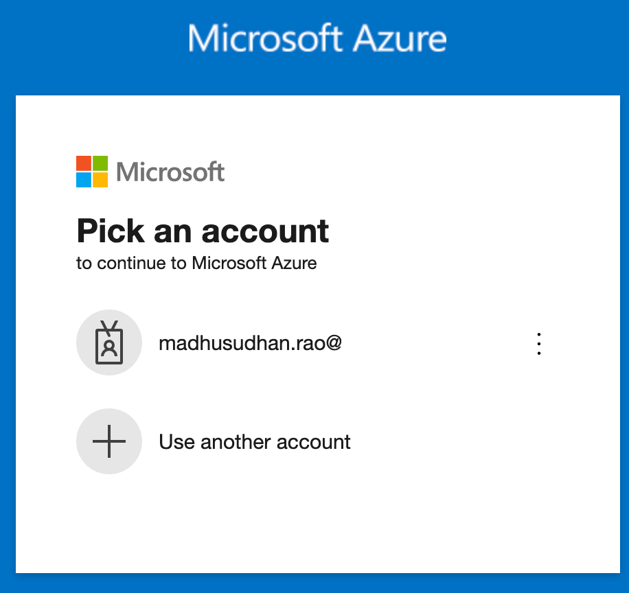
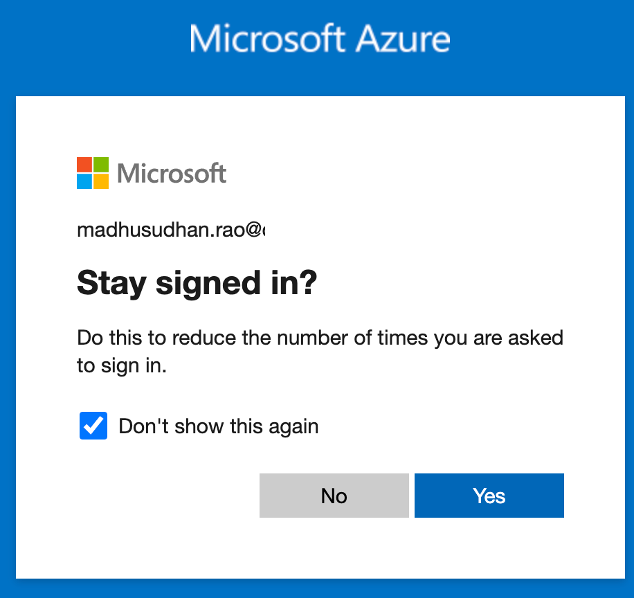
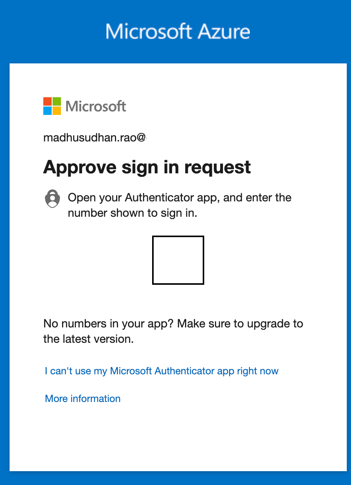
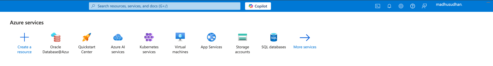

## Creating Oracle Database via Azure Portal

### Step 1: Search for Oracle Database@Azure

In the Azure Portal search bar, type "Oracle Database@Azure" to locate the service.

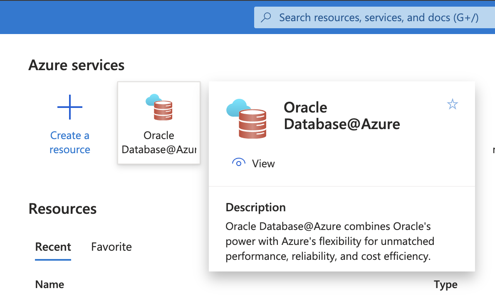

### Step 2: Select Service Type

Choose from the available options:
- **Oracle Autonomous Database Service** - For managed database workloads
- **Oracle Exadata Database** - For high-performance enterprise deployments

Click on **Oracle Autonomous Database Service** in the left navigation.

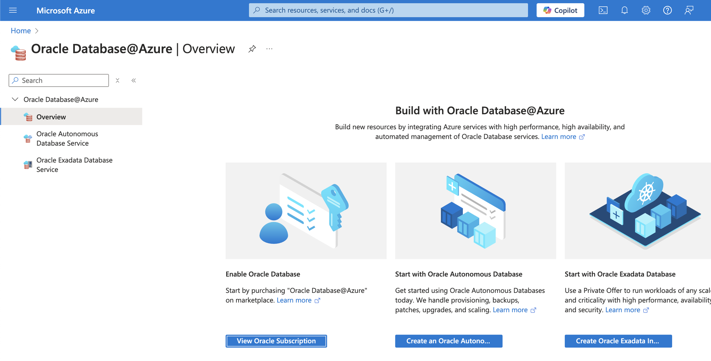

### Step 3: Initiate Database Creation

Click the **+ Create** button to begin the database configuration wizard.

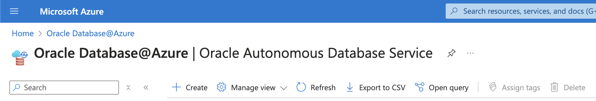

### Step 4: Configure Subscription and Resource Group

- Select your Azure subscription
- Choose an existing resource group or create a new one

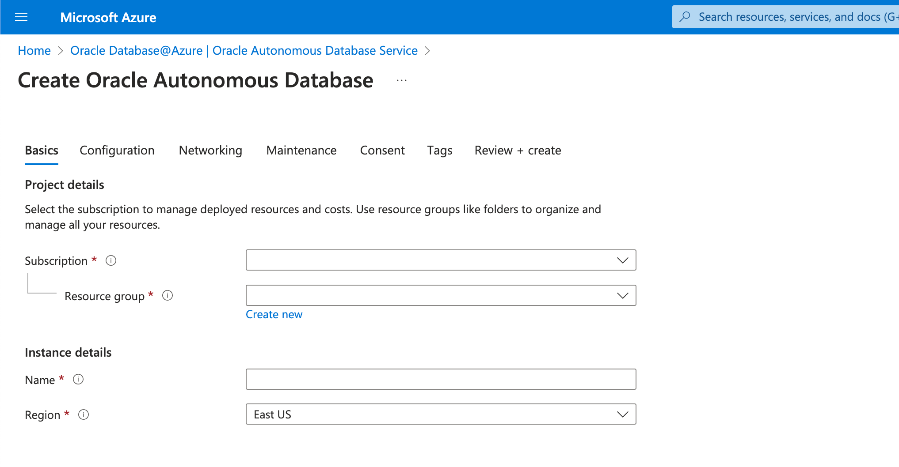

### Step 5: Configure Database Settings

Configure the following parameters:

- **Workload Type**: Choose one of:
  - Data Warehouse (OLAP workloads)
  - Transaction Processing (OLTP workloads)
  - JSON (Document-oriented workloads)
  - APEX (Application Express)
  
- **Database Version**: Select latest Database version available
- **Admin Password**: Set a strong administrator password
- **Backup Retention**: Configure backup retention period (in days)

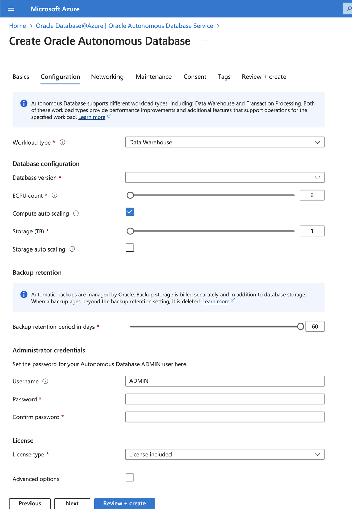

### Step 6: Configure Network Access

Select your network access strategy:

- **Private Network Only**: Restrict access to your virtual network (recommended for production)
- **Public Network**: Allow access from configured IP ranges

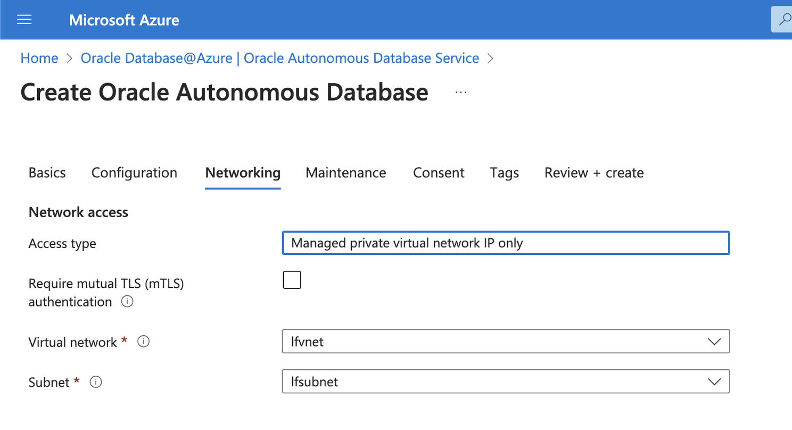


### Step 7: Review and Create

Review all configuration details on the **Review + Create** screen.

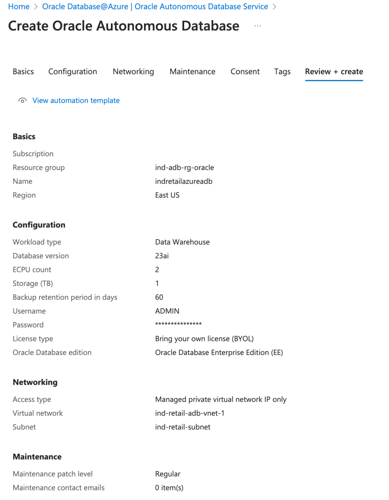

Click **Create** to initiate the deployment process.

### Step 8: Monitor Deployment

The deployment process will proceed through the following states:
- **Provisioning**: Resources are being created
- **Available**: Database is ready for use
- **Failed**: Review error logs if deployment fails

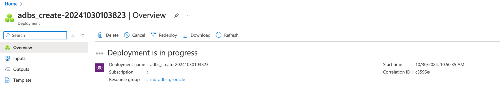


---

## Azure CLI Setup

### Installation

The Azure CLI is a cross-platform command-line tool available for Windows, macOS, and Linux.

**For macOS:**
```bash
brew update && brew install azure-cli
```

**For Linux (Ubuntu/Debian):**
```bash
sudo apt-get update
sudo apt-get install azure-cli
```

For other operating systems, see [Azure CLI Installation Guide](https://learn.microsoft.com/en-us/cli/azure/).

### Authentication

Log in to Azure:

```bash
az login
```

Your default web browser will open to authenticate. After authentication, you'll see your subscriptions and tenant information in the terminal:

```
A web browser has opened at https://login.microsoftonline.com/organizations/oauth2/v2.0/authorize. 
Please continue the login in the web browser. If no web browser is available or if the web browser 
fails to open, use device code flow with `az login --use-device-code`.

Retrieving tenants and subscriptions for the selection...
```

### List Your Subscriptions

Verify your subscriptions and account details:

```bash
az account list
```

Example response:

```json
[
  {
    "cloudName": "AzureCloud",
    "homeTenantId": "e63de8-XXXX-XXX0863da5d",
    "id": "99d4fb0e-XXXX-XXXXdb9025",
    "isDefault": true,
    "managedByTenants": [],
    "name": "My Subscription",
    "state": "Enabled",
    "tenantDefaultDomain": "example.onmicrosoft.com",
    "tenantDisplayName": "Example Tenant",
    "tenantId": "e63de867-XXXX-e90c0863da5d",
    "user": {
      "name": "user@example.com",
      "type": "user"
    }
  }
]
```

---

## Infrastructure Setup with Azure CLI

To deploy Oracle Autonomous Database@Azure via CLI, you'll need the following prerequisites:

- **Resource Group**: Container for all related resources
- **Virtual Network (VNet)**: Private network for your resources
- **Delegated Subnet**: Subnet delegated to `Oracle.Database/networkAttachments` service
- **Public IP** (optional): For external access
- **Bastion Host** (optional): Secure jump host for private resource access

---

## Creating an Azure Resource Group

An Azure Resource Group is a logical container that holds related resources for an Azure solution. It enables you to manage resources as a single unit.

### Create Resource Group

```bash
az group create \
    --name <resource-group-name> \
    --location <region>
```

**Example:**

```bash
az group create \
    --name oracle-adb-rg \
    --location eastus
```

**Expected Output:**

```json
{
  "id": "/subscriptions/99d4fb0e-XXX-XXX-XX025/resourceGroups/oracle-adb-rg",
  "location": "eastus",
  "managedBy": null,
  "name": "oracle-adb-rg",
  "properties": {
    "provisioningState": "Succeeded"
  },
  "tags": null,
  "type": "Microsoft.Resources/resourceGroups"
}
```

Verify your resource group on the [Azure Portal](https://portal.azure.com/):


---

## Creating a Virtual Network and Subnet

### What is Azure Virtual Network?

Azure Virtual Network (VNet) provides the foundational building block for your private network in Azure. It enables secure communication between:
- Azure resources (Virtual Machines, databases, etc.)
- The internet
- On-premises networks

### Create VNet and Subnet

```bash
az network vnet create \
    --name <vnet-name> \
    --resource-group <resource-group-name> \
    --address-prefix 10.0.0.0/16 \
    --subnet-name <subnet-name> \
    --subnet-prefixes 10.0.0.0/24
```

**Example:**

```bash
az network vnet create \
    --name oracle-vnet-1 \
    --resource-group oracle-adb-rg \
    --address-prefix 10.0.0.0/16 \
    --subnet-name oracle-subnet-1 \
    --subnet-prefixes 10.0.0.0/24
```

### Verify on Azure Portal

Search for "Virtual Networks" and view your newly created VNet:

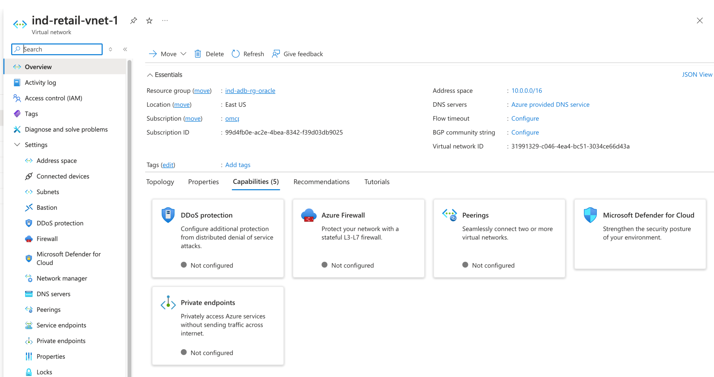

Navigate to **Subnets** to verify the subnet configuration:


Click the edit icon to view detailed subnet settings:


---

## Creating Azure Public IP

### What is Azure Public IP?

An Azure Public IP address provides inbound and outbound connectivity for Azure resources. It's essential for resources that need to communicate over the internet.

### Create Public IP

```bash
az network public-ip create \
    --resource-group <resource-group-name> \
    --name <public-ip-name> \
    --sku Standard \
    --location <region> \
    --zone 1 2 3
```

**Example:**

```bash
az network public-ip create \
    --resource-group oracle-adb-rg \
    --name oracle-public-ip \
    --sku Standard \
    --location eastus \
    --zone 1 2 3
```

**Expected Output:**

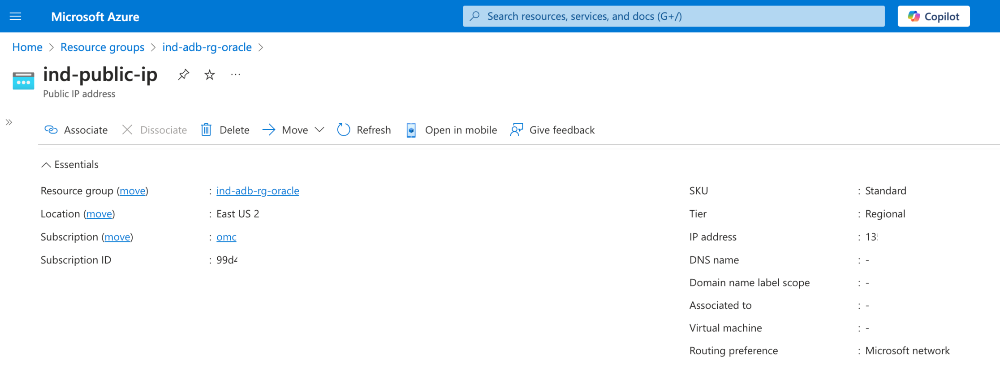

---

## Creating Azure Bastion for Secure Access

### What is Azure Bastion?

Azure Bastion provides secure and seamless SSH/RDP access to virtual machines over the internet using TLS, eliminating the need for:
- Public IP addresses on VMs
- VPN clients
- Exposed RDP/SSH ports

### Create Bastion Subnet

First, create a dedicated subnet for Azure Bastion:

```bash
az network vnet subnet create \
    --name AzureBastionSubnet \
    --resource-group <resource-group-name> \
    --vnet-name <vnet-name> \
    --address-prefix 10.0.1.0/26
```

**Example:**

```bash
az network vnet subnet create \
    --name AzureBastionSubnet \
    --resource-group oracle-adb-rg \
    --vnet-name oracle-vnet-1 \
    --address-prefix 10.0.1.0/26
```

### Create Bastion Host

```bash
az network bastion create \
    --name oracle-bastion \
    --public-ip-address <public-ip-name> \
    --resource-group <resource-group-name> \
    --vnet-name <vnet-name> \
    --location <region>
```

Verify on Azure Portal:


---

## Creating a Windows Virtual Machine

### List Available VM Images

To view available VM images:

```bash
az vm image list
```

This returns a JSON array of available images, including:

```json
{
    "architecture": "x64",
    "offer": "WindowsServer",
    "publisher": "MicrosoftWindowsServer",
    "sku": "2022-Datacenter",
    "urn": "MicrosoftWindowsServer:WindowsServer:2022-Datacenter:latest",
    "urnAlias": "Win2022Datacenter",
    "version": "latest"
},
{
    "architecture": "x64",
    "offer": "UbuntuServer",
    "publisher": "Canonical",
    "sku": "22_04-lts-gen2",
    "urn": "Canonical:0001-com-ubuntu-server-jammy:22_04-lts-gen2:latest",
    "urnAlias": "Ubuntu2204",
    "version": "latest"
}
```

### Create Windows VM

```bash
az vm create \
    --name <vm-name> \
    --resource-group <resource-group-name> \
    --public-ip-address <public-ip-address> \
    --image Win2022Datacenter \
    --admin-username azureuser
```

**Example:**

```bash
az vm create \
    --name oracle-windows-vm \
    --resource-group oracle-adb-rg \
    --public-ip-address oracle-public-ip \
    --image Win2022Datacenter \
    --admin-username azureuser
```

### Create Linux/Ubuntu VM

```bash
az vm create \
    --name <vm-name> \
    --resource-group <resource-group-name> \
    --image Ubuntu2204 \
    --admin-username azureuser
```

Verify on Azure Portal:


---

## Accessing the Windows VM via RDP

### Download RDP Configuration

1. Navigate to your VM in the Azure Portal
2. Click the **Connect** button at the top
3. Download the RDP configuration file


### Connect Using RDP Client

Use any RDP client or [Microsoft Windows App](https://learn.microsoft.com/en-us/windows-app/overview) to open the downloaded RDP file.

Once connected, you can:
- Open a web browser to access external websites
- Connect to your Oracle Database using SQL*Plus or SQL Developer
- Configure network settings as needed

---

## Deploying Oracle Autonomous Database via Azure CLI

For a complete example of deploying Oracle Autonomous Database@Azure using Azure CLI, see the [Oracle Autonomous Database Azure CLI Samples](https://github.com/oracle-devrel/oracle-autonomous-database-samples/tree/main/multicloud/azure-cli) repository.

### Key Configuration Parameters

When creating your database instance via CLI, consider:
- **Workload Optimization**: Choose the appropriate workload type
- **Network Configuration**: Use delegated subnets for secure access
- **Backup Strategy**: Configure retention policies
- **High Availability**: Enable availability domain redundancy where supported

---

## Next Steps

After successfully deploying your Oracle Autonomous Database on Azure, you can:

- **Connect from Various Applications**: .NET Core, Java, Python, SQL*Plus, and more
- **Set Up Data Studio**: Use Oracle's web-based IDE
- **Configure Backups**: Implement automated backup strategies
- **Monitor Performance**: Use Azure Monitor and Oracle Cloud Tools
- **Scale Resources**: Adjust compute and storage as needed

For additional resources and troubleshooting, refer to the [Oracle Database@Azure Documentation](https://docs.oracle.com/).

---

## Additional Resources

- [Azure CLI Documentation](https://learn.microsoft.com/en-us/cli/azure/)
- [Oracle Database@Azure](https://www.oracle.com/cloud/azure/)
- [Oracle Autonomous Database Samples](https://github.com/oracle-devrel/oracle-autonomous-database-samples)
- [Azure Virtual Network Documentation](https://learn.microsoft.com/en-us/azure/virtual-network/)
- [Azure Bastion Documentation](https://learn.microsoft.com/en-us/azure/bastion/)