# Building a RAG Application with AI Agent Development Kit and Google Colab Notebook

## Introduction

Artificial intelligence is advancing rapidly, with AI agents emerging as powerful autonomous systems. These systems perceive their environment, execute actions, and learn from experiences, making them valuable tools for diverse applications. This guide explores AI agents, agentic AI, and retrieval-augmented generation (RAG) techniques, providing practical instructions for building a RAG application using Oracle Cloud Infrastructure (OCI).

This guide covers the essential steps for creating an OCI Object Storage bucket, configuring a generative AI agent, establishing a RAG-based knowledge base, and deploying a Python-based application. Upon completion, you will understand how AI agents function and how to leverage RAG to build intelligent conversational interfaces that deliver accurate and contextually relevant responses.

This also covers using [RAG Agent Development Kit](https://docs.oracle.com/en-us/iaas/Content/generative-ai-agents/adk/api-reference/introduction.htm) with Google Colab Notebook

## AI Agents

An AI agent is a software entity capable of:

- Perceiving its environment and executing actions
- Learning from experiences and outcomes

### Key Characteristics

- Setting and pursuing goals
- Gathering and analyzing information
- Applying logic to plan execution steps
- Learning through trial and error (reinforcement learning)
- Utilizing tools and data sources to accomplish objectives

### Capabilities

AI agents demonstrate the following capabilities:

- Understanding intent behind user queries
- Drawing on historical data and learned experiences
- Dynamically generating solutions to novel problems
- Replicating human-like reasoning patterns

### Technologies

AI agents leverage various technologies:

- Large Language Models (LLMs)
- Natural Language Processing (NLP)
- Cloud services and APIs
- Machine learning-based systems

## Agentic AI

Agentic AI refers to AI systems capable of:

- Making autonomous decisions based on past performance and current conditions
- Operating with minimal human oversight
- Adapting and adjusting strategies to achieve objectives

### Key Characteristics

- **Autonomy**: Makes decisions independently without human intervention
- **Flexibility**: Adapts by adding new steps, requesting assistance, or adjusting approaches as needed
- **Goal-Oriented**: Maintains focus on specific objectives throughout execution

### Behavioral Model

Agentic AI operates similarly to a manager who:

- Deploys resources and expertise strategically
- Collaborates with team members and incorporates feedback
- Optimizes workflows and requests additional information when necessary

Unlike traditional AI, agentic AI exhibits greater autonomy and adaptability, enabling it to handle complex tasks and make informed decisions with minimal human intervention.

## Retrieval-Augmented Generation (RAG)
Retrieval-Augmented Generation (RAG) is a technique that enhances Large Language Model (LLM) outputs by integrating targeted, current, and context-specific information without modifying the underlying model. This approach enables generative AI systems to:

- Provide more accurate and contextually relevant responses
- Access current data and real-time information
- Leverage organization-specific knowledge and domain expertise

### Data Sources

RAG systems ingest information from multiple sources:

- Databases
- Data warehouses
- Documents and structured content
- News feeds and real-time data streams

### Applications

RAG enhances the value of AI systems for:

- Conversational chatbots
- Question-answering systems
- Information retrieval and search

### Example Use Case

A sports organization can deploy RAG to deliver current information about games, player statistics, and team details, supplemented by general sports knowledge and historical context.
## Step 1: Create OCI Object Storage Bucket

Log in to [cloud.oracle.com](https://cloud.oracle.com) and navigate to **Storage** > **Buckets** from the left navigation menu.

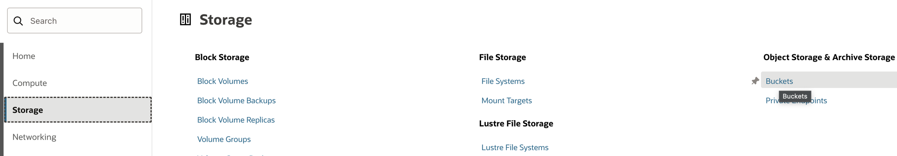

Create a new bucket by providing a descriptive name. This bucket will store PDF documents and knowledge items that constitute your knowledge base.

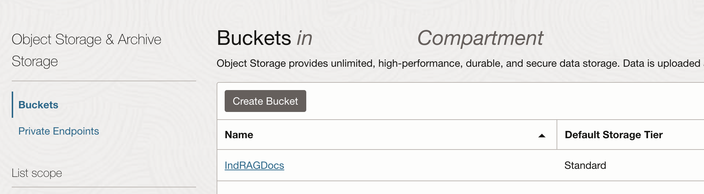

## Step 2: Create a Generative AI Agent

From the left navigation, select **Analytics & AI** > **AI Services** > **Generative AI Agent**.

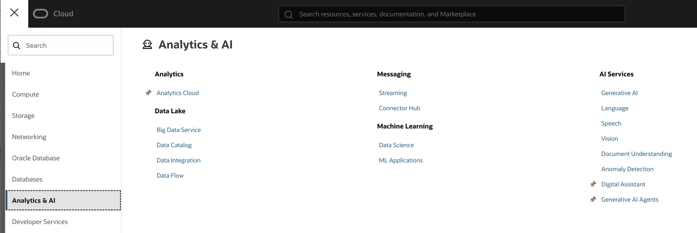

If the Generative AI Agent option is not visible in the navigation menu, change your region to Chicago. If this does not resolve the issue, you may not have subscribed to this service. Contact your administrator to identify the subscribed region for your account.

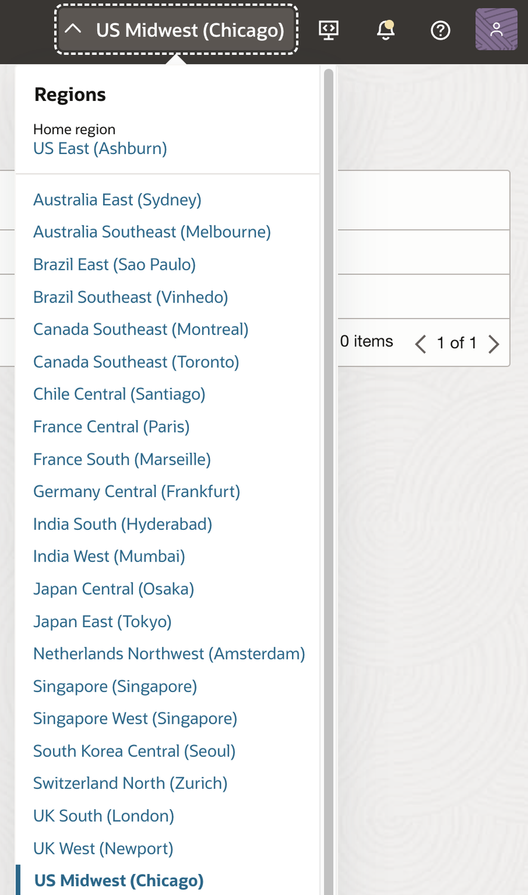

**Important**: The Object Storage bucket and RAG AI Agent must reside in the same region. On the **Overview** tab, click the **Create Agent** button.

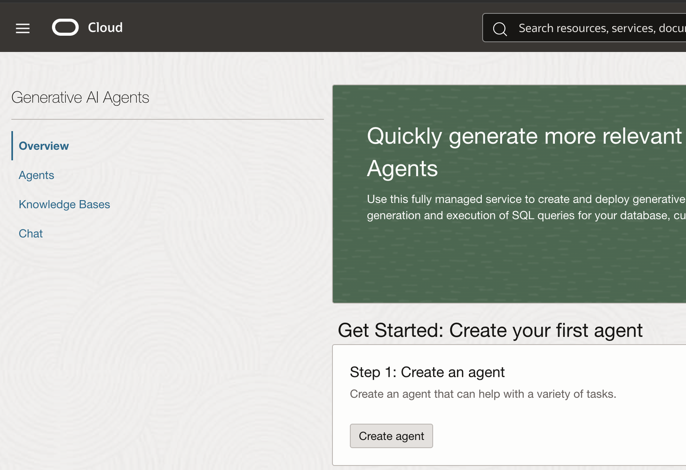

Provide the following basic information:

- **Agent Name**: A descriptive name for your agent
- **Welcome Message**: A greeting message displayed to users
- **Routing Information**: Select "Always Invoke RAG tool first"

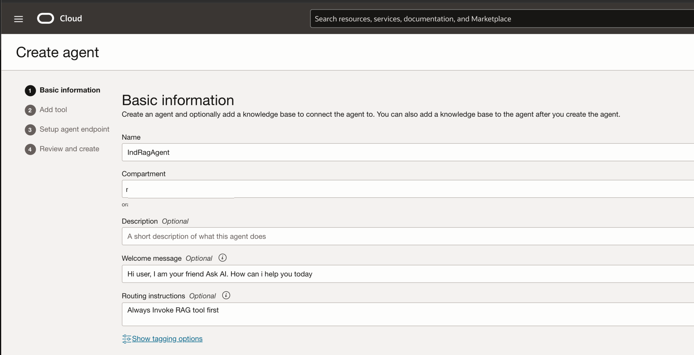

Click **Next** to configure tools. In the tools configuration section:

1. Select **RAG** as the tool type
2. Provide a descriptive name for the RAG tool
3. Add knowledge bases (created in the following steps)

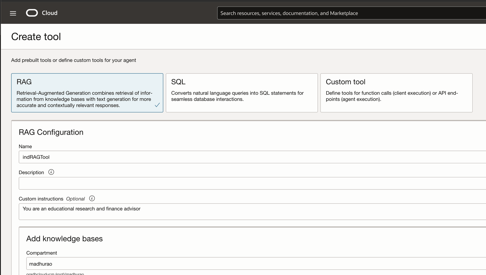

**Note**: SQL tools are also available for connecting to Oracle Database and generating SQL queries based on natural language input. SQL-based database interaction is not covered in this guide.

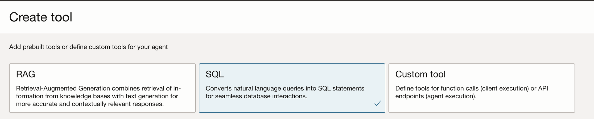

## Step 3: Create a Knowledge Base

Create a data source by selecting the OCI Object Storage bucket created in Step 1.

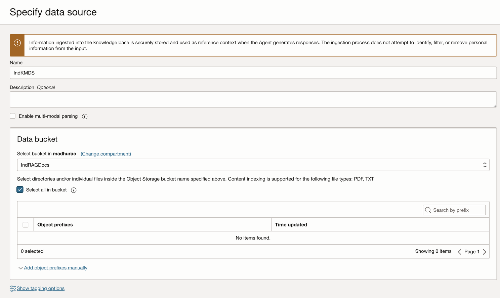

Under the **Knowledge Bases** section in the tools menu, click **Create Knowledge Base**.

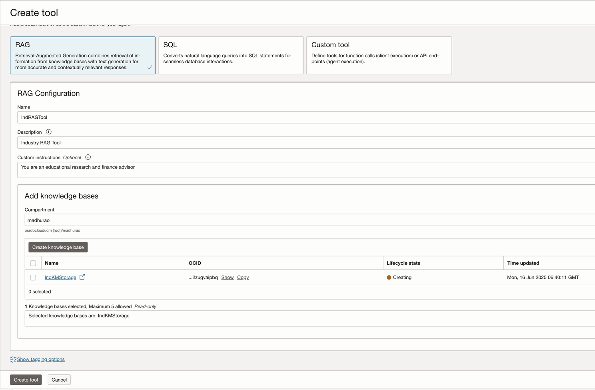

Configure the knowledge base settings:

1. Leave **Guardrails** options in their default disabled state
2. Click **Next** to proceed
3. Review and accept the license agreement
4. Click **Submit** to create the agent

This action creates your Agent Endpoint and Agent instance. **Important**: Record the **Agent Endpoint OCID** as you will need this identifier for future integrations and API calls.

## Step 4: Test Initial Agent Conversation

Click the **Launch Chat** button to open the agent chat interface. The welcome message you configured will be displayed.

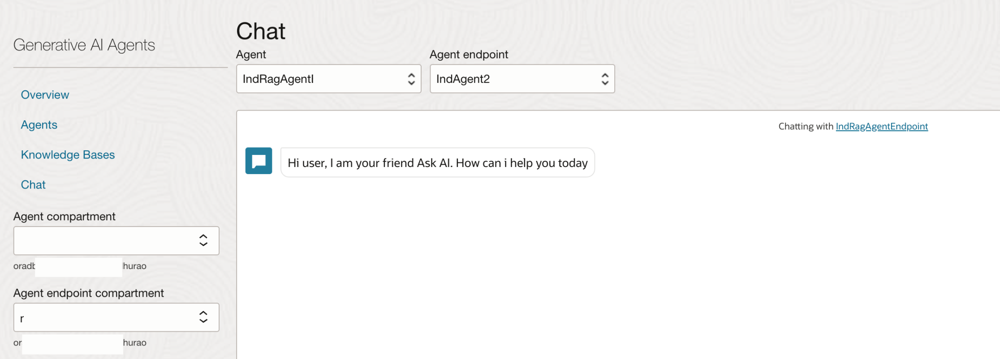

### Testing Query

Test the agent by asking a question:

```
Who is Database Sharding?
```

Without trained knowledge, the agent responds:

```
Unsure about the answer based on the references.
```

This is expected behavior, as the knowledge base has not yet been populated with relevant data.

## Step 5: Train the Agent with Knowledge Base Data

To improve agent responses, populate the knowledge base with relevant documents.

### Prepare Knowledge Documents

Gather knowledge artifacts from appropriate sources. For example, retrieve information from [Oracle Database Sharding Guide](https://docs.oracle.com/cd/F39414_01/shard/oracle-globally-distributed-database-guide.pdf) and convert it to PDF format.
  
### Upload to Object Storage

Upload the PDF documents to the OCI Object Storage bucket created in Step 1.

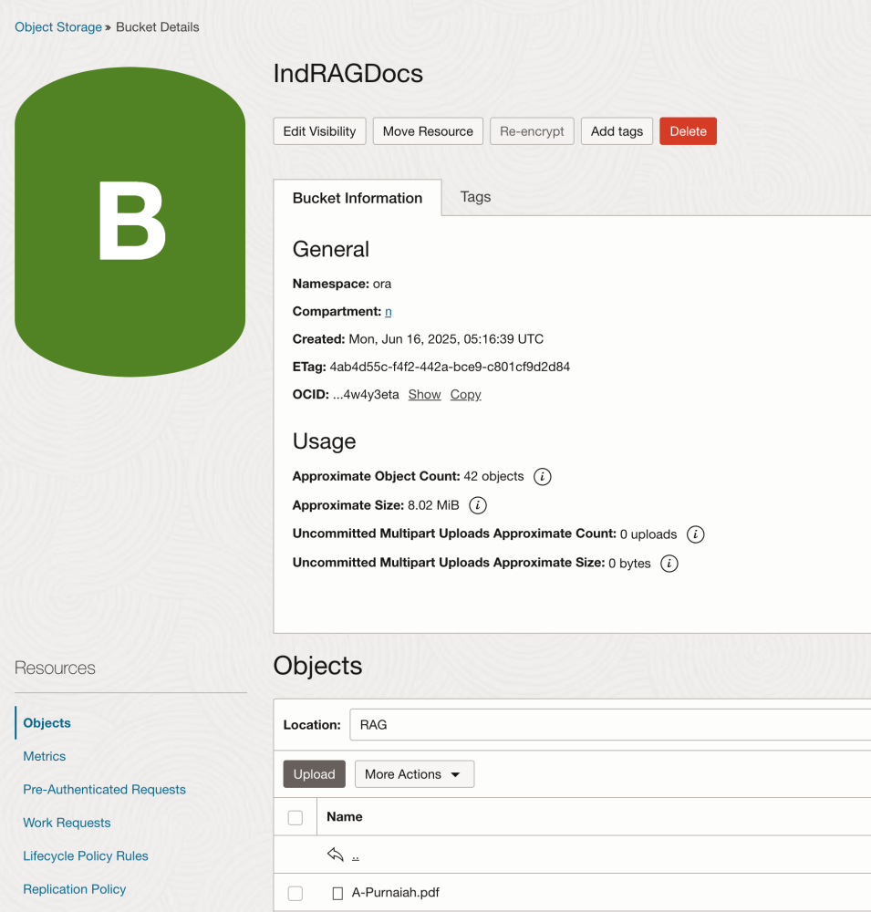

### Initiate Data Ingestion

Create a Data Ingestion Job:

1. Navigate to **Knowledge Bases** > **Storage** > [Your Bucket Name]
2. Click **Create Ingestion Job**
3. Monitor the job status

The ingestion job status will transition from **Accepted** to **Succeeded** within a few minutes. Upon completion, the knowledge base will be updated with the new documents.

## Step 6: Test Agent with Trained Knowledge Base

Now that the knowledge base has been populated with relevant documents, test the agent again with the same query:

```
Who is Database Sharding?
```

The agent now provides a comprehensive, informative response based on the ingested knowledge documents:

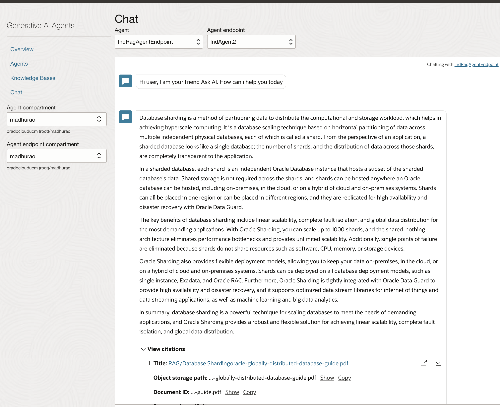

This demonstrates the effectiveness of RAG in enhancing agent responses with domain-specific knowledge.

## Step 7: Run RAG AI Agent Chatbot with Google Colab

Extend agent functionality by creating a Google Colab notebook that connects to your RAG AI Agent Endpoint for programmatic chat interactions.

Access the reference implementation:

[Download Google Colab Notebook](RAGChatbotwithAgentDevelopmentKit.ipynb)

This notebook demonstrates how to interact with your RAG agent using [RAG Agent Development Kit](https://docs.oracle.com/en-us/iaas/Content/generative-ai-agents/adk/api-reference/introduction.htm), enabling integration with additional workflows and applications.

## Author 

Madhusudhan Rao, Principal Product Manager, Oracle Database

Jan 28th, 2026