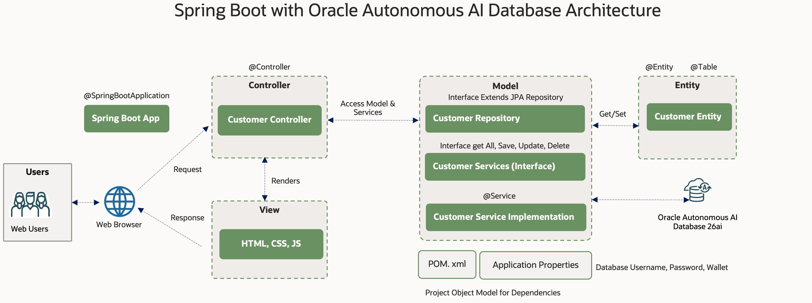
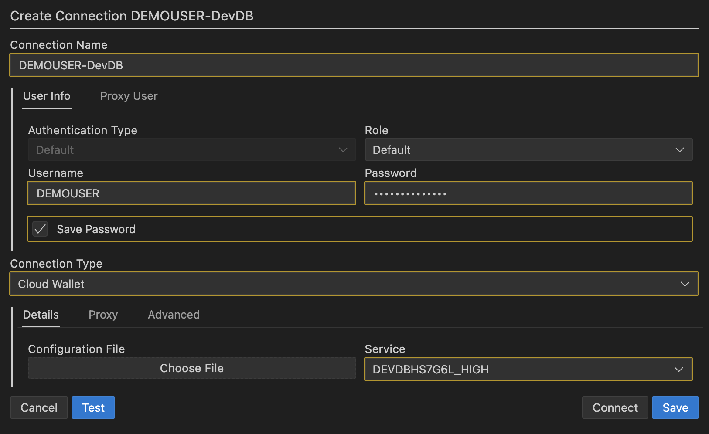
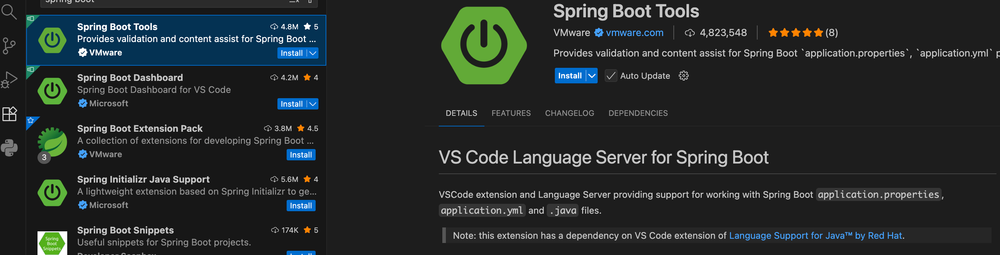
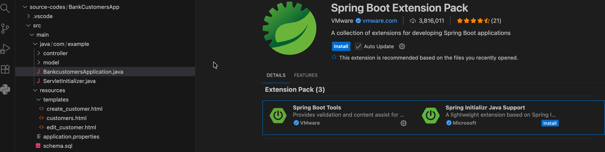
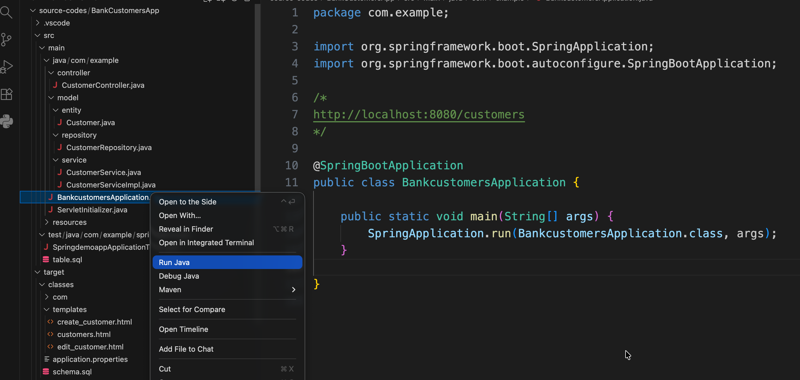
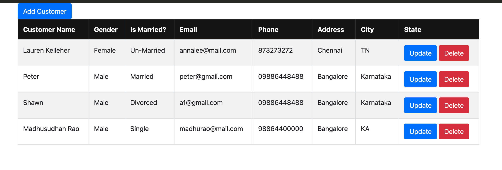
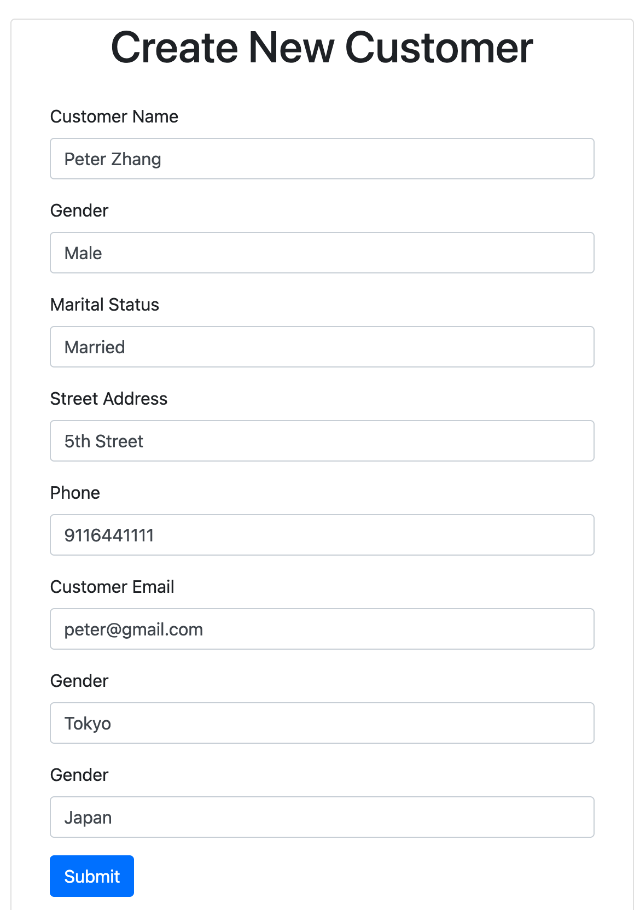
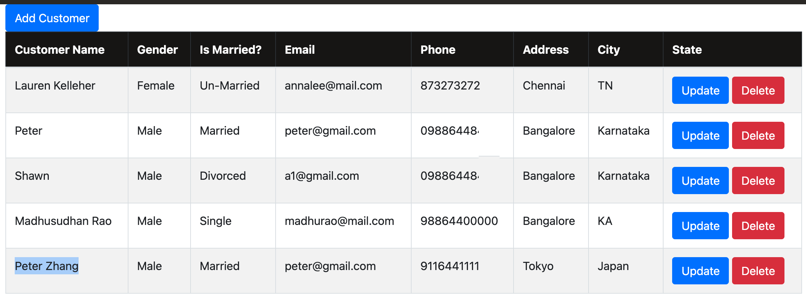
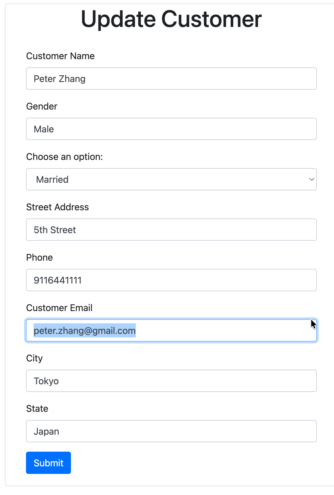
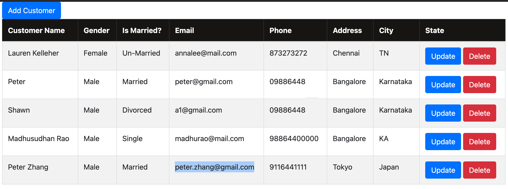

# Develop Spring Boot Application with Oracle Autonomous AI Database in 5 mins. 
 
## Introduction

Spring Boot makes it easy to create stand-alone, production-grade Spring based Applications that you can "just run".
    
**Spring Boot Application Features**

* Create stand-alone Spring applications
* Embed Tomcat, Jetty or Undertow directly (no need to deploy WAR files)
* Provide opinionated 'starter' dependencies to simplify your build configuration
* Automatically configure Spring and 3rd party libraries whenever possible
* Provide production-ready features such as metrics, health checks, and externalized configuration
* Absolutely no code generation and no requirement for XML configuration

**Architecture**



Estimated Time: 5 mins.  
 
### Objectives

In this short sprint, you will:
 
* Create a Spring Boot Oracle Autonomous AI Database Application
* The application will support Create, Read, Update, Delete [CRUD] operations.
* Start with a completely working Spring Boot app template and quickly create database application.
  
    <!-- [Spring Boot Application](youtube:FQHXNHTTFLg:large)   -->
    
### Prerequisites

This lab assumes you have:

* Oracle cloud account and privileges to create & manage Oracle Autonomous AI Database
* Oracle Autonomous AI database wallet has been downloaded into local filesystem. 
* Source code has been downloaded.
 
### Source code download
 
```
<copy>
-- Clone the GitHub Repo
gh repo clone oracle-devrel/oracle-ai-developer-hub

Or /sourcecode folder under this markdown
 
</copy>
``` 
 
## Task 1: Install SQL Developer and Connect to Database 

1. (Optional) Install the [VSCode extension SQL Developer](https://marketplace.visualstudio.com/items?itemName=Oracle.sql-developer), create a connection. Upload Database wallet use **Cloud Wallet** connection type
 
    

2. Create Bank Customers table, You can use **SQL Worksheets** on Autonomous Database Console or Use **SQL Developer** VSCode Extension to create this table.

    ```
    <copy>
    CREATE TABLE "BANK_CUSTOMERS" 
    (	
        "ID" NUMBER GENERATED BY DEFAULT ON NULL AS IDENTITY MINVALUE 1 
        MAXVALUE 99999  
        INCREMENT BY 1 START WITH 1 CACHE 20 NOORDER  NOCYCLE  
        NOKEEP  NOSCALE  NOT NULL ENABLE, 
        "CUSTOMER_NAME" VARCHAR2(100), 
        "GENDER" VARCHAR2(10),  
        "MARITAL_STATUS" VARCHAR2(50), 
        "STREET_ADDRESS" VARCHAR2(255),  
        "CITY" VARCHAR2(50), 
        "STATE" VARCHAR2(50),  
        "PHONE_NUMBER" VARCHAR2(50),   
        "EMAIL" VARCHAR2(128), 
        PRIMARY KEY ("ID")
        USING INDEX  ENABLE
    ) ;
    </copy>
    ``` 

## Task 2: Spring Boot Project Setup - VSCode Extensions
 
1. To develop a Spring Boot application in Visual Studio Code, 
you need to install the following:

    * [Java Development Kit](https://www.microsoft.com/openjdk) (JDK)
    * [Extension Pack for Java](https://marketplace.visualstudio.com/items?itemName=vscjava.vscode-java-pack)
    * [Spring Boot Extension Pack](https://marketplace.visualstudio.com/items?itemName=vmware.vscode-boot-dev-pack)
    * Install the Extension Pack for Java 
    * Install the Spring Boot Extension Pack

    

    

2. Download Oracle Autonomous AI Database wallet and extract to a folder

    

## Task 3. Project Object Model - Add dependencies
  
1. The pom.xml (Project Object Model) file in a Spring Boot project is the core configuration file used by Maven, the build automation tool. It defines the project's structure, dependencies, build process, and other essential configurations.

    Key elements of a Spring Boot pom.xml:

    * Project Metadata: This includes basic information about the project such as groupId, artifactId, version, name, and description.
    * Parent POM: Spring Boot projects commonly leverage a parent POM, typically spring-boot-starter-parent. This parent POM provides default configurations for dependency management, plugins, and other settings, simplifying project setup and ensuring consistent builds.
    * Dependencies: This section lists all the external libraries and frameworks required by the project. Spring Boot utilizes "starters" (e.g., spring-boot-starter-web, spring-boot-starter-data-jpa) which are convenient dependency descriptors that pull in a set of related and compatible dependencies, simplifying dependency management.
  
    Add the Oracle JDBC driver and UCP (Universal Connection Pool) to pom.xml:

    ```
    <copy>
    <dependencies>
		<dependency>
			<groupId>com.oracle.database.jdbc</groupId>
			<artifactId>ojdbc11-production</artifactId>
			<version>21.5.0.0</version>
			<type>pom</type>
		</dependency>
		<dependency>
			<groupId>org.springframework.boot</groupId>
			<artifactId>spring-boot-starter-data-jpa</artifactId>
		</dependency>
		<dependency>
			<groupId>org.springframework.boot</groupId>
			<artifactId>spring-boot-starter-thymeleaf</artifactId>
		</dependency>
		<dependency>
			<groupId>org.springframework.boot</groupId>
			<artifactId>spring-boot-starter-web</artifactId>
		</dependency>  
		<dependency>
            <groupId>jakarta.persistence</groupId>
            <artifactId>jakarta.persistence-api</artifactId>
        </dependency>
		<dependency>
			<groupId>org.springframework.boot</groupId>
			<artifactId>spring-boot-starter-tomcat</artifactId>
			<scope>provided</scope>
		</dependency>
		<dependency>
			<groupId>org.springframework.boot</groupId>
			<artifactId>spring-boot-starter-test</artifactId>
			<scope>test</scope>
		</dependency>
	</dependencies>
    </copy>
    ``` 

## Task 4. Configure the datasource in application.properties

1. In Spring Boot, application.properties is a crucial configuration file that allows for externalized configuration of your application. It serves as a central place to define various settings and properties that control the behavior of your Spring Boot application without modifying the source code.
Key characteristics and uses of application.properties:

2. Location: It is typically located in the **src/main/resources** directory of your Spring Boot project.
    Format: It follows a simple key-value pair format, where each line represents a configuration property. 

3. Replace  <Connection\_name\>, <Wallet\_folder\>, <DB\_username\> and <DB\_password\>


    ```
    <copy>
    spring.application.name=bankcustomersapp
    spring.datasource.driver-class-name=oracle.jdbc.OracleDriver 

    ##Change these properties --------------
    spring.datasource.url=jdbc:oracle:thin:@<connectionname>_high?TNS_ADMIN=/<Wallet_folder>/Wallets_files
    spring.datasource.username=<DB_username>
    spring.datasource.password=<DB_password> 
    ##--------------------------------------
    spring.jpa.database-platform=org.hibernate.dialect.OracleDialect

    ##Properties of UCP
    oracle.jdbc.fanEnabled=false
    spring.datasource.type=oracle.ucp.jdbc.PoolDataSource
    spring.datasource.oracleucp.connection-factory-class-name=oracle.jdbc.pool.OracleDataSource
    spring.datasource.oracleucp.sql-for-validate-connection=select * from dual
    spring.datasource.oracleucp.connection-pool-name=connectionPoolName1
    spring.datasource.oracleucp.initial-pool-size=15
    spring.datasource.oracleucp.min-pool-size=10
    spring.datasource.oracleucp.max-pool-size=30
    ##Logging properties for UCP
    logging.level.root=trace
    logging.file.name=logs.log
    logging.level.oracle.ucp=trace
    </copy>
    ``` 
  
## Task 5. Create Entity

1. In a Spring Boot application, an entity refers to a Plain Old Java Object (POJO) class that is mapped to a table in a relational database. It is a fundamental concept in Object-Relational Mapping (ORM) using the Java Persistence API (JPA) and its implementations like Hibernate, which Spring Boot often utilizes for data access.

    * Here's a breakdown of what constitutes an entity in Spring Boot:
    Database Table Representation: An entity class represents the structure of a database table. Each instance of the entity class corresponds to a row in that table.
    * JPA Annotations: Entities are typically annotated with @Entity from the javax.persistence package. This annotation marks the class as a persistent entity that JPA should manage.
    Table and Column Mapping:
    * The @Table annotation (optional) can be used to explicitly specify the name of the database table if it differs from the class name.
    Fields within the entity class represent the columns of the database table. The @Column annotation (optional) can be used to specify column details like name, length, and nullability.

2. Map Table name, Getter and Setter methods for database columns

    ```
    <copy>
    ## Refer Customer.java in the downloaded source codes
    
    @Entity
    @Table(name = "BANK_CUSTOMERS")

    public class Customer {

        @Id
        @GeneratedValue(strategy = GenerationType.IDENTITY)
        private Long id;
        
        @Column(name = "CUSTOMER_NAME")
        private String customerName;
 
        .. 

        public Customer() {}   

        public Customer(String customerName, String gender, String maritalStatus, String streetAddress, String city,
                String state, String phoneNumber, String email) {
            this.customerName = customerName;       
            this.gender = gender;
            this.maritalStatus = maritalStatus;
            this.streetAddress = streetAddress;
            this.city = city;
            this.state = state;
            this.phoneNumber = phoneNumber;
            this.email = email;
        }

        public Long getId() {
            return id;
        }

        public void setId(Long id) {
            this.id = id;
        }

        public String getCustomerName() {
            return customerName;
        }

        public void setCustomerName(String customerName) {
            this.customerName = customerName;
        }

        ... 
        
    }
    </copy>
    ``` 


## Task 6. Create Interface Customer Repository which extends JpaRepository

1.   The repository is responsible for providing data access operations on the entity, 
    such as saving, updating, retrieving, and deleting data.
    It abstracts the database operations and provides a simplified interface for interacting with the data layer

    **JpaRepository** is a core interface within Spring Data Java Persistence API, designed to simplify data access and persistence operations in Java applications using the **Java Persistence API** (JPA). It acts as a powerful abstraction layer, significantly reducing the amount of boilerplate code required for common database interactions.
       
    ```
    <copy>
    public interface CustomerRepository extends JpaRepository<Customer, Long> { }
    </copy>
    ``` 

## Task 7. Create Customer Service Interface & Implementation

1. A "Spring Boot service" refers to a component within a Spring Boot application that encapsulates and handles the business logic of the application. These services are typically marked with the @Service annotation in Java, indicating their role in the application's architecture.
Here's a breakdown of what a Spring Boot service entails:

    * Business Logic Container: Services are designed to contain the core business rules and operations. This includes tasks like data validation, complex calculations, orchestration of multiple data access operations, and interaction with other services.
    * Separation of Concerns: By placing business logic in service classes, Spring Boot promotes a clean separation of concerns within the application's layers. This means:
        * Controllers: (presentation layer) handle incoming requests and delegate to services.
        * Services: (business logic layer) perform the actual work and interact with repositories.
        * Repositories: (data access layer) handle interactions with the database.
    * Dependency Injection: Spring Boot's dependency injection mechanism (often using @Autowired) allows services to easily receive and utilize other components, such as repositories or other services, without needing to manually create instances.

    ```
    <copy>
    public interface CustomerService {

        List<Customer> getAllCustomers();

        Customer saveCustomer(Customer customer);
        
        Customer getCustomerById(Long id);
        
        Customer updateCustomer(Customer customer);
        
        void deleteCustomerById(Long id);
    }
    </copy>
    ``` 

2. The **service implementation class** implements the Bank Customer interface (CustomerRepository)
and provides the actual implementation of the business logic

    ```
    <copy>
    @Service
    public class CustomerServiceImpl implements CustomerService { 
        
        private CustomerRepository customerRepository;
    
        public CustomerServiceImpl(CustomerRepository customerRepository) {
            super();
            this.customerRepository = customerRepository;
        }
    
        @Override
        public List<Customer> getAllCustomers() {
            return customerRepository.findAll();
        }

        @Override
        public Customer saveCustomer(Customer customer) {
            return customerRepository.save(customer);   
        }
        @Override
        public Customer getCustomerById(Long id) {
            return customerRepository.findById(id).get();   
        }

        @Override
        public Customer updateCustomer(Customer customer) {
            return customerRepository.save(customer);       
        }

        @Override
        public void deleteCustomerById(Long id) {
            customerRepository.deleteById(id);  
        }
    
    }
    </copy>
    ```  
 
## Task 8. Create View Components

1. In Spring Boot, a "view component" refers to a server-side component designed to encapsulate a specific piece of UI, including its associated logic and data. This approach promotes reusability, testability, and a more organized structure for building web applications, particularly when using technologies like Thymeleaf or HTMX.

2. Create **customers.html** to list all the customers 

    ```
    <copy>
    <tbody>
        <tr th:each = "customer: ${customers}">
            <td th:text = "${customer.customerName}"></td>
            <td th:text = "${customer.gender}"></td>
            <td th:text = "${customer.maritalStatus}"></td>
            <td th:text = "${customer.email}"></td>
            <td th:text = "${customer.phoneNumber}"></td>
            <td th:text = "${customer.city}"></td>
            <td th:text = "${customer.state}"></td>
            <td>
                <a th:href = "@{/customers/edit/{id}(id=${customer.id})}"
                    class = "btn btn-primary">Update</a>
                
                <a th:href = "@{/customers/{id}(id=${customer.id})}"
                    class = "btn btn-danger">Delete</a> 
            </td>
        </tr>
    </tbody>
    </copy>
    ``` 

3. Add **create_customer.html** to add new customers (insert new records)


    ```
    <copy>
    <form th:action="@{/customers}" th:object = "${customer}" method="POST">
        <div class ="form-group">
            <label> Customer Name </label>
            <input type = "text" name = "customerName" th:field = "*{customerName}"
            class = "form-control" placeholder="Enter Customer Name" />
        </div>

        <div class ="form-group">
            <label> Gender </label>
            <input type = "text" name = "gender" th:field = "*{gender}"
            class = "form-control" placeholder="Enter Customer Gender"  />
        </div>

        ....
        
        <div class = "box-footer">
            <button type="submit" class = "btn btn-primary">
                Submit
            </button>
        </div>
    </form>
    </copy>
    ``` 

4. Add **edit_customer.html** to add update customer (Update record by ID)

    ```
    <copy>
    <form th:action="@{/customers/{id} (id=${customer.id})}" th:object = "${customer}" method="POST">
        <div class ="form-group">
            <label> Customer Name </label>
            <input
            type = "text"
            name = "customerName"
            th:field = "*{customerName}"
            class = "form-control"
            placeholder="Enter Customer Name" 
            />
        </div>

        .....
        
        <div class = "box-footer">
            <button type="submit" class = "btn btn-primary">
                Submit
            </button>
        </div>
    </form>
    </copy>
    ``` 
 
## Task 9. Create Spring Boot Main Application & Run the App

1. The **@SpringBootApplication** annotation in Spring Boot is a convenience annotation that combines three commonly used annotations, simplifying the setup of a Spring Boot application. It is typically placed on the main class of a Spring Boot application.
2. The **@SpringBootApplication** annotation effectively combines the following: 
@Configuration: This annotation tags the class as a source of bean definitions for the application context. It indicates that the class can declare one or more @Bean methods, which are processed by the Spring container to generate bean definitions.
   
    ```
    <copy>
    @SpringBootApplication
    public class BankcustomersApplication {

        public static void main(String[] args) {
            SpringApplication.run(BankcustomersApplication.class, args);
        }

    }
    </copy>
    ``` 

3. Run the application and access the app in the browser URL http://localhost:8080/customers 

    

    The equivalant command in terminial is as follows.

    ```
    <copy>
     /usr/bin/env //.vscode/extensions/redhat.java-1.49.0-darwin-arm64/jre/21.0.9-macosx-aarch64/bin/java @/var/folders/kh/3j4qcvcn5klcg32c_xfddb900000gn/T/cp_cmbtusz8ckfsuwclwsfy4tmsn.argfile com.example.BankcustomersApplication
     </copy>
    ``` 

4. Running Application, View all Bank Customers

    

5. Add new Customer record

    

5. View newly added Customer

    

6. Update customer record and view the update

    

7. View the updated customer

    
  
## Learn More & Downloads
 
* [Autonomous AI Database for Developers](https://docs.oracle.com/en-us/iaas/autonomous-database-serverless/doc/autonomous-database-for-developers.html) 
* [Download Source code](https://github.com/madhusudhanrao-ppm/dbdevrel/tree/main/source-codes)
* [Direct ORM deployment link](https://cloud.oracle.com/resourcemanager/stacks/create?zipUrl=https://objectstorage.us-phoenix-1.oraclecloud.com/p/jtfUsV33KtLR937hWybAgrq8qtuQQuAaIw1K_VBThhlUF6Z1HYF0Ai50sQlp06bQ/n/oradbclouducm/b/medical_transcripts/o/Terraform/oracle-lakehouse-devedition-stack.zip)
 
## Author 

Madhusudhan Rao, Principal Product Manager, Oracle Database
Dec 2025