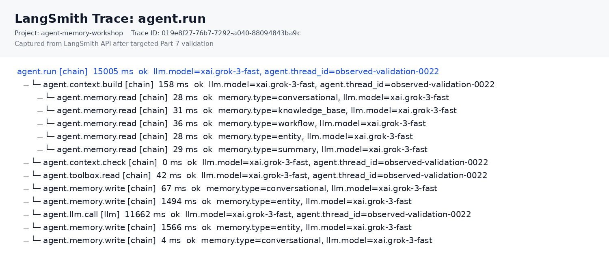

# Part 7: Agent Observability

## Three TODOs in This Part

Part 7 adds LangSmith tracing to the agent you built in Part 6. You will keep the original `call_agent()` function unchanged and create an observed wrapper that sends traces to a LangSmith project.

Before running the Part 7 notebook cells, set a LangSmith API key:

```bash
export LANGSMITH_API_KEY="lsv2_..."
export LANGSMITH_TRACING=true
export LANGSMITH_PROJECT=agent-memory-workshop
```

Then open your project in LangSmith:

```text
https://smith.langchain.com
```

---

## TODO 17: Configure LangSmith

LangSmith has three moving parts in this lab:

- **Client** - connects the notebook to LangSmith
- **Project** - groups traces for this workshop
- **Trace runs** - records parent and child operations for one agent turn

**Complete solution:**

```python
import os

import langsmith as ls
from langsmith import Client

def configure_agent_observability(
    project_name: str = "agent-memory-workshop",
):
    os.environ.setdefault("LANGSMITH_TRACING", "true")
    os.environ.setdefault("LANGSMITH_PROJECT", project_name)

    if not os.environ.get("LANGSMITH_API_KEY"):
        raise RuntimeError(
            "Set LANGSMITH_API_KEY before running Part 7. "
            "Create an API key in LangSmith, then export it in your shell or set it in this notebook."
        )

    client = Client()
    return {"client": client, "project_name": project_name}

observability = configure_agent_observability()
tracer = ls
```

**Privacy default:** This lab records metadata, not content. Trace inputs, outputs, and metadata should include lengths, counts, model names, tool names, memory types, and error status - not full prompts, retrieved documents, API keys, raw tool output, or database connection strings.

---

## TODO 18: `call_agent_observed()`

The original `call_agent()` remains your working agent harness. In Part 7, you create a second function, `call_agent_observed()`, that follows the same flow but wraps each major operation in LangSmith trace runs.

**Trace shape:**

```text
agent.run
├── agent.context.build
│   ├── agent.memory.read conversational
│   ├── agent.memory.read knowledge_base
│   ├── agent.memory.read workflow
│   ├── agent.memory.read entity
│   └── agent.memory.read summary
├── agent.context.check
├── agent.toolbox.read
├── agent.memory.write user_message
├── agent.llm.call
├── agent.tool.execute
├── agent.tool.log
├── agent.memory.write workflow
├── agent.memory.write entity
└── agent.memory.write assistant_message
```

**Important metadata to record:**

| Field | Example | Why it is safe |
|---|---|---|
| `agent.thread_id` | `0022` | Identifier, not content |
| `query.length` | `74` | Length only |
| `context.estimated_tokens` | `1320` | Count only |
| `memory.type` | `knowledge_base` | Category only |
| `memory.result_length` | `540` | Length only |
| `tool.name` | `search_tavily` | Tool name only |
| `tool.result_length` | `1800` | Length only |
| `llm.model` | `xai.grok-3-fast` | Model name only |

**Why manual trace runs first:** LangSmith can trace LangChain applications automatically, but manual runs make this notebook's Part 6 architecture visible. Once you understand that trace, automatic instrumentation is easier to reason about.

---

## TODO 19: Run and Inspect the Trace

Run a short observed conversation using a fresh thread ID:

```python
observed_thread = "observed-0022"

for q in [
    "Find papers about memory in AI agents",
    "What did we just discuss?",
    "Search the web for recent agent observability ideas",
]:
    call_agent_observed(q, thread_id=observed_thread, max_iterations=5)
```

Then open LangSmith:

1. Open `https://smith.langchain.com`
2. Select the `agent-memory-workshop` project
3. Open the most recent `agent.run` trace
4. Expand the child runs

You should see where the agent spent time and which operations happened during the turn.



## What to Look For

**Context build runs:** These show which memory systems were read before the LLM call.

**Tool runs:** These show whether the model called Tavily or summary tools.

**Context check runs:** These show estimated context window size without exposing the full prompt.

**Memory write runs:** These show the durable writes that make the next turn memory-aware.

## Key Takeaways

**Observability makes agent behavior inspectable.** The Part 6 chart shows that the memory-aware agent controls context growth. Part 7 shows the operational path behind that chart.

**The trace is not the memory store.** Oracle AI Database still stores the agent's memory. LangSmith shows what happened during execution.

**Safe traces are designed.** A useful trace does not need full prompts or raw tool results. In most labs and production systems, counts, names, durations, statuses, and sanitized IDs are enough to debug the flow.
